# 整理

## 1 图

### 1.1 Use-Case Diagram

[UML用例图（Use Case Diagram）概述](https://zhuanlan.zhihu.com/p/135348779){:target="_blank"} 
[软件设计中如何画各类图之五用例图（Use Case Diagram）：系统功能需求与用户交互的图形化描述](https://blog.csdn.net/cooldream2009/article/details/134798264){:target="_blank"}

<figure markdown="span">
  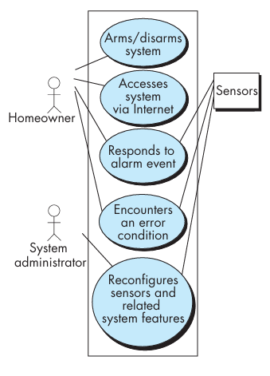{ width="600" }
</figure>

### 1.2 Class Diagram

[设计模式（0）：UML类图（Class Diagram）](https://blog.csdn.net/WHEgqing/article/details/107902548){:target="_blank"}

<figure markdown="span">
  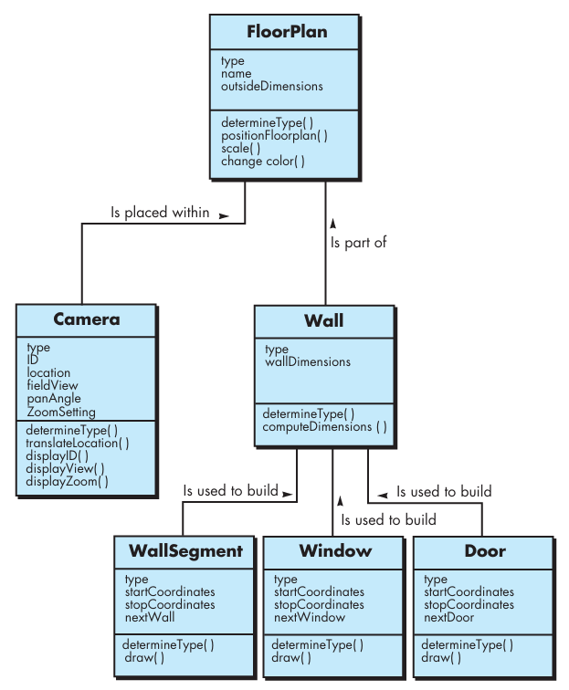{ width="600" }
</figure>

### 1.3 State Diagram

[2 分钟学会 UML 状态图](https://www.bilibili.com/video/BV1dx421S7Lo/){:target="_blank"}

<figure markdown="span">
  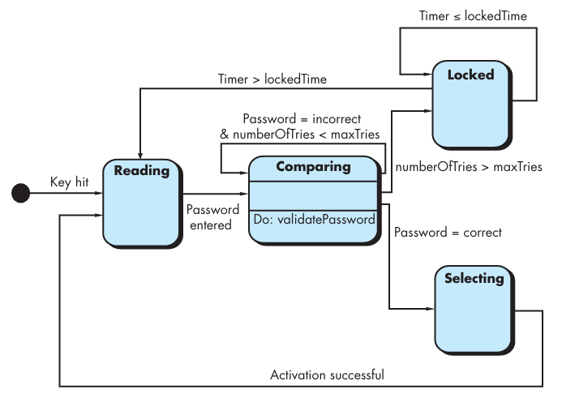{ width="600" }
</figure>

<figure markdown="span">
  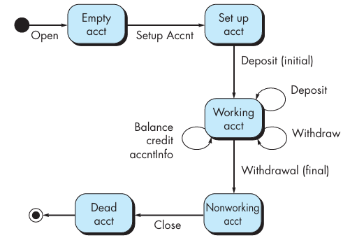{ width="600" }
</figure>

### 1.4 CRC

[9. 简易类图+CRC卡片](https://zhuanlan.zhihu.com/p/149234056){:target="_blank"}

<figure markdown="span">
  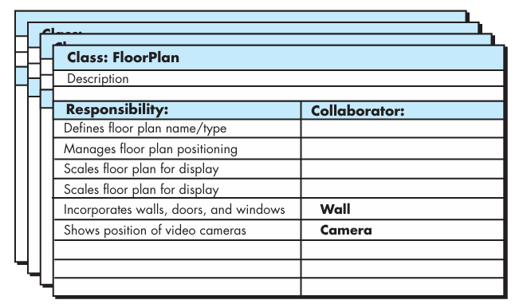{ width="600" }
</figure>

### 1.5 Sequence Diagram

[5 分钟学会 UML 时序图（顺序图、序列图）](https://www.bilibili.com/video/BV1YM411f7dr/){:target="_blank"} 
[UML时序图(Sequence Diagram)](https://zhuanlan.zhihu.com/p/681732997){:target="_blank"}

<figure markdown="span">
  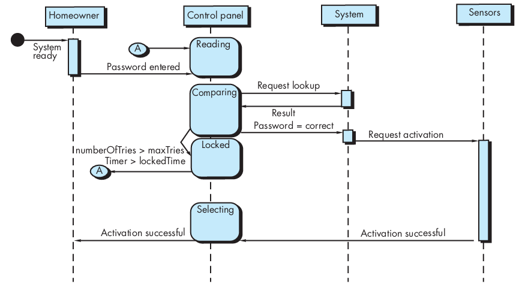{ width="600" }
</figure>

### 1.6 Data Flow Diagram

[3 分钟学会 数据流图](https://www.bilibili.com/video/BV1Hx4y1J7yg/){:target="_blank"}

<figure markdown="span">
  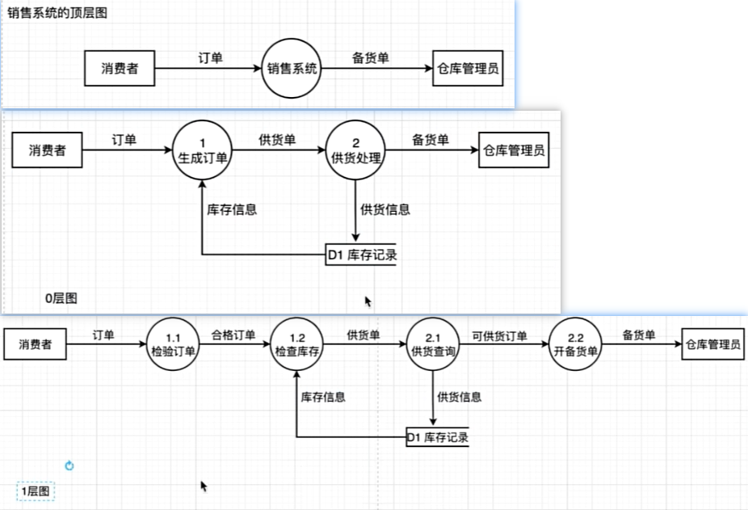{ width="600" }
</figure>

### 1.7 Software Architecture

<figure markdown="span">
  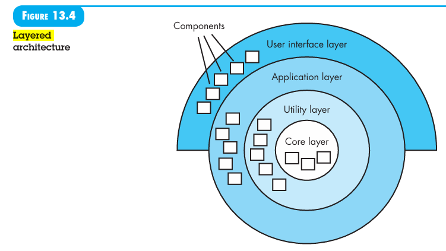{ width="600" }
</figure>

## 2 基本路径测试

[基本路径测试](https://wintermelonc.github.io/WintermelonC_Docs/zju/compulsory_courses/software_engineering/ch23/?h=v%28g%29#6-%E5%9F%BA%E6%9C%AC%E8%B7%AF%E5%BE%84%E6%B5%8B%E8%AF%95-basis-path-testing){:target="_blank"}

计算 cyclomatic complexity 的方法：

1. 平面图中的闭合区域数
2. 边数 - 节点数 + 2
3. 判定节点数 + 1

## 3 Scrum

Scrum meeting 中，所有团队成员都要回答以下三个关键问题：

1. What did you do since the last team meeting?
2. What obstacles are you encountering? 
3. What do you plan to accomplish by the next team meeting?

## 4 等价类划分和边界值分析

可以按照以下准则定义等价类：

1. 如果输入条件规定了一个范围，则定义一个有效和两个无效等价类
2. 如果输入条件要求一个特定值，则定义一个有效和两个无效等价类
3. 如果输入条件规定了一个集合的成员，则定义一个有效和一个无效等价类
4. 如果输入条件是布尔值，则定义一个有效和一个无效类

BVA 的指南在许多方面与等价类划分提供的指南相似：

1. 如果输入条件指定了一个由值 a 和 b 界定的范围，则应使用值 a 和 b 以及略高于和略低于 a 和 b 的值来设计测试用例
2. 如果输入条件指定了值的数量，则应开发测试用例以测试最小和最大数量。略高于和略低于最小值和最大值的值也会被测试
3. 将指南 1 和 2 应用于输出条件。例如，假设需要一个温度与压力对照表作为工程分析程序的输出。应设计测试用例以生成包含允许的最大（和最小）表格条目数的输出报告
4. 如果内部程序数据结构有规定的边界（例如，表格有定义的 100 个条目限制），请确保设计一个测试用例以在边界处测试该数据结构

## 5 测试策略

建议采用以下综合性测试策略：

1. unit testing（单元测试）：

    1. 目标：验证代码中最小的可测试部分的正确性
    2. 范围：业务逻辑层、数据访问层和工具类

2. integration testing（集成测试）：

    1. 目标：验证系统各模块之间，以及系统与外部依赖之间的交互是否正确
    2. 范围：

        1. 数据层集成：测试 DAO/Repository 与真实测试数据库的交互
        2. 外部服务集成
        3. 端到端模块集成：测试表示层、业务层和数据层的完整调用链路

3. system testing（系统测试）：

    1. 目标：验证整个系统作为一个整体是否满足所有功能和非功能需求
    2. 范围：覆盖所有用例
    3. 重点：

        1. 功能测试：确保需求文档中的每个功能点都能正常工作
        2. 界面测试：验证 Web UI 的正确性和可用性
        3. 安全性测试：验证用户认证、授权和数据加密是否正确
        4. 性能测试

4. acceptance testing（验收测试）：

    1. 目标：由最终用户或客户代表执行，以验证系统是否满足他们的实际业务需求和期望
    2. 方式：通常采用 Alpha 测试（内部用户）和 Beta 测试（少量真实用户试用）的形式。基于用户故事或验收标准进行

5. non-functional testing（非功能测试）：

    1. 性能测试：模拟多个并发用户同时进行编码、提交训练任务等操作，测试系统的响应时间、吞吐量和资源利用率，确保系统能满足预期负载
    2. 压力测试：测试系统在极限负载下的行为，确定其瓶颈和崩溃点
    3. 兼容性测试：在不同的浏览器（Chrome, Firefox, Safari）和操作系统上测试 Web 界面

[特定应用测试策略](https://wintermelonc.github.io/WintermelonC_Docs/zju/compulsory_courses/software_engineering/ch22/?h=%E6%B5%8B%E8%AF%95#8-%E7%89%B9%E5%AE%9A%E5%BA%94%E7%94%A8%E6%B5%8B%E8%AF%95%E7%AD%96%E7%95%A5){:target="_blank"}

## 6 The Waterfall Model

[瀑布模型](https://wintermelonc.github.io/WintermelonC_Docs/zju/compulsory_courses/software_engineering/ch4/#2-%E7%80%91%E5%B8%83%E6%A8%A1%E5%9E%8B-the-waterfall-model){:target="_blank"}

## 7 Stakeholder

[项目干系人](https://wintermelonc.github.io/WintermelonC_Docs/zju/compulsory_courses/software_engineering/ch31/#2-%E9%A1%B9%E7%9B%AE%E5%B9%B2%E7%B3%BB%E4%BA%BA-stakeholders){:target="_blank"}

## 8 缺陷放大模型

<figure markdown="span">
  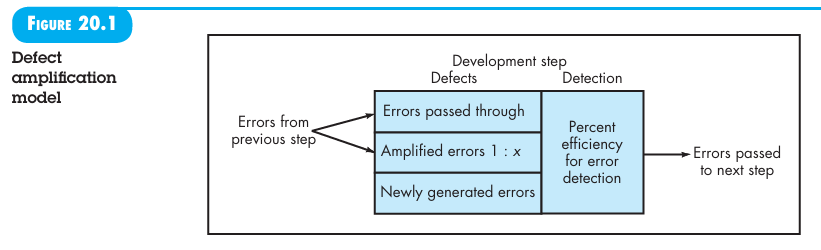{ width="600" }
</figure>

传递到下一步的错误数 = (来自上一步的错误数 + 本阶段新产生的错误数) × (1 − 本阶段检测效率) × x

<figure markdown="span">
  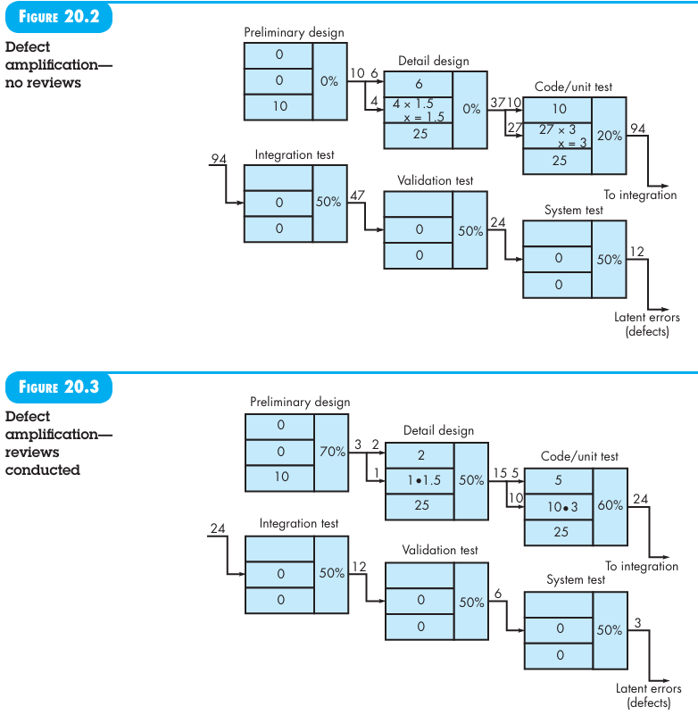{ width="600" }
</figure>

## 9 美学设计

[美学设计](https://wintermelonc.github.io/WintermelonC_Docs/zju/compulsory_courses/software_engineering/ch17/?h=%E7%BE%8E%E5%AD%A6#7-%E7%BE%8E%E5%AD%A6%E8%AE%BE%E8%AE%A1-aesthetic-design){:target="_blank"}

## 10 业务流程再工程

<figure markdown="span">
  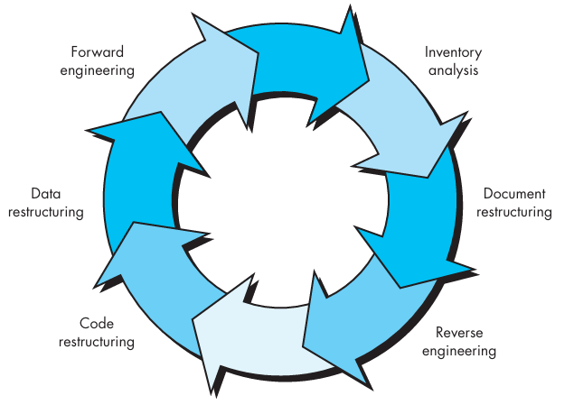{ width="600" }
</figure>