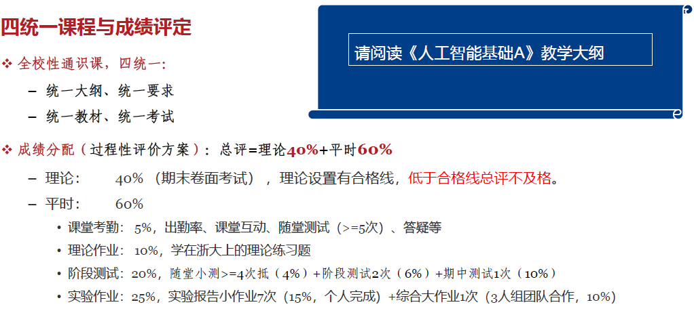

# 人工智能基础（A）

!!! tip "说明"

    此文档正在更新中……

## 课程介绍

!!! info "注意"

    此为 2024-2025 春夏学期课程安排，仅供参考

nd老师

### 考核方式

<figure markdown="span">
  { width="800" }
</figure>

人工智能基础（A）课程大纲

703 KB | 14 page

<a class="down-button" target="_blank" href="../../../file/AI_basic/ai_doc1.pdf" markdown="1">:fontawesome-solid-download: 下载</a>

