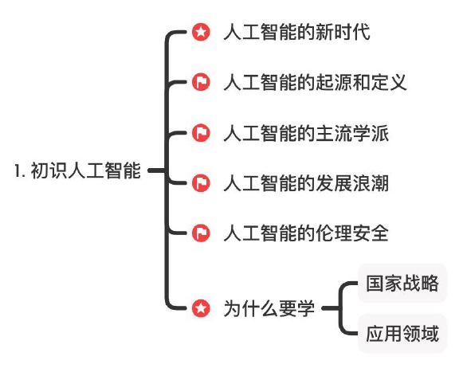
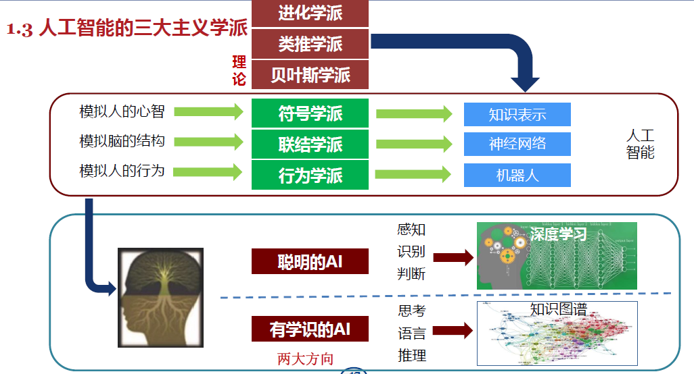
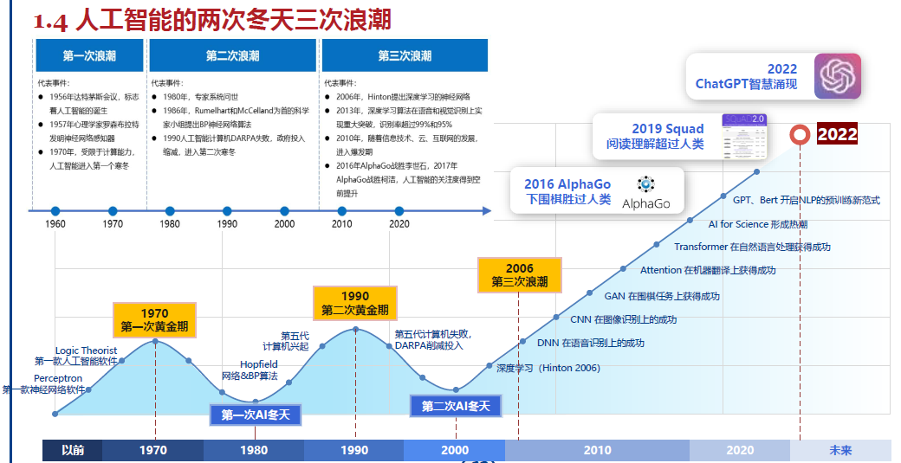
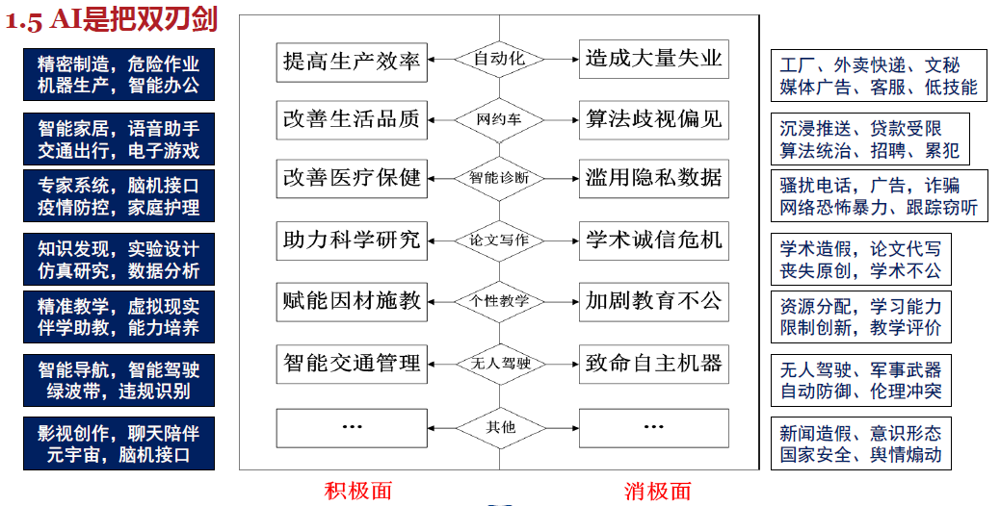

# 1 初识人工智能

<!-- !!! tip "说明"

    本文档正在更新中…… -->

!!! info "说明"

    本文档仅涉及部分内容，仅可用于复习重点知识

本节要点：

<figure markdown="span">
  { width="400" }
</figure>

## 1.1 人工智能的新时代

### 1.1.2 人工智无处不在的时代

1. 扫地机器人：自动识别全屋地面并完成智能扫地
2. 门禁机器：刷脸识别
3. 无人机
4. 无人驾驶汽车
5. 大语言模型

## 1.2 人工智能的起源和定义

### 1.2.1 人工智能的起源

1955 年 8 月，约翰·麦卡锡、马文·明斯基、克劳德·香农、纳撒尼尔·罗切斯特 4 位学者联合提交了一份提案，在这个提案中使用了“Artificial Intelligence”这个术语

1956 年 8 月，美国，达特茅斯会议上，正式提出了“人工智能”这一概念

### 1.2.2 人工智能的定义

**定义**：能够和人一样进行感知、认知、决策、执行的人工程序或系统

- 研究、开发用于模拟、延伸和扩展人的智能的理论、方法、技术及应用系统的一门新的技术科学
- 企图了解智能的本质，并生产出一种新的能以人类智能相似的方式做出反应的智能机器
- 研究包括机器人、语音识别、图像识别、自然语言处理和专家系统等
- 人工智能是对人的意识、思维的信息过程的模拟，不是人的智能，但能像人那样思考、也可能超过人的智能

**强人工智能、弱人工智能和通用人工智能**

1. 弱人工智能：通过计算机替代一部分人类的智能化能力或实现一部分智能的增强，当然在某些方面还可能超越人类，或者说实现机器模拟人的 **部分智能**
2. 强人工智能（通用人工智能）：与人类一样或超越人类智慧的人工智能

## 1.3 人工智能的主流学派

<figure markdown="span">
  { width="800" }
</figure>

### 1.3.1 符号主义学派

基于符号表示— **逻辑** 推理—搜索的人工智能

- 认为人类认知和思维的基本单元是符号，认知过程是以符号表示基础的一种运算，计算机是一个可用来模拟人的智能行为的物理符号系统
- 核心：构建符号表达知识
- 代表人物：艾伦·图灵、约翰·麦卡锡和马文·明斯基、艾伦·纽厄尔和赫伯特·西蒙等研究学者
- 主要成果：机器定理程序、启发式算法、专家系统等

| 优点 | 缺点 |
| :--: | :--: | 
| 精准 | 抽象难、遗漏 |
| 严谨 | 冲突、构建复杂 |
| 可解释 | 特殊条件和规则 |
| 普适 | 跟不上变化 |
| | 语义分歧 |

### 1.3.2 联结主义学派

基于神经网络—深度学习的人工智能

- 联结主义是一种理解认知过程的理论框架。试图通过 **模拟大脑的神经网络** 来解释人类的认知功能，如记忆、学习、语言处理和模式识别
- 目标：实现模拟人脑的结构，产生了神经网络方法
- 代表人物：沃伦·麦卡洛克、沃尔特·皮茨
- 主要成果：
    - 神经网络深度学习
    - 现代人工智能大语言模型

| 优点 | 缺点 |
| :--: | :--: | 
| 自动训练 | 难解释 |
| 可预测 | 算力 |
| 适应变化 | 过拟合 |
| 超越人类 | 偏见 |
| 仿生 | 鲁棒性 |
| 高维 | 伦理冲突 |

> 鲁棒性（Robustness）是指系统或模型在面对不确定性、噪声、异常情况或输入变化时，仍能保持其性能和稳定性的能力。在人工智能和机器学习领域，鲁棒性通常意味着模型在训练数据之外的测试数据上仍能表现良好，并且对输入数据中的噪声或扰动具有一定的抵抗力

### 1.3.3 行为主义学派

基于环境交互强化学习的人工智能

- 构建一个智能体，它关注智能体在环境中的行为，智能体以最大化奖励为目标，与环境不断交互来学习和适应，会根据行为的结果进行调整，主要方法包括：
    - 强化学习
    - Q-learning 和策略梯度方法
- 代表人物：理查德·S.萨顿、安德鲁·G.巴托
- 主要应用：游戏 AI、机器人控制、自动驾驶等

| 优点 | 缺点 |
| :--: | :--: | 
| 重视结果 | 功利主义 |
| 环境适应性强 | 试错成本和风险高 |
| 人类对齐 | |

## 1.4 人工智能的发展浪潮

<figure markdown="span">
  { width="800" }
</figure>

1. 第一次浪潮：符号主义

    1. 达特茅斯会议
    2. 西洋跳棋程序
    3. ELIZA 聊天程序
    4. 首个专家系统

2. 第一次低谷：由于算力不足，政府投资削减
3. 第二次浪潮：联结主义

    1. RI（XCON）专家系统真正投入商用
    2. 神经网络研究的突破
    3. 反向传播 BP 算法

4. 第二次低谷：由于 PC 发展迅猛，政府投资削减
5. 第三次浪潮：杰弗里·辛顿提出了深度学习

## 1.5 人工智能的伦理安全

<figure markdown="span">
  { width="800" }
</figure>

### 1.5.1 AI 造假

AI 伪造诈骗

### 1.5.2 算法偏见和歧视

幸存者偏差：忽略了筛选条件，把经过筛选的结果当成随机结果。只关注到幸存者的信息而忽略了整体情况，从而导致错误的结论

### 1.5.3 道德困境与伦理冲突

1. 自动驾驶
2. 电车困境

### 1.5.3 公共安全与个人隐私

### 1.5.4 AI 伦理安全风险的应对

一个 AI 任务设计应兼顾考虑“事先、事中、事后”全方位的因素

人类伦理准则：

1. 机器人不得伤害人类，或者坐视人类受到伤害
2. 在不违背 1 的前提下，机器人必须服从人类的指令
3. 在不违背 1 2 的前提下，机器人有义务自我保护

伦理共识：

1. 保护人类的价值观、道德观
2. 在多元价值中达成伦理共识
3. 尊重不同文化，包容多样性，消除算法歧视
4. 建立全球化、区域化的伦理规范