# 11 自然语言处理建模

<!-- !!! tip "说明"

    本文档正在更新中…… -->

!!! info "说明"

    本文档仅涉及部分内容，仅可用于复习重点知识

Natural Language Processing（NLP）：自然语言处理

## 11.1 概述

### 11.1.1 NLP 任务分类

1. 语音识别
2. 文本分析理解
3. 文本转换
4. 文本生成

### 11.1.2 技术演变

1. 基于规则的算法
2. 统计语言模型
3. 序列生成模型
4. 预训练大模型

预训练：在大量无标注的数据上进行模型的训练

预训练 - 微调模式

<figure markdown="span">
  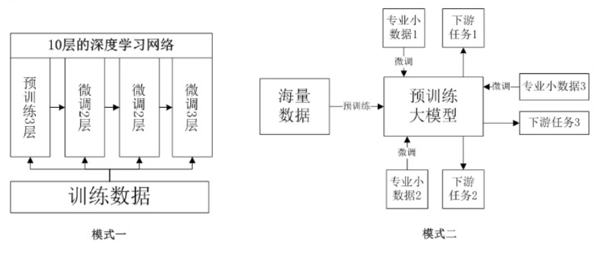{ width="600" }
</figure>

## 11.2 NLP 技术基础

### 11.2.1 分词

**token**：可以是一个字，也可以是一个词，或者是一个字母，甚至是一个字节，要看具体的情况。本质上，一个“Token”就是通过分词技术（工具）将一句话分割成的最小单位，是一个特定的自然语言处理模型能处理的最基本元素

NLP 的第一步工作就是进行分词

### 11.2.2 词向量与词嵌入

**词向量 / 词嵌入**（word embedding）：通过语言模型学习得到的词的特征分布，它包含了大规模语料中复杂的上下文信息

- 词向量：数字编码技术
- 词嵌入：NLP 各网络层之间的数据存在形式

分布式表示：

<figure markdown="span">
  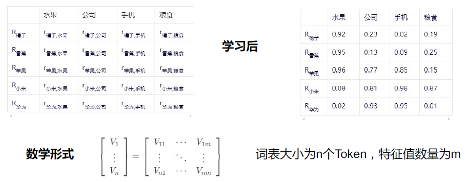{ width="600" }
</figure>

独热表示：得到二维稀疏矩阵，可以处理成一维稠密矩阵

<figure markdown="span">
  { width="600" }
</figure>

### 11.2.3 文本相似度

**1.余弦相似度**：衡量两个向量在方向上相似程度的度量方法

$\text{Cosine Similarity} = \cos \theta = \dfrac{A · B}{||A||\ ||B||}$

**2.欧氏距离**：空房间中两点间的直线距离

$d = \sqrt{\sum\limits_{i=1}^n(x_i - y_i)^2}$

**3.Jaccard 相似度**：用于比较两个集合之间相似性和多样性

$J(A, B) = \dfrac{|A \cap B|}{|A \cup B|}$

$EJ(A, B) = \dfrac{A · B}{||A||^2 + ||B||^2 - A · B}$

**4.曼哈顿距离**：从一个十字路口到另一个十字路口的最短路径

$d = \sqrt{\sum\limits_{i=1}^n|x_i - y_i|}$

## 11.3 经典 NLP 模型

### 11.3.1 词袋模型

Bag of word（BoW）是自然语言处理和信息检索中的一种常用文本表示方法。它将文本表示为一个词的集合，忽略词语的上下文关系，只计算词语的出现频率和其他统计值

构建过程：

1. 分词
2. 构建词表：每个词语对应一个唯一的索引
3. 计算词频
4. 向量化

常用统计量：

1. TF
2. IDF
3. TF-IDF

### 11.3.2 Word2Vec

将词汇表中的每个词用固定长度的向量来表示，这个固定的长度就叫维度

构造变换矩阵对输入矩阵进行降维

<figure markdown="span">
  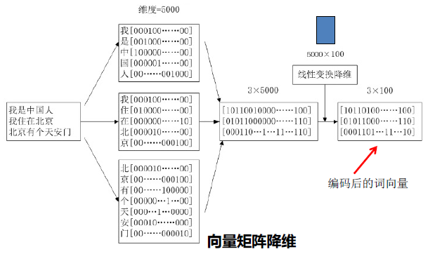{ width="600" }
</figure>

两种实现方式：

1. CBoW：使用给定上下文词（周边词）来学习预测中心词
2. Skip-Gram：通过给定的中心词，来学习预测上下文词

<figure markdown="span">
  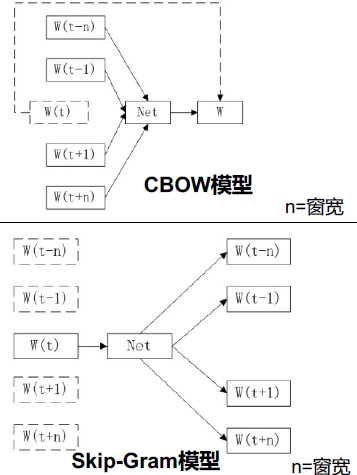{ width="600" }
</figure>

### 11.3.3 Seq2Seq

其核心思想是使用一个编码器网络将输入序列（如源语言句子）编码为一个固定维度的向量或一系列隐状态，然后使用一个解码器网络从这个向量或隐状态出发，逐词生成目标序列（如目标语言句子）。整个过程无须人工设计复杂的语言规则，而是让神经网络自行学习如何进行有效的序列转换

<figure markdown="span">
  { width="600" }
</figure>

编码器和解码器都是深度学习网络

输入的文本（自然语言）通过编码器将词嵌入逐层变换传递，而解码器则再将词嵌入逐层变换传递翻译成文本（自然语言）输出

词嵌入对人类而言就像黑盒子一样，难以解释，但这恰恰就是 AI 的分析和理解过程

## 11.4 Transformer 结构

Transformer 是一种基于注意力机制的序列模型，是一种特殊的 Seq2Seq 编码器 - 解码器结构

<figure markdown="span">
  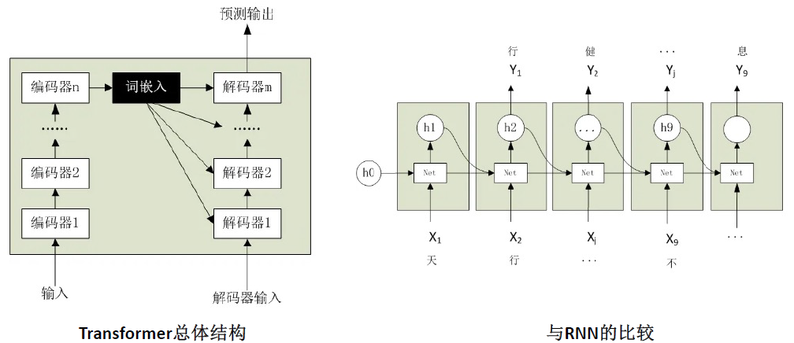{ width="600" }
</figure>

### 11.4.1 编码器

编码器网络由多个编码器层堆叠而成，每个编码器层接收来自嵌入层的输出

<figure markdown="span">
  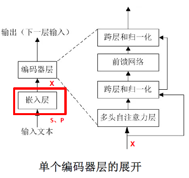{ width="400" }
</figure>

1. 分词：`S = [我, 在, 学, 人, 工, 智, 能]`
2. 增加位置序列：`P = [1, 2, 3, 4, 5, 6, 7]`
3. 编码：在嵌入层网络，完成对 S 和 P 的编码工作，然后将 S 与 P 进行拼接，输出向量 X
4. 词嵌入 X 经过多头注意力运算输出词嵌入 Z
5. 跨层连接与归一化处理
6. 完成输出：输出词嵌入 E

<figure markdown="span">
  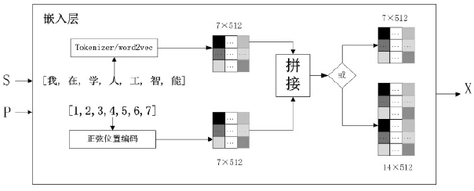{ width="600" }
</figure>

<figure markdown="span">
  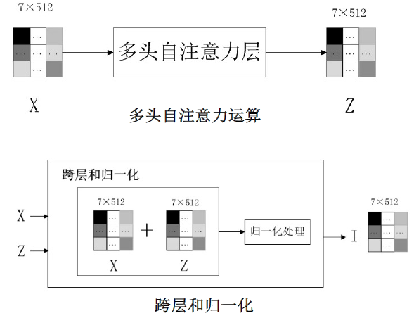{ width="600" }
</figure>

<figure markdown="span">
  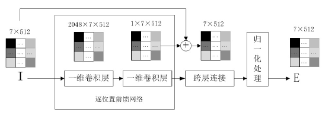{ width="600" }
</figure>

**逐位置前馈网络**：是一个两层的前馈神经网络，每个位置的词向量都独立地经过这个网络进行变换，而不是通常的将多维输入向量平铺展开成一维的向量。在上图中展示的是采用两个一维卷积网络

### 11.4.2 解码器

<figure markdown="span">
  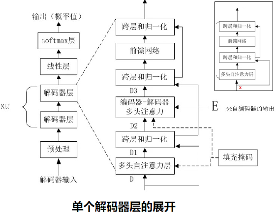{ width="600" }
</figure>

解码器网络由多个解码器层堆叠而成，每个解码器层接收来自编码器的输出 E、前一层的解码器输出

1. 预处理：完成位置编码和解码器输入编码的拼接
2. 填充掩码：输出采用自回归算法，为防止看到未来数据，所以需要增加一个掩码操作，把当前位置之后的数据掩盖掉，解码器边生成边向右移动，直到出现终止条件
3. 多头注意力层处理
4. 跨层和归一化处理
5. 编码器 - 解码器多头注意力层
6. 完成第一层输出
7. 解码器的输出：接下去的解码器层的输入均来自上一层解码器的输出，不再接收样本数据
8. 最终输出：最后再通过全连接层和 softmax 层输出最终的预测结果

<figure markdown="span">
  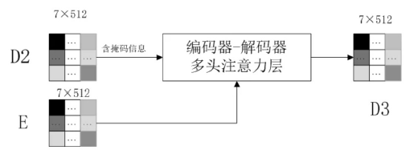{ width="600" }
</figure>

### 11.4.3 多头注意力机制

多头注意力机制的目的是在多个子空间中捕获多种特征，同时实现并行处理，从而加快训练速度。对于同一个输入序列，通过多头注意力机制可以从不同的角度来进行特征提取，每一个头都关注某一个特征

1. Q（query，查询）：当前需要关注或查询的信息点
2. K（key，键）：输入数据中的各个部分或特征
3. V（value，值）：实际被加权求和以生成输出的参数，它包含了输入数据中的具体信息

**自注意力机制**

1. 线性变换
2. 计算注意力分数
3. 归一化注意力分数
4. 最终的注意力分数

<figure markdown="span">
  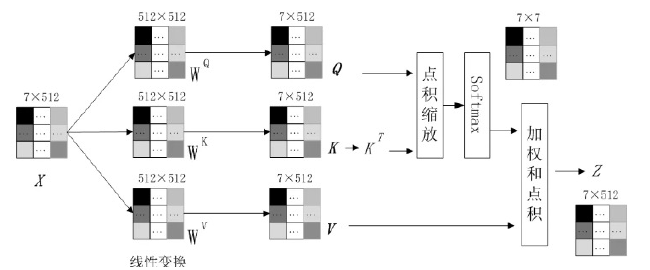{ width="600" }
</figure>

**多头注意力机制**

将 Q、K、V 分为 N 个头，每个头使用不同的权重参数进行自注意力计算，所有这些头的注意力分数会拼接起来，产生最后的多头注意力分数

<figure markdown="span">
  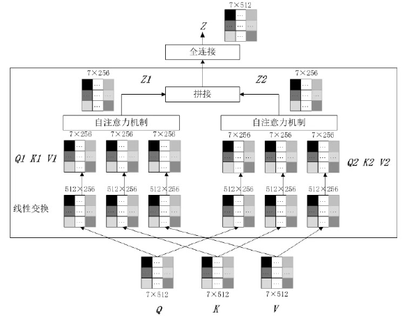{ width="600" }
</figure>

### 11.4.4 3 种类型的 Transformer 模型

1. BERT：仅使用编码器
2. GPT：仅使用解码器
3. T5：编码器和解码器都使用
