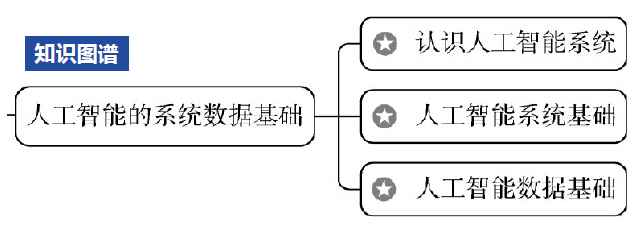
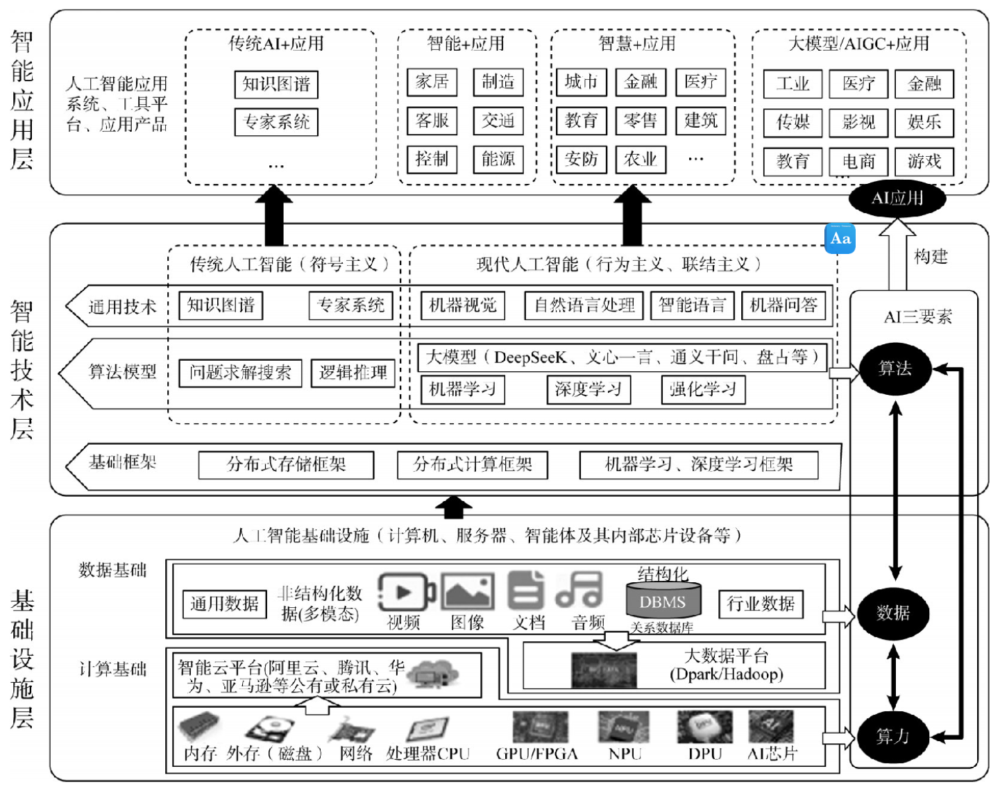
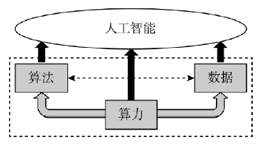
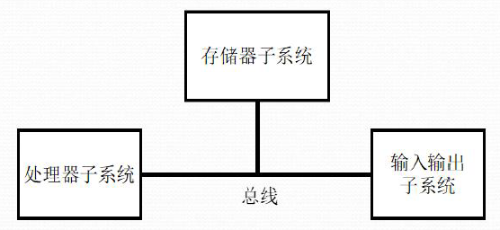
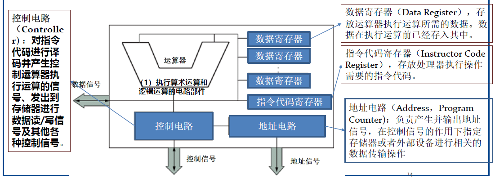
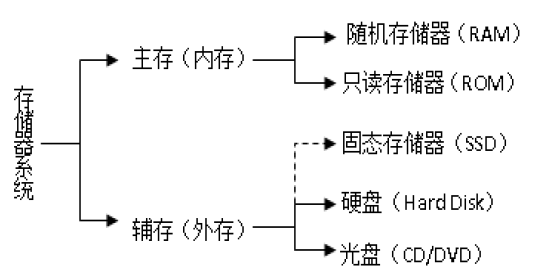
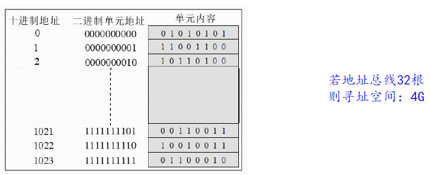
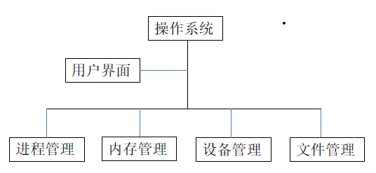

# 2 人工智能的系统数据基础

<!-- !!! tip "说明"

    本文档正在更新中…… -->

!!! info "说明"

    本文档仅涉及部分内容，仅可用于复习重点知识

本节要点：

<figure markdown="span">
  { width="400" }
</figure>

## 2.1 认识人工智能系统

### 2.1.1 人工智能系统架构

<figure markdown="span">
  { width="600" }
</figure>

### 2.1.2 人工智能系统三要素

数据，算法，算力

<figure markdown="span">
  { width="400" }
</figure>

## 2.2 人工智能的系统基础

### 2.2.1 计算机系统组成

硬件系统 + 软件系统

硬件系统的 5 个组成部分（冯·诺伊曼计算机模型）：

- 输入设备、存储器、处理器（运算 + 控制）、输出
- Input, Memory, CPU (Datapath + Controller), Output

硬件系统的 3 个子系统：

1. 存储器
2. 处理器
3. 输入输出

连接三个子系统的是总线（Bus），分为地址总线、数据总线和控制总线

<figure markdown="span">
  { width="400" }
</figure>

程序存储原理：

1. 程序和程序执行所需要的数据在执行前存放到存储器中
2. 要求程序和数据采用同样的格式 —— 二进制
3. 执行程序时，给出程序所在的存储位置

### 2.2.2 处理器系统

<figure markdown="span">
  { width="600" }
</figure>

性能指标：

1. 主频
2. CPU 数量、内核数量
3. 字长：处理器一次能够处理的最大二进制数的位数
4. 协处理器：不单独工作、在 CPU 的协调下完成任务，例如处理浮点运算的协处理器
5. 内部高速缓存器（Cache）

### 2.2.3 存储器系统

- 存储器由若干个存储单元组成，每个存储单元都有一个唯一的标识叫做存储器地址，用二进制位模式进行标识
- 数据存放在存储单元中，存储单元以字节（Byte，缩写为 B ）为单位，一个字节由 8 位二进制位（bit，缩写为 b） 组成
- 存储容量即存储器中存储单元的总数，也叫做字节数，或者称为地址空间

<figure markdown="span">
  { width="600" }
</figure>

##### 内存储器（主存储器）

容量小，运行速度快

- 每个内存单元存储 1 个字节的地址，地址也按二进制位进行标识，连续存放
- 内存空间和 CPU 地址总线数目有关

<figure markdown="span">
  { width="600" }
</figure>

1. 随机存取存储器（RAM）
      1. DRAM：制作内存条
      2. SRAM：制作 Cache
2. 只读存储器（ROM）：断电后存储的数据不会丢失
      1. PROM
      2. EPROM
      3. EEPROM

##### 外存储器（辅助存储器）

容量大，运行速度慢

磁盘（disk）

---

固态存储器（SSD），存储介质是闪存（Flash Memory）

优势：

1. 速度快
2. 克服了 RAM 的易失性

类型：

1. U 盘，固态硬盘
2. 卡片式固态存储器：CF 卡，SD 卡

### 2.2.4 输入输出系统

端口：是外部设备与主机连接器。如 USB 接口，Type C 接口

端口和主机的数据传输模式有两种：并行或串行

- 并行一次传输 8 位数据（字节模式）
- 串行每次传输 1 位数据（也是位模式）

### 2.2.5 操作系统

操作系统是计算机硬件和用户 其他软件和人之间的接口，位于计算机系统核心，它使用户能够方便地操作计算机，能有效地对计算机软件和硬件资源进行管理和使用

- 内核（kernel）：是操作系统的核心，管理计算机各种资源所需要的基本模块（程序）代码 ，包括文件管理、设备驱动、内存管理、 CPU 调度和控制等功能
- Shell（外壳程序）：负责接收用户（包括用户执行的应用程序）的操作命令，并将这个命令解释后交给 Kernel 去执行
- 在 Windows 系统中 Shell 是 GUI

<figure markdown="span">
  { width="400" }
</figure>

#### 进程管理

- 进程：正在执行中的程序
- 进程管理：最重要的任务是进程调度，其目的就是有效管理而且防止死锁

时间片轮转法：

- 按照 FCFS（先来先服务原则）原则，排成一个队列

#### 内存管理

- 内存调度
- 内存和外存数据交换
- 内存保护机制

#### 设备管理

#### 文件系统

## 2.3 人工智能数据基础

### 2.3.2 数值数据的表示

- 原码
- 反码
- 补码

[浮点数的表示](../../compulsory_courses/computer_organization/theory/ch3.md#35-floating-point){:target="_blank"}

### 2.3.3 文本和文档数据的表示

ASCII 码、GBK、UTF-8

### 2.3.4 多媒体数据的表示

#### 图形和静态图像

图形（Graphics，矢量图）是指有几何图形的图。矢量图形的格式是一组指令集合，这些指令被编码为二进制数据存储在计算机中

静止的图像（Image，位图）是一个矩阵，其元素代表空间的一个点，称之为像素点。以像素点 RGB 数据信息表示，每个像素点包含 R、G、B 的 24 位（3 Byte）二进制数据

bmp, gif, jpeg/jpg

#### 音频数据表示

wav, mp3, aac

#### 视频与动画

视频是图像数据的一种