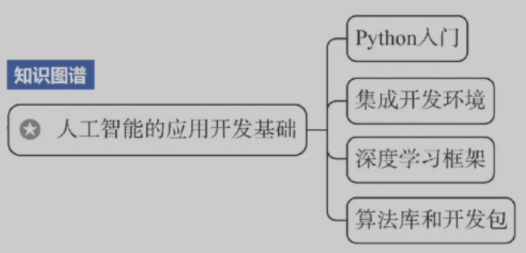
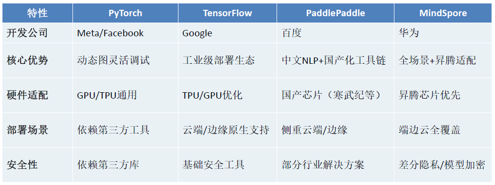

# 3 人工智能的应用开发基础

<!-- !!! tip "说明"

    本文档正在更新中…… -->

!!! info "说明"

    本文档仅涉及部分内容，仅可用于复习重点知识

本节要点：

<figure markdown="span">
  { width="400" }
</figure>

## 3.1 从手写数字识别应用说起

### 3.1.2 一个简单手写数字识别程序

假如我们在白纸上用黑色的笔写上一个数字（0 - 9），再用手机拍一张照片，我们希望让机器能够认知写了什么字。这就是典型的人工智能问题，机器如何识别一个手写体的数字

1. 数据加载和预处理，就是加载手写数字数据集，对数据进行必要的预处理，比如展平图像、标准化特征等
2. 模型选择和训练，就是选择一个合适的机器学习模型，使用训练数据来训练模型
3. 模型评估和调优，就是在测试数据上评估模型的性能，根据评估结果调整模型参数或选择其他模型以提高性能
4. 用户接口实现，就是完成设计一个用户界面，允许用户输入手写数字图像。并且，将用户输入的图像预处理成模型可以接受的格式
5. 预测和结果展示，使用训练好的模型对用户输入的图像进行预测，将预测结果展示给用户

### 3.1.3 基本环境搭建与配置

!!! tip "教程"

    详细教程见 [Python](../../../knowledge/python/index.md){:target="_blank"}

#### Anaconda

Python 环境管理器

#### PyCharm

IDE（集成开发平台）

#### Jupyter Notebook

交互式学习环境

## 3.2 Python 入门

!!! tip "教程"

    详细教程见 [Python](../../../knowledge/python/index.md){:target="_blank"}

## 3.3 AI 算法库和开发工具包

### 3.3.1 数据处理和分析

Pandas

提供高效的数据结构和丰富的数据操作工具

### 3.3.2 数值计算和科学计算

NumPy

Python 科学计算库，提供高效的多维数组对象和用于数值计算的工具

### 3.3.3 可视化工具

Matplotlib

绘图库

### 3.3.4 自然语言处理工具

1. NLTK
2. spaCy
3. Transformers

### 3.3.5 图形用户界面开发工具

1. PyQt
2. Tkinter

## 3.4 深度学习框架

深度学习框架是专为简化深度学习模型开发而设计的软件工具，它通过封装底层数学运算、优化算法实现和硬件加速功能，帮助开发者更高效地构建、训练和部署神经网络模型

<figure markdown="span">
  { width="600" }
</figure>

### 3.4.1 PyTorch 框架环境配置

PyTorch 是一个由 Facebook 人工智能研究院开发的开源深度学习框架

### 3.4.3 PaddlePaddle

PaddlePaddle（飞桨）是由中国百度公司（Baidu）自主研发的深度学习框架，于 2016 年正式开源，是中国首个本土研发的、功能完备的深度学习框架