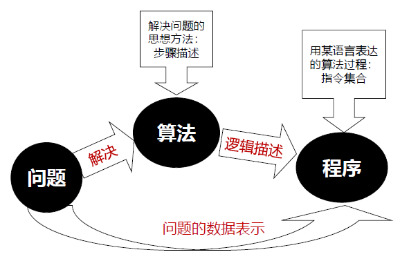

# 4 从问题求解到机器学习

!!! tip "说明"

    本文档正在更新中……

!!! info "说明"

    本文档仅涉及部分内容，仅可用于复习重点知识

## 4.1 问题求解概述

问题求解是人工智能的核心领域之一，求解问题的方法是设计算法

### 4.1.1 案例分析

1. [装箱问题](../../compulsory_courses/ADS/ch11.md#2-bin-packing){:target="_blank"}
2. 倒水量水问题

### 4.1.2 问题求解理论基础

**问题**：某个给定的智能活动过程的当前状态与智能主题所要求的目标状态之间的差距

## 4.2 通用问题求解与算法方法学

### 4.2.1 通用问题求解与算法

问题求解的核心就是寻找解决方案并实现算法设计

<figure markdown="span">
  { width="600" }
</figure>

### 4.2.2 算法方法学

#### 贪心法

[Greedy Algorithms](../../compulsory_courses/ADS/ch9.md){:target="_blank"}

#### 分治法

[Divide and Conquer](../../compulsory_courses/ADS/ch7.md){:target="_blank"}

#### 回溯法

[Backtracking](../../compulsory_courses/ADS/ch6.md){:target="_blank"}

#### 动态规划

[Dynamic Programming](../../compulsory_courses/ADS/ch8.md){:target="_blank"}

## 4.3 问题求解与搜索算法

### 4.3.1 状态空间搜索类问题求解

四要素：

1. 初始状态：问题开始时的状态
2. 目标状态：问题希望达到的状态
3. 操作：从一个状态转换到另一个状态的规则或操作
4. 路径：从初始状态到目标状态的一系列操作的集合

八数码、华容道

### 4.3.2 启发式搜索问题求解

在搜索空间中查找问题解决方案的技术。启发式搜索使用一个启发式函数来评价选择哪个分支可能会导向最佳解。启发式函数可以看作是一种“直觉”或“猜想”

走迷宫问题：A* 搜索算法

### 4.3.3 其他搜索求解算法

1. 暴力搜索：可使用 [剪枝搜索](../../compulsory_courses/ADS/ch6.md#α---β-pruning){:target="_blank"}
2. [最大最小搜索算法](../../compulsory_courses/ADS/ch6.md#tic-tac-toe){:target="_blank"}
3. 深度/广度优先搜索
4. 遗传算法
5. 模拟退火
6. 约束满足问题求解

## 4.4 机器学习求解方法

### 4.4.1 机器学习及定义

机器学习的目标就是根据已有的数据集，构造一个映射函数，从而预测未知输入所对应的输出

机器学习的 3 个核心要素：

1. 数据
2. 模型
3. 算法

### 4.4.2 机器学习的类型及应用

1. 有监督学习
2. 无监督学习
3. 半监督学习

## 4.5 机器学习算法库 Scikit-learn

