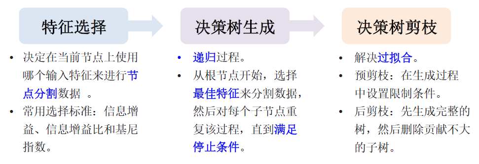

# 5 回归与分类模型

<!-- !!! tip "说明"

    本文档正在更新中…… -->

!!! info "说明"

    本文档仅涉及部分内容，仅可用于复习重点知识

## 5.1 监督学习方法概述

监督学习主要解决两类问题：回归和分类

监督学习的核心：从数据中发现规律，并将这些规律应用于新的、未知的数据

<figure markdown="span">
  { width="600" }
</figure>

典型流程：

1. 数据收集及预处理
2. 选择算法
3. 训练模型
4. 模型评估和部署

### 5.1.1 模型评估

<figure markdown="span">
  { width="600" }
</figure>

**混淆矩阵**（confusion matrix）

混淆矩阵是用于评估分类模型性能的工具，它展示了模型在不同类别上的预测结果与真实值的对比情况

对于二分类问题，混淆矩阵通常是一个 2x2 的矩阵，结构如下：

<figure markdown="span">
  { width="600" }
</figure>

<ol>
  <li>TN（True Negative，真负例）：模型正确预测为负类的样本数量</li>
  <li>FP（False Positive，假正例）：模型错误预测为正类的负类样本数量（即“误报”）</li>
  <li>FN（False Negative，假负例）：模型错误预测为负类的正类样本数量（即“漏报”）</li>
  <li>TP（True Positive，真正例）：模型正确预测为正类的样本数量</li>
</ol>

- 精确率（precision）：$\dfrac{TP}{TP + FP}$
- 召回率（recall）：$\dfrac{TP}{TP + FN}$
- F1 分数（F1 score）：$\dfrac{2TP}{2TP + FP + FN}$
- 特异度（specificity）：$\dfrac{TN}{TN + FP}$
- 假阴性率（false negative rate）：$\dfrac{FN}{TP + FN}$

### 5.1.2 面临的挑战

1. 数据质量：幸存者偏差；采用数据与真实数据分布不一致
2. 可解释性：模型是个黑箱，模型越大，能力越强，可解释性越差
3. 计算资源：训练成本高
      - 方案：设计更优的算法
4. 过拟合：训练集上表现很好，预测时表现很差的现象
      1. 交叉验证
      2. dropout
      3. 正则化
      4. 不过度训练
      5. 特征选择
      6. 集成学习，即多种不同质模型的组合投票
      7. 数据质量与预处理技术

## 5.2 回归模型

<figure markdown="span">
  { width="600" }
</figure>

### 5.2.1 线性回归模型

输入变量和输出变量之间存在线性关系

$Y = \beta_0 + \beta_1 X + \beta_2 X + \cdots + \beta X + \epsilon$

线性回归评价指标：

<figure markdown="span">
  { width="600" }
</figure>

### 5.2.2 Logistic 回归

逻辑回归是一种广义线性回归，也是常用的统计学习方法，用于解决二分类问题

<figure markdown="span">
  { width="600" }
</figure>

1. 注意事项
      1. 逻辑回归不要求自变量和因变量是线性关系
      2. 逻辑回归应该包括所有重要的变量，为避免过拟合和欠拟合，可采用逐步筛选法估计逻辑回归
      3. 逻辑回归需要大样本量，样本量较少可能会导致估计效果比普通最小二乘法差
      4. 自变量不应具有多重共线性，会影响参数估计，可解释性等
2. 适用范围
      1. 因变量是分类变量，且只能为数值
      2. 自变量与 Logistic 概率之间符合线性关系
      3. 样本量远多于自变量个数（5-10 倍），一般 10 倍以上拟合的模型较有信服度
      4. 自变量之间相互独立

## 5.3 分类模型

<figure markdown="span">
  { width="600" }
</figure>

<figure markdown="span">
  { width="600" }
</figure>

<figure markdown="span">
  { width="600" }
</figure>

### 5.3.1 线性分类器

核心思想：在输入特征向量的特征空间中找到一个线性决策边界，将不同类别的数据点分开

### 5.3.2 决策树分类模型

结构：类似于一棵倒置的树，从根节点开始，通过一系列的判断，最终到达叶节点得出结论

构建步骤：

1. 特征选择
2. 决策树生成
3. 决策树剪枝

<figure markdown="span">
  { width="600" }
</figure>

