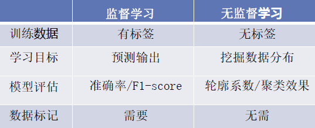
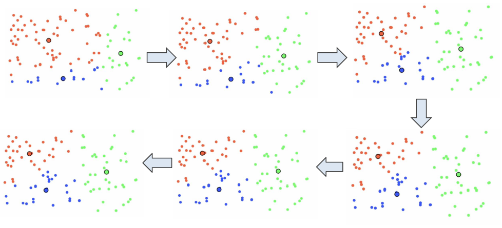
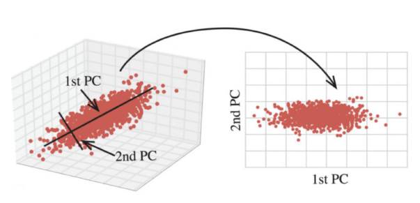

# 6 数据的聚类和降维技术

<!-- !!! tip "说明"

    本文档正在更新中…… -->

!!! info "说明"

    本文档仅涉及部分内容，仅可用于复习重点知识

## 6.1 无监督学习方法概述

<figure markdown="span">
  { width="600" }
</figure>

异常检测：既可以是有监督学习，也可以是无监督学习

无监督学习的两大类方法

1. 聚类：目标是将相似的数据点分组在一起，形成簇（cluster）
2. 降维：降维将高维数据转换为低维表示，减少数据的复杂度，同时巧妙地保留了原始数据中最重要的信息

## 6.2 聚类分析技术

聚类是一种无监督学习技术，旨在将数据集分成若干组，使得同组内的样本相似度高，而不同组间的样本相似度低

### 6.2.1 K-means 算法

K-means 是最常用的聚类算法之一

1. 随机初始化若干个中心点，周围散布着未分类的数据点
2. 将每个数据点分配给最近的中心，形成初步的簇
3. 重新计算每个簇的中心点

<figure markdown="span">
  { width="600" }
</figure>

### 6.2.2 鸢尾花案例

在鸢尾花案例中，聚类就像是在没有任何先验知识的情况下，仅仅根据花的特征（花萼和花瓣的长度和宽度）来将它们分类

```python linenums="1"
iris = datasets.load_iris()
X = iris.data
y = iris.target

# 对数据进行标准化
# 标准化的目的是将所有特征调整到相同的尺度
# 这对 K-means 算法很重要
scaler = StandardScaler()
X_scaled = scaled.fit_transform(X)

# n_cluster 指定簇的数量
# random_state=42 确保结果可重复
kmeans = KMean(n_cluster=3, random_state=42)
kmeans.fit(X_scaled)

# 获取聚类结果
y_kmeans = kmeans.pred(X_scaled)

# 评估聚类结果
accuracy = accuracy_score(y, y_kmeans)
print(f'聚类准确率：{accuracy:.2f}')

# 分析簇的组成
for i in range(3):
    cluster = np.where(y_kmeans == i)[0]
    printf(f'\n簇 {i} 的组成：')
    for iris_type in range(3):
        count = np.sum(y[cluster] == iris_type)
        print(f'{iris.target_names[iris_type]}：{count}')
```

## 6.3 数据降维技术

降维是将高维数据转换为低维表示的过程，以简化数据集并降低计算复杂性

降维的作用：

1. 数据可视化（二维绘图）
2. 数据去噪，去除系统性伪影
3. 数据压缩（图像，音频）
4. 加速监督学习

### 6.3.1 主成分分析

PCA（Principal Component Analysis）是最常用的降维技术之一

1. 数据中心化
2. 计算协方差矩阵
3. 计算特征向量和特征值
4. 选择主成分

寻找到原始空间中的一个方向，将数据降维到这个方向中，可以保留最多的信息

<figure markdown="span">
  { width="600" }
</figure>

### 6.3.2 鸢尾花案例

```python linenums="1"
iris = datasets.load_iris()
X = iris.data
y = iris.target

scaler = StandardScaler()
X_scaled = scaler.fit_transform(X)

# 创建 PCA 对象，转换 X_scaled
# X_pca 的每一列对应一个主成分
pca = PCA()
X_pca = pca.fit_transform(X_scaled)

# explain_variance_ratio 标识每个主成分解释了多少比例的方差
# 这个比例反映了每个主成分的重要性
explain_variance_ratio = pca.explained_variance_ratio_

# 分析主成分的组成
print('主成分的特征向量：')
for i, component in enumerate(pca.components_):
    print(f'PC{i + 1}：{component}')

print(f'\n原始特征与主成分的相关性')

for i, component in enumerate(pca.components_):
    correlations = component * np.sqrt(pca.explained_variance_{i})
    print(f'PC{i + 1}：')
    for j, corr in enumerate(correlations):
        print(f'{iris.feature_names[j]}：{corr:.3f}')
```
