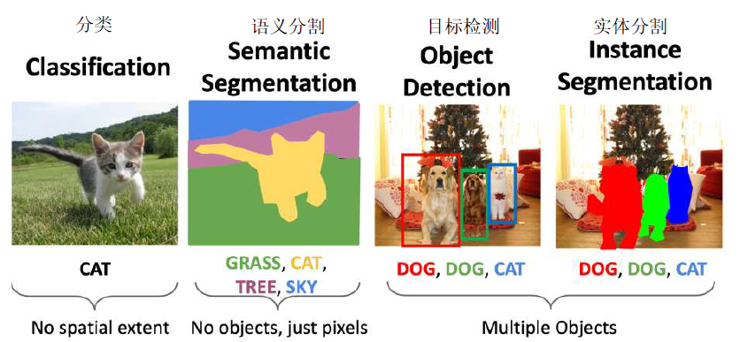
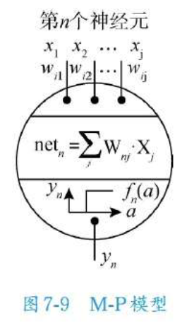
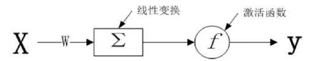
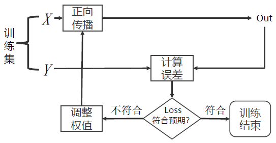

# 7 深度网络基础组件

<!-- !!! tip "说明"

    本文档正在更新中…… -->

!!! info "说明"

    本文档仅涉及部分内容，仅可用于复习重点知识

- 机器学习：把大量的数据归纳到少数的参数中（参数估计）
- 机器学习到深度学习：从简单到复杂，从线性到非线性，从可解释到不可解释

最小二乘法是机器学习最基础的模型

## 7.1 深度学习三要素概述

1. 算法
2. 算力
3. 数据

### 7.1.1 算法

误差反向传播算法（BP 算法）让神经网络的自主学习成为可能

“没有免费的午餐”定律：不存在一种“万能”的深度学习模型（如 CNN、RNN、Transformer 等）能在所有任务（图像分类、NLP、时间序列预测等）中均达到最优性能

应该按照任务的目标来设计网络

## 7.2 机器图像识别破冰

<figure markdown="span">
  { width="600" }
</figure>

### 7.2.1 人眼识别物体的基本过程

神经元的“全或无”现象：

只有当外来刺激有足够大的强度，才能引起神经元细胞的兴奋并产生动作电位，但再增加刺激强度并不会导致动作电位的幅度发生变化。神经元细胞产生的动作电位沿着细胞膜向周围传播，传播的范围和距离也不会随刺激强度的不同而不同

### 7.2.2 感知机模型

深度学习（Deep Learning，DL）是机器学习的一个子集，它使用多层人工神经网络来精准完成诸如物体检测、语音识别、语言翻译等任务

基本思想：通过构建多层网络，对目标进行多层表示，以期通过多层的高维特征来表示数据的抽象语义信息，从而获得更好的特征鲁棒性

多层网络结构：由多层神经元组成，包括输入层、隐藏层和输出层。这些层之间通过权重和偏置进行连接，形成复杂的网络结构

神经网络的特性：

1. 自动特征提取：自动从原始数据中提取有用的特征，无需人工设计特征工程
2. 非线性激活函数：深度学习模型中通常使用非线性激活函数（如 ReLU、sigmoid 等），使得模型能够学习复杂的非线性关系
3. 大规模数据处理能力：借助现代计算技术和大数据资源，深度学习模型能够处理大规模数据集，提高模型的准确性和泛化能力

---

科学家们一直试图通过仿生的方法寻找机器识别物体的解决方法。于是提出了模仿生物识别图像的原理进行人工智能建模，建立了神经元模型，再由多个神经元模型组成人工神经网络结构。最早对神经元建立数学模型的是沃伦·麦卡洛克和沃尔特·皮茨提出的简易数学模型（M-P 模型）

<figure markdown="span">
  { width="200" }
</figure>

M-P 模型主要由 3 部分组成

**1.输入与连接强度**

$x_1,\ x_2,\ x_j$：第 n 个神经元接受的来自其他神经元的输出信息作为该神经元的输入信息

$net_n$：第 n 个神经元的内部状态，根据与其他神经元的联结强度的权重 $w_{ij}$，将其他神经元的输出信息求加权和 $net_n = \sum w_{ij}x_j$

**2.传递函数 T**

传递函数模拟了神经元的“全或无”现象，数学表达式如下：

$$
T_n(a) = \begin{cases}
    0 & a < \theta \\
    T & a \geqslant \theta
\end{cases}
$$

**3.输出**

$y_n = T_n(net_n, \theta_n)$，其中 $\theta_n$ 为阈值，又称偏置值

---

感知机模型用激活函数代替了最初的传递函数功能

<figure markdown="span">
  { width="400" }
</figure>

网络 $\Sigma = WX^T + b$，b 是偏置量。f 是激活函数，用于完成非线性变换

## 7.3 浅层人工神经网络模型

感知机无法解决“异或问题”，给感知机模型直接宣判了“死刑”。但在 BP 算法提出后，感知机模型重获新生

### 7.3.1 单隐含层 MLP

多层神经网络解决了感知器模型只能处理线性可分问题的缺陷，使神经网络真正成为强大的建模工具

一个多层感知器至少包含三层：一个输入层，一个隐藏层和一个输出层

数据通过输入层进入网络，乘以连接的权重后输入到隐藏层节点。隐藏层节点将这些加权后的输入求和并经过一个非线性变换（称为激活函数）后送往输出层

### 7.3.2 损失函数

损失函数即模型的优化目标

### 7.3.3 BP 算法

反向传播算法是一种常见的人工神经网络学习算法，特别适用于多层前馈神经网络的训练。该算法由学习过程中的信号正向传播与误差的反向传播两个过程组成

<figure markdown="span">
  { width="400" }
</figure>

特点：

1. 自适应、自主学习
2. 较强的非线性映射能力
3. 严谨的推导过程
4. 较强的泛化能力

局限性：

1. 易陷入局部最小值
2. 收敛速度慢
3. 隐节点选取缺乏理论指导
4. 学习新样本时可能遗忘旧样本

### 7.3.4 梯度下降法

以最快的速度找到函数局部最小值的优化算法

以 $f(x) = x^2$ 为例，其梯度下降法如下所述

1. 方向：即梯度的反方向，$-\nabla f=-2x$
2. 步长：假设学习率 $\eta = 0.5$，则一次前进的步长为 $-0.5\nabla f = -x$
3. 终止条件：理性情况是梯度 $\nabla = 0$，实际上一般做不到，可设置一个较小的值如 $10^{-2}$ 作为代替

以 $P(8, 64)$ 为起点，$\eta = 0.1$，梯度下降法的过程如下：

| $x_i$ | 8 | 6.4 | 5.12 | 4.096 |
| :--: | :--: | :--: | :--: | :--: |
| $\nabla f$ | 16 | 12.8 | 10.24 | ... |
| $x_i - \eta \nabla f$ | 6.4 | 5.12 | 4.096 | ... |

### 7.3.5 MLP 训练过程中权重值的调整

MLP 模型的训练，就是指不断地调整隐含层和输出层计算单元的权重值

## 7.4 人工神经网络应用实战 —— MNIST 手写体数字识别

```python linenums="1"
from sklearn.datasets import fetch_openml
from sklearn.model_selection import train_test_split
from sklearn.neural_network import MLPClassifier

# 加载 MNIST 数据集
mt_data = fetch_openml('mnist_784', version=1)
# 归一化处理，每个像素的取值范围是 0~255
X, y = mt_data.data / 255.0, mt_data.target
# 划分训练集和测试集
X_train, X_test, y_train, y_test = train_test_split(X, y, test_size=0.25, random_state=42)
# 查看数据形状
print(X_train.shape)

"""
创建并训练 MLP 分类器

:param hidden_layer_sizes: 隐藏层的数量和每层的神经元数量
:param max_iter: 最大迭代次数
:param solver: 权重优化算法的选择
    'sgd' 'adam'
:param activation: 应用于隐藏层的激活函数
    'logistic' 'tanh' 'relu'
:param alpha: L2 惩罚（正则化项）参数，用来防止过拟合
"""
my_MLP = MLPClassifier(hidden_layer_sizes=(100, ), max_iter=100, random_state=42)
# 模型训练
my_MLP.fit(X_train, y_train)
# 评估模型
score = my_MLP.score(X_test, y_test)
# 输出准确率
print(f'Model accuracy: {score:.2f}')
```

## 7.5 扩展阅读

### 7.5.1 激活函数的选择

激活函数的作用是通过非线性变换，使神经网络具备非线性特性，以解决一些非线性任务

常用激活函数

1. sigmoid：$\dfrac{1}{1 + e^{-x}}$
2. tanh：$\dfrac{e^x - e^{-x}}{e^x + e^{-x}}$
3. ReLU：$\max(0, x)$
4. ELU：$f_i(a_i) = \begin{cases}
    x & \text{if}\  x > 0 \\
    \alpha(e^x - 1) & \text{if}\  x \leqslant 0
\end{cases}$
5. softmax：$\dfrac{e^{x_i}}{\sum_j e^{x_j}}$

### 7.5.2 损失函数的选择

常用损失函数（$T_i$ 是模型输出的结果，$Y_i$ 是训练样本的结果）：

1. 回归损失函数：用于衡量回归系统的误差
      1. 均方误差 $MSE = \dfrac{\sum\limits_{i=1}^N(T_i - Y_i)^2}{N}$
      2. 平均绝对误差 $MAE = \dfrac{\sum\limits_{i=1}^N|T_i - Y_i|}{N}$
      3. 平均绝对百分比误差 $MAPE = \dfrac{\sum\limits_{i=1}^N|\dfrac{Y_i - T_i}{Y_i}|}{N} \times 100$
      4. 均方根对数误差 $MSLE = \dfrac{\sum\limits_{i=1}^N[\log(T_i + 1) - \log(Y_i + 1)]^2}{N}$
2. 分类损失函数
      1. 二进制交叉熵，对应激活函数 sigmoid
      2. 多分类交叉熵，对应激活函数 softmax

### 7.5.3 优化器的选择

1. 随机梯度下降法（SGD）
      1. 小批量梯度下降法（Mini-batch SGD）
      2. 动量梯度下降法（Momentum SGD）
2. 自适应梯度算法（AdaGrad）