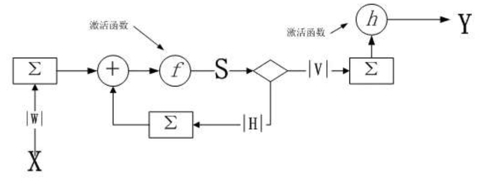
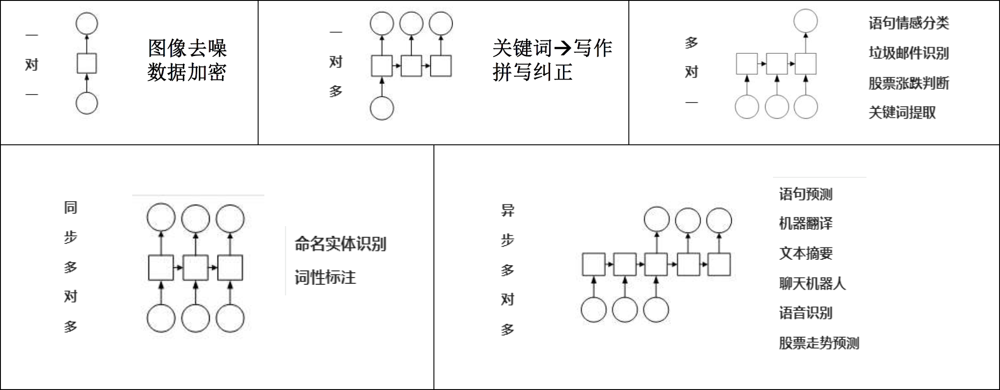
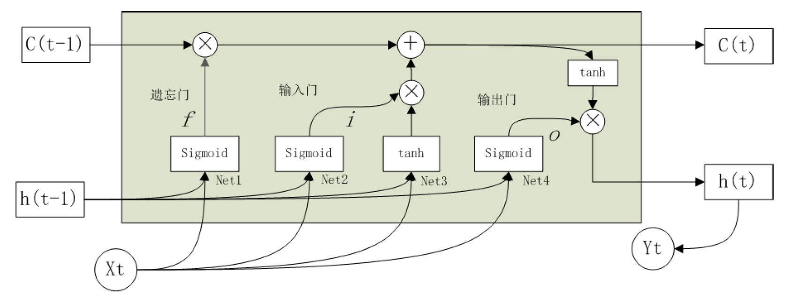
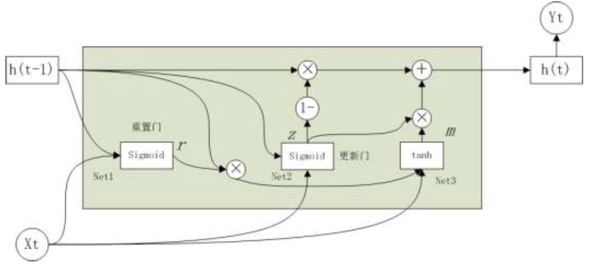
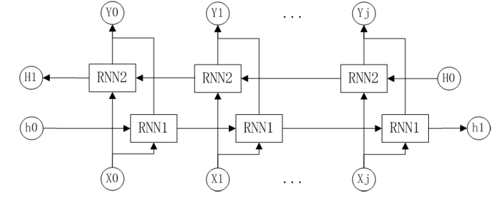
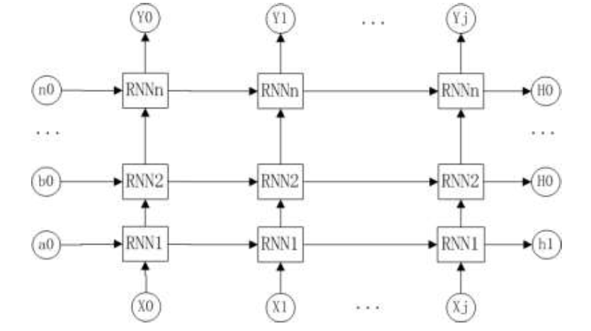

# 9 循环神经网络

<!-- !!! tip "说明"

    本文档正在更新中…… -->

!!! info "说明"

    本文档仅涉及部分内容，仅可用于复习重点知识

Recurrent Neural Network（RNN）

## 9.1 循环神经网络概述

一种特殊类型的反馈神经网络，专门用于处理序列数据

### 9.1.1 RNN 基本结构

<figure markdown="span">
  { width="600" }
</figure>

在 t 时刻，输出

$$
\begin{aligned}
    Y_t & = h(V·S_t + \alpha)\\
    S_t & = f(W·X_t + H·S_{t - 1} + \beta)
\end{aligned}
$$

1. h 和 f 是激活函数
2. W 是输入层到隐含层的权重矩阵
3. V 是隐含层到输出层的权重矩阵
4. H 是隐含层上一次的值作为这一次的输入的权重
5. $\alpha,\ \beta$ 是偏置值

### 9.1.3 RNN 结构分类

1. 一对一
2. 一对多
3. 多对一
4. 同步多对多
5. 异步多对多

<figure markdown="span">
  { width="600" }
</figure>

## 9.2 LSTM

Long Short-Term Memory（长短期记忆网络）

RNN 的问题：无法学习太长的序列，“很快忘记前面说过的话”

### 9.2.1 LSTM 结构和计算方法

LSTM 是一种优化的 RNN，由输入门、遗忘门、输出门及记忆状态（也叫记忆细胞）组成

<figure markdown="span">
  { width="600" }
</figure>

在 t 时刻，输入有 3 个向量

1. $X_t$
2. $h_{t-1}$：隐式编码
3. $C_{t-1}$：记忆状态

输出也有 3 个向量

1. $Y_t$
2. $h_t$：隐式编码
3. $C_t$：记忆状态

| 模块 | 作用 | 计算方法 |
| :--: | :--: | :--: |
| 遗忘门 | 决定什么时候把以前的状态遗忘 | $f_t = sigmoid(Net1)$ |
| 输入门 | 决定什么时候加入新的状态 | $i_t = sigmoid(Net2)$ |
| 输出门 | 决定什么时候把状态和输入叠加输出 | $o_t = sigmoid(Net4)$ |
| 记忆状态 | 累计历史信息，调控 $h_t$ 输出内容 | $C_t = f_t \otimes C_{t-1} + i_t \otimes \tanh(Net3)$ |
| 隐式编码 | 与下一次的输入一起参与计算 | $h_t = o_t \otimes \tanh(C_t)$ |
| Net1 | 遗忘门的拓扑结构 | $Net1 = W_{h1} · h_{t-1} + W_{X_1} · X_t + b_1$ |
| Net2 | 输入门的拓扑结构 | $Net2 = W_{h2} · h_{t-1} + W_{X_2} · X_t + b_2$ |
| Net3 | 输入 tanh 层的拓扑结构 | $Net3 = W_{h3} · h_{t-1} + W_{X_3} · X_t + b_3$ |
| Net4 | 输出门的拓扑结构 | $Net4 = W_{h4} · h_{t-1} + W_{X_4} · X_t + b_4$ |
| $\otimes$ | 向量按位相乘（点乘）| |
| $\oplus$ | 向量按位相加 | |

权重 $W_{hn},\ W_{xn},\ b$ 就是 LSTM 需要学习的参数

### 9.2.2 LSTM 的应用领域

1. 机器翻译
2. 文本生成
3. 情感分析
4. 聊天机器人
5. 语音识别
6. 时间序列预测
7. 推荐系统
8. 异常检测
9. 音乐生成
10. 动作识别

## 9.3 其他循环神经网络

### 9.3.1 GRU

Gated Recurrent Unit（门控循环单元）是对 LSTM 的一种简化

1. 更新门：将遗忘门与输入门结合，更新门调控着用候选信息来更新当前的隐式编码信息的程度值，该值越大，保留的信息越多
2. 重置门：调控着忘记以前的状态的程度值，该值越小，被忽略的信息越多

<figure markdown="span">
  { width="600" }
</figure>

### 9.3.2 Bi-RNN

Bi-directional RNN（双向 RNN）

<figure markdown="span">
  { width="600" }
</figure>

### 9.3.3 Deep RNN

Deep Recurrent Neural Network（深度循环神经网络）

<figure markdown="span">
  { width="600" }
</figure>