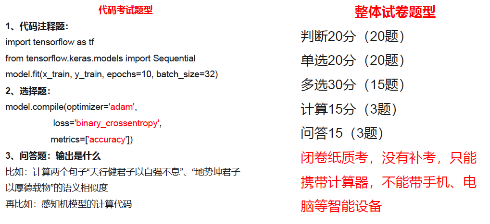
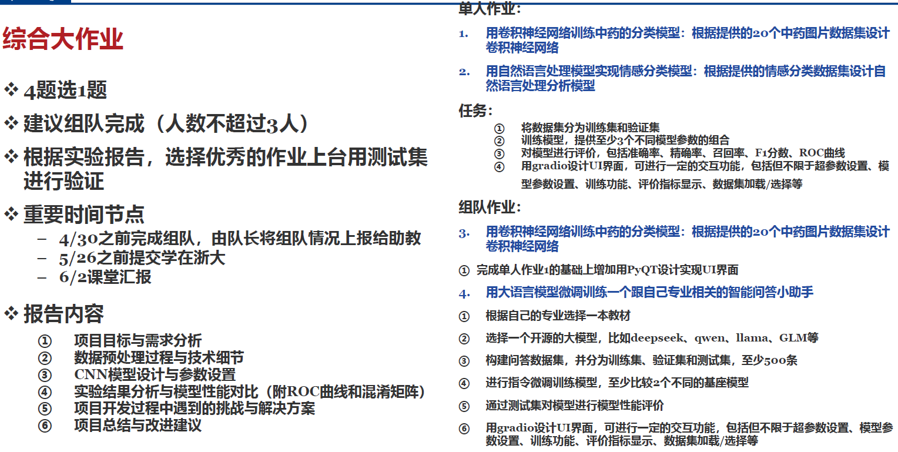

# 人工智能基础（A）

!!! tip "说明"

    本文档正在更新中……

## 课程介绍

!!! info "注意"

    此为 2024-2025 春夏学期课程安排，仅供参考

nd老师

### 考核方式

<figure markdown="span">
  { width="800" }
</figure>

人工智能基础（A）课程大纲

703 KB | 14 page

<a class="hq-down-button" target="_blank" href="../../../file/AI_basic/ai_doc1.pdf" markdown="1">:fontawesome-solid-download: 下载</a>

#### 期中考试

期中考试开卷，考试时间非常紧张，允许携带电子设备，允许使用各种工具，包括 AI

#### 期末考试

<figure markdown="span">
  { width="800" }
</figure>

#### 综合大作业

<figure markdown="span">
  { width="800" }
</figure>

## 笔记

### 个人笔记

[1 初识人工智能](./ch1.md) 
[2 人工智能的系统数据基础](./ch2.md) 
[3 人工智能的应用开发基础](./ch3.md) 
[4 从问题求解到机器学习](./ch4.md) 
[5 回归与分类模型](./ch5.md) 
[6 数据的聚类和降维技术](./ch6.md) 
[7 深度网络基础组件](./ch7.md) 
[8 卷积神经网络](./ch8.md) 
[9 循环神经网络](./ch9.md) 
[10 完整的人工智能应用开发实践](./ch10.md) 
[11 自然语言处理建模](./ch11.md) 
[12 大语言模型与生成式人工智能](./ch12.md) 
[13 预训练 —— 微调和多模态模型](./ch13.md) 
[习题整理](./exercise.md)

### 其他

[人工智能基础（A）个人期末复习资料](https://www.cc98.org/topic/6213806){:target="_blank"}

## 综合大作业

我们小组选择的是中药材分类任务

我们小组项目的 Github 仓库：[ZJU_medicines_classification](https://github.com/WintermelonC/ZJU_medicines_classification){:target="_blank"}

> 最后模型在测试集上的准确率为 86%，也不是特别高

## 历年题整理

### 2024-2025 春夏

#### 期中

[2024-2025春夏学期人工智能基础（A）zxp老师班期中测试](https://www.cc98.org/topic/6163038){:target="_blank"}

[2024-2025春夏学期人工智能基础（A）lxj老师班期中测试](https://www.cc98.org/topic/6162841){:target="_blank"}

[2024-2025春夏学期人工智能基础（A）zcy老师班期中测试](https://www.cc98.org/topic/6162655){:target="_blank"}

[2024-2025春夏学期人工智能基础（A）zwp老师班期中测试](https://www.cc98.org/topic/6162651){:target="_blank"}

[【仅供参考】2024-2025 人工智能基础（A）期中 周四第7,8节 沈宁老师（tags：人工智能基础期中、ai基础期中、sn）](https://www.cc98.org/topic/6158487){:target="_blank"}

### 2024-2025 秋冬

[2024 秋冬 人工智能基础（A）回忆卷 （tag ： 人工智能基础A期末 人工智能基础A回忆）](https://www.cc98.org/topic/6088287){:target="_blank"}

[人工智能基础A 复习资料整理 历年卷（个人补全版）](https://www.cc98.org/topic/6206862){:target="_blank"}

## 个人感受

总得来说，不推荐选

| 是否学习过任何面向对象编程语言 | 是否学习过 Python | 是否学习过深度学习 | 是否 Python 代码实操过模型训练过程 | 建议 |
| :--: | :--: | :--: | :--: | :--: |
| 否 | | | | 不能选 |
| 是 | 否 | 否 | | 不建议选 |
| 是 | 否 | 是 | 否 | 慎重考虑选 |
| 是 | 是 | 是 | 否 | 可以考虑选 |
| 是 | 是 | 是 | 是 | 可以选 |

在选这门课之前我自行了解过一些深度学习的知识，发现这门课也是讲这个的，于是选来听听

我对这门课还是挺失望的

1. 老师上课念 ppt，节奏松散，经常讲不完一节课该讲的知识
2. 课上讲的内容和课后布置的实验作业不是一个档次的，且部分实验指导文档表述不清。很难想象这是面向深度学习零基础的学生的课
3. 一些东西只讲一个大概，这可以理解，毕竟是通识课，但是部分实验作业当中涉及到了具体原理，虽然可以稀里糊涂地填空空完成实验作业，但这有什么用呢
4. 这门课给我的态度是：把代码丢给你，自己读去，看不懂有实验指导文档，还是看不懂吗，问助教去，问 AI 去

当然，有些东西确实是需要学生自学完成的，这是不可否认的。所以你学会了加减乘除，现在去算微积分吧

期末考试难度中等，少数题考得比较细。多选题多选少选均不给分（？）。最搞笑的是最后一道题是个作文题，答题纸上给了方格，不少于 600 字

> 我当时考试正式打铃前 5 分钟发卷子，看到答题纸最后一道题的方格纸，以及不少于 600 字，直接笑出来了

这门课毕竟是新开的课，还需要课程组好好打磨一下，希望这门课的安排能更合理吧

!!! question "但是我确实对深度学习很感兴趣，怎么办"

    推荐去看 [《动手学深度学习》—— 动手学深度学习 2.0.0](https://zh.d2l.ai/index.html){:target="_blank"}

    不过最好还是先学习以下 “预修课程”：

    1. 微积分
    2. 线性代数
    3. [概率论与数理统计](../../../zju/basic_courses/prob_theo_and_math_stat/index.md){:target="_blank"}