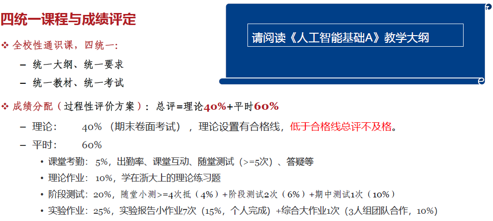

# 人工智能基础（A）

!!! tip "说明"

    本文档正在更新中……

## 课程介绍

!!! info "注意"

    此为 2024-2025 春夏学期课程安排，仅供参考

nd老师

### 考核方式

<figure markdown="span">
  { width="800" }
</figure>

人工智能基础（A）课程大纲

703 KB | 14 page

<a class="hq-down-button" target="_blank" href="../../../file/AI_basic/ai_doc1.pdf" markdown="1">:fontawesome-solid-download: 下载</a>

## 个人笔记

[1 初识人工智能](./ch1.md) 
[2 人工智能的系统数据基础](./ch2.md) 
[3 人工智能的应用开发基础](./ch3.md) 
[4 从问题求解到机器学习](./ch4.md) 
[5 回归与分类模型](./ch5.md) 
[6 数据的聚类和降维技术](./ch6.md) 
[7 深度网络基础组件](./ch7.md) 
[习题整理](./exercise.md)