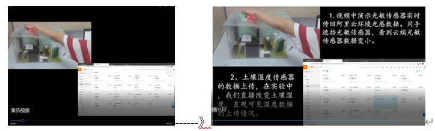
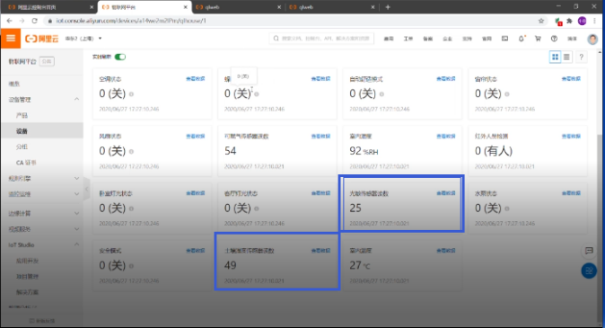

# 数字音视频基础与制作

<!-- !!! tip "说明"

    此文档正在更新中…… -->

## 课程介绍

!!! info "注意"

    此为 2024-2025 秋冬学期课程安排，仅供参考

ldw老师

1. 零基础也可以选
2. 如果你只是想学习 Pr、Au 等软件的话，不建议选这门课，因为这门课的核心目的不是教你使用软件的
3. 如果你学习过 Pr、Au、Ps 等软件的使用，或者学习过摄影的话，那么这门课的部分作业对你来说会相对轻松很多。其中学习过 Pr 等软件的使用，期末上机考试也会很轻松
4. 这门课不仅教我们使用软件，更多的是讲解一些视频或照片的拍摄方法、器材、思路、镜头、调色等，还有一些视频效果的处理（具体可以看[课程内容](#课程内容)部分）

### 课程类别

科技创新

### 课程内容

有理论课和实践课

1. 3D投影的体验；QQ群号解析；大疆稳定器的使用
2. Premiere中提取音频，降噪、分析，音画合一的操作；序列的设置，关键帧的设置。Pr剪辑入门，制作配置字幕的自我介绍
3. 器材：云台、滑轨等器材的使用；软件：内置、自定义转场效果的设置
4. 器材：延时摄影拍摄；软件：视频效果的基础学习，多机位的剪辑的方式
5. 器材：摇臂、导轨的使用；软件：绿（蓝）屏抠图、色彩的调整；画面色彩和风格的统一
6. 器材：三轴相机稳定器的使用；软件：滚动字幕的设计、视频模板的应用
7. 脱机文件的制作和在编辑中的意义，输出最终序列的视频
8. Au、Pr剪辑综合实验上机考试

### 考核方式

#### 平时成绩（40%）

##### 课程作业

1. QQ 群号解析
2. 制作一段自我介绍的视频
3. 利用遮罩实现无缝转场
4. 拍摄空间压缩照片、低角度拍摄（利用水面等）、慢动作视频
5. 拍摄或制作一个广告

##### 实验作业

1. 稳定器的使用
2. 拍摄一段自己走路运动的视频，实现定格分身术
3. 实现时间定格
4. 尝试绿幕的拍摄，并制作跨屏取可乐的效果和从电视机里出来的画面
5. 定点延时摄影并制作带配乐诗朗诵视频
6. 拍摄一段大范围延时摄影的视频（小组作业）
7. 多机位拍摄一个新年祝福视频
8. 人像光线的应用

#### 出勤和课堂表现（10%）

#### 综合作业（20%）

##### 期末大作业

可以制作 MV（可 2~3 人合作，更多人数事先报备）或 VLOG：

MV要求：

1. 可以用部分别人拍摄的视频素材剪辑。要求加歌词字幕。
2. 可以不是自己唱，但是要自己处理。伴奏可以在5sing上找，实在没有用全民K歌录制伴奏。
3. 歌曲时长大于两分钟，不到的话自己拼接成大于2分钟。
4. 要求提交的文件：MV视频（MP4格式）、录制的原声两个文件。

VLOG要求：

1. 所有的视频基本自己拍摄和剪辑

#### 上机考核（30%）

至少需要掌握 Pr、Au 这两个软件，只需要掌握课上老师讲过的相关操作就可以

> 老师说，可以使用其他剪辑软件，只要达到考试要求就可以，但还是推荐使用 Pr

冬八周进行

4 道操作题

自带电脑，可现场在网上查阅资料

考试时间 75 分钟

测试一共有 4 个小题，在规定时间内制作得越没有破绽，分数按照完成度给分。分数采用递减制，完成任意一题 40 分，两题 65 分，三题 85 分，四题 100 分

内容：

1. 字幕
2. 蒙版
3. 调色
      1. 外部 LUT 文件
      2. 单色
      3. 青橙色调
4. 速度
      1. 声音踩点
5. 声音
      1. 降噪
      2. 标准化
      3. 调速（不变调）
      4. 混响
6. 变形稳定器
7. 裁剪
8. 倒影
9. 绿幕

## 历年题整理

### 2024-2025 秋冬

**题目 1：**

1. 利用 PR 蒙版制作视频所示的文字在手机后面出现的效果
2. 采用的字体为“锐字温帅字体”，字体包在文件夹中
3. 文字内容：“生活不仅有眼前的苟且，还有诗和远方”。排布为圆弧形。可参考视频效果-扭曲-球面化

**题目 2：**

1. 音频裁剪：裁剪处理音频开始部分的朗读错误，重复和其他不该出现的声音（处理 20 秒）
2. 音频降噪：音频内包含一个 6K Hz的噪声，将噪声处理掉
3. 音视频时长：音视频时长控制在 20 秒左右
4. PPT 水墨转场：根据音频的时间线，设置对应的 PPT 画面，不同画面之间采用水墨转场，转场过程参考给出的示例文件。水墨转场的素材也已经提供

**题目 3：**

1. 将原始素材 1、2、3 以左、中、右的顺序制作三分屏
2. 人物从三分屏的边界依次从左侧走入右侧
3. 人物动作要保持连贯流畅
4. 视频左下角添加“姓名+学号”的水印文字
5. 整体效果参考示例视频

**题目 4：**

1. 原始素材为求是大讲堂大范围延时视频，视频抖动严重，请使用合理的方式将视频去抖动
2. 选用给定的 LUT，文件名为“Luts.cube”，对视频进行调色
3. 在视频左下角添加“姓名 + 学号”的文字扫光效果

注意：本题目得分根据去抖动和调色等效果来判定

### 2022-2023 春夏

**题目 1：**

1. 只需要前10秒的素材，要求将同学拍摄的延时摄影制作得更稳定些，视频大小允许有形变
2. 完成扫光的效果“浙江大学欢迎您”（锐字温帅字体已在目录中提供，在PR中名称可能为REEJI）
3. 最后一帧画面定格，画面变暗淡出，并完成最后的字幕输出，字幕要求避免纯白背景下不可见的问题，字幕内容为 “学号：改成自己的学号 姓名：改成自己的姓名 2022年春夏浙江大学音视频课程出品”
4. 将原视频中的音乐去除，按照做好的视频长度裁剪浙大校歌的音乐长度，要求淡入淡出

**题目 2：**

将给定的视频画面色彩有些雾蒙蒙，将色彩调节清晰。参照参考样片给定的方式，将色彩只剩下红色。不同图像的变化对比可以直接使用视频的“划出”效果。将原视频、清晰视频和只剩红色的视频合在一个视频中，各 8 秒左右

**题目 3：**

把视频绿幕中陈老师放置在桌面上，看起来像身处小人国，加上寻找六彩猫的场景，添加合适的倒影，和环境合拍一些

1. 为了避免人悬浮在桌子上，人物是有倒影的，需要表现出来
2. 六彩猫是有多种颜色的，要保留绿色的

**题目 4：**

已经有学生拍摄的一段视频，现在甲方要用到其他场合，简单地提出了一些修改要求。只需要原素材视频前24秒时长的视频

1. 整个视频需要配音和配乐，视频长度要符合配音长度（如：配音长度是 34 秒，对应的视频长度是 24 秒）。配乐只要淡入即可
2. 从出现画面到 23 秒，将空着的黑的地方填上类似说明文字。需要的文字如下：“1、视频中延时光敏传感器实时传回阿里云环境光感数据。用手遮挡光敏传感器，看到云端光敏传感器数据变小”“2、土壤湿度传感器的数据上传，在实验中，我们直接改变土壤湿度，直观可见湿度数据的上传情况”

甲方只会PS，给出的大概出现的效果如下：

<figure markdown="span">
{ width="600" }
</figure>

在原视频中第 3 秒到 12 秒，13 秒到 24 秒，由于光敏传感和土壤湿度两个数据是变化的测量数据，采用合适的编辑技术（改变颜色，框选，局部缩放都可以）让观众对这两个数据引起关注

<figure markdown="span">
{ width="600" }
</figure>

## 个人感受

最好根据自身情况选这门课

期末上机考试的内容对于从来没有接触过剪辑软件的同学来说，有一定的难度，当然如果你在这门课上认真学了 Pr，期末考试也能够应对

个人感觉对于软件使用的部分，讲解的不是很清楚，不过可以在 B 站搜教学视频看