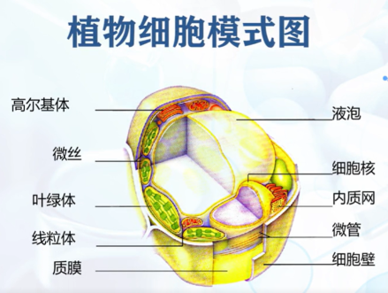
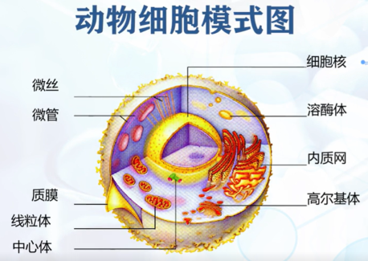
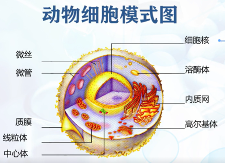
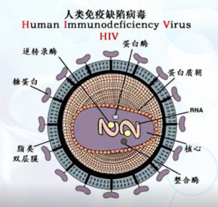
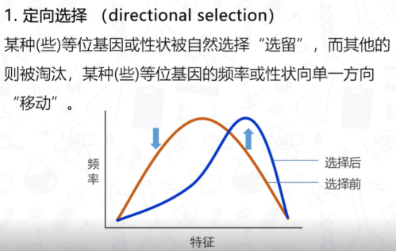
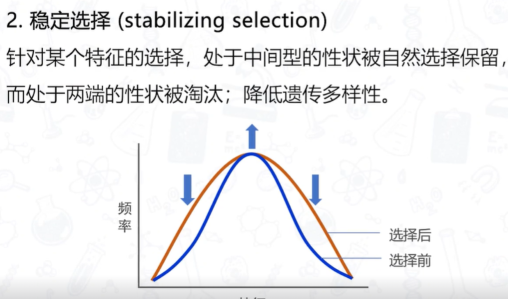
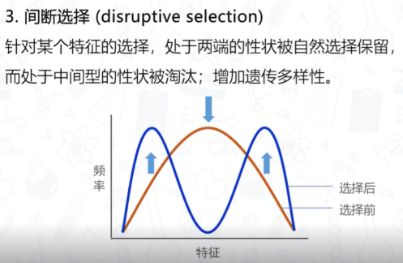

# 1 细胞与细胞工程

!!! info "说明"

    1. 本文档仅涉及部分内容，仅可用于复习重点知识
    2. 部分思考题答案由 AI 生成

## 1.1 细胞的概述

### 1.1.1 显微镜与细胞

1665 年，Robert Hooke 发现了细胞

1675 年，Leeuwenhoek 首次观察到了活细菌

#### 原核细胞

主要特点：

1. 遗传物质仅一个环状 DNA
2. 无核膜
3. 无细胞器，无细胞骨架
4. 以无丝分裂或出芽繁殖

代表生物：支原体、细菌、蓝藻

<figure markdown="span">
    { width="600" }
</figure>

#### 真核细胞

三大结构体系：

1. 生物膜系统：质膜、内膜系统（细胞器）
2. 遗传信息表达系统：染色质（体）、核糖体、mRNA、tRNA 等等
3. 细胞骨架系统：胞质骨架、核骨架

<figure markdown="span">
    { width="600" }
</figure>

<figure markdown="span">
    { width="600" }
</figure>

### 1.1.2 没有细胞结构的病毒

分类：

1. 真病毒：DNA 或 RNA 与蛋白质构成的核酸 - 蛋白质复合体
2. 类病毒：感染性的 RNA 构成
3. 朊病毒：仅由有感染性的蛋白质构成

1892 年，伊凡诺夫斯基发现并过滤得到了烟草致病性过滤因子

1935 年，Stanley 首次提纯并结晶了烟草花叶病毒，获得了 1946 年诺贝尔化学奖

特点：

1. 不具有细胞结构
2. 一种病毒内只含有一种核酸，DNA 或者 RNA
3. 依赖宿主细胞复制，形成子代
4. 对大多数抗生素不敏感，对干扰素敏感
5. 在宿主体外对高温、X 射线、γ 射线、紫外线敏感，易变形失活

- 抗生素（antibiotics）：是由微生物和植物在生活过程中所产生的一类次级代
谢产物，能干扰其他活体细胞的生长发育，起到抑菌抗菌、抗肿瘤、抗支原体、
抗病毒等的作用
- 干扰素（interferon）：高等动物细胞在病毒等诱生剂的作用下所产生的一种
具高活性、广谱抗病毒功能的特异性糖蛋白

存在人畜共患的病毒

艾滋病病毒：

<figure markdown="span">
    { width="600" }
</figure>

新冠肺炎病毒：

<figure markdown="span">
    { width="600" }
</figure>

### 1.1.3 病毒的应用 - 疫苗

中国古代的种痘之术：从患有轻度天花症的人体内取出痘液给健康人接种

疫苗：用细菌、病毒、螺旋体等制成的抗原性生物制品

种类：

1. 减毒活疫苗：免疫原性强，潜在的危险性。在免疫力差的部分个体可引发感染，突变可能恢复毒力。如牛痘疫苗、卡介苗疫苗等
2. 灭活疫苗（死疫苗）：安全性好，有的免疫原性弱。如脊髓灰质炎疫苗、甲肝疫苗等
3. 类毒素疫苗：针对产生强力外毒素或肠毒素的病原菌。如破伤风、白喉疫苗等
4. 转基因疫苗：通过转基因技术，生产病毒的抗原蛋白。如乙肝病毒疫苗等
5. 核酸疫苗：将编码抗原蛋白的外源基因（DN A或 RNA）直接导入动物体细胞内，并通过宿主细胞的表达系统合成抗原蛋白

生物农药：

1. 专一性高
2. 对人畜安全
3. 毒力大
4. 后效长
5. 使用方便
6. 无公害

## 1.2 细胞增殖与分化

### 1.2.1 细胞分裂

1. 无丝分裂
2. 有丝分裂
3. 减数分裂

### 1.2.2 细胞分化

细胞分化过程是由一系列基因产物调控的，一个关键的调控蛋白，可以调控一系列下游基因，完成细胞分化

#### 发育潜能

由一个细胞可能分化发育出多少种细胞

1. 全能性：具有能使后代细胞形成完整个体的潜能
2. 多能性
3. 单能性

胚胎干细胞：具有分化成多种细胞类型及构建组织的潜能

对于植物来说，分化成熟的植物体的细胞，仍保持全能性，仍有可能发育成完整的植株

随着分化的演进，动物细胞逐渐丧失其分化潜能 全能性 -> 多能性 -> 单能性 -> 分化成熟的体细胞

动物细胞核具有发育全能性。高度分化的哺乳动物体细胞核也具有全能性

关键在于细胞质，细胞质中有着决定细胞分化全能性的物质，称为分化决定子。细胞质中的分化决定子是 RNA

### 1.2.3 细胞衰老

人体衰老时，身体各部分功能都发生衰老

身体的衰老是以细胞衰老为基础的

细胞培养传代次数与供体年龄和供体物种特性有关

早衰症患者的细胞培养只传代 2-4 次

Hayflick 极限：细胞增殖能力和寿命是有限的

细胞、至少是培养的细胞，不是不死的而是有一定寿命的。它们的增殖能力不是无限的，而是有一定界极限的

人体衰老时，并非全身细胞均衡衰老，而是部分细胞衰老，导致整体机能失调。激素系统和神经系统的衰老对全身的影响最大

#### 机理

1. 氧化性损伤：代谢过程中产生的活性氧基团或分子，引发的氧化性损伤的积累，最终导致衰老
2. 端粒与衰老：
      1. 人类端粒结构为染色体末端重复上千次的 TTAGGG 序列所组成
      2. 由于 RNA 引物的原因，DNA 聚合酶一定会留下染色体末端的一段 DNA（一段端粒）使其不被复制。真核细胞染色体末端的端粒就会随着细胞分裂而缩短。这个缩短的端粒传给子细胞后，随着细胞的再次分裂进一步缩短细胞衰老的机理
3. 基因与衰老
4. 发育程序与衰老
5. 线粒体 DNA 与衰老

#### 疾病

1. 老年痴呆症（阿兹海默症）：蛋白质折叠错误
2. 帕金森氏病：中枢神经系统变性疾病
3. 亨廷顿病：常染色体显性遗传性神经退行性疾病

### 1.2.4 细胞凋亡

1. 细胞坏死（病理死亡）：因环境因素突变或病原物入侵而死亡
2. 细胞凋亡：因个体正常生命活动的需要，一部分细胞在一定阶段死去

细胞凋亡是一个由基因决定的自动结束生命的过程，所以也常常被称为细胞程序性死亡

细胞凋亡是普遍存在的

植物细胞的细胞凋亡广泛存在于植物的生长发育和相应外界胁迫的反应中

#### 区别

<figure markdown="span">
    { width="600" }
</figure>

#### 因素

1. 物理因子：射线（紫外线、γ 射线）、重金属等、温度刺激（热激、冷激）
2. 化学及生物因子：活性氧基团和分子，DNA 和蛋白质合成的抑制剂，激素，细胞生长因子，肿瘤坏死因子 α

## 1.3 细胞的癌变与治疗

### 1.3.1 癌细胞

肿瘤：

1. 良性肿瘤：不转移
2. 恶性肿瘤：转移、浸润

癌：

1. 上皮组织：癌
2. 结缔组织和肌肉：肉瘤
3. 其他（血液）：白血病等

正常细胞的四大生物学特征：

1. 锚地依赖性：细胞必须附在固体上或固定的表面，才能生长分裂
2. 血清依赖性：细胞必须具有生长因子，才能生长
3. 接触抑制性：细胞与细胞接触后，生长便受到抑制
4. 形态依赖性：细胞成扁平状，并有长纤维网状结构

癌细胞的三大生物学特征：

1. 永久性：无终止地生长，涉及到生长控制的改变
2. 转化性：无限制地生长，脱离了生长因子的调控
3. 转移性：细胞获得入侵正常组织的能力

### 1.3.2 致癌因素

癌细胞是由正常细胞转化而来的，这种过程称为细胞的转化

致癌剂：化学、物理、生物因子（DNA 肿瘤病毒与 RNA 肿瘤病毒）是动物细胞转变成转化细胞的条件

癌症发生中，环境因素的作用大于遗传因素

癌症的预防：注意避免接触环境中能够诱发或促进细胞癌症的因素

### 1.3.3 癌基因与抑癌基因

1. 癌基因是促细胞增殖的基因，癌基因的活化或异常表达，会导致细胞的癌变
2. 抑癌基因是抑制细胞增殖的基因，抑癌基因发生突变、缺失或沉默时，也可导致细胞癌变

抑癌基因是正常细胞增殖过程中的负调控因子

抑癌基因发生功能丧失性突变（隐性突变），则导致细胞周期失控而过度增殖

#### 治疗

传统思路是手术、放疗、化疗

癌症治疗新方案：

1. 免疫治疗
2. 靶向治疗
3. 溶瘤病毒治疗

## 1.4 癌的治疗

### 1.4.1 化学疗法

化疗是利用化学药物杀死肿瘤细胞、抑制肿瘤细胞的生长繁殖和促进肿瘤细胞的分化的一种治疗方式

化疗药物种类：

1. 烷化剂：直接作用于 DNA 上，防止癌细胞再生，如尼莫司汀
2. 抗代谢药：干扰 DNA 和 RNA 的合成，如 5 - 氟尿嘧啶（5-FU）和 6 - 巯基嘌呤(6-MP)等
3. 抗肿瘤抗生素：抑制细胞分裂或改变细胞膜来干扰 DNA，如放线菌素 D 等
4. 植物类抗癌药：植物碱和天然产品，可以抑制有丝分裂或酶的作用，阻止细
胞再生必需的蛋白质合成，如紫杉醇和秋水仙素等
5. 激素：用于杀死癌细胞或减缓癌细胞生长时，如阿他美坦和阿那曲唑等

<figure markdown="span">
    { width="600" }
</figure>

### 1.4.2 放射治疗

放射治疗的原理是用放射线所带的能量破坏细胞的 DNA，使细胞生长停止。放射线包括放射性同位素产生的 a、阝、Y 射线和各类 × 射线

### 1.4.3 靶向治疗

利用药物或其他替代分子，通过特异地选择致癌位点来相结合发生作用，使肿瘤细胞特异性死亡的新型治疗方法

靶向治疗的关键是，在众多肿瘤细胞中找出癌细胞特有的蛋白分子，这些蛋白分子就可能成为靶分子。如果这些靶分子具有影响癌细胞生长或存活的功能，那么它们就很可能是靶向治疗的靶占

## 1.5 思考题

**病毒是非细胞形态的生命体，这与“细胞是生命活动的基本单位”是否相矛盾？**

不矛盾。病毒需要宿主细胞才能展现出生命活动

---

**所有病毒都是有害的吗？试举例说明人类是如何利用病毒的**

有些病毒不感染人类。可以用于基因治疗、疫苗开发、生物控制（生物农药）

---

**细胞为什么会衰老？**

端粒缩短、氧化性损伤等等

---

**细胞凋亡和细胞坏死有何异同？试举例说明**

<figure markdown="span">
    { width="600" }
</figure>

细胞凋亡：胎儿尾巴的消失

细胞坏死：皮肤烧伤

---

**肿瘤就是癌症吗？两者之间有何关系？**

有肿瘤不意味着得癌症。良性肿瘤不在身体内转移，不是癌症。得癌症也不一定会产生肿瘤，比如白血病

---

**什么是癌基因？什么是抑癌基因？两者诱发肿瘤/癌症得机理有何不同？**

1. 癌基因是促细胞增殖的基因，癌基因的活化或异常表达，会导致细胞的癌变
2. 抑癌基因是抑制细胞增殖的基因，抑癌基因发生突变、缺失或沉默时，也可导致细胞癌变

---

**现代医学治疗癌症有哪些新方法？试举例说明**

1. 免疫治疗
2. 靶向治疗
3. 溶瘤病毒治疗

---

**什么是细胞工程？试举例说明细胞工程的研究内容和应用方向**

细胞工程是一门利用生物学、遗传学、分子生物学、生物化学和工程学原理和技术对细胞进行改造或操作的学科。它包括了对细胞结构与功能的研究，以及对细胞的生长、繁殖、分化、代谢等生命过程的调控。细胞工程旨在通过改变细胞特性来达到特定目的，如生产有用的生物制品、改良动植物品种、治疗疾病等。

细胞工程的研究内容

1. **细胞融合**：通过物理或化学方法使两个或多个不同类型的细胞合并成一个杂交细胞。例如，制备单克隆抗体时，将B淋巴细胞与骨髓瘤细胞融合形成杂交瘤细胞。

2. **基因编辑**：使用CRISPR/Cas9等技术对细胞内的DNA序列进行精确修改，以插入、删除或替换特定的基因片段。这可以用于研究基因功能、创建疾病模型或开发基因疗法。

3. **干细胞研究**：探索如何引导多能性干细胞（如胚胎干细胞或诱导多能干细胞）分化为特定类型的细胞，用以再生医学或组织工程。

4. **细胞培养**：优化条件以支持细胞在体外的长期存活和增殖，这对于药物测试、疫苗生产和个性化医疗至关重要。

5. **细胞产物的生产**：利用细胞作为“工厂”来大量生产蛋白质、酶、激素等生物活性物质。

应用方向

- **医药领域**：开发新型治疗方法，比如基因治疗、细胞治疗和个性化医疗；制造生物制药，如单克隆抗体、重组蛋白药物。
  
- **农业领域**：培育具有抗病虫害、耐逆境特性的优良作物品种；改进家畜繁殖技术，提高畜牧业效率。

- **工业领域**：通过发酵过程生产生物燃料、食品添加剂、酶制剂等；开展环境修复工作，如利用微生物降解污染物。

- **基础科学研究**：深入理解生命的本质，如细胞信号传导机制、基因表达调控网络等。

总之，细胞工程是一个跨学科的研究领域，其研究成果对于改善人类健康、提升农业生产率、推动工业创新等方面都有着重要的意义

---

**什么是 iPSC（诱导性多潜能干细胞）技术？和治疗性克隆技术有何异同之处？**

iPSC（诱导性多潜能干细胞，induced Pluripotent Stem Cells）技术是一种通过将特定的基因导入已经分化的成熟细胞（如皮肤细胞或血细胞），使其重新编程回到类似胚胎干细胞状态的技术。这些重新编程的细胞具有分化成体内几乎任何类型细胞的能力，因此被称为“多潜能”干细胞。这项技术最初由日本科学家山中伸弥（Shinya Yamanaka）和他的团队在2006年开发，并因其重大意义而获得了2012年的诺贝尔生理学或医学奖。

治疗性克隆是指利用体细胞核转移（SCNT）技术将一个体细胞的细胞核转移到一个去核的卵细胞中，然后激活这个重组细胞，让它开始分裂并形成早期胚胎。从这个早期胚胎中可以获得胚胎干细胞，这些细胞理论上可以分化为任何类型的细胞，用于修复或替换受损组织。

相似点

- 两者都可以产生具有多能性的干细胞，这些细胞能够分化为多种不同的细胞类型。
- 都是为了医学目的，比如再生医学、细胞替代疗法等。

不同点

- **起源不同**：iPSC是通过对成熟细胞进行重新编程获得的，而治疗性克隆则是通过体细胞核转移技术从重构的胚胎中获得的胚胎干细胞。
- **伦理问题**：由于治疗性克隆涉及到创建和随后销毁人类胚胎，它引发了更多的伦理争议；而iPSC技术则因为不涉及胚胎使用，伦理争议相对较少。
- **技术和效率**：iPSC技术的操作相对简单，而且可以在实验室条件下大量生产；相比之下，治疗性克隆的成功率较低，且过程复杂。
- **免疫兼容性**：理论上，iPSC可以直接从患者自身获取细胞来制造，这可能减少免疫排斥的问题，而治疗性克隆得到的细胞尽管也可以来自患者自身，但其实际应用中的免疫反应仍需进一步研究。

总的来说，虽然两种方法都旨在提供一种途径来获取多能干细胞，但它们之间存在显著的技术和伦理差异。随着技术的发展，iPSC技术已经成为再生医学领域的一个重要工具