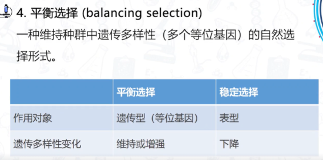
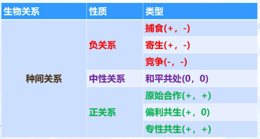
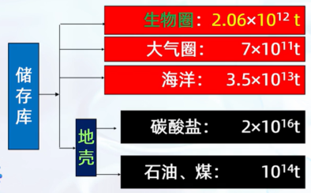

# 整理

<!-- !!! tip "说明"

    本文档正在更新中…… -->

!!! info "说明"

    1. 本文档仅涉及部分内容，仅可用于复习重点知识
    2. 思考题答案由 AI 生成

## 1 细胞与细胞工程

细胞学说的内容：

1. 细胞是一个有机体，一切动植物都由细胞发育而来，并由细胞和细胞产物所构成
2. 细胞是一个相对独立的单位，既有它自己的生命，又对与其他细胞共同组成的整体生命起作用
3. 新细胞是由老细胞分裂产生的

---

植物细胞特有的细胞器：叶绿体

<figure markdown="span">
    { width="600" }
</figure>

---

<figure markdown="span">
    { width="600" }
</figure>

---

原核细胞：

1. 遗传物质仅一个环状 DNA
2. 无核膜
3. 无细胞器，无细胞骨架
4. 以无丝分裂或出芽繁殖

代表生物：支原体、细菌、蓝藻

所有原核细胞都具有细胞膜和核糖体，原核细胞没有线粒体

---

真核细胞：

三大结构系统：

1. 生物膜系统：质膜、内膜系统（细胞器）
2. 遗传信息表达系统：染色质（体）、核糖体、mRNA、tRNA 等
3. 细胞骨架系统：胞质骨架、核骨架

---

亚细胞器官：细胞核、细胞膜、内质网、高尔基体、细胞质、线粒体、叶绿体等

---

类病毒：无蛋白质外壳，裸露的环状的 ssRNA 分子

---

抗生素：是由微生物和植物在生活过程中所产生的一类次级代谢产物，能干扰其他活体细胞的生长发育，起到抑菌抗菌、抗肿瘤、抗支原体、抗病毒等的作用

干扰素：高等动物细胞在病毒等诱生剂的作用下所产生的一种具高活性、广谱抗病毒等功能的特异性糖蛋白

---

发育潜能：由一个细胞可能分化发育出多少种细胞

1. 全能性：具有使后代细胞形成完整个体的潜能
2. 多能性
3. 单能性

细胞的发育潜能是由细胞质中 RNA 决定的。RNA 决定细胞分化的全能性

---

人类早衰症的病因是基因突变

---

端粒：由于 RNA 引物的原因，细胞每分裂一次，染色体的端部就缩短

---

肿瘤：

1. 良性肿瘤：不转移
2. 恶性肿瘤：转移、浸润

---

（原）癌基因：促细胞增殖的基因，其活化或异常表达，会导致细胞的癌变

抑癌基因：抑制细胞增殖的基因，其发生突变、缺失或沉默时，也可导致细胞癌变

---

靶向治疗：利用药物或其他代替分子，通过特异地选择致癌位点来相结合发生作用，使肿瘤细胞特异性死亡的新型治疗方法

---

PD1、PDL1 免疫疗法：

PD-1 使 T 细胞表面的一种受体蛋白，当癌细胞上的 PD-L1 蛋白和 T 细胞上的 PD-1 受体结合，T 细胞就无法认识癌细胞了

利用药物阻隔等方式，使 T 细胞的 PD1 与肿瘤细胞的 PDL1 无法有效结合，激活了免疫系统，T 细胞可以杀死癌细胞

---

格列卫 Gleevec 在慢性髓系白血病中的肿瘤治疗策略属于哪种方式

## 2 基因与基因工程

基因治疗思路：

1. 用健康的基因取代治病的基因
2. 失活或敲除功能不正常的突变基因
3. 向体内引入新的或修饰过的基因

策略：转基因，基因编辑

体内治疗：直接把健康基因/基因编辑工具转入目标组织/细胞

离体治疗：去除细胞改造基因，体外培养扩增，输回体内

---

Spark 公司的 Luxuturna 基因疗法，通过腺相关病毒 AAV 载体，将正确的 PRE65 基因递送到视网膜细胞中并表达，用于治疗 Leber 先天性黑蒙 2 型

荷兰 UniQure 公司的 Glybera 基因疗法，用于治疗脂蛋白酯酶缺乏症 LPLD

全球首个人体 CRISPR 基因编辑临床试验：治疗 Leber 先天性黑蒙 2 型

---

多倍化和杂交是高等植物基因组进化和新物种形成的主要动力之一

---

XY 型：雄性有两个异型性染色体。人类，哺乳动物，果蝇等

ZW 型：雌性有两个异型性染色体。鸟类，蝴蝶等

XO 型：雄性只有 X 染色体，没有 Y 染色体。蝗虫：雄性是 16 + X；雌性是 16 + XX

---

蜜蜂的蜂王和工蜂是二倍体。而雄峰是由蜂王未受精的卵发育而来的单倍体

雄性配子与蜂王的雌配子结合，形成二倍体，在不同营养条件下，发育为蜂王和工蜂

---

玉米雌雄同株：

雌花序由 Ba 基因控制

雄花序由 Ts 基因控制

---

<table>
    <tr>
        <th id="tab-both-mid">疾病</th>
        <th id="tab-both-mid">特点</th>
        <th id="tab-both-mid">染色体组成</th>
    </tr>
    <tr>
        <td id="tab-both-mid">Klinefelter 综合征</td>
        <td>外貌男性，睾丸萎缩，具有乳房，不育，低智商，身高 > 183 cm</td>
        <td id="tab-both-mid">47，XXY</td>
    </tr>
    <tr>
        <td id="tab-both-mid">XYY 综合征</td>
        <td>外貌男性，智力一般较低，性格粗暴，易冲动，生殖器官发育不良，多数不育，有人认为患者有反社会行为</td>
        <td id="tab-both-mid">Y 染色体 ≥ 2</td>
    </tr>
    <tr>
        <td id="tab-both-mid">Turner 综合征</td>
        <td>外貌女性，个矮，第二性征发育不良，原发性闭经，肘外翻，盾状胸，往往有先天性心脏病，智力低下或正常</td>
        <td id="tab-both-mid">45，X0</td>
    </tr>
    <tr>
        <td id="tab-both-mid">真两性畸形</td>
        <td>内生殖器一侧睾丸一侧卵巢，第二性征介于两性之间</td>
        <td id="tab-both-mid">46，XY 46，XX</td>
    </tr>
    <tr>
        <td id="tab-both-mid">多 X 女性</td>
        <td>表现为女性，眼距宽，外生殖器及第二性征多正常，有的月经失调，类似 21 三体，智力发育迟缓</td>
        <td id="tab-both-mid">X 染色体 ≥ 2</td>
    </tr>
</table>

---

近交系统越大，表明个体的父母之间的亲缘关系越近

---

男性 Y 染色体的性别决定区域基因（SRY）导致性腺分化为睾丸；睾丸产生睾酮，和受体结合起反应，使机体发育雄性化

没有睾酮的条件下，发育沿着雌性模式进行

---

生殖器官的性别分化在发育的早期已发生，即在怀孕的最初两个月

大脑的性分化在妊娠期的后半阶段开始

---

程序化效应/组织化效应：永久性调节

激活效应：短暂性调节

性别认同具有永久性的特征

---

聚合酶链式反应（PCR），是一种体外扩增 DNA 片段的分子生物学技术 —— 以微量 DNA 为模板，快速复制出大量 DNA 拷贝

Kary B. Mullis 博士（PE-Cetus 公司）提出 PCR 概念

1. 变性：模板 DNA 双链解离成为单链
2. 退火/复性：引物与模板 DNA 单链的互补序列配对
3. 延伸/合成：DNA 模板 - 引物复合物在聚合酶作用下，以四种 dNTP 为反应原料，沿单链模板以 5'-3' 方向，按碱基互补配对原则，合成一条新的 DNA 单链

---

以基因克隆或分子克隆操作为主的重组DNA技术是基因工程的核心技术

---

Paul Berg 等人构建了世界上第一个重组 DNA 分子

Herbert Boyer 和 Stanley Cohen 创造了第一个重组 DNA 生物 —— 转化了重组质粒 DNA 的大肠杆菌

利用酿酒酵母制备的乙型肝炎疫苗是世界上第一个重组疫苗

---

目的基因的获取：

1. 构建基因文库或 cDNA 文库，从中调用目的基因
2. 利用 PCR 特异性地扩增所需要地目的基因片段
3. 人工合成核苷酸链，通过化学方法，以单核苷酸为原料合成目的基因

---

载体：

1. 质粒和柯斯质粒
2. 病毒载体
      1. 噬菌体
      2. 腺病毒
      3. 腺相关病毒 AAV
      4. 慢病毒 Lentivirus 载体等
3. 人工染色体

---

限制性内切酶。DNA 连接酶

---

甘薯是天然的转基因作物，基因组 DNA 中含来自土壤农杆菌的 T-DNA 片段

---

我国市场上的转基因作物：甜菜，玉米，大豆，抗病毒番木瓜，抗虫棉花，油菜

在中国批准并且已经商业化种植的转基因农作物只有两种：转基因抗虫棉花和转基因抗病毒番木瓜

---

青蒿素合成生物系统

基因来源：黄花蒿，酿酒酵母，大肠杆菌，金黄色葡萄球菌

---

*Regenesis*：George M Church 和 Rdward Regis

---

世界上第一个人工合成生命体 Synthia，将人工合成的丝状/蕈状支原体的基因组转入山羊支原体细胞，产生的人造细胞表现出前者的生命特性

在酵母中完成基因组的组装

---

酵母基因组合成计划（Sc 2.0）

中国科学家完成了酿酒酵母 4 条染色体的人工合成

---

覃重军课题组及其合作者首次人工创建了单条染色体的真核细胞 —— 酿酒酵母

---

合成生物系统的三个基本层次：生物元件，生物装置和生物系统

---

杂种优势：选择有利于杂合子的程度大于两种纯合子

---

精准基因编辑的酶：

1. ZFN/锌指核酸酶
2. TALEN/转录激活因子样效应核酸酶
3. CRISPR/Cas9

## 3 新陈代谢

并不是所有的有机化学反应都能在生物体内出现，因为细胞水环境

---

1 分子 NADH 可产生 2.5 ATP

1 分子 FADH2 可产生 1.5 ATP

---

人体内参与体液调节的激素主要来自：内分泌器官，内分泌组织，旁分泌组织，肠道微生物

神经系统调节：动作电位，神经递质，肠道微生态

---

通用的氢原子/电子载体：

1. FMN- 黄素腺嘌呤单核苷酸
2. FAD- 黄素腺嘌呤二核苷酸
3. NAD- 烟酰胺腺嘌呤二核苷酸
4. NADP- 烟酰胺腺嘌呤二核苷酸磷酸

---

位居不同代谢途径交叉点上的中间代谢物常形成“代谢池”以满足各个代谢的稳态平衡

---

新陈代谢不包含 DNA 复制，RNA 转录和蛋白质翻译等复杂细胞活动

---

细胞功能依赖于其酶系分布

---

不同组织或统一组织的不同细胞中的代谢活动具有异质性。但重要代谢过程在不同生物中高度保守

---

生物氧化的三个阶段：

1. 乙酰辅酶 A 生成
2. 乙酰辅酶 A 氧化 —— 柠檬酸循环
3. 电子传递和氧化磷酸化 —— 产生 ATP

柠檬酸循环：

1. 循环反应只沿一个方向进行，但大多数反应都是可逆的
2. 柠檬酸循环是两用代谢途径：既彻底氧化分解乙酸盐又可提供许多生物合成前体
3. 柠檬酸循环被严谨调控

---

膳食蛋白质在人体中的消化吸收

肝脏是人体营养物质转化和分配中心

## 4 仿生与生物信息

### 仿生学

远古时代，人类的祖先模仿蜘蛛网编网捕鱼

鲁班用竹木作鸟

大禹时期，鱼尾巴游动、转弯，在船尾上架置木浆，橹和舵，增加了船的动力，掌握了使船转弯的手段

中国古汉文中的仿生思想：甲骨文中的象形文字

---

仿生学是一门建立在多学科边缘上的综合性学科，包括数理科学，物理学，生物学和化学，以及工程技术科学等

<figure markdown="span">
    { width="600" }
</figure>

#### 拟态仿生

动物的拟态与保护色

坦克的迷彩着装

#### 力学仿生

##### 形体的模仿

“复仇号”帆船模仿鳕鱼、鲇鱼外形建造

俄罗斯海军新型核潜艇和鱼类模仿海豚的外形

##### 结构的模仿

大禹时期，鱼尾巴游动、转弯，在船尾上架置木浆，橹和舵，增加了船的动力，掌握了使船转弯的手段

模仿鲸的胸鳍给船装上了船鳍

##### 界面的模仿

模仿鱼和鲸的体表粘液合成人工粘液，以减小湍流

鲨鱼的鳞片图案

##### 空气动力学

鲁班用竹木作鸟

奥纳多·达·芬奇和助手设计和制造了一架扑翼机，世界上第一架人造飞行器

飞鸟的体形和翅膀在滑进飞行时与飞机的飞行极为相似

昆虫飞行时翅膀的运动很复杂，其角度的变化控制比目前的飞行自动驾驶仪还好

飞机仿造蜻蜓的翅膀配重防止振颤

现代先进的飞机能够模仿昆虫在空中作各种花样演习

苍蝇的楫翅是“天然导航仪”，人们模仿它制成了“振动陀螺仪”。应用在火箭和高速飞机上，实现了自动驾驶

##### 薄壳结构

建筑物

##### 仿生物膜

人工膜：

1. 化学组成和厚度与天然膜相似
2. 能有效地分开两种不同的液相
3. 具有结构和化学两侧不对称性，易于操作，能用来研究膜的向量功能（如传递等）

#### 智能仿生

气体受体和嗅觉系统组织，Richard Axel 和 Linda B. Buck 获得 2004 年诺贝尔生理学或医学奖

---

狗拥有非常发达的主要嗅觉系统，这主要归功于它们高度发展的嗅上皮和大量的嗅觉受体细胞。狗的嗅觉上皮面积比人类大得多，而且它们具有数亿个嗅觉受体细胞，相比之下，人类只有几百万个。这些特征使得狗能够检测到浓度极低的气味分子，并且分辨复杂的气味模式

---

气敏电阻：一类以某些氧化物如 $SnO_2, ZnO, Fe_2O_3$ 等为主体的半导体材料，它是一种表面效应很强的材料

---

青蛙的视觉系统与图像处理

1. 边缘侦察器
2. 昆虫侦察器
3. 事件侦察器
4. 变暗感受器

---

蛇的红外探测。蛇窝

波长：5 - 30 μm

---

水母耳能感受风暴产生时空气和波浪摩擦而产生的次声波。“水母耳”风暴预测仪

---

蝙蝠利用超声波捕食，回声定位。

声纳系统

---

夜蛾的反雷达技术

---

动物的天然导航。利用日月星辰，海流，海水成分，地磁场，重力场

蚂蚁把太阳当作指南针

#### 整体仿生

智能机器人：从动物性到人形，从机械到软体

---

生物计算机

1. 能制成超高密度的线路
2. 能使生物本身固有的自我修复机能得到发挥，即使芯片中出了故障本身也能修复，从而使它成为一种具有永久性的不出故障元件
3. 只要用少量的能量就能工作，不存在发热问题

### 生物材料

医学，生物学，材料科学，工程学

1. 与活体相联系的材料
2. 植入活体内能起某种生物体功能的材料
3. 模仿生物功能的材料

#### 天然生物材料

主要成分：

1. C, H, O, N
2. Ca, P, Cl, K
3. Fe, Cu, Zn, Mn, Mg

结构特征：

水，核苷酸，氨基酸，糖类，生物矿物

##### 结构蛋白

胶原，丝心蛋白，角蛋白，弹性蛋白，肌肉收缩蛋白

##### 结构多糖

天然多糖：

纤维素、壳多糖、角叉菜胶、琼脂等可用于建筑、造纸、食物稳定剂、纺织以及染织等

结构多糖：

生物纤维，固溶胶，透明质酸，蛋白聚糖，糖蛋白

##### 生物软组织

柔韧的生物复合材料可认为是相对刚硬的纤维或粒子填充在柔软的基质中而形成

海葵骨架：

老年中胶层组成：胶原 6.7 %

在较大的应力下，胶原纤维取向变化，中胶层在应力方向变硬；载荷消失后，中胶层又能弹性地恢复原形

##### 生物复合纤维

可承受弯曲和压缩载荷地多组纤维组成，应力可相互传递

蝗虫腱：

原纤维是几丁质（壳多糖），基体是蛋白

几丁质是以很强的氢键结合的，蛋白块体是球状的，它们形成基体并分布在纤维之间，与其牢牢键合，从而增加了基体的刚度

##### 生物矿物

由生命系统参与合成的天然的生物陶瓷和生物高分子复合材料

如骨骼，牙齿，珍珠，贝壳，鹿角

碳酸钙，磷酸钙，氧化铁，硫化铁，硅石类

---

贝壳的结构：

1. 角质层：很薄，由壳质蛋白构成
2. 棱柱层：由棱柱状方解石平行排列而成
3. 珍珠层：由小平板状结构单元平行累积而成，其中无极相占 95 %，有机基质是一些蛋白质和多糖

#### 仿生和智能材料

仿生材料：仿制天然生物材料或具有生物功能，甚至是真正有生物活性的材料

1. 仿珍珠层材料
2. 人工酶
3. 人工生物膜

---

智能材料：指模仿生物系统中同时具有感知和驱动双重功能的材料，又称机敏材料

感知、反馈和响应是智能材料的三大要素

变色玻璃，形状记忆合金，增韧氧化锆陶瓷，正温度系数热敏陶瓷，陶瓷变阻器以及合成弹性多肽等

1. 主动智能材料：材料本身具有选择性、变形性、自修复、开关性等功能
2. 被动智能材料：材料本身不具备感知、驱动等功能，需外加一反馈系统才能实现这些功能

#### 生物医学材料

基本要求：

1. 具有高度精确的生物学功能或模仿该功能
2. 具有生物相容性
      1. 无宿主反应：生物材料在生理环境中对机体不产生明显而有害的效应
      2. 无材料反应：机体对材料也不产生明显而有害的影响

---

人工血管

##### 生物医用金属材料

主要用于骨和牙等硬组织修复和替换，心血管和软组织修复以及人工器官制造中的结构元件

不锈钢，镁基合金，钛基合金，多孔金属

##### 生物陶瓷

主要用于肌肉 - 骨骼系统的修复和替换，也可用于心血管系统的修复和制作药物释放与传递载体

##### 生物医用高分子材料

鼻状骨架

<figure markdown="span">
    { width="600" }
</figure>

##### 生物医用复合材料

主要用于修复或替换人体组织、器官或增进其功能以及人工器官的制造

##### 生物衍生材料

由经过特殊处理的天然生物组织形成的生物医学材料，这是一种无生命活力的材料

### 组织工程

基本过程：细胞 → 组织 → 器官

---

研究方法：

1. 内生诱导：将特定分子（如生长因子）注入或植入伤口或需再生的器官之中，使患者自身的细胞移向受伤处，引起组织的再生
2. 外生替换：将特定细胞和可生物降解的聚合物载体植到目的位置而进行组织修复或再生，随后人工聚合物降解，新器官留在人体内

#### 种子细胞

研究用于直接移植或制造体外器官的干细胞或体细胞培养

#### 生长因子

体外生长所需的细胞品系、细胞基质和器官的生物大分子

#### 支架材料

研制用于细胞或器官包裹的生物相容性材料

---

用于包裹细胞的胶囊：主要由带孔的聚合物薄膜组成，其中含有可分泌特定药物或蛋白质的细胞

1. 可使特定物质能集中到达特定位点
2. 可以避免免疫排斥所带来的问题
3. 易损坏，不易取放

---

体外膜肺氧合：可以对重症心肺功能衰竭患者进行长时间心肺支持，为危重症的抢救赢得宝贵的事件

## 5 生命演化与微生物

生命起源于无机物，起源于海洋

---

生物大爆发发生在寒武纪

---

生物大灭绝发生了 5 次，目前正处于第 6 次

### 生物多样性

#### 物种多样性

是生物多样性的直观体现，是生物多样性的核心

#### 遗传（基因）多样性

种内的遗传变异

是生物多样性的内在表现形式，是生物多样性的载体

#### 生态系统多样性

---

双名法

属名 + 种加词 + 定名人

1. 属名：首字母大写，斜体
2. 种加词：通常用拉丁文的形容词，首字母小写，斜体
3. 定名人：首字母大写，正体

月季：*Rosa chinensis* Jacq.

银杏：*Ginkgo biloba* Linn.

---

玉米原产于中国（×）

---

植物的基本特征：

1. 具有纤维素的细胞壁
2. 能进行光合作用
3. 固着生长（不会动）
4. 具有无限生长的能力
5. 构件生物

---

微生物：形体微小、个体结构简单、多种类群的低等生物的统称

1. 个体小，表面积大
2. 吸收多，代谢强
3. 繁殖快，生长旺盛
4. 分布广，容易变异

---

微生物类群：

1. 原核细胞型：细菌、放线菌、支原体、立克次体、衣原体和蓝细菌
2. 真核细胞型：真菌、原生生物
3. 非细胞型：病毒、类病毒、朊病毒

---

真菌作用：

1. 提供饮料和食物
2. 医学和药用价值
3. 用于生物修复和生物防治害虫
4. 真菌在人类和其他生物中引起疾病
5. 作为分解者的功能

---

点青霉和产黄青霉是提取青霉素的菌种

---

三域系统：细菌域，古菌域，真核生物域

---

微生物的共同特性：代谢，生长，进化

---

破伤风抗毒素是以类毒素为抗原注射于马体后得到的可治疗破伤风病的生物制品

---

共生菌群是机体非特异免疫的组成部分，但有时也会引起感染

---

寒武纪大爆发的成因假说：

1. 分子遗传基础
2. 气候与环境
3. 生态雪球效应
4. 自然历史过程

---

原始生命体的特征：具有细胞结构，光合作用，产生甲烷，吸收甲烷

---

每次大灭绝之后都紧跟着适应性辐射和物种爆发

---

生命起源的基本标准：相对封闭的，能代谢，能繁殖的有机物体系

---

演化生物学：

1. 拉马克学说 —— 首次提出完整演化论
2. 达尔文的演化理论（自然选择理论）
3. 演化论的发展（达尔文之后的演化理论）
      1. 自然选择的替代理论
         1. 新拉马克学说
         2. 定向演化理论
         3. 突变者理论
      2. 综合演化论（新达尔文学说）
4. 分子演化理论
      1. 分子演化的中性理论
      2. 分子演化的近中性理论

---

自然选择发生的条件：

1. 生物群体中发生繁殖，个体间存在表型变异
2. 不同表型的存活力和繁殖力存在差异（适合度不同）
3. 适合度可以遗传

---

自然选择不具有的特点：

1. 适应的必然性
2. 完美
3. 进步
4. 自然的和谐和平衡
5. 道德和伦理

---

拉马克学说：

1. 器官发生理论
2. 获得性状遗传理论

独立、自发，多个祖先

---

自然选择：

1. 演化随时间发生
2. 共同祖先
3. 渐进性
4. 种群变化
5. 自然选择

---

系统发育树：

1. 构建物种起源与演化历史
2. 推断性状起源与演化历史
3. 推断基因起源与演化历史

---

分子钟假说：分子水平的演化速率近似恒定，类似时钟

---

适合度：某个基因型产生后代的相对生存和繁殖能力，即被自然所“选留”的程度，f = 1 ~ 0

适合度是用于定量描述自然选择的

---

1. 自然选择是导致适应性演化的唯一机制
2. 适应是演化的结果，也是演化的过程
3. 适应是一种相对优势和更高的适合度

---

定向选择：

<figure markdown="span">
    { width="600" }
</figure>

稳定选择：

<figure markdown="span">
    { width="600" }
</figure>

间断选择：

<figure markdown="span">
    { width="600" }
</figure>

平衡选择：

<figure markdown="span">
    { width="600" }
</figure>

---

群体数量大的物种（多样性高），受自然选择作用强，遗传漂变作用弱，r 策略

群体数量小的物种（多样性低），受自然选择作用弱，遗传漂变作用强，K 策略

---

遗传漂变：大自然的抽样误差，属于随机事件

---

自然选择和遗传漂变是演化的 2 个最重要原因

---

人与猿的特征差异：

1. 身体结构的改变
      1. 骨骼系统结构的改变
      2. 脑量的变化
      3. 体毛的退化
2. 行为特征的改变

---

人与动物有亲缘关系：

1. 与哺乳动物共有典型器官
2. 保留的痕迹器官：第三眼睑，动耳肌，腹直肌，阑尾，尾椎
3. 胚胎学
4. 偶发性返祖现象

---

人是真人属内唯一现存物种

---

全世界 Y 染色体类群分化与现代人 8 个种族的形成是同步的

---

1967 年，分子生物学家基于血红蛋白氨基酸差异，认为人类与黑猩猩关系最近

---

生物大灭绝的特点：时间段，全球性，生物类群多，灭绝量大

---

地球诞生到大约10亿年前，地球上都只有微生物这一种生命体

## 6 生态学与全球变化

地圈可进一步划分为大气圈和水圈为主的物理气候系统和以岩石圈为主的固体地球系统

---

<figure markdown="span">
    { width="600" }
</figure>

---

全球变化：广义来说，是指人类社会本身及其赖以生存发展的地球环境的变化

本质：在能量的驱动下物质存在的形态和时空位置发生了变化

---

物质循环是全球变化的驱动力，也是全球变化的根本机制

---

全球物质循环（生物地球化学循环）：

1. 水循环
2. 气体型循环
3. 沉积型循环

---

水循环：

垂直移动，水平移动

水循环的动力就是太阳辐射和重力作用

水的储存库主要是水域、大气、植物及土壤

---

碳循环

古老大气中碳的主要归宿：碳酸盐沉积物

<figure markdown="span">
    { width="600" }
</figure>

---

氮循环：

生物体内有机氮的合成，氨化作用，硝化作用，反硝化作用，固氮作用

氮的主要储存库是大气

氮循环被打断导致水体富营养化

---

磷循环：

以不活跃的地壳作为其主要的贮存库

磷循环被打断导致水体富营养化

---

硫循环：

硫循环被打断导致酸雨增加

---

有毒物质循环：

1. 有毒物质的生物积累：老年个体有毒物质含量更高
2. 有毒物质的生物浓缩（生物富集）：所有生物体内有毒物质含量高于环境中的含量
3. 有毒物质的生物（学）放大：高营养级的生物有毒物质含量更高

---

按照大地女神假说观点，环境也是生物系统与环境系统不断相互作用的结果

---

全球变暖是温室气体效应的结果

---

气候变化是长期大气状态变化的一种反映

---

全球变化的主要过程：气候系统 → 水文循环过程 → 固体地球系统 → 岩石圈循环过程

---

几十年至几百年的中等时间尺度变化是全球变化研究的重点

---

寄生：

1. 体内寄生，体外寄生
2. 永久性寄生，暂时性寄生
3. 专性寄生，兼性寄生（以腐生为主兼营寄生；以寄生为主而兼营腐生）

---

竞争：

1. 干扰竞争
2. 利用竞争：两种生物同时竞争利用同一种资源

---

竞争排除现象：当两个物种持续存在竞争时，一个物种最终会将另一个种群完全排除掉

---

植物界三大共生体：地衣，根瘤，从枝菌根真菌

---

因为生态位的相近，种内竞争往往更激烈

---

共生作用的生态学意义：

1. 双方生长得到促进
2. 调节植物间相互作用
3. 同一营养级正相关作用对群落结构的影响

---

植物与植物之间通常以化学信息进行交流：他感效应（化感效应）

---

动物之间的信息通讯方式

1. 视觉信号通讯：萤火虫，孔雀，鹿，蝴蝶
2. 声音信号通讯：鸟类，昆虫，青蛙
3. 化学信号通讯：蚂蚁，狗，老鼠
4. 触觉信息通讯：海洋部分生物，蜘蛛，猴子
5. 舞蹈信息通讯：蜜蜂
6. 电信息通讯：电鳗
7. 动物的利他行为：动物以降低自身的适合度为代价，来提高其他个体适合度的行为

## 思考题

**病毒是非细胞形态的生命体，这与“细胞是生命活动的基本单位”是否相矛盾？**

病毒确实挑战了我们对“生命活动的基本单位是细胞”的传统理解。在生物学中，细胞被认为是生命体结构和功能的基本单位，所有已知的生命形式都是由一个或多个细胞组成的。然而，病毒具有一些独特特征，使得它们处于生命的定义边缘：

1. **非细胞结构**：病毒不是由细胞构成的；相反，它们是由一小段遗传物质（DNA或RNA）包裹在一个蛋白质壳（衣壳）内组成，有些病毒还有一层来自宿主细胞膜的包膜。
2. **依赖宿主细胞**：病毒不能独立进行自我复制或新陈代谢。它们必须侵入并利用宿主细胞的机制来复制自己的遗传物质和合成病毒蛋白，进而组装新的病毒颗粒。
3. **代谢活动**：病毒在没有感染宿主细胞时，不会表现出任何代谢活动，这与典型的生物体不同。
4. **进化能力**：尽管病毒不具有细胞结构，但它们能够经历突变、选择和适应，这是生命体的一个重要特征。

因此，从严格意义上讲，病毒不符合细胞是生命活动基本单位这一原则，因为它们自身并不是由细胞构成，也不具备独立的生命过程。然而，病毒确实参与到了生物系统的演化和生态中，并且在感染过程中显示出了某些生命特征。科学家们通常将病毒视为介于生命与非生命之间的实体，或者是具有特定性质的分子复合物。

总结来说，病毒的存在并不直接否定“细胞是生命活动的基本单位”这一概念，而是提示我们需要更加灵活地考虑生命的定义，尤其是在面对这些独特的病原体时。

---

**所有病毒都是有害的吗？试举例说明人类是如何利用病毒的**

并非所有病毒都是有害的。虽然许多病毒确实可以导致疾病，但有些病毒对宿主没有明显的影响，甚至有一些病毒可以被人类利用来造福社会。以下是几个例子说明人类如何利用病毒：

1. **基因治疗**：科学家们已经开发出了使用经过改造的病毒作为载体的方法，用于将健康的基因导入到病人的细胞中，以替代有缺陷的基因。这种技术可以用来治疗由单个基因突变引起的遗传性疾病。例如，腺相关病毒（AAV）常用于此类应用，因为它不会引起疾病，并且能够有效地将遗传物质传递给目标细胞。
2. **疫苗开发**：灭活或减毒的病毒可以直接用作疫苗成分，帮助免疫系统识别和对抗特定病原体。比如麻疹、腮腺炎和风疹（MMR）联合疫苗就是通过这种方式制成的。此外，还有基于病毒样颗粒（VLPs）的疫苗，如人乳头瘤病毒（HPV）疫苗，它们不含病毒遗传物质，因此不具备感染性，但能激发有效的免疫反应。
3. **癌症治疗**：溶瘤病毒疗法是一种新兴的抗癌策略，它使用了特异性感染并杀死癌细胞而不伤害正常细胞的病毒。这些病毒可以在肿瘤内复制，裂解癌细胞，同时释放出抗原刺激机体产生更强的免疫应答。例如，T-VEC（Imlygic）是首个获得美国FDA批准用于治疗黑色素瘤的溶瘤病毒药物。
4. **生物控制**：在农业领域，某些昆虫特异性的病毒被用来控制害虫种群。例如，核多角体病毒（NPVs）是一类专门感染鳞翅目昆虫的病毒，已被用作生物农药来减少害虫对作物的危害。
5. **噬菌体疗法**：针对细菌感染，特别是多重耐药菌株，人们正在探索使用噬菌体（即专门感染细菌的病毒）进行治疗。噬菌体只攻击特定种类的细菌，对于人体和其他有益微生物相对安全，这使得它们成为抗生素的一种潜在替代品或补充手段。

综上所述，尽管一些病毒确实具有致病性，但也有不少病毒为医学、科研以及环境保护等领域提供了宝贵的工具和资源。

---

**细胞为什么会衰老？**

细胞衰老是一个复杂的生物学过程，它涉及到多种内在和外在因素。以下是导致细胞衰老的一些主要原因：

1. **端粒缩短**：每次细胞分裂时，染色体末端的保护结构——端粒会逐渐变短。当端粒缩短到一定程度后，细胞就无法正常分裂，进入一种称为“复制性衰老”的状态。这是因为端粒过短可能会激活DNA损伤响应机制，阻止进一步的细胞分裂以防止潜在的基因不稳定性和癌症。
2. **氧化应激**：自由基和其他活性氧物质（ROS）是在代谢过程中自然产生的副产品。高水平的ROS可以损害细胞内的蛋白质、脂质和DNA等分子，造成累积性的伤害，最终影响细胞的功能和生存能力。抗氧化防御系统的减弱或过度生产ROS都会加速这一过程。
3. **线粒体功能障碍**：线粒体是细胞的能量工厂，负责产生ATP供能。随着年龄的增长，线粒体中的DNA突变增加，呼吸链复合物受损，导致能量生成效率下降，并且可能释放更多有害的ROS，形成恶性循环。
4. **蛋白质稳态失衡**：老化细胞中蛋白质折叠错误率上升，以及清除错误折叠或损坏蛋白质的能力降低，如泛素-蛋白酶体系统和自噬作用的效率减退，这会导致异常蛋白质聚集，干扰细胞内环境稳定，进而影响细胞健康。
5. **慢性炎症**：长期低级别的炎症反应被称为“炎性衰老”，它可以由多种因素引起，包括细胞因子分泌失调、免疫监视失效等。这种持续的炎症状态对组织修复和再生构成挑战，同时也促进了衰老相关疾病的发展。
6. **干细胞耗竭**：随着时间推移，组织特异性干细胞的数量减少或者其自我更新能力减弱，使得组织难以维持正常的修复和再生，从而表现出衰老特征。
7. **表观遗传变化**：DNA甲基化模式的变化、组蛋白修饰的改变以及其他表观遗传调控元件的调整，都与细胞衰老有关。这些变化能够影响基因表达，促使细胞进入衰老状态。
8. **细胞间通讯改变**：随着年龄增长，细胞之间的信号传导也会发生变化，例如通过分泌因子进行交流的方式，这会影响到周围细胞的行为和整个组织微环境的健康状况。

综上所述，细胞衰老是由多方面原因共同作用的结果，而这些因素之间往往相互关联，形成了一个复杂的网络。了解这些机制有助于开发延缓衰老进程的方法和技术，对于预防和治疗老年性疾病有着重要意义。

---

**细胞凋亡和细胞坏死有何异同？试举例说明**

细胞凋亡（Apoptosis）和细胞坏死（Necrosis）是两种不同类型的细胞死亡形式，它们在机制、触发条件以及对机体的影响上有显著的区别。

细胞凋亡

**定义与特征：**

- **程序性死亡**：细胞凋亡是一种由基因调控的程序性细胞死亡过程。它是一个有序的过程，旨在消除不再需要或有潜在危害的细胞，而不损伤周围组织。
- **形态学变化**：包括细胞收缩、核浓缩、染色质边缘化、DNA片段化、形成凋亡小体（即从细胞表面突出的小囊泡），最后被邻近的细胞吞噬清除。
- **炎症反应**：通常不引发炎症反应，因为凋亡细胞迅速被巨噬细胞等吞噬细胞识别并清理掉。

**例子：**

- **发育过程中的自然现象**：如蝌蚪尾巴在变成青蛙时的消失，这是通过细胞凋亡实现的。
- **免疫系统中**：T细胞在成熟过程中如果未能正确识别自身抗原，会经历凋亡以防止自体免疫疾病的发生。
- **癌症治疗**：化疗药物和放疗常常诱导癌细胞发生凋亡来达到治疗目的。

细胞坏死

**定义与特征：**

- **非程序性死亡**：细胞坏死通常是由于外部因素（如物理伤害、缺血、感染、毒性物质等）引起的急性细胞损伤，导致细胞结构崩解，内容物泄漏到周围环境中。
- **形态学变化**：细胞膨胀、细胞膜破裂、细胞器破坏，最终导致细胞溶解，并且释放出细胞内容物。
- **炎症反应**：细胞坏死后，其内容物泄露至周围组织，激活局部免疫反应，引起炎症。

**例子：**

- **心肌梗死**：当心脏的血液供应被阻断时，受影响的心肌细胞因缺乏氧气而死亡，这就是一种典型的细胞坏死。
- **烧伤**：皮肤受到高温或其他热源的直接损害后，上皮细胞和其他细胞可能会迅速坏死。
- **感染**：某些细菌毒素可以直接杀死宿主细胞，造成局部组织坏死，例如坏疽性感染。

相同点

尽管细胞凋亡和细胞坏死有着明显的区别，但在某些情况下，两者之间可能存在重叠或转化。例如，在一些病理条件下，原本应为凋亡的过程可能由于信号传导异常而演变为坏死。此外，近年来的研究也揭示了介于两者之间的新型细胞死亡模式，比如铁死亡（Ferroptosis）、焦亡（Pyroptosis）等。

总之，细胞凋亡和细胞坏死代表了不同的生物学过程，前者是有机体自我调节的一部分，后者则更多地反映了对外界不利条件的响应。理解这两种细胞死亡方式及其差异对于研究疾病的发病机制和开发新的治疗方法至关重要。

---

**肿瘤就是癌症吗？两者之间有何关系？**

肿瘤（Tumor）和癌症（Cancer）这两个术语经常被人们混用，但实际上它们并不完全相同。理解两者之间的关系对于准确描述疾病状态非常重要。

肿瘤

- **定义**：肿瘤是指体内某一部位的细胞异常增生形成的肿块或赘生物。它可以是良性的（Benign），也可以是恶性的（Malignant）。良性肿瘤的特点是生长缓慢、边界清晰、通常不会侵犯周围组织或转移到其他部位；而恶性肿瘤则具有侵袭性，可以破坏邻近结构，并且有能力通过血液或淋巴系统扩散到身体的其他部分。
- **例子**：
    - **良性肿瘤**：如皮肤上的皮脂腺囊肿、子宫内的肌瘤等。
    - **恶性肿瘤**：即我们常说的癌症，比如肺癌、乳腺癌等。

癌症

- **定义**：癌症是一类以不受控制的细胞增长为特征的疾病，这些细胞能够侵入并破坏周围组织，并且可以通过转移形成新的病灶。因此，所有的癌症都是恶性肿瘤，但并非所有恶性肿瘤都会被称为“癌”，因为这个术语一般特指起源于上皮组织的恶性肿瘤（如腺癌、鳞状细胞癌）。来源于非上皮组织的恶性肿瘤有其他的名称，例如肉瘤（源自间叶组织）、白血病（源自骨髓中的造血细胞）等。
- **特性**：
    - **无限制地增长**：癌细胞失去正常的生长调控机制，快速分裂繁殖。
    - **侵袭性和转移能力**：癌细胞可以穿透基底膜进入血管或淋巴管，随血液循环或淋巴流动到达远端器官，建立继发性肿瘤。

关系

- **包含关系**：所有的癌症都属于恶性肿瘤的一种，但是并不是所有的肿瘤都是癌症。换句话说，癌症是一个更具体的术语，它指的是具有侵袭性和转移潜能的恶性肿瘤。
- **诊断意义**：在临床上，医生需要区分肿瘤是良性还是恶性，因为这决定了治疗方案的选择以及预后评估。如果病理检查结果显示肿瘤细胞具有高度异型性、核分裂象增多、浸润周围组织等特点，则很可能是癌症。

总结来说，肿瘤是一个更为宽泛的概念，涵盖了所有类型的细胞异常增生形成的肿块，包括良性与恶性两种；而癌症则是特指那些具有侵袭性和转移能力的恶性肿瘤。正确地区分这两者有助于更好地理解疾病的性质和严重程度。

---

**什么是癌基因？什么是抑癌基因？ 两者诱发肿瘤/癌症的机理有何不同？**

癌基因（Oncogenes）和抑癌基因（Tumor Suppressor Genes）是两类在细胞生长、分裂及死亡调控中起关键作用的基因，它们的状态变化与肿瘤的发生密切相关。以下是关于这两类基因的详细解释及其诱发肿瘤/癌症的不同机理：

癌基因（Oncogenes）

- **定义**：癌基因是由原癌基因（Proto-oncogenes）突变或异常激活而来。原癌基因在正常情况下负责编码促进细胞增殖、存活或分化的蛋白质，如生长因子受体、信号转导分子等。
- **功能失常**：当原癌基因发生特定类型的突变（点突变、扩增、染色体重排等），其产物可能会变得过度活跃或者失去调控，转变为癌基因，导致细胞不受控制地增殖，进而可能发展成肿瘤。
- **例子**：
    - **RAS家族**：这些基因编码的小GTP酶参与信号传导路径，调节细胞周期进展。
    - **MYC**：该基因产物可以作为转录因子影响多种靶基因表达，促进细胞生长和分裂。
- **诱发肿瘤机制**：癌基因通过增强细胞内的促增殖信号来推动细胞周期进程，使得细胞能够绕过正常的检查点进行连续分裂。这种持续性的刺激最终可能导致肿瘤形成。

抑癌基因（Tumor Suppressor Genes）

- **定义**：抑癌基因的功能在于抑制细胞过度增殖，维持细胞内环境稳定，并确保DNA损伤修复机制的有效运作。它们通常参与细胞周期检查点控制、凋亡诱导以及基因组稳定性维护等方面。
- **功能失常**：如果抑癌基因发生缺失、失活突变或受到表观遗传修饰的影响而沉默，则细胞将失去对异常生长的有效监控，从而易于失控性增殖并累积更多遗传变异。
- **例子**：
    - **p53**：被誉为“基因组守护者”，它能够在检测到DNA损伤时暂停细胞周期，激活修复程序，必要时触发凋亡以消除受损细胞。
    - **RB（视网膜母细胞瘤基因）**：此基因参与细胞周期G1期向S期转换的调控，防止细胞未经许可进入DNA合成阶段。
- **诱发肿瘤机制**：抑癌基因的失活或丢失会削弱细胞对异常状态的响应能力，例如无法及时修复DNA损伤、不能适时启动凋亡过程，这为后续的基因突变提供了机会，增加了恶性转化的风险。

总结

简而言之，癌基因和抑癌基因的作用是对立但互补的。癌基因主要是因为获得了新的或增强了原有的活性，促使细胞异常增殖；而抑癌基因则是因为失去了原有的抑制作用，让细胞逃脱了正常的生长限制。两者共同构成了细胞内部复杂的调控网络，任何一方的失调都可能引发肿瘤的发生和发展。了解这两种基因的工作原理对于揭示癌症的发病机制、开发新型抗癌疗法具有重要意义。

---

**现代医学治疗癌症有哪些新方法？试举例说明**

癌症是一种复杂的疾病，其治疗通常需要多学科的综合治疗方法。现代医学在癌症治疗方面有了不少进展，以下是一些新方法的例子：

1. **靶向治疗**：这种疗法针对癌细胞内的特定异常分子或受体进行作用。因为这些特定的分子或受体对癌细胞的生长和存活至关重要，所以通过阻断它们可以抑制肿瘤的发展。靶向治疗旨在减少对正常细胞的损害，同时提高对癌细胞的效果。
2. **免疫疗法**：利用患者自身的免疫系统来对抗癌症。这可以通过激活患者的免疫系统，使其更有效地识别并攻击癌细胞，或者通过给予增强免疫反应的物质来实现。例如，检查点抑制剂能够阻止癌细胞“欺骗”免疫系统的能力，让免疫系统更好地发挥抗癌功能。
3. **基因疗法**：涉及修改患者的基因以帮助他们抵抗或治愈疾病。对于某些类型的癌症，科学家们正在探索如何使用基因编辑技术直接修正导致癌症的基因缺陷。
4. **精准医疗**：根据每个患者的基因特征、环境因素和生活方式等因素定制个性化的治疗方案。这种方法可以使治疗更加有效，并可能减少副作用。
5. **质子治疗和其他形式的放射治疗**：质子治疗是一种先进的放射治疗形式，它使用质子束而非X射线来杀死癌细胞。相比传统放疗，质子治疗能更精确地定位肿瘤，减少对周围健康组织的影响。

请注意，上述信息仅供参考。具体到每一位患者的情况都会有所不同，因此对于具体的治疗选择，应当由专业医生根据病人的具体情况做出决定。如果您或您身边的人有相关健康问题，请务必咨询合格的医疗专业人士。中国国家卫生健康委员会等权威机构也会提供最新的诊疗指南，确保公众获得科学准确的信息。

---

**什么是细胞工程？试举例说明细胞工程的研究内容和应用方向**

细胞工程（Cell Engineering）是一门涉及对细胞进行操作和改造，以实现特定目标的生物技术学科。它结合了分子生物学、遗传学、免疫学等多个领域的知识和技术，旨在理解和操控细胞的行为、结构以及功能。细胞工程的研究内容广泛，涵盖了从基础科学研究到实际应用的各个方面。

研究内容

1. **细胞培养与扩增**：研究如何在体外条件下维持细胞的生长和分裂，包括开发合适的培养基、优化培养条件等。这是所有细胞工程技术的基础。
2. **基因编辑**：使用CRISPR/Cas9等工具对细胞内的DNA序列进行精确修改，以改变细胞的特性或功能，例如纠正致病基因突变、引入新的功能基因等。
3. **细胞融合**：将两个或多个不同来源的细胞合并成一个杂交细胞，用于生产单克隆抗体或其他目的。
4. **干细胞研究**：探索干细胞的自我更新能力和分化潜能，研究其在组织修复、再生医学等方面的应用潜力。
5. **细胞疗法**：包括CAR-T细胞治疗在内的免疫细胞改造，通过增强患者自身免疫系统的细胞来对抗疾病，特别是癌症。
6. **人工合成细胞**：尝试构建具有生命特征的人工细胞，模拟真实细胞的功能，这对于理解生命的基本原理及开发新型生物材料有着重要意义。
7. **细胞重编程**：诱导已分化的细胞返回到多能状态，使之能够再次分化为其他类型的细胞，这在再生医学中尤为重要。

应用方向

1. **医药研发**：
      - **药物筛选**：利用细胞模型测试新药的有效性和毒性，加速药物发现过程。
      - **个性化医疗**：根据患者的个体差异设计定制化治疗方案，如基于肿瘤细胞特性的靶向治疗。
2. **再生医学**：
      - **组织工程**：制造人工组织和器官，如皮肤、骨骼、心脏瓣膜等，用于移植手术。
      - **干细胞疗法**：促进受损组织的修复和再生，治疗诸如糖尿病、帕金森病等多种难治性疾病。
3. **农业与食品工业**：
      - **作物改良**：通过基因编辑提高农作物的抗逆性、营养价值等。
      - **肉类替代品**：开发实验室培育的“清洁肉”，减少传统畜牧业带来的环境负担。
4. **环境保护**：
      - **污染治理**：使用经过改造的微生物来降解有害化学物质，净化土壤和水体。
      - **生物传感器**：创建敏感的细胞系统，用于实时监测环境中的污染物浓度。
5. **生物能源**：
      - **藻类生物燃料**：优化藻类细胞代谢途径，高效产生生物柴油和其他可再生能源。

细胞工程作为一门前沿科技，正在不断推动着医学、农业、环境科学等多个领域的发展，并为解决人类面临的诸多挑战提供了新的思路和方法。随着技术的进步，我们可以期待更多创新成果在未来涌现。

---

**什么是iPSC （诱导性多潜能干细胞）技术？和治疗性克隆技术有何异同之处？**

iPSC（诱导性多潜能干细胞，Induced Pluripotent Stem Cells）技术是一种能够将已经分化的成熟细胞重新编程为类似胚胎干细胞状态的技术。通过这一过程，这些重编程的细胞获得了再次分化成各种不同类型细胞的能力，即多能性。

iPSC 技术的基本原理

2006年，日本科学家山中伸弥（Shinya Yamanaka）首次成功地将小鼠的皮肤纤维母细胞转化为iPSCs，他因此获得了2012年的诺贝尔生理学或医学奖。这项技术的核心在于引入四个特定的转录因子（Oct4, Sox2, Klf4 和 c-Myc），它们可以激活细胞内与多能性相关的基因表达模式，从而使细胞恢复到一个未分化的、多潜能的状态。

治疗性克隆技术

治疗性克隆（Therapeutic Cloning），也称为体细胞核移植（Somatic Cell Nuclear Transfer, SCNT），是将一个人类体细胞的细胞核转移到一个去除了自身细胞核的卵细胞中，以创建一个与供体遗传信息相同的早期胚胎。这个胚胎不会被用来孕育生命，而是用于从中提取胚胎干细胞进行研究和潜在的治疗用途。

iPSC 技术与治疗性克隆技术的异同

相似之处

- **目的**：两者都旨在获取具有多能性的干细胞，可用于再生医学、疾病模型构建和药物开发等领域。
- **伦理问题**：尽管程度不同，但两者在某种程度上都涉及到了伦理讨论，特别是关于人类胚胎的使用和尊重。

不同之处

- **来源材料**：
    - **iPSC**：可以从容易获取的成体细胞（如皮肤细胞、血液细胞等）开始，不需要使用卵子或创建胚胎。
    - **治疗性克隆**：需要使用捐赠的人类卵子，并且会形成一个早期胚胎，这引发了更多的伦理争议。
- **操作复杂度**：
    - **iPSC**：相对简单，因为它只需要对现有的细胞进行重编程处理。
    - **治疗性克隆**：技术上更加复杂，因为它涉及到精确的核移植手术以及后续的胚胎培养步骤。
- **免疫排斥风险**：
    - **iPSC**：由于是从患者自身的细胞制备而来，理论上可以减少移植后的免疫排斥反应。
    - **治疗性克隆**：虽然也可以从患者的体细胞出发，但由于涉及卵子提供者，可能会存在一定的遗传差异，增加免疫排斥的风险。
- **伦理考量**：
    - **iPSC**：因为不涉及胚胎的创建和破坏，通常被认为比治疗性克隆更具伦理接受性。
    - **治疗性克隆**：由于其过程涉及到创建并随后销毁早期人类胚胎，引起了较大的伦理争论。

总的来说，iPSC技术为再生医学提供了更为简便且伦理争议较少的选择，而治疗性克隆则在某些情况下可能仍具有不可替代的价值，尤其是在了解人类发育和某些遗传性疾病方面。随着科学技术的发展，未来这两种方法可能会继续共存，并各自发挥独特的作用。

---

**如何解释拉马克“用进废退、获得性遗传”的演化理论？**

拉马克的演化理论，通常被称为“用进废退”和“获得性遗传”，是19世纪初法国生物学家让-巴蒂斯特·拉马克提出的一种解释物种随时间变化的方式。尽管这一理论在现代进化生物学中已经被达尔文的自然选择理论所取代，但它对于早期理解生物多样性的发展有着重要意义。

拉马克的两个核心观点

1. **用进废退（Law of Use and Disuse）**：
      - 拉马克认为，一个器官或身体部位如果经常被使用，那么它会逐渐变得更强壮、更发达；相反，如果某个器官长期不被使用，则会逐渐萎缩甚至消失。例如，他提出长颈鹿之所以有长长的脖子，是因为它们不断伸展脖子去吃高处的树叶，随着时间推移，脖子越变越长。
2. **获得性遗传（Inheritance of Acquired Characteristics）**：
      - 他还假设个体在其一生中因应环境变化而获得的新特征是可以传递给后代的。比如，如果一个人通过锻炼增强了肌肉力量，这种增强后的肌肉特性可以遗传给他的孩子。

现代科学对拉马克理论的看法

从今天的视角来看，拉马克的观点存在一些局限性和误解：

- **基因决定论**：现代遗传学表明，大多数生理特征是由基因编码的，而不是由后天经历直接改变的。虽然环境因素确实可以影响基因表达（如表观遗传学所示），但这些变化并不意味着新的遗传信息会被创造出来并稳定地传给下一代。
- **突变与选择**：根据达尔文的自然选择理论，新特征主要是通过随机突变产生的，并且只有那些有助于生存和繁殖的特征才更可能在种群中保留下来。这与拉马克强调个体行为直接导致适应性改变的观点不同。
- **分子水平证据**：DNA复制过程中发生的错误以及外部因素（如辐射、化学物质等）引起的突变是遗传变异的主要来源。这些变异是在生殖细胞中发生的，因此能够被传递给后代，而体细胞内的变化一般不会影响到遗传信息。

拉马克理论的历史意义

尽管拉马克的理论并非完全准确，但它为后来的研究者提供了一个思考框架，促使人们探讨物种如何随着时间演变的问题。此外，“用进废退”的概念在一定程度上预示了后来关于功能对形态发展的影响的研究，尤其是在生态发育生物学领域。而且，在某些非遗传机制下，如文化传承和社会学习中，类似“获得性遗传”的现象确实存在，但这超出了传统意义上的生物学遗传范畴。

总之，虽然拉马克的演化理论在细节上有所欠缺，但它作为早期尝试解释生命多样性的努力之一，仍然值得尊重，并且为后续科学家提供了宝贵的启示。

---

**SRY基因在人类性别分化中有何作用？**

SRY（Sex-determining Region Y）基因是位于人类Y染色体上的一个关键性别决定因子，它在男性性别的发育过程中扮演着至关重要的角色。以下是SRY基因在人类性别分化中的具体作用：

SRY基因的作用机制

1. **启动睾丸发育**：在胚胎早期阶段，当存在Y染色体时，SRY基因会被表达，并且其编码的蛋白质（SRY蛋白）能够激活一系列下游基因的表达，这些基因共同促使原始生殖嵴向睾丸方向发展。
2. **调控SOX9表达**：SRY蛋白可以直接结合到SOX9基因的增强子区域，促进SOX9的表达。SOX9是一种转录因子，在睾丸形成中起核心作用，它可以进一步上调其他与睾丸发育相关的基因，如AMH（Anti-Müllerian Hormone）和SF1（Steroidogenic Factor 1）等。
3. **抑制卵巢发育路径**：除了积极促进睾丸发育外，SRY还通过抑制卵巢特异性基因（如FOXL2）来阻止女性生殖器官的发展。这确保了具有XY染色体组合的个体沿着雄性路径发育。
4. **影响性激素分泌**：随着睾丸的形成，它们开始产生雄激素，主要是睾酮。这些激素不仅对内生殖器的 masculinization（男性化）至关重要，而且也对第二性征的发展有重要影响，比如阴茎和阴囊的形成，以及后期青春期的变化。

性别分化的复杂性

值得注意的是，虽然SRY基因被认为是男性性别决定的主要开关，但性别分化是一个复杂的多步骤过程，涉及多个基因和信号通路之间的相互作用。例如，即使没有SRY基因的存在，某些情况下也能观察到男性表型的发展，这可能是由于其他遗传或环境因素的影响。此外，一些罕见的遗传疾病可能导致性别发育异常，即所谓的DSDs（Disorders of Sex Development），其中就包括SRY基因突变或缺失的情况。

总之，SRY基因是XY染色体系统下男性性别决定的关键分子开关，它通过启动睾丸发育程序并调节相关基因网络来引导胚胎向男性方向分化。然而，性别分化不仅仅是单个基因的作用，而是众多基因和信号途径协同工作的结果。

---

**简述基因工程操作的主要步骤和实践意义**

基因工程（Genetic Engineering），也称为遗传工程或重组DNA技术，是指通过直接操作有机体的基因组来改变其遗传构成的技术。它允许科学家们精确地添加、删除或修改特定的基因，从而赋予生物体新的特性或者纠正已有的缺陷。以下是基因工程操作的主要步骤及其实践意义：

基因工程的主要步骤

1. **目标基因的选择与获取**：
      - 确定需要插入到宿主细胞中的目的基因。
      - 从供体组织中提取含有该基因的DNA片段，或者使用化学合成的方法制造人工基因。
2. **构建载体系统**：
      - 选择合适的载体（如质粒、病毒等），用于携带外源基因进入受体细胞。
      - 将目的基因插入到载体的适当位置，确保它可以被正确表达。
3. **转化/转导/转染**：
      - 采用物理法（电穿孔、显微注射）、化学法（氯化钙处理）或生物学方法（如利用噬菌体感染细菌），将重组载体导入目标细胞。
4. **筛选和鉴定**：
      - 使用标记基因（如抗生素抗性基因）筛选出成功接纳了外源基因的细胞。
      - 进一步验证新基因是否正确整合并表达了预期的功能蛋白，这可以通过PCR、Western Blot、Southern Blot等分子生物学技术完成。
5. **功能评估与优化**：
      - 测试转基因生物的新特性，如抗病性、产量提高等，并根据结果调整策略以达到最佳效果。
6. **安全性和伦理考量**：
      - 对于应用于农业、医药等领域的产品，必须进行严格的安全性评价，包括环境影响、人类健康风险等方面。
      - 遵守相关法律法规及伦理准则，确保研究和应用符合社会接受的标准。

实践意义

- **医学领域**：
    - **基因治疗**：修复或替换有缺陷的基因，为遗传性疾病提供潜在治愈手段。
    - **疫苗开发**：生产更安全有效的亚单位疫苗和病毒样颗粒疫苗。
    - **药物研发**：加速新药发现过程，例如通过建立疾病模型来进行靶点验证和先导化合物筛选。
- **农业方面**：
    - **作物改良**：增强植物对病虫害的抵抗力，改善营养价值，增加作物产量。
    - **动物养殖**：培育具有优良性状的家畜品种，如生长速度快、肉质好等。
- **工业用途**：
    - **生物制造**：利用微生物高效生产化学品、酶制剂、生物燃料等。
    - **环境保护**：设计能够降解污染物的超级细菌或其他生物体，帮助治理环境污染。

总之，基因工程技术极大地扩展了我们对生命科学的理解，并且在多个行业中展现了巨大的应用潜力。随着技术的进步，我们可以期待更多创新成果在未来涌现，同时也需要注意平衡科技进步与社会责任之间的关系。

---

**公众转基因争论的核心是什么？如何评估转基因植物的安全性？**

公众对于转基因（Genetically Modified, GM）作物的争论主要集中在安全性、伦理道德、环境影响以及经济和社会问题等方面。以下是对这些争论核心点的概述，以及如何评估转基因植物安全性的方法：

公众转基因争论的核心

1. **食品安全性**：
      - 担忧转基因食品可能对人体健康产生未知的影响，如过敏反应或其他长期效应。
      - 关注是否所有潜在的风险都已经充分研究和测试。
2. **环境影响**：
      - 担心转基因作物可能会对非目标生物造成负面影响，例如昆虫或鸟类。
      - 对基因漂移的关注，即转基因作物的基因可能转移到野生近缘种或杂草中，导致“超级杂草”的出现。
   - 生态系统的多样性是否会因为单一品种的大规模种植而受到威胁。
3. **伦理与社会问题**：
      - 转基因技术的应用涉及到对自然界的干预，一些人认为这违反了自然法则。
      - 尤其是在发展中国家，小农户可能会依赖于跨国公司提供的种子和技术，引发关于粮食主权和农业自主权的问题。
4. **经济效益**：
      - 讨论转基因作物能否真正提高农民收入，减少农药使用，还是只增加了农业投入成本。
      - 专利保护下的转基因种子价格较高，限制了一些资源有限的小农获得新技术的机会。
5. **标签制度**：
      - 部分消费者希望购买时能够清楚地知道产品是否含有转基因成分，以便做出知情选择。

如何评估转基因植物的安全性

为了确保转基因植物及其衍生产品的安全性，通常采用一套严格的科学评估程序，主要包括以下几个方面：

1. **分子特征分析**：
      - 确认插入的基因序列及其位置，了解其表达模式，确保不会意外激活其他有害基因。
2. **毒理学评估**：
      - 测试新蛋白质是否有毒性，包括急性毒性试验、慢性毒性试验等。
      - 进行过敏原性评估，以确定新的蛋白质是否会诱发过敏反应。
3. **营养成分比较**：
      - 将转基因作物与传统对照作物进行营养成分对比，确保两者之间没有显著差异。
4. **环境风险评估**：
      - 研究转基因作物在田间的表现，特别是它们对非目标生物的影响。
      - 监测基因漂移的可能性，并采取措施防止不必要的基因流动。
5. **生态影响监测**：
      - 观察转基因作物种植区的生态系统变化，比如昆虫群落结构、土壤微生物活性等。
6. **长期跟踪调查**：
      - 在商业化种植后继续监控转基因作物的表现及其对环境和人类健康的长期影响。
7. **独立第三方审核**：
      - 由政府监管机构或独立科研单位来进行客观公正的审查，保证评估过程透明可信。
8. **国际标准遵循**：
      - 参照世界卫生组织(WHO)、联合国粮农组织(FAO)等相关国际组织制定的标准和指南。

通过上述一系列严格且系统的评估流程，可以最大限度地降低转基因植物带来的潜在风险，同时保障公众利益和环境保护。重要的是要保持开放透明的信息交流渠道，让公众参与到决策过程中来，从而增强他们对转基因技术和产品的信任。

---

**如何理解合成生物学的层级结构与设计原理？**

合成生物学（Synthetic Biology）是一门结合了工程学原理与分子生物学技术的新兴学科，旨在设计和构建新的生物组件、装置以及系统，或者重新设计现有的自然生物系统。理解合成生物学的层级结构与设计原理对于掌握这一领域至关重要。以下是对其层级结构和设计原理的详细解释：

层级结构

1. **基础元件（Parts）**：
      - 这是最基本的构建块，包括启动子、终止子、编码序列（如基因）、核糖体结合位点（RBS）等。每个元件都有特定的功能，并且可以被标准化，以便于组合使用。
2. **模块（Modules/Devices）**：
      - 模块是由多个基础元件组成的功能性单元，能够执行某种特定的任务，例如感应环境信号、调节基因表达或产生代谢产物。这些模块可以在不同条件下独立工作，也可以与其他模块协同作用。
3. **路径（Pathways）**：
      - 一系列相互关联的酶促反应或其他生化过程构成了一条代谢路径。通过优化路径中的各个步骤，科学家们可以提高目标产物的产量或引入全新的生物合成能力。
4. **系统（Systems）**：
      - 系统是由多个模块和路径共同作用形成的复杂网络，用于实现更高级别的功能，比如细胞内的信号传导、细胞间通信或整个细胞的行为控制。
5. **应用（Applications）**：
      - 最终的应用是指将上述各层次的成果整合到实际用途中，如生产药物、生物燃料、材料，或者开发新型治疗方法、环境修复策略等。

设计原理

1. **标准化（Standardization）**：
      - 为了便于重复利用和互换性，合成生物学强调对生物部件进行标准化定义和描述。BioBrick就是一种流行的标准化格式，它允许研究人员像搭积木一样组装不同的DNA片段。
2. **抽象化（Abstraction）**：
      - 将复杂的生物现象简化为易于理解和操作的概念模型，从而使得设计师能够在更高层面上思考问题而不必纠结于底层细节。
3. **解耦合（Decoupling）**：
      - 通过分离功能模块之间的依赖关系，使每个模块都能独立地测试和优化，这样可以加快研发速度并降低失败风险。
4. **迭代设计-构建-测试循环（Iterative Design-Build-Test Cycle）**：
      - 合成生物学项目通常遵循一个反复的过程：首先设计实验方案，然后根据设计方案构建原型，接着测试其性能，最后基于反馈调整设计，直至达到预期效果。
5. **计算工具支持（Computational Support）**：
      - 利用计算机模拟和预测工具来辅助设计过程，例如预测蛋白质折叠、RNA二级结构、基因表达模式等，这有助于在实际实验室工作中节省时间和资源。
6. **安全性考虑（Safety Considerations）**：
      - 在设计之初就考虑到潜在的安全隐患，确保新创建的生物体系不会对环境或人类健康造成不利影响。
7. **伦理和社会责任（Ethics and Social Responsibility）**：
      - 认真对待合成生物学可能带来的伦理挑战和社会影响，积极参与公众讨论，确保研究活动符合道德规范和社会期望。

总之，合成生物学通过精心规划的层级结构和严谨的设计原则，不仅推动了科学技术的进步，也为解决全球面临的诸多挑战提供了创新性的解决方案。随着该领域的不断发展，我们有望见证更多突破性的发现和技术革新。

---

**为什么说生物的性别分化最终都是由基因决定的？**

生物的性别分化最终由基因决定这一观点，主要是基于以下几个方面的原因：

1.**遗传基础**

- **性别决定系统**：大多数物种拥有某种形式的性别决定系统，如XY、ZW、X0等。这些系统中的特定染色体或基因（例如人类中的SRY基因）在性别分化过程中起到了关键的作用。以XY系统为例，如果存在Y染色体上的SRY基因，则通常会发育成雄性；反之，若仅有X染色体而无Y染色体，则倾向于发育为雌性。

2.**基因调控网络**

- **转录因子和信号通路**：性别分化的启动不仅仅依赖于单一基因，而是涉及一系列复杂的基因调控网络。这些网络中的转录因子和其他分子能够激活或者抑制下游的目标基因，从而引导生殖腺向睾丸或卵巢的方向发展。比如，在男性发育路径中，SRY蛋白可以激活SOX9基因表达，进而促进睾丸形成。

3.**激素的影响**

- **性腺产生的激素**：一旦性腺被确定为睾丸或卵巢，它们就会开始分泌不同的性激素（如睾酮或雌二醇），这些激素进一步影响身体其他部位的发育，包括第二性征的发展。尽管环境因素可以在一定程度上影响激素水平，但最初促使性腺选择某一路径的是由基因控制的。

4.**表观遗传修饰**

- **DNA甲基化和组蛋白修饰**：除了直接改变DNA序列外，基因表达还可以通过表观遗传机制受到调控。某些情况下，即使没有明显的基因突变，表观遗传变化也会影响性别相关基因的活性，这表明基因表达模式对于性别分化的重要性。

5.**例外情况与复杂性**

- **特殊情况**：虽然基因是性别分化的主要驱动力，但在自然界中确实存在一些不遵循典型遗传模式的情况，如温度依赖型性别决定（TSD）存在于爬行动物中，或是社会结构影响下的性别转换现象出现在某些鱼类身上。然而，即使是这些看似非基因决定的例子，背后也可能隐藏着深层次的遗传背景，因为动物对环境刺激作出反应的能力本身也是由基因编码的。

综上所述，基因提供了性别分化的蓝图，并且通过构建复杂的调控网络来指导整个过程。尽管环境和其他因素可能会对最终结果产生一定影响，但从根本上讲，性别分化的方向和进程是由基因所设定的程序所驱动的。因此，可以说生物的性别分化最终都是由基因决定的。

---

**你对人类的性别决定、性别认同与性取向有何认识和看法？**

人类的性别决定、性别认同与性取向是三个相互关联但又各自独立的概念，它们涉及生物学、心理学和社会文化等多个层面。理解这些概念对于尊重个体差异、促进社会包容至关重要。

性别决定（Biological Sex Determination）

这是指在胚胎发育过程中，由遗传因素（如染色体类型）和基因表达所引导的身体特征发展过程，最终决定了个体的生殖系统和其他性状。最常见的是XY/XX性别决定系统，在这种情况下，男性通常携带XY染色体组合，而女性则为XX。然而，还有其他较少见的性别决定机制以及各种形式的间性（intersex）状况，即一个人可能生来就具有不完全符合传统男性或女性定义的生殖器或内部解剖结构。

性别认同（Gender Identity）

性别认同是指个人内心深处对自己性别的感知和认知，这不一定与其出生时被指定的生理性别相一致。例如，跨性别者（transgender individuals）可能会感受到自己属于不同于其出生性别分类的另一性别，或者他们可能认为自己的性别超越了二元对立的传统框架（非二元性别，non-binary）。性别认同是一个非常个人化的体验，它受到心理、情感和社会环境等多种因素的影响。

性取向（Sexual Orientation）

性取向描述了一个人对他人产生浪漫或性吸引力的方式，它可以指向同性别、异性别或是多种性别。常见的性取向类别包括异性恋、同性恋、双性恋等，此外还有无性恋（asexuality）以及其他更复杂的模式。性取向是天生且不可选择的，它构成了个人身份的重要部分，并且不应被视为疾病或需要“治愈”的状态。

认识和看法

- **科学态度**：从科学研究的角度来看，性别决定、性别认同与性取向都是自然现象，它们体现了人类多样性的一部分。研究表明，性别认同和性取向不是由单一因素决定的，而是多方面共同作用的结果，包括生物学基础、早期经历和个人心理特质等。
- **尊重人权**：每个人都应享有平等的权利去自由地表达自己的性别认同和性取向，不受歧视或迫害。国际人权法保护每个人免遭基于性取向和性别认同的暴力、骚扰及不公平待遇。
- **社会包容**：为了建立一个更加和谐的社会，我们应该努力消除偏见和误解，增进对不同性别表达方式的理解和支持。教育机构、媒体和公共政策都扮演着关键角色，通过积极传播正确信息来促进社会包容。

总之，性别决定、性别认同与性取向反映了人类丰富多彩的本质，理解和接纳这种多样性有助于构建一个更加公正、开放和平等的世界。每个个体都应该得到尊重，无论他们的性别如何定义，也不论他们爱上了谁。

---

**基因编辑的基本原理是什么？对于基因编辑作物，是否应该严格遵守传统转基因生物的监管标准？**

基因编辑的基本原理

基因编辑（Gene Editing）是一种允许科学家对生物体的DNA序列进行精确修改的技术。最著名的基因编辑工具是CRISPR-Cas9系统，它源自细菌的一种天然免疫机制。以下是基因编辑的主要步骤和原理：

1. **目标识别**：通过设计特定的引导RNA（gRNA），可以将Cas9蛋白或其他类似酶带到基因组中的特定位置。gRNA与目标DNA序列互补配对，从而精确定位编辑地点。
2. **切割DNA**：一旦找到正确的位置，Cas9会切割双链DNA，产生双链断裂（DSB）。这种断裂激活了细胞内的修复机制。
3. **修复过程**：
      - **非同源末端连接（NHEJ）**：这是一种快速但容易出错的修复方式，可能导致插入或删除几个核苷酸，进而改变阅读框或引入终止密码子，导致基因失活。
      - **同源定向修复（HDR）**：如果同时提供一个模板DNA片段，细胞可以使用这个模板来指导更精确的修复，例如插入新的基因序列或者纠正突变。
4. **结果验证**：经过编辑后，需要通过各种分子生物学技术（如PCR、测序等）确认编辑是否成功以及是否有脱靶效应发生。

对于基因编辑作物的监管考虑

关于基因编辑作物是否应该严格遵守传统转基因生物（GMOs）的监管标准，这是一个复杂的问题，涉及科学、伦理、法律和社会等多个方面。以下是几点思考：

科学依据

- **相似性与差异性**：一些基因编辑作物只是简单地引入了单个碱基的变化，类似于自然发生的突变；而传统的转基因技术通常涉及到跨物种转移完整的基因。因此，从技术角度来看，两者并不完全相同。
- **风险评估**：对于某些类型的基因编辑（如敲除基因），其潜在风险可能较低，因为它们并没有添加外来的遗传物质。然而，任何基因编辑操作都有可能发生意外后果，比如脱靶效应，所以也需要谨慎对待。

监管框架

- **灵活性与适应性**：现有的一些国家和地区已经开始制定专门针对基因编辑作物的法规，这些法规旨在区分不同类型的基因编辑，并根据具体应用的风险水平采取相应的管理措施。例如，欧盟目前倾向于将所有基因编辑作物视为GMO进行严格监管，而美国则采用更加灵活的方法，只对那些包含外来DNA插入的作物实施特别审查。
- **国际协调**：鉴于农产品贸易全球化，不同国家之间应加强沟通合作，确保监管政策的一致性和互认性，以避免不必要的市场壁垒和技术障碍。

社会接受度

- **透明沟通**：公众对于新技术的理解和支持至关重要。政府和科研机构应当积极开展科普教育活动，增加信息透明度，让社会各界充分了解基因编辑的安全性和益处。
- **利益相关者参与**：在制定相关政策时，应该广泛听取农民、消费者、环保组织等各方意见，确保决策过程民主公正。

综上所述，虽然基因编辑作物和传统转基因作物有共同点，但也存在显著的区别。为了既能促进创新又能保障安全，合理的做法可能是根据具体情况调整监管策略，而不是一概而论地套用旧有的GMO标准。同时，持续监测新技术的发展动态，及时更新和完善相关法律法规也是非常必要的。

---

**什么是基因治疗？试举例说明。是否可以在生殖细胞中进行基因治疗？**

基因治疗的定义

基因治疗（Gene Therapy）是一种医学干预手段，旨在通过修正或补充缺陷基因来治疗疾病。它利用生物技术将正常的功能性基因引入患者体内，以补偿有缺陷的基因或者直接纠正致病基因。这种方法可以针对遗传性疾病、某些类型的癌症以及其他由基因异常引起的疾病。

基因治疗的例子

1. **严重联合免疫缺陷症（SCID）**：
      - 这是一种罕见但致命的遗传病，患者的免疫系统几乎完全失效。科学家们使用病毒载体（如慢病毒或逆转录病毒）将正常的ADA基因（腺苷脱氨酶基因）导入患者的造血干细胞中，从而使这些细胞能够产生功能性ADA酶，恢复正常的免疫功能。
2. **莱伯氏先天性黑蒙症（LCA）**：
      - 一种影响视网膜感光细胞的遗传性眼疾，导致儿童失明。通过AAV（腺相关病毒）载体将健康的RPE65基因传递到患者的视网膜细胞内，可以帮助修复受损的视觉通路，改善视力。
3. **镰状细胞贫血**：
      - 研究人员正在探索使用CRISPR-Cas9等基因编辑工具来修复导致该疾病的β珠蛋白基因突变，或者激活胎儿血红蛋白基因表达，作为替代疗法减轻症状。
4. **癌症CAR-T细胞疗法**：
      - 在这种免疫疗法中，T细胞从患者体内取出并经过基因工程改造，使其表面表达嵌合抗原受体（CAR），从而特异性地识别并杀死肿瘤细胞。然后，这些经过修饰的T细胞被重新注入患者体内，发挥抗癌作用。

是否可以在生殖细胞中进行基因治疗？

理论上讲，基因治疗可以在生殖细胞（即精子和卵子）中进行，这被称为生殖系基因治疗（Germline Gene Therapy）。与仅限于治疗个体自身的体细胞基因治疗不同，生殖系基因治疗不仅可以治愈携带者本人的疾病，还可以防止遗传缺陷传递给后代。

然而，目前大多数国家对生殖系基因治疗持非常谨慎的态度，主要原因包括：

- **伦理问题**：涉及改变人类种群的遗传组成，可能引发一系列复杂的伦理和社会问题，比如“设计婴儿”担忧以及社会不平等问题。
- **安全性和长期后果未知**：由于生殖系基因治疗的影响会传递至未来的世代，因此其潜在的风险和副作用难以预测，需要极其严格的科学验证。
- **法律限制**：许多国家和地区已经立法禁止或严格限制任何形式的生殖系基因编辑活动，以保护公众利益和维护道德底线。

尽管如此，在特定情况下，例如预防严重的单基因遗传病时，一些专家认为经过充分研究和监管批准后，或许可以考虑有限度地开展生殖系基因治疗。但是，当前全球范围内普遍接受的做法仍然是专注于体细胞层面的基因治疗。

---

**你认为基于现代生物技术，我们有能力合成新物种或产生已灭绝物种吗？技术的瓶颈在哪里？**

基于现代生物技术，合成新物种或尝试复活已灭绝物种的概念已经在科学界引起了广泛关注。尽管这些目标看似遥不可及，但随着基因编辑、合成生物学和其他相关技术的进步，我们已经取得了一些重要的进展。然而，要完全实现这样的愿景还面临着多方面的挑战和技术瓶颈。

合成新物种

**可能性与进展：**

- **合成生物学**：科学家们正在开发能够设计和构建人工生命系统的方法，包括创建具有全新代谢路径的微生物。例如，2010年，克雷格·文特尔研究所宣布成功合成了一个细菌的人工染色体，并将其移植到另一个细胞中启动了该细胞的生命活动。
- **基因编辑工具**：CRISPR-Cas9等基因编辑技术使得精确修改DNA成为可能，这为定制化改造现有物种提供了强大的手段。理论上，通过一系列复杂的基因操作，可以创造出自然界未曾见过的新物种。

**技术瓶颈：**

- **复杂性管理**：即使是最简单的单细胞生物也包含着极其复杂的分子网络。理解并操控这些网络以产生稳定且功能完整的新型生物体是一项巨大的挑战。
- **生态适应性**：合成的新物种必须能够在特定环境中生存下来并与自然界的其他生物互动。确保它们不会对生态系统造成负面影响也是至关重要的。
- **伦理考量**：合成新物种涉及到深刻的伦理问题，比如是否应该创造新的生命形式，以及如何评估其潜在的社会和环境后果。

产生已灭绝物种（“脱灭绝”）

**可能性与进展：**

- **古DNA分析**：从化石或保存下来的组织样本中提取古代DNA，利用现代测序技术重建灭绝物种的完整基因组序列。例如，猛犸象和渡渡鸟的部分基因组已经被破译。
- **克隆技术和基因编辑**：理论上可以通过将灭绝物种的基因信息引入近缘现存物种中来复活某些特征。例如，澳大利亚的“拉扎勒斯项目”试图复活塔斯马尼亚虎（Thylacine）；而哈佛大学的乔治·丘奇实验室则在探索使用CRISPR修复亚洲象体内嵌入的猛犸象基因片段。

**技术瓶颈：**

- **DNA退化**：随着时间推移，古老DNA会逐渐降解，导致信息丢失或变得不完整。获取足够高质量的遗传物质是一个主要障碍。
- **生殖兼容性**：即便能够获得完整的基因组信息，找到合适的代孕母体也是一个难题。特别是当灭绝物种与其最近的现存亲属之间存在显著差异时，胚胎发育可能会遇到困难。
- **行为和社会结构**：复活的个体需要学习适当的行为模式，并融入群体生活。如果缺乏适当的教育环境或者没有同种伙伴，它们很难真正意义上“复活”。
- **法律与伦理**：关于是否应该复活灭绝物种存在广泛的争议，包括资源分配、动物福利以及对现有生态系统的潜在影响等问题。

综上所述，虽然现代生物技术为我们提供了前所未有的能力去探索合成新物种和复活已灭绝物种的可能性，但我们仍需克服许多技术和伦理上的障碍。同时，任何此类行动都应当谨慎行事，并充分考虑到长远的社会和环境影响。

---

**为什么说没有酶就不会有细胞新陈代谢？**

酶（Enzymes）是生物催化剂，它们在细胞的新陈代谢过程中扮演着不可或缺的角色。没有酶的存在，细胞内的化学反应要么无法进行，要么速度极其缓慢，以至于生命活动无法维持。以下是几个关键原因说明为什么说没有酶就不会有细胞新陈代谢：

1.**降低活化能**

- **定义**：每个化学反应都需要克服一定的能量障碍才能发生，这个障碍被称为活化能。
- **作用**：酶通过提供一个替代的反应路径，显著降低了所需跨越的能量壁垒，使得反应可以在生理条件下迅速完成。例如，在人体内，消化淀粉的α-淀粉酶可以将原本需要高温才能发生的水解反应变得在体温下就能高效运作。

2.**特异性与效率**

- **专一性**：每种酶通常只催化特定的一类底物之间的反应，确保了代谢途径的高度有序性和精确控制。这种特异性保证了复杂的生物化学网络能够协调一致地运行。
- **高效率**：相比于无催化剂的情况，酶可以加速反应速率数百万倍甚至更多。这意味着即使是非常微量的酶也能驱动大量的物质转化，这对于细胞快速响应环境变化至关重要。

3.**调节机制**

- **反馈抑制**：许多酶受到产物浓度的影响而被抑制或激活，形成负反馈回路，从而保持体内平衡状态（homeostasis）。这一特性允许细胞根据需求调整各种代谢过程的速度。
- **共价修饰**：磷酸化、乙酰化等化学修饰可以改变酶的活性形式，进一步增强了对代谢流量的动态调控能力。

4.**时空组织**

- **区室化**：真核细胞内部存在多种膜包围的小室（如线粒体、叶绿体），不同类型的酶分布在这些特定区域内，实现了代谢活动的空间隔离和功能专业化。这不仅提高了反应的选择性和效率，还减少了不必要的副反应。
- **多酶复合体**：某些情况下，一系列连续反应所需的多个酶会结合成一个多酶复合体，使得中间产物可以直接传递给下一个催化步骤，避免了扩散损失并加快了整个流程。

5.**热力学可行性**

- **熵增效应**：有些反应本身并不利于自发进行（即ΔG > 0），但当它们与其他有利反应耦合时，整体上可以实现正向转变。酶在这里起到了桥梁的作用，促进了不利反应与有利反应之间的联系，从而使看似不可能的过程变得可能。

总之，酶作为高效的生物催化剂，几乎参与了所有细胞内的生化转换，从营养物质的分解到能量的产生再到分子的合成，它们为细胞提供了必要的动力和方向。没有酶的帮助，细胞的新陈代谢将陷入停滞，生命也就失去了赖以生存的基础。因此，可以说，酶是细胞新陈代谢的核心驱动力量。

---

**你知道的生物材料有哪些？你接触过哪一类智能材料，你认为智能材料的发展对人类有何益处？**

生物材料概述

生物材料（Biomaterials）是指那些被设计用来与生物系统交互作用，并且可以用于医疗或非医疗应用的材料。它们通常具有良好的生物相容性，能够在体内发挥特定的功能，如支持组织修复、递送药物、监测健康状况等。以下是几种常见的生物材料分类及其代表性例子：

1. **金属基生物材料**：
      - **钛合金和不锈钢**：广泛应用于骨科植入物（如髋关节置换）、牙科种植体等。
2. **陶瓷基生物材料**：
      - **羟基磷灰石（HA）和磷酸三钙（TCP）**：这两种材料模仿了骨骼的主要矿物质成分，常用于制造人工骨移植材料。
3. **聚合物基生物材料**：
      - **聚乳酸（PLA）、聚乙醇酸（PGA）及其共聚物（PLGA）**：这些可降解塑料可用于制作缝合线、支架和其他临时性医疗器械。
4. **天然高分子材料**：
      - **胶原蛋白、纤维素、藻酸盐**：来源于动物或植物，适用于伤口敷料、组织工程支架等领域。
5. **复合材料**：
      - **碳纳米管增强复合材料**：结合了不同类型的材料特性，提高了机械强度的同时保留了良好的生物相容性。
6. **水凝胶**：
      - **透明质酸基水凝胶**：由于其柔软性和保水能力，适合用作软组织填充剂或细胞培养基质。

智能材料接触与益处

接触过的智能材料

作为一个人工智能助手，我并没有实际的身体去“接触”任何物质，但我可以通过分析文献和技术报告来了解智能材料的发展趋势。以下是一些典型的智能材料类别：

- **形状记忆合金（SMAs）**：能够记住原始形状并在特定温度下恢复，可用于血管支架、矫正器等。
- **自愈合材料**：含有微胶囊化修复剂，当材料出现裂纹时，胶囊破裂释放出修复物质，实现自我修复功能。
- **pH响应型材料**：根据周围环境的酸碱度改变物理性质，比如从固体转变为液体，这在药物控释系统中非常有用。
- **电活性聚合物（EAPs）**：对外加电压作出反应，产生形变或运动，模拟肌肉收缩，适用于仿生机器人和微型泵。

智能材料的发展对人类的益处

1. **个性化医疗**：智能材料可以根据患者的独特需求定制治疗方案，例如通过3D打印技术生产个性化的植入物或者使用基因编辑工具构建精准靶向的药物载体。
2. **提高生活质量**：随着年龄增长或因疾病导致的身体机能下降，智能材料可以帮助人们维持更好的生活品质，如可穿戴式辅助装置、人造器官等。
3. **环境保护**：开发环保型智能材料有助于减少传统材料带来的环境污染问题，例如自清洁表面涂层减少了化学清洁剂的使用；可降解塑料降低了白色污染。
4. **工业效率提升**：智能材料可以在制造业中提供更高效的工作方式，如自动化生产线中的传感器反馈控制系统，确保产品质量稳定并降低能耗。
5. **安全性能增强**：在建筑、交通等行业中，智能材料的应用可以显著提高结构的安全性和耐久性，如地震预警系统中的应变感应材料、汽车碰撞吸收能量的泡沫材料等。

总之，智能材料的研究与发展不仅推动了科学技术的进步，也为解决社会面临的诸多挑战提供了新的思路和解决方案。随着更多创新成果的涌现，我们有理由相信智能材料将在未来继续为人类带来巨大的福祉。

---

**根据日常生活中的仿生学实例，你对仿生和智能材料有什么想法和灵感？**

仿生学（Bionics）是一门通过模仿自然界生物结构和功能来设计新型材料、机械或系统的学科。它不仅促进了科学技术的进步，也为智能材料的发展提供了丰富的灵感来源。以下是基于日常生活中的几个仿生学实例，探讨它们如何启发我们思考仿生与智能材料的结合：

1.**荷叶效应与自清洁表面**

**实例**：荷叶表面具有超疏水特性，使得水滴在其上形成球状并滚落，带走灰尘和其他污染物。

**启发**：

- **智能自洁涂料**：开发类似荷叶表面微观结构的涂层，应用于建筑物外墙、窗户玻璃等，减少维护成本。
- **防水防污纺织品**：制造能够抵御液体渗透且易于清洗的衣物、家具面料。

2.**壁虎脚掌与粘附机制**

**实例**：壁虎能够在垂直甚至倒挂的情况下行走，这是因为其脚趾底部覆盖着微小的毛发状结构，这些结构可以与物体表面产生范德华力。

**启发**：

- **干式粘合剂**：研究壁虎脚掌的工作原理，创造出无需溶剂即可强力粘结的胶带或密封条。
- **攀爬机器人**：借鉴这种独特的粘附方式，开发用于复杂地形探索或高空作业的机器人。

3.**鲨鱼皮与减阻技术**

**实例**：鲨鱼皮肤表面布满了细小的齿状突起，称为“盾鳞”，这有助于降低水流阻力，提高游泳效率。

**启发**：

- **船舶涂料**：利用仿鲨鱼皮纹理的涂料减少船体与海水之间的摩擦力，节省燃料消耗。
- **风力发电机叶片**：在风机叶片表面添加类似的微观结构，以优化气流流动，提升发电效能。

4.**蜘蛛丝与高强度纤维**

**实例**：蜘蛛丝以其极高的强度和弹性著称，是自然界中最坚韧的天然纤维之一。

**启发**：

- **高性能复合材料**：合成类似于蜘蛛丝化学组成的人造纤维，用于航空航天、体育用品等领域。
- **柔性防护装备**：设计既轻便又坚固的个人防护用具，如防弹衣、登山绳索。

5.**向日葵追踪太阳的能力**

**实例**：向日葵花朵会随着太阳位置的变化而转动，确保始终面向光源获取最大光照量。

**启发**：

- **太阳能板跟踪系统**：模仿植物光合作用时的运动模式，自动调整光伏面板角度，增加能量收集效率。
- **智能遮阳装置**：根据阳光入射角动态调节百叶窗开合程度，保持室内适宜温度。

6.**蝴蝶翅膀与色彩显示**

**实例**：某些蝴蝶翅膀上的鳞片排列成特定结构，反射出绚丽多彩的颜色，而并非依赖色素。

**启发**：

- **结构色材料**：研制基于光学干涉原理生成颜色的新型材料，应用于显示屏幕、装饰品等方面。
- **环保染料替代品**：减少传统化学染料使用，探索更加可持续的着色方法。

总结

从上述例子可以看出，自然界充满了无数值得学习的设计理念和技术解决方案。将仿生学与智能材料相结合，不仅可以创造出更高效、更环保的产品和服务，还可能带来全新的产业革命。未来的研究应该继续深入挖掘自然界的奥秘，并将其转化为实际应用，造福人类社会。同时，在追求技术创新的同时，我们也应重视生态保护，确保科技进步与自然和谐共生。

---

**细胞新陈代谢的基本特征有哪些？**

细胞新陈代谢是细胞内所有化学反应的总和，是维持细胞生命活动的基本过程。细胞新陈代谢的基本特征包括：

1. **物质代谢**：
      - 细胞从外界环境中摄取营养物质，如糖、脂肪、蛋白质、维生素和矿物质等，并将其转化为细胞所需的分子。
      - 细胞将代谢废物，如二氧化碳、尿素和乳酸等，排出体外。
2. **能量代谢**：
      - 细胞通过代谢过程产生能量，主要通过糖酵解、三羧酸循环（TCA循环）和氧化磷酸化等途径。
      - 能量以ATP（三磷酸腺苷）的形式储存和利用。
3. **合成代谢**：
      - 细胞合成新的生物分子，如DNA、RNA、蛋白质、脂质和碳水化合物等，以支持生长、发育和修复。
4. **分解代谢**：
      - 细胞分解大分子，如多糖、脂质和蛋白质，以释放能量或生成小分子，供合成代谢使用。
5. **调节和控制**：
      - 细胞新陈代谢受到多种因素的精细调节，包括激素、酶活性、基因表达和信号传导途径等。
      - 细胞通过反馈机制和前馈机制来维持代谢平衡。
6. **适应性**：
      - 细胞能够根据环境变化调整其代谢途径，以适应不同的生长条件和生存压力。
7. **周期性**：
      - 在多细胞生物中，细胞新陈代谢与生物体的昼夜节律和生理周期相协调。
8. **可塑性**：
      - 细胞在不同发育阶段和不同组织中展现出不同的代谢特征，以满足特定的功能需求。
9. **废物处理**：
      - 细胞通过一系列机制处理和排除代谢废物，以防止毒性积累和细胞损伤。
10. **信号传递**：
      - 细胞通过代谢产物作为信号分子，参与细胞间的通讯和组织器官的协调功能。

细胞新陈代谢的这些特征共同确保了细胞的正常功能和生物体的健康状态。任何代谢过程的失调都可能导致疾病，如糖尿病、肥胖症、心血管疾病和癌症等。

---

**为什么说生物氧化类似蜡烛燃烧却又迥然不同？**

生物氧化（Biochemical Oxidation）是指发生在生物体内的化学反应，其中有机物质作为燃料被氧气氧化，释放能量用于维持生命活动。这个过程与蜡烛燃烧表面上看起来相似，因为两者都涉及到氧气参与的氧化反应，并且最终都会产生二氧化碳和水。然而，实际上生物氧化和蜡烛燃烧之间存在着显著的区别：

相似之处

1. **氧化还原反应**：两者都是通过氧化还原反应将燃料分子中的电子转移到氧分子上。
2. **产物相同**：无论是蜡烛燃烧还是细胞呼吸，最终的主要产物都是二氧化碳(CO₂)和水(H₂O)。
3. **能量释放**：在这两个过程中，化学键断裂时储存的能量都被释放出来。

截然不同之处

反应条件

- **温度**：蜡烛燃烧是一个剧烈的放热反应，需要较高的温度才能进行；而生物氧化则在体温条件下（约37°C对于人体而言）以温和的方式逐步完成。
- **催化剂**：生物氧化依赖于一系列特异性的酶来加速每一步反应，这些酶确保了反应可以在较低温度下高效地发生。相比之下，蜡烛燃烧不需要任何生物催化剂。

控制机制

- **调控性**：生物氧化受到严格的生理控制，由复杂的信号传导网络调节，以适应机体不断变化的能量需求。例如，在运动时，肌肉细胞会增加ATP的生成速率；而在休息状态下，则减少。蜡烛燃烧一旦开始就难以精确调整其速度或停止，除非外部干预。
- **分步进行**：生物氧化不是一次性完成的，而是分为多个阶段，如糖酵解、柠檬酸循环（三羧酸循环）、电子传递链等，每个步骤都有专门的酶促反应。这种分步式的设计允许更精细的能量管理。

能量利用效率

- **能量形式**：生物氧化产生的能量主要以ATP的形式被捕获并储存在细胞中，这是一种高能磷酸化合物，可以直接为各种细胞活动供能。而蜡烛燃烧所释放的能量主要是以热能和光的形式散失到环境中。
- **能量利用率**：由于生物氧化能够有效地捕捉并转化大部分释放的能量，因此它的能量利用效率远高于非生物燃烧过程。据估计，细胞呼吸可以将大约40%的能量转化为有用的工作，而普通燃烧通常只达到个位数百分比。

代谢废物处理

- **副产品管理**：生物系统内有一套完善的机制来处理代谢废物，包括CO₂排出体外以及H₂O的再利用。此外，还有抗氧化剂系统来清除可能对细胞造成损害的活性氧物种（ROS）。蜡烛燃烧后的废气直接排放到空气中，没有类似的内部回收或保护措施。

综上所述，虽然生物氧化和蜡烛燃烧都是氧化反应，但前者是经过高度进化优化的复杂生化过程，具有严格调控、高效能量转换和安全废物处理等特点，而后者则是一种简单的物理化学现象，缺乏上述特性。这体现了自然选择如何塑造了生命的独特性和优越性。

---

**为什么说柠檬酸循环在细胞新陈代谢中处于核心地位？**

柠檬酸循环（Citric Acid Cycle，也称为Krebs循环或三羧酸循环）在细胞新陈代谢中占据核心地位，主要因为它是连接多种代谢途径的枢纽，并且直接参与能量的生成。以下是几个关键原因说明其重要性：

1.**能量生产的中心环节**

- **ATP生成**：柠檬酸循环本身虽然只产生少量ATP（每轮循环大约2个ATP分子），但它为后续的电子传递链提供了大量的高能电子载体NADH和FADH₂。这些还原态辅酶随后进入线粒体内膜上的呼吸链，在那里通过氧化磷酸化过程合成更多的ATP。
- **二氧化碳排放**：在柠檬酸循环过程中，每个乙酰辅酶A分子被完全氧化成两个CO₂分子，这一过程释放出的能量被捕获并用于上述辅酶的还原。

2.**代谢物转换的关键节点**

- **丙酮酸与乙酰辅酶A的桥梁**：糖酵解产生的丙酮酸在线粒体中被转化为乙酰辅酶A后进入柠檬酸循环。这是葡萄糖、脂肪酸及某些氨基酸共同的最终代谢路径之一。
- **碳骨架再利用**：除了作为能源物质的终端代谢点外，柠檬酸循环中的中间产物还可以脱离循环用于合成其他重要的生物分子，如脂肪酸、胆固醇、非必需氨基酸等。例如，草酰乙酸可以用来生成天冬氨酸；α-酮戊二酸则是谷氨酸合成的前体。

3.**调节代谢流量的敏感部位**

- **反馈抑制**：柠檬酸循环受到多种因素的影响，包括底物浓度、产物积累以及细胞内的能量状态。比如，当ATP水平较高时，ADP/AMP比值降低，导致异柠檬酸脱氢酶活性下降，从而减缓整个循环的速度。这种精确的调控确保了能量供需平衡，防止浪费资源。
- **与其他代谢网络的交互**：柠檬酸循环不仅接收来自不同来源的碳源，还与其他重要的代谢通路相互作用，如尿素循环、卟啉合成等，形成一个复杂的动态系统。

4.**适应不同营养条件的能力**

- **灵活性**：由于柠檬酸循环能够处理多种类型的燃料分子（如葡萄糖、脂肪酸、蛋白质降解产物），因此它赋予了细胞在面对变化的环境和饮食结构时保持稳定能量供应的能力。

综上所述，柠檬酸循环不仅是细胞呼吸的核心组成部分，负责将食物中的化学能转化为可利用的形式，而且还是连接各种代谢途径的重要节点，对于维持生命活动至关重要。它的高效性和多功能性使得这个古老的生化反应序列成为所有需氧生物不可或缺的一部分。

---

**为什么有些人不适合喝鲜牛奶？**

有些人不适合喝鲜牛奶，主要原因包括以下几点：

1. **乳糖不耐受**：有些人的体内缺乏乳糖酶，无法将牛奶中的乳糖分解为葡萄糖和半乳糖，导致饮用牛奶后出现腹胀、腹痛、腹泻等不适症状。对于乳糖不耐受的人来说，饮用牛奶可能带来更多不适，因此不宜喝牛奶。
2. **牛奶过敏**：部分人群可能对牛奶中的蛋白质产生过敏反应，饮用牛奶后可能会出现皮肤红疹、呼吸困难等过敏症状。对于乳蛋白过敏的人来说，饮用牛奶可能会引发严重的过敏反应，因此他们应该避免喝牛奶。
3. **缺铁性贫血患者**：食物中的铁需要在消化道中转化成亚铁才能被人体吸收和利用。当人们喝入牛奶后，其体内的亚铁就会与牛奶中的钙盐、磷盐等结合成不溶性化合物，从而使铁的含量减少。如果缺铁性贫血患者喝了牛奶，会加重其贫血的症状。
4. **消化性溃疡患者**：牛奶虽可缓解胃酸对溃疡面的刺激，但牛奶能刺激胃黏膜使其分泌大量的胃酸，从而加重患者的病情。
5. **反流性食道炎患者**：反流性食道炎是由于食管下括约肌收缩力下降，使胃及十二指肠内的液体反流进入食管而引起。含有脂肪的牛奶会降低食管下括约肌的张力，加重胃液和肠液的反流，从而加重患者的食道炎症状。
6. **胆囊炎和胰腺炎患者**：牛奶中脂肪的消化需要胆汁和胰腺酶的参与。所以，患有胆囊炎和胰腺炎的人喝入牛奶后，会增加胆囊和胰腺的负担，从而使病情加重。
7. **腹部手术后的患者**：此类病人多有肠胀气的症状。牛奶中含有较多的脂肪和酪蛋白。这些物质在胃肠内不易被消化。它们在肠道内停留过久就会产生气体，从而使患者肠胀气的症状加重，不利于患者肠蠕动功能的恢复。
8. **肾结石患者**：牛奶中含钙较多，肾结石中大部分都含有钙盐。结石形成的最危险因素是钙在尿中浓度短时间突然增高。饮牛奶后2～3小时，正是钙通过肾脏排除的高峰，如此时正处于睡眠状态，尿液浓缩，钙通过肾脏较多，故易形成结石。

对于不确定是否适合喝牛奶的人，建议咨询医生或营养师的意见，以保障自身健康。

---

**为什么减肥那么难？**

减肥之所以被认为困难，是因为它涉及到多个复杂的因素，包括生理、心理、行为习惯以及社会环境等。以下是几个主要原因解释为什么减肥可能具有挑战性：

1.**身体的自我保护机制**

- **基础代谢率下降**：当人们减少热量摄入时，身体会启动节能模式，降低基础代谢率（BMR），即在休息状态下消耗的能量。这意味着即使吃得更少，你燃烧的卡路里也会相应减少，从而使得减重变得更加困难。
- **饥饿激素调节**：长期节食可能导致体内饥饿感增强，因为胃肠道分泌的饥饿素（ghrelin）水平上升，而饱腹信号如瘦素（leptin）则可能变得不那么敏感。这会让人更容易感到饿，并渴望高热量食物。

2.**生活方式和日常活动量**

- **久坐不动的生活方式**：现代社会中许多人过着相对静态的生活，缺乏足够的体力活动。办公室工作、长时间使用电子设备等都减少了日常能量消耗。
- **运动依从性差**：尽管知道锻炼有助于减肥，但很多人难以坚持规律性的体育运动计划。找到适合自己的运动形式并保持动力是一个持续的过程。

3.**饮食结构与选择**

- **高热量密度食品**：加工食品、快餐和含糖饮料通常含有较高的脂肪、糖分和盐分，这些成分不仅容易导致过量进食，而且营养价值较低。
- **情绪化或压力性进食**：一些人在面对压力、焦虑或抑郁时倾向于用食物来安慰自己，这种行为模式可能会阻碍减肥进展。

4.**遗传与个体差异**

- **基因影响**：某些人天生具有较慢的新陈代谢速度或者对特定类型的食物更加敏感，例如胰岛素抵抗，这些都是由遗传因素决定的。
- **年龄相关变化**：随着年龄增长，肌肉质量逐渐流失，新陈代谢也随之放缓，这使得维持体重变得更加困难。

5.**心理健康和社会支持**

- **认知偏差**：有时人们对自己体型的认知存在偏差，低估了自己的体重问题或者高估了减肥成果。
- **社交环境的影响**：周围人的态度和支持程度也会影响一个人减肥的决心和行动力。如果家庭成员或朋友并不重视健康的生活方式，那么改变起来就会更加艰难。

6.**慢性疾病与药物副作用**

- **内分泌失调**：甲状腺功能异常、多囊卵巢综合征（PCOS）等内分泌系统紊乱可以干扰正常的体重管理。
- **药物作用**：一些常用药物，如抗抑郁药、抗精神病药、类固醇等，也可能引起体重增加作为副作用之一。

综上所述，减肥不仅仅是一个简单的“少吃多动”的问题，而是需要综合考虑个人的身体状况、生活习惯、心理状态及外部环境等多个方面。为了成功实现减重目标，建议采取科学合理的饮食控制、适当的运动方案，并寻求专业指导和支持，同时也要关注心理健康，建立积极的生活态度。

---

**为什么近年来的突发、新发传染病多是病毒性疾病（例如 SARS、禽流感、新冠病毒肺炎COVID-19）？**

近年来突发、新发传染病多是病毒性疾病的原因主要有以下几点：

1. **病毒在自然宿主内变异快**，人群对新发和烈性病毒普遍缺乏免疫力。社会和环境的日益改变也给新发和烈性病毒的传播和流行创造了条件。病毒为了适应环境的变化，会发生突变，以寻找更“优秀”的宿主，实现“搬家”。例如，只感染禽类的H7N9病毒经过变异后，可以感染人类。
2. **人类活动的影响**，如砍伐森林、破坏地球环境，也是导致传染病急剧爆发的主要原因。人类为了自保，会与病毒卷入一场无休止的博弈中去，人们体内的免疫系统会分泌抗体来消灭病毒。然而，当人类感染了从未遇见过的病毒时，由于人体强大的免疫力会造成自我损伤，因此反而可能会形成更严重的疾病。
3. **全球气候变化和生物多样性的改变**，这些因素破坏自然界各种动物的食物链，生态系统失去平衡导致病毒从自然界溢出。在自然界中各种生命体都有自己的生态位，人类活动改变了自然界原本的秩序，使不同动物的活动范围发生变化，给病毒跨物种传播和进化创造条件。
4. **人口流动和全球化**，加速了新发传染病的传播速度及范围，从而增加了疫情的防控压力。病原体的广泛分布，其中一些生物学特征尚未完全知晓，且由于传播动物物种的多样性，对人畜共患新发传染病的预测与防控仍然需要持续的探索。

---

**什么是生命多样性？包括哪几个层次？谈谈你对我国植物和动物的物种多样性的了解情况**

生命多样性，也称为生物多样性，通常可划分为三个层次：遗传多样性、物种多样性与生态系统多样性。随着遥感、地理信息系统等现代技术的广泛应用，景观的概念逐渐渗入生态学领域，景观多样性作为生物多样性的第4个层次被广为研究。

在中国，植物和动物的物种多样性非常丰富。据《中国的生物多样性保护》白皮书，中国已知物种135061种，其中，动物界65362种，植物界39539种。中国是全球农作物主要起源中心之一，也是稻、亚麻、茄子、香蕉、甜橙等作物的原生起源地之一，最早驯化栽培了大豆、粟、李、桃、杏等作物。据不完全统计，中国有栽培作物455类1339种，其野生近缘植物1930种；有中药资源种类12807种，3500多种药用植物为中国特有种；有经济树种1000种以上，原产观赏植物种类达7000种。这些数据表明中国在遗传多样性方面也具有丰富的资源。

---

**达尔文演化理论的主要内容是什么？**

达尔文的演化理论，通常被称为自然选择理论（Theory of Natural Selection），是现代生物学中关于物种起源和发展最基础且最具影响力的理论之一。查尔斯·达尔文在其1859年出版的《物种起源》一书中详细阐述了这一理论的主要内容。以下是达尔文演化理论的核心要点：

1.**个体变异**

- **多样性**：自然界中的生物个体并非完全相同，即使在同一物种内部也存在着广泛的形态、生理和行为上的差异。
- **遗传性**：这些差异至少部分是可以遗传给后代的，意味着某些特征会通过繁殖传递下去。

2.**过度繁殖**

- **生殖潜力**：大多数生物都有能力产生远超其环境所能支持数量的后代，这导致了种群增长的压力。

3.**生存斗争**

- **资源竞争**：由于有限的食物、空间和其他必需资源，不同个体之间以及不同物种之间存在激烈的竞争关系。这种竞争不仅发生在同一物种内（种内竞争），也可能跨越不同物种（种间竞争）。
- **天敌与疾病**：捕食者、寄生虫和病原体也是影响个体存活的重要因素。

4.**适者生存**

- **适应性优势**：在上述各种形式的竞争中，那些拥有更有利于生存和繁殖特性的个体会有更高的机会留下更多的后代。例如，能够更好地获取食物或避开天敌的动物更容易生存下来并将有利基因传给下一代。
- **累积效应**：随着时间推移，具有有益特征的个体比例逐渐增加，而不利特征则可能减少甚至消失。

5.**自然选择**

- **非随机过程**：自然选择是一个非随机的过程，它决定了哪些特征会在一个特定环境中被保留下来。那些使个体更适合其栖息地条件的特性将被“选择”出来，并通过世代相传而变得更加普遍。
- **微小变化积累成大改变**：经过长时间的自然选择作用，原本微小的变异可以积累成为显著的新特征，最终可能导致新物种的形成。

6.**共同祖先假说**

- **所有生命形式相关联**：达尔文提出，现存的所有生物种类都是从一个或少数几个原始生命形式逐步演变而来的。随着时间的推移，不同的谱系分化并发展出各自独特的适应性特征，形成了今天我们所见的丰富多样的生物世界。

达尔文演化理论的意义

达尔文的理论解释了为什么我们会观察到如此众多且多样化的生物类型，并提供了一个框架来理解它们之间的关系。此外，他还强调了进化是一个持续不断的过程，即每个物种都在不断地适应环境的变化。这一理论为后来的发展奠定了基础，包括分子遗传学、生态学等多个领域内的深入研究，极大地改变了我们对生命的认识。

---

**如何理解“微生物是一把十分锋利的双刃剑”？ 举例说明**

“微生物是一把十分锋利的双刃剑”这句话形象地说明了微生物在人类生活中既有积极作用，也可能带来负面影响。微生物在食品、石油工业、化工业、医药业有重大作用，人类自身带有一定数量的有益菌群，比如肠道内的菌群可以帮助我们更好的吸收营养。然而，少数微生物也是人类的敌人，它们在给人类带来巨大利益的同时也带来“残忍”的破坏。微生物在人们的日常生活、工农业生产和医药、环保等方面有重要的应用；微生物也有可能引起毁灭性的灾害。

例如，微生物在食品加工领域中发挥重要作用。例如，一种产糖型酵母—面条专用酵母菌，在面条制作中的应用就是一个很好的例子。通过酵母菌的发酵作用，可以产生糖类化合物和酯香类化合物，增加面条的筋道感和独特的香气。此外，微生物在环境治理中也扮演着关键的角色，它们参与了有机物质的分解和循环过程，维持了生态系统的平衡。然而，微生物也可能带来严重的危害。例如，沙门氏菌是一种常见的食品污染菌，它可以通过污染肉类、禽蛋、乳制品等食物，引发人类的急性肠胃炎。另一个案例是单核细胞增生李斯特菌，它主要存在于土壤、水域和动物肠道中。这种细菌具有较强的耐盐、耐碱和耐低温特性，因此可以在冷藏食品中长时间存活。一旦人类食用了被单核细胞增生李斯特菌污染的食物，就可能引发严重的脑膜炎、败血症等疾病，尤其是对孕妇、老年人等免疫力较低的人群危害更大。

---

**目前主流的细胞生命三域系统如何分类，有何争议？**

细胞生命三域系统的分类

细胞生命的三域系统（Three-domain system）是由美国微生物学家卡尔·乌斯（Carl Woese）于1977年提出的，它将所有已知的生命形式分为三个主要的域：细菌域（Bacteria）、古菌域（Archaea）和真核生物域（Eukarya）。这一分类基于对16S/18S rRNA序列的比较分析，揭示了不同类型的细胞在进化上的关系。

三域的具体划分：

- **细菌域（Bacteria）**：包括所有原核生物中的非古菌成员。这些生物是单细胞的，没有真正的细胞核或复杂的内部结构。
- **古菌域（Archaea）**：最初被认为是极端环境下的特殊细菌，但后来的研究表明它们在生化和遗传上与细菌有显著差异。古菌也都是单细胞原核生物，但在某些代谢途径和细胞膜成分等方面更接近真核生物。
- **真核生物域（Eukarya）**：涵盖了所有具有明确细胞核和其他膜包裹细胞器（如线粒体、叶绿体等）的生物。这个域包含了四个主要的界——动物界、植物界、真菌界和原生生物界。

关于三域系统的争议

尽管三域系统已经成为现代生物学中广泛接受的分类框架，但仍有一些争议点和未解之谜：

1.**病毒的地位**

- **非细胞生物**：病毒不是由细胞组成的，因此不完全适合纳入传统的三域系统。一些科学家认为病毒应该被视为“非细胞生命”或者单独作为一个类别来考虑。
- **第四域的可能性**：少数研究者提出可能存在一个独立于现有三域之外的“第四域”，以容纳那些难以归类的病毒或其他未知生物实体。

2.**古菌与真核生物的关系**

- **共同祖先假说**：传统观点认为真核生物是从古菌进化而来的，或者是两者共享一个最近的共同祖先。然而，最新的基因组数据提示真核生物可能是通过古菌与早期细菌之间的内共生事件形成的，这意味着真核生物可能代表了一个新的分支而不是直接从古菌演变而来。
- **渐进演化模型 vs. 内共生理论**：对于真核生物起源的确切机制仍然存在不同的解释。渐进演化模型主张逐步积累复杂性，而内共生理论则强调关键性的合并事件（例如线粒体的获得）对真核细胞特征的发展起到了决定性作用。

3.**分类边界的模糊性**

- **水平基因转移的影响**：随着更多关于水平基因转移（HGT）现象的认识，我们意识到基因可以在不同物种甚至不同域之间交换，这使得基于垂直遗传构建的分类体系变得更加复杂。
- **新兴类群的发现**：近年来不断有新的微生物类群被识别出来，尤其是通过宏基因组学方法，这些新发现有时会挑战现有的分类边界，并促使科学家重新评估各个域内部的多样性。

综上所述，虽然三域系统为我们理解地球上生命的多样性提供了一个强有力的概念工具，但它并非完美无缺，科学界也在持续探索和完善这一框架，以便更好地反映生命的真正本质及其历史演变过程。

---

**自命不凡的人类为何在小小的病毒面前应对乏策、力不从心？**

人类在面对病毒时显得力不从心的原因有多方面。首先，病毒具有高度的变异能力，它们可以迅速适应环境变化并发展出新的毒株，这使得病毒难以被彻底消灭。例如，新型冠状病毒（SARS-CoV-2）引起的新型冠状病毒肺炎（COVID-19）仍在继续肆虐全球，给公共卫生体系带来巨大挑战，并威胁人类健康和生存。此次疫情留给我们太多思索：要关注呼...。其次，全球化和环境变化等因素使传染病和感染病的防控面临着新的更加紧迫和复杂的局面，特别是在新冠病毒感染疫情的影响下，世界各国不得不采取前所未有的措施，应对这场传染病大流行危机以及下一场疫病可能降临的风险。面对疫情，人类再次审视100年以来在应对微生物感染方面能力的不足。人类曾经以为，在疫苗、药物、公共卫生策略方面已经积累了接近100年的经验，同时相关领域也实现了突飞猛进的科技发展，但是，在这场微生物引发的全球性大流行面前，人类的防线还是呈现出令人吃惊的脆弱性。

---

**人类能够完成消灭传染病的终极目标吗？**

关于人类是否能完成消灭传染病的终极目标，这是一个复杂的问题。尽管人类在对抗某些传染病方面取得了显著成就，例如1977年世界卫生组织宣布消灭了天花，但微生物本身的适应机制使其生命力极度顽强，基因突变和快速的人口流动性都为传染病的蔓延提供了温床，人类与传染病作斗争的历史还远未结束。此外，随着全球环境的变化，传染病防控面临着新的挑战，如全球变暖导致的冰川融化等现象，使得古老病毒的复活成为一个不容忽视的问题。因此，尽管人类在预防和治疗传染病方面取得了进步，但要完全消灭传染病仍然是一个长期而艰巨的任务。

---

**达尔文提出的生物演化理论能解释所有的演化现象吗？为什么？**

达尔文的自然选择理论是理解生物演化的核心框架，但它并不是万能钥匙，并不能单独解释所有的演化现象。随着时间的发展，科学家们已经认识到需要结合其他机制和理论来全面理解生命的多样性及其变化。以下是几个原因说明为什么达尔文的理论无法独自解释所有演化现象：

1.**遗传漂变（Genetic Drift）**

- **随机性的影响**：在小种群中，某些基因频率的变化可能是由于随机事件造成的，而不是因为这些基因赋予了生存或繁殖上的优势。这种非适应性的变化被称为遗传漂变，它在进化过程中扮演着重要角色。

2.**基因流动（Gene Flow）**

- **迁移的作用**：当个体从一个种群迁移到另一个种群并成功繁殖时，它们会带来新的等位基因，从而改变接收种群的基因库。基因流动可以增加遗传多样性，也可能引入适应性特征，影响当地的自然选择压力。

3.**突变（Mutation）**

- **创新的来源**：尽管达尔文强调自然选择的重要性，但他并未充分重视突变作为新遗传变异的主要来源。现代合成理论指出，突变提供了进化的原材料，而不仅仅是自然选择作用的对象。

4.**水平基因转移（Horizontal Gene Transfer, HGT）**

- **跨物种交流**：特别是在微生物之间，HGT允许基因在不同物种间直接传递，这为快速获得有益特性提供了一条捷径。例如，抗生素抗性基因可以通过这种方式迅速扩散。

5.**表观遗传学（Epigenetics）**

- **不涉及DNA序列改变的调控**：近年来的研究表明，环境因素可以通过修饰DNA而不改变其基本序列的方式影响基因表达。这些可逆的变化可以在几代内持续存在，并可能对进化产生短期影响。

6.**发育生物学（Evo-Devo）**

- **形态发生的控制**：研究发现，少数关键基因（如HOX基因）在胚胎发育期间决定了身体结构的基本布局。微小的改变可能会导致显著的形态差异，这是达尔文时代所未预见的一种进化途径。

7.**协同进化（Co-evolution）**

- **相互依赖的关系**：两个或多个物种之间的共同进化过程，比如捕食者与猎物、寄生虫与其宿主之间的关系，超出了单一物种内部自然选择的范畴。这些互动关系可以驱动复杂的生态网络形成和发展。

8.**多层选择（Multilevel Selection）**

- **群体层面的选择**：除了个体层面的选择外，还有证据表明，某些情况下整个群体的行为模式也受到选择压力的影响，例如社会昆虫中的合作行为。

9.**非编码RNA与调控元件**

- **复杂转录调控**：随着对非编码RNA功能以及增强子、沉默子等顺式作用元件的认识加深，我们了解到即使是在相同基因背景下，不同的调控机制也可以产生极大的表型多样性。

综上所述，虽然达尔文提出的自然选择理论奠定了演化学的基础，但为了更全面地解释生命的历史和多样性，必须将上述及其他相关概念整合进来。现代综合进化论正是这样一个尝试，它融合了遗传学、分子生物学、生态学等多个学科的知识，以提供更为完整和准确的进化图景。

---

**生物演化有没有方向？为什么我们会看到现在地球上如此丰富多彩的生命？演化的动力是什么？**

生物演化是一个复杂的过程，它没有固定的方向，但受到多种因素的影响和推动。演化的动力主要包括自然选择、突变、性选择、基因流动以及遗传漂变等。虽然在已知的演化过程中，确实具有逐渐复杂的现象，但是依然有许多物种保持在较简单的状态，如细菌。因此复杂性可能增加也可能减少，或是维持不变，结果取决于天择的机制。

在不同时间尺度上，演化会表现出不同的行为。例如，在1000年的时间尺度上，环境的变化可以导致演化方向的改变。环境是自然选择的标杆，环境变了演化方向也得变。1代的尺度上我们通常还不用考虑环境改变（人类除外），100万年就不行了。而在这个尺度上，环境的变化十分麻烦。一方面，环境变化有一定周期性。冰川期就是一个典型例子：过去100万年里，地球正处在大概10万年遭遇一次冰期的循环状态中，上一次在1万多年前结束，下一次可能会在约5万年后到来。另一方面，百万年时间尺度，也是地球级灾难开始登场的尺度。比如，3200立方千米岩浆级别的超级火山差不多就100万年一次。这种灾难给环境带来影响太偶然了，实在难以预测。

此外，演化创新带来适应性景观维度的提升，一旦我们意识到生命演化存在形态多样化的潜力，就不能将演化简单理解为某个新表型逐步替代旧表型的单向“进化”序列。像四足动物从海洋登陆，或者鸟类获得飞行能力这样的重大宏观演化事件都由一系列复杂步骤组成，但我们不能认为其中的每一步骤都是为最终演化结果积累优势才会得以保留，而在此过程中没有“实现最终目的”的过渡物种都会因此被逐渐替代或最终淘汰。

---

**对于营固着生活的植物来说，处理其与周边其它邻居的关系，极为重要，请举例说明**

对于营固着生活的植物（如树木、草本植物等），处理其与周边其它邻居的关系确实非常重要。这是因为它们无法像动物那样移动以寻找更好的资源或避开竞争者，因此必须在固定的位置上有效地应对环境中的挑战。以下是几个例子说明植物如何通过不同策略来管理与邻近植物的关系：

1.**化学战：化感作用（Allelopathy）**

- **定义**：某些植物会分泌特定的化学物质到土壤中，这些物质可以抑制其他植物的生长。
- **实例**：黑核桃树（Juglans nigra）释放出一种叫做juglone的化合物，这种物质能够阻止周围许多植物的种子发芽和幼苗成长，从而减少直接的竞争。

2.**空间争夺：垂直扩展与水平扩展**

- **垂直扩展**：一些植物会长得更高大，以便更好地获取阳光。例如，在森林环境中，高大的乔木通过快速向上生长占据光的优势位置。
- **水平扩展**：而另一些植物则倾向于横向蔓延，比如匍匐茎植物或者藤本植物，它们可以在地面上覆盖更多的面积，限制其他植物的空间发展。

3.**共生关系：根瘤菌与豆科植物的合作**

- **合作方式**：豆科植物（Leguminosae family）与根瘤菌之间存在互利共生的关系。根瘤菌居住于植物根部形成的小结节内，并将空气中的氮气转化为植物可利用的形式；作为回报，植物为细菌提供碳水化合物。
- **好处**：这种合作关系使得豆科植物能够在贫瘠的土壤中茁壮成长，同时也改善了整个生态系统的肥力状况。

4.**互利共生：菌根真菌网络**

- **定义**：大多数陆生植物都与特定类型的真菌建立了菌根共生关系。这些真菌缠绕或侵入植物根系，帮助植物吸收水分和矿物质养分，尤其是磷元素。
- **实例**：兰花是一种高度依赖菌根真菌的植物种类，尤其是在早期发育阶段。此外，还有研究表明，地下菌根网络甚至可以让不同的植物个体之间传递信息，例如警告病害的到来。

5.**适应性进化：形态结构上的调整**

- **叶子形状的变化**：为了最大限度地接收光照，植物可能会根据光照条件改变叶子的大小、厚度以及排列方式。例如，生活在阴暗处的植物往往拥有较大的薄叶，而在开阔地带的同类植物则可能具有较小但更厚实的叶片。
- **枝条角度的变化**：一些植物能够调整其枝条的角度，以避免被邻近植物遮挡光线。比如，苹果树的新梢会在春季时向上弯曲，确保新长出来的叶子能获得充足的日照。

6.**时间错开：生命周期的不同步**

- **开花时间差异**：不同物种之间的开花期如果错开，就可以减少对传粉媒介的竞争。例如，早春开花的植物通常比晚春或夏季开花的植物享有较少的竞争压力。
- **休眠机制**：某些植物采用季节性休眠的方式度过不利时期，这样当它们活跃时，周围的竞争相对较小。

综上所述，营固着生活的植物通过多种多样的生理、生态及行为上的策略来处理与邻居之间的关系，以确保自身生存和发展。这些互动不仅影响个体植物的表现，也塑造了整个群落结构和生态系统功能。

---

**如何理解关键种对群落结构稳定性的影响？**

关键种（keystone species）是指那些虽然生物量低，但能够对所居住的群落结构产生强烈影响的物种。关键种对群落结构稳定性的影响体现在它们对生态系统功能的任何方面产生巨大影响，例如，一些学者将关键种定义中的“不成比例”视为判读关键种存在的先决条件，所以高丰度的物种不太可能被认为是关键种。物种丰度成为了判断关键种的核心，然而，实际上大部分重要的生态功能都是由高丰度物种完成的。关键种可以通过多种方式来影响菌群组成和功能，不同方式的选择会根据环境不同而改变。关键种的消失或削弱能引起整个群落和生态系统发生根本性的变化。关键种的个体数量可能稀少，但也可能多，其功能或是专一的也可能是多样的。关键种是生态学研究，特别是生物保护学研究中的一个研究热点。关键种可以是对生态系统功能的任何方面产生巨大影响的任一种物种。关键种的识别对于特定生态系统的保护并无裨益。

---

**专一授粉者的虫媒植物和广谱授粉者的虫媒植物在发展演化中优劣势分析**

专一授粉者与广谱授粉者虫媒植物在演化过程中各自具有不同的优势和劣势。专一授粉者虫媒植物通常与特定的传粉昆虫形成紧密的共生关系，这种关系可以增加传粉的效率和成功率，因为专一授粉者往往对特定植物的花部特征具有高度的适应性。然而，这种专一性也可能导致植物对环境变化的适应能力降低，因为它们依赖于特定的传粉昆虫，如果这些昆虫数量减少或消失，植物的繁殖可能会受到严重影响。专一授粉植物的访问量足够高、能够完全移出花粉时，由于减少了花粉丢失，会提高雄性适合度。

相比之下，广谱授粉者虫媒植物不依赖于特定的传粉昆虫，而是可以由多种昆虫进行传粉。这种泛化传粉系统的优势在于它们对环境变化的适应能力更强，因为即使某些传粉昆虫数量减少，还有其他昆虫可以完成传粉任务。此外，广谱授粉植物通常具有较低的花部特征特化程度，这使得它们更容易吸引多样化的传粉昆虫。然而，广谱授粉的劣势在于传粉效率可能较低，因为不同昆虫的传粉行为可能不一致，导致花粉传递的成功率不如专一授粉者高。

在群落水平上的调查表明，泛化传粉系统应为自然界占主流的传粉系统，人们开始质疑传粉者对植物花部的特征选择，考虑非传粉者在花部特征中的选择作用。在群落水平研究多物种的花部特征选择，相对于单一物种或者近缘物种，往往能得到较为普遍的规律。例如，花的颜色和形状是花最直观的特征。通过系统关系分析群落共存植物的花色，发现高山草甸群落中共同开花的植物，其花色更倾向于增大彼此的差异，也就是植物倾向有不同的花色。而且稀有和中等数量的物种与周边植物的颜色差距，小于优势物种与周边物种的颜色差距，说明花色作为影响单一种群动态的特征，可能会影响到整个群落的动态。花的对称性是花形态的基本特征，群落水平上的研究发现，两侧对称的花比辐射对称的花尺寸的变异更小，而且传粉者类群变化也更小。传粉者多样性能够解释两类对称性的花之间40%的花尺寸变异的区别，支持了传粉者介导的稳定选择假说。

---

**如何准确地解读“Global warming”？**

"Global warming"（全球变暖）是指地球表面平均温度长期上升的趋势，这一现象主要是由于人类活动导致大气中温室气体浓度增加所引起的。以下是更详细地解读“Global warming”的几个关键点：

1.**定义与背景**

- **定义**：全球变暖指的是近几十年来观测到的全球平均地表气温和海洋温度显著升高的趋势。
- **时间框架**：通常指的是从工业革命开始至今（大约自1850年起），特别是20世纪中期以来加速的变化。

2.**主要原因**

- **温室效应增强**：自然界的温室效应本是维持地球温暖适宜生命存在的机制，但人类排放的二氧化碳(CO₂)、甲烷(CH₄)等温室气体过量增加了这种效应，使得更多的热量被捕获在地球系统内。
- **化石燃料燃烧**：能源生产、交通运输等行业大量使用煤炭、石油和天然气释放出大量的CO₂。
- **土地利用变化**：森林砍伐减少了能够吸收CO₂的植被覆盖，同时也改变了地表反射率（反照率），影响了能量平衡。

3.**证据与影响**

- **温度记录**：气象站、卫星和其他监测工具提供的数据显示过去一个世纪全球平均气温明显升高。
- **冰川融化**：极地冰盖、山地冰川以及永久冻土层正在快速消融，导致海平面上升。
- **极端天气事件频率增加**：热浪、干旱、洪水、飓风等极端气候现象变得更加频繁且强度更大。
- **生态系统响应**：动植物分布范围发生变化，一些物种面临灭绝风险；农业生产模式受到影响；海洋酸化威胁珊瑚礁等重要生态系统。

4.**科学共识**

- **广泛认可**：国际上的科学家普遍认同全球变暖是一个现实问题，并且主要由人为因素造成。政府间气候变化专门委员会(IPCC)发布的评估报告代表了全球数千名顶尖气候科学家的研究成果，为政策制定者提供了权威指导。

5.**应对措施**

- **减缓策略**：减少温室气体排放，例如推广可再生能源、提高能效、发展低碳技术等。
- **适应行动**：加强基础设施建设以抵御气候变化带来的负面影响，保护易受影响社区，调整农业种植结构等。

总之，“Global warming”不仅仅是一个环境术语，它反映了现代社会面临的重大挑战之一，即如何在满足经济发展需求的同时保护我们的星球免受不可逆转的环境损害。理解和正视全球变暖的问题对于推动全球合作采取有效行动至关重要。

---

**人类为何需要对有毒物质的循环给予更多的关注和防范？**

人类需要对有毒物质的循环给予更多的关注和防范，因为有毒有害化学物质的环境风险贯穿化学物质生产、加工使用、消费、废弃的全过程，控制新污染物环境风险需要关注化学物质生命周期不同阶段的不同形态，包括产品形态和。有毒有害物质的污染作为当今全球面临的重大环境问题之一，已经引起国际社会的广泛关注。本次检测出的有毒有害物质，有的已经在相关国际公约中受到控制，有的则已在发达国家受到限制。有毒有害物质污染问题日益凸显，对生态环境和人类健康造成严重影响。随着工业化和城市化进程加快，土壤修复针对污染的土壤，需要采取有效的修复措施，以消除或降低污染影响。

---

**温室气体为何会增强地球温室效应？**

温室气体增强地球温室效应的原因在于它们能够有效地吸收地球表面、大气本身相同气体和云所发射出的红外辐射。大气辐射向所有方向发射，包括向下方的地球表面的放射。温室气体则将热量捕获于地面- 对流层系统之内。这被称为“自然温室效应”。大气辐射与其气体排放的温度水平强烈耦合。在对流层中，温度一般随高度的增加而降低。从某一高度射向空间的红外辐射一般产生于平均温度在-19℃的高度，并通过太阳辐射的收入来平衡，从而使地球表面的温度能保持在平均14℃。温室气体浓度的增加导致大气对红外辐射不透明性能力的增强，从而引起由温度较低、高度较高处向空间发射有效辐射。这就造成了一种辐射强迫，这种不平衡只能通过地面 对流层系统温度的升高来补偿。这就是“增强的温室效应”。如果大气不存在这种效应，那么地表温度将会下降约333度或更多。反之，若温室效应不断加剧，全球温度也必将逐年持续升高。

---

**大地女神假说认为，地球是一个生命体，她对全球的种种物理化学变化会作出主动的响应和调整，从而缓和地球正在发生的各种变化。你是怎么认为的？**

大地女神假说（Gaia Hypothesis），也称为盖亚理论，是由英国科学家詹姆斯·洛夫洛克（James Lovelock）和美国生物学家林恩·马古利斯（Lynn Margulis）在20世纪60年代末至70年代初提出的一种理论。该理论认为地球上的生物与其非生物环境之间存在着复杂的相互作用，并且这些互动共同维持着一个有利于生命存在的稳定状态。

理论核心观点

1. **地球作为一个整体系统**：盖亚理论将地球视为一个自我调节的复杂系统，其中生物圈（所有生物及其活动）、大气层、水圈以及岩石圈之间的相互作用可以被看作是一个有机的整体。
2. **主动调节机制**：理论强调地球能够通过生物与非生物成分间的反馈回路来调整自身条件，例如温度、化学组成等，以保持适宜生命存活的状态。
3. **长期稳定性**：尽管经历了地质时间尺度上的巨大变迁，如冰河时期或火山爆发，地球仍然保持着相对稳定的气候和其他环境参数，这被认为是由于盖亚机制的作用。

评价与争议

- **支持者的看法**：
    - 认为盖亚理论提供了一种全新的视角来看待地球生态系统，突出了生物对环境的影响及其重要性。
    - 强调了人类活动对于全球环境变化的影响，促进了环境保护意识的提升。
- **批评者的观点**：
    - 某些科学家质疑“地球作为一个生命体”的比喻是否科学合理，担心这种说法可能会误导公众理解自然界的运作方式。
    - 部分学者认为盖亚理论缺乏具体的物理和化学机制解释，难以用传统科学方法验证其有效性。
    - 另一些人则指出，虽然地球确实存在许多自我调节的过程，但这并不意味着整个地球可以被视为单一的生命实体；相反，它更像是由众多独立但相互关联的过程组成的网络。

我的观点

从现代科学的角度来看，盖亚理论为我们提供了一个有价值的框架，用来思考生物与非生物环境之间的关系，以及它们如何共同塑造我们的星球。然而，将其描述为“地球是一个生命体”可能过于拟人化，容易引起误解。更为准确的说法可能是，地球上的各种过程——无论是生物的还是非生物的——都紧密相连，并通过一系列反馈循环相互影响，从而有助于维持某些关键变量在一个适合大多数已知生命的范围内。

总之，盖亚理论提醒我们关注地球系统的完整性及各部分之间的联系，鼓励人们更加重视生态平衡的重要性。同时，我们也需要继续探索和完善相关科学知识，以便更好地理解和应对当前面临的全球环境挑战。