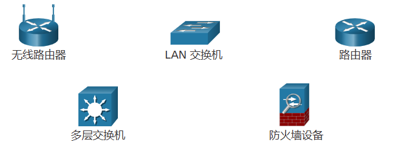
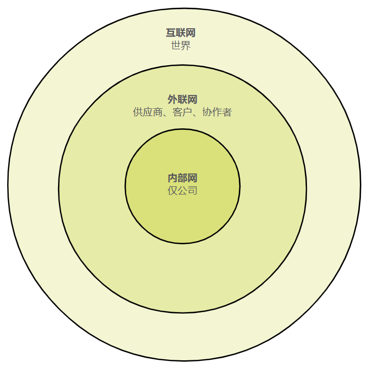

# 1 当今网络

<!-- !!! tip "说明"

    本文档正在更新中…… -->

!!! info "说明"

    本文档仅涉及部分内容，仅可用于复习重点知识

## 1.2 网络组件

### 1.2.1 主机角色

**主机**：连接到网络并直接参与网络通信的所有计算机

主机可以被称为 **终端设备**。某些主机也称为 **客户端**

然而，术语“主机”特指网络上为通信目的而分配了一个数字的设备。这个数字用来标识特定网络中的主机。这个数字称为互联网协议 (IP) 地址。IP 地址标识主机和主机所连接的网络

**服务器**：是装有特殊软件，可以为网络上其他终端设备提供信息（例如电子邮件或网页）的计算机

每项服务都需要单独的服务器软件。例如，服务器必须安装 Web 服务器软件才能为网络提供 Web 服务。安装有服务器软件的计算机可以同时向多个不同客户端提供服务

Web 浏览器是典型的客户端软件。一台计算机也可以运行多种类型的客户端软件

### 1.2.2 点对点

客户端和服务器软件通常运行在单独的服务器上，但一台计算机也可以同时兼任两个角色

**对等网络**：在小企业和家庭中，许多计算机在网络中既是服务器又是客户端

### 1.2.3 终端设备

为了区分不同的终端设备，网络中的每台终端设备都有一个地址。当一台终端设备发起通信时，会使用目的终端设备的地址来指定应该将消息发送到哪里

**终端设备**：指通过网络传输的消息的来源或目的地

### 1.2.4 中间设备

中间设备可以将单个终端连接到网络中。它们可以将多个独立的网络连接起来，形成互联网络。这些中间设备提供连接并确保数据在网络中传输

<figure markdown="span">
  { width="400" }
</figure>

### 1.2.5 网络介质

通信通过介质在网络上传输。介质为消息从源设备传送到目的设备提供了通道

1. 金属线电缆：数据被编码为电脉冲
2. 玻璃或塑料光纤（光缆）：数据被编码为光脉冲
3. 无线传输：数据是通过调制特定频率的电磁波进行编码的

## 1.3 网络表示方式和网络拓扑

### 1.3.1 网络表示方式

<figure markdown="span">
  { width="600" }
</figure>

使用专门的术语来描述这些设备和介质是如何相互连接的：

1. 网络接口卡 (NIC)：将设备物理连接到网络
2. 物理端口：网络设备上的接口或插口，介质通过它连接到终端设备或其他网络设备
3. 接口：网络设备上连接到独立网络的专用端口。由于路由器连接了不同的网络，路由器上的端口称为网络接口

### 1.3.2 拓扑图

1. 物理拓扑图
      1. 各台主机的位置及其与网络连接的方式
      2. 记录电缆安装位置、网络设备位置
      3. 说明了中间设备和电缆安装的物理位置
2. 逻辑拓扑图
      1. 对主机进行分组的依据是它们使用/访问网络的方式，而不考虑它们的物理位置
      2. 记录主机名称、IP 地址、组信息和应用程序（即服务器软件）
      3. 说明了设备、端口和网络的编址方案

<figure markdown="span">
  { width="600" }
</figure>

<figure markdown="span">
  { width="600" }
</figure>

## 1.4 常见网络类型

### 1.4.1 多种规模的网络

1. 小型家庭网络：将少量的几台计算机互联并将它们连接到互联网
2. 小型办公室和家庭办公室网络 (SOHO) ：让一个家庭办公室或远程办公室内的计算机连接到企业网络或访问集中的共享资源
3. 大中型网络：可能有许多站点，包含成百上千台相互连接的主机
4. 全球网络：互联网是由网络组成的网络，连接全球亿万台计算机

### 1.4.2 LAN 和 WAN

1. **局域网**（LAN）：针对较小地理区域内的用户和终端设备提供访问的网络基础设施，通常用于企业、家庭或小型企业网络中的部门

   1. 在有限区域（如家庭、学校、办公大楼或园区）内互连终端设备
   2. 通常由一个组织或个人管理。实行网络级管控、安全控制并制定访问控制策略
   3. 为内部终端设备和中间设备提供高速带宽

2. **广域网**（WAN）：针对广泛地理区域内的网络提供访问的网络基础设施，通常由服务提供商（SP）或 Internet 服务提供商（ISP）管理

   1. 互连广泛地理区域（例如各大城市、州、省、国家/地区或大陆之间）内的 LAN
   2. 通常由多个服务提供商管理
   3. 通常提供 LAN 之间的较慢链路

### 1.4.3 互联网

互联网是一个遍及全球的互相连接的网络（简称互联网络或互联网）的集合

### 1.4.4 内部网和外部网

**内部网**：表示一个组织的私有局域网和广域网连接

内部网的设计旨在仅允许该组织的成员、员工或其他获得授权的人员进行访问。组织可以使用外联网为在其他组织工作，但需要本组织数据的人提供安全访问

<figure markdown="span">
  { width="400" }
</figure>

## 1.5 Internet 连接

### 1.5.2 家庭和小型办公室 Internet 连接

1. 有线电视：通常由有线电视服务提供商提供，互联网数据信号在输送有线电视信号的同一电缆上进行传输。它提供了高带宽、高可用性和始终在线的互联网连接
2. DSL：数字用户线也可提供高带宽、高可用性和始终在线的互联网连接。DSL 通过电话线路运行。通常小型办公室和家庭办公室用户会选择使用非对称 DSL (ADSL)，这种方式的特点是下载速度高于上传速度
3. 蜂窝网：蜂窝网互联网接入使用手机网络进行连接。只要您能收到蜂窝网信号，就能获得蜂窝网互联网接入。性能会受手机功能和手机基站的限制
4. 卫星：对于根本没有互联网连接的地方来说，获得卫星互联网访问非常有用。卫星天线要求有到卫星的清晰视线
5. 拨号电话：使用电话线和调制解调器，费用相对较低。拨号调制解调器连接提供的低带宽不足以用于大型数据传输，但对旅行过程中的移动访问非常有用

### 1.5.3 企业 Internet 连接

1. 专用租用线路：租用线路是服务提供商网络内连接地理位置分散的办公室的保留电路，提供个人语音和/或数据网络。电路按月或按年租用
2. 城域以太网：有时被称为 **以太网 WAN**。城域以太网将 LAN 访问技术扩展到 WAN 中。以太网是一种 LAN 技术
3. DSL：企业 DSL 提供各种格式。一种常见的选择是对称数字用户线路 (SDSL)，它类似于 DSL 的普通用户版本，但是提供相同的上传和下载速度
4. 卫星：当有线解决方案不可用时，卫星服务可以提供连接

### 1.5.4 融合网络

与专用网络不同，融合网络能够通过相同的网络基础设施，在许多不同类型的设备之间传输数据、语音和视频。此网络基础设施采用一组相同的规则、协议和实施标准。融合数据网络在一个网络中传送多种服务

## 1.6 可靠网络

### 1.6.1 网络架构

网络底层架构必须解决以下四个基本特性才能满足用户的期望：

1. 容错能力
2. 可扩展性：可扩展的网络可以快速扩展，以支持新用户和应用程序。它不会降低现有用户正在访问的服务的性能
3. 服务质量（QoS）
4. 安全性

### 1.6.2 容错能力

容错网络是在发生故障时限制受影响设备数量的网络。这种网络能够在发生故障时快速恢复。这些网络依赖于消息的源与目的地之间的多条路径。如果一条路径失败，消息将立即通过不同的链路发送。有多条路径到达目的地被称为冗余

实施分组交换网络是可靠网络提供冗余的一种方法。分组交换将流量分割成通过共享网络发送的数据包。单个消息，例如一份电子邮件或一段视频流，会分割成多个消息块，称为数据包。每个数据包拥有所需的消息源和目的地的编址信息。网络内的路由器基于当时的网络状况交换数据包。这意味着，单个消息中的所有数据包，可能会采用完全不同的路径到达目的地

### 1.6.4 服务质量

当带宽需求超过可用量时，就会造成拥塞。网络带宽用一秒内传输的位数进行衡量，或表示为位/秒 (bps)。在尝试通过网络实现并发通信时，网络带宽需求可能超过可用范围，从而造成网络拥塞

如果流量规模大于可通过网络传输的量，设备会将数据包保存在内存中，直至有资源可以传输它们

QoS 策略：用于优先处理特定类型的数据流量，确保关键应用（如视频会议、在线游戏、 VoIP 电话）获得稳定的带宽、低延迟和低丢包率，尤其在网络拥塞时保障用户体验

### 1.6.5 网络安全

1. 保护提供网络连接的设备的安全
2. 防止有人未经授权访问网络上的管理软件

为了实现网络安全性目标，需要满足三个主要要求：

1. 机密性：意味着只有预定和授权收件人可以访问并读取数据
2. 完整性：表示保证信息在从源到目的地的传输过程中不会被更改
3. 可用性：表示保证授权用户及时可靠地访问数据服务

## 1.7 网络趋势

### 1.7.1 近期趋势

1. 自带设备（BYOD）
2. 在线协作
3. 视频通信
4. 云计算

### 1.7.2 自带设备 (BYOD)

任何设备以任何方式连接到任何内容的概念是一种全球趋势，需要彻底改变我们使用设备的方式，并安全地将它们连接到网络。这一趋势被成为 **自带设备** (BYOD)

BYOD 意味着设备由任何使用者在任意地点使用

### 1.7.6 云计算

云计算是我们访问和存储数据的方式之一。云计算使我们可以在互联网上存储个人文件，甚至可以在服务器上备份整个硬盘驱动器。使用云可以访问文字处理和图片编辑等应用程序

没有数据中心，就无法实现云计算。**数据中心** 是用于容纳计算机系统和相关组件的设施。数据中心可能会占用大楼的一个房间、一个或多个楼层，甚至整个大楼。数据中心的构建和维护成本通常很高。因此，只有大型企业会使用专门构建的数据中心来容纳数据并为用户提供服务。对于没有能力维护自己的专用数据中心的小型企业，可以租用大型数据中心企业的云服务器和存储服务来降低总拥有成本

云类型主要有四种：

1. 公有云
2. 私有云
3. 混合云：由两个或多个云组成（例如：部分私有， 部分公共）
4. 社区云：是专为特定实体或组织使用而创建的

### 1.7.8 电力线网络

使用标准电源适配器，只要有电源插座，设备就可以连接到 LAN。无需安装数据线，也几乎不需要额外的电力。通过使用供电的同一线路，电力线网络通过按一定频率发送数据来发送信息

### 1.7.9 无线宽带

1. 无线互联网服务提供商 (WISP) ：使用类似家庭无线局域网 (WLAN) 的无线技术，将用户连接到专用的接入点或热点的 ISP。WISP 更多用于 DSL 或电缆服务不太可行的农村环境
2. 无线宽带服务：这个解决方案与智能手机使用了相同的蜂窝技术。天线安装在室外，为家中的设备提供有线或无线连接。在许多方面，家庭无线宽带与 DSL 和有线电视接入服务直接竞争

## 1.8 网络安全

### 1.8.1 安全威胁

1. 外部威胁

   1. 病毒、蠕虫和特洛伊木马：包括在用户设备上运行的恶意软件或代码
   2. 间谍软件和广告软件：安装在用户设备上的软件类型。这些软件会秘密收集有关用户的信息
   3. 零日攻击（也称零小时攻击）：在出现漏洞的第一天发起的攻击
   4. 威胁发起者攻击：恶意人员攻击用户设备或网络资源
   5. 拒绝服务攻击（DoS）：使网络设备上的应用和进程减缓或崩溃的攻击
   6. 数据拦截和盗窃：通过公司网络捕获私人信息的攻击
   7. 身份盗窃：窃取用户的登录凭证来访问私人数据的攻击

2. 内部威胁：众多研究表明，大多数常见的数据泄密事件归因于网络的内部用户

### 1.8.2 安全解决方案

应使用多个安全解决方案在多个层上实施安全。当一个安全组件无法识别和保护网络时，其他组件可以保护网络

1. 家庭或小型办公室网络的基本安全组件

    1. 防病毒和反间谍软件：帮助防止终端设备感染恶意软件
    2. 防火墙过滤：阻止未经授权的进出网络访问。这可以是基于主机的防火墙系统，用于阻止未经授权访问终端设备，也可以是家用路由器上的基本过滤服务，用于阻止外部人员未经授权访问网络

2. 企业网络的安全

    1. 专用防火墙系统：提供更高级的防火墙功能，更详细地过滤大量数据流
    2. 访问控制列表 (ACL)；基于 IP 地址和应用程序，进一步过滤访问和流量转发
    3. 入侵防御系统 (IPS)：识别快速扩散的威胁，例如零日攻击或零小时攻击
    4. 虚拟专用网络 (VPN)：为远程工作人员提供对组织机构的安全访问
