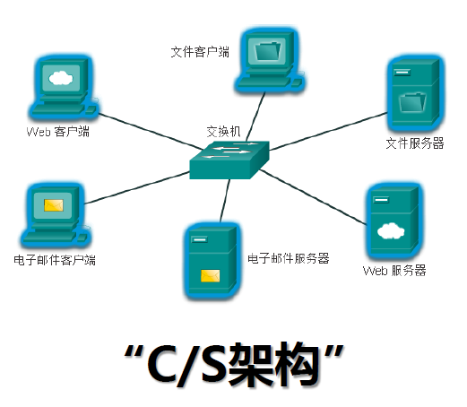
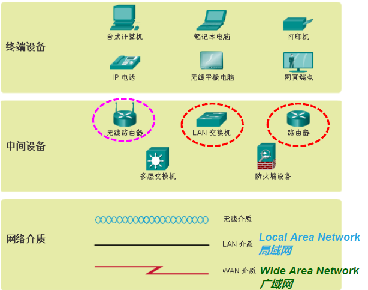
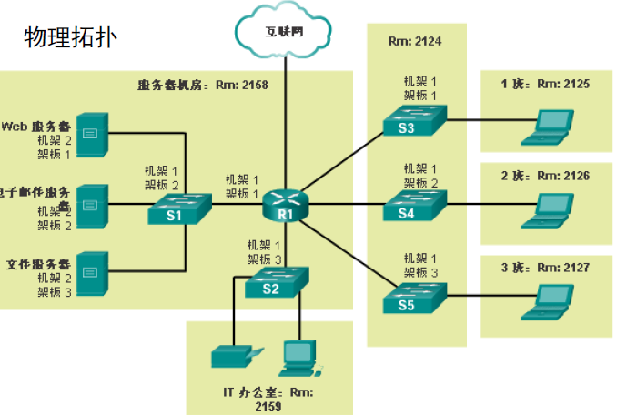
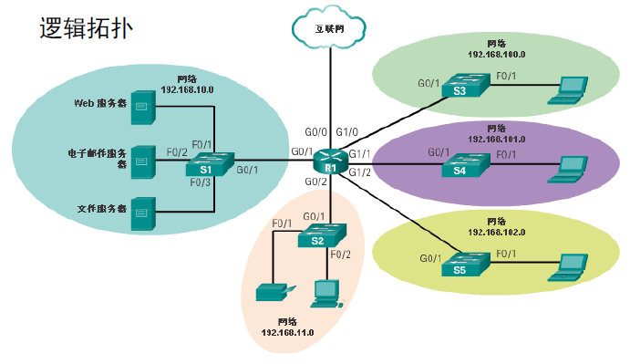

# Lecture 1

<!-- !!! tip "说明"

    本文档正在更新中…… -->

!!! info "说明"

    本文档仅涉及部分内容，仅可用于复习重点知识

## 1 当今网络

### 1.1 网络影响着我们的生活

多种规模的网络：

1. 小型家庭网络
2. 小型办公室/家庭办公室网络
3. 大中型网络
4. Internet

客户端和服务器：

<figure markdown="span">
  { width="600" }
</figure>

1. 终端设备：所有连接到网络并直接参与网络通信的计算机都属于主机。主机也称为终端设备
2. 服务器（Server）：服务器是为其他设备或程序（客户端）提供数据、服务或资源的硬件或软件系统
      1. Web 服务器：托管网站（如 Nginx、Apache）
      2. 文件服务器：提供文件存储和共享（如 FTP 服务器）
      3. 游戏服务器：处理多玩家联机数据
      4. 数据库服务器：存储和管理数据（如 MySQL）
3. 客户端（Client）：客户端是向服务器发起请求并接收服务的终端设备或应用程序
      1. 浏览器（访问网页）
      2. 手机 APP（调用 API）
      3. 电子邮箱客户端（收发邮件）

对等网络：在小企业或家庭网络中，许多计算机既是服务器又是客户端。这种网络称为对等网络

### 1.2 网络组件

#### 1.2.1 网络设备

1. 终端设备是通过网络传输的消息的源或目的地
2. 中间设备将每台终端设备连接到网络，并且可以将多个独立的网络连接成网际网络

#### 1.2.2 网络介质

1. 电缆内的金属线
2. 玻璃或塑料光纤
3. 无线（电波）

#### 1.2.3 网络服务

网络组件用于提供服务和过程。服务和过程是网络设备上运行的通信程序，称为软件

- 服务包括人们日常使用的许多常见网络应用程序。如电子邮件托管服务和 Web 托管服务
- 过程提供的是通过网络引导和移动消息的功能。过程不易察觉，但却是网络运行的关键

### 1.3 网络表达方式和网络拓扑

#### 1.3.1 网络表示方式

<figure markdown="span">
  { width="600" }
</figure>

#### 1.3.2 拓扑

1. 物理拓扑图
      1. 各台主机的位置及其与网络连接的方式
      2. 记录电缆安装位置、网络设备位置
2. 逻辑拓扑图
      1. 对主机进行分组的依据是它们使用/访问网络的方式，而不考虑它们的物理位置
      2. 记录主机名称、IP地址、组信息和应用程序（即服务器软件）

<figure markdown="span">
  { width="600" }
</figure>

<figure markdown="span">
  { width="600" }
</figure>

### 1.4 常见网络类型

1. 局域网（LAN）：针对较小地理区域内的用户和终端设备提供访问的网络基础设施
      1. 有线局域网
      2. 无线局域网（WLAN）
2. 广域网（WAN）：针对广泛地理区域内的网络提供访问的网络基础设施，通常由服务提供商（SP）或 Internet 服务提供商（ISP）管理
      1. WAN 通常提供 LAN 之间的较慢链路

### 1.5 Internet 连接

以太网（Ethernet）是一种有线局域网（LAN）技术，用于在本地网络（如家庭、办公室、数据中心）中通过电缆连接设备并传输数据。它是目前应用最广泛的局域网通信标准，定义了物理层和数据链路层的技术规范

### 1.6 可靠网络

网络底层架构必须解决以下四个基本特性才能满足用户的期望：

1. 容错能力
2. 可扩展性
3. 服务质量（QoS）：用于优先处理特定类型的数据流量，确保关键应用（如视频会议、在线游戏、 VoIP 电话）获得稳定的带宽、低延迟和低丢包率，尤其在网络拥塞时保障用户体验
4. 安全性

### 1.7 网络趋势

1. 自带设备（BYOD）：任何设备以任何方式连接到任何内容
2. 在线协作
3. 视频通信
4. 云计算

### 1.8 网络安全

1. 外部威胁
2. 内部威胁

## 3 协议和模型

### 3.1 规则

通信的三个要素

1. 源：发送方
2. 通道
3. 目的：接收方

计算机网络通信需要遵守一定的规则或协议

1. 消息编码
2. 消息格式和封装
      1. 每条计算机信息在通过网络发送之前都以特定的格式封装，称为帧（frame）。帧提供目的地址和源地址等必要信息
3. 消息大小
      1. 源：将长消息分割为同时符合最小和最大长度要求的多个片段或帧。帧太长或太短都无法传送
      2. 目的：将消息的各个片段重新组合为原始消息
4. 消息时序
5. 消息传输选项
      1. 单播：一对一（只有一个目的）
      2. 组播/多播：一对多（同时发送同一条消息到一组目的）
      3. 广播：一对全体

### 3.2 协议

网络协议定义了用于设备之间交换消息的通用格式和规则，包括消息编码、格式和封装、大小、时序、模式等方面

常用的网络协议，例如：

1. 超文本传输协议（HTTP）
2. 文件传输协议（FTP）
3. 传输控制协议（TCP）
4. Internet 协议（IP）

### 3.3 协议簇

执行某种通信功能所需的一组内在相关协议称为协议簇/族/栈

协议簇显示为分层结构，上层服务依赖于下层协议的功能：

1. 上层负责处理发送的消息内容
2. 下层负责通过网络传输数据和向上层提供服务

### 3.4 标准组织

互联网标准组织：

1. 互联网工程任务组（IETF）：负责开发、更新和维护 Internet 和 TCP/IP 技术。包括用于开发新协议和更新现有协议的流程和文档，称为征求意见（RFC）文档
2. 互联网名称与数字地址分配机构（ICANN）：总部设在美国，负责全球 IP 地址分配、
全球域名管理、TCP/IP 协议中使用的其他信息如端口号的分配

电子和通信标准组织：

1. 电气电子工程师协会 IEEE（读作“I-triple-E”）：是为致力于推动诸多行业领域的技术创新和标准创建的工程师设立的组织，涉及的领域包括电力与能源、医疗保健、电信和网络。（IEEE 802.3 以太网，IEEE 802.11 WLAN）
2. 电子工业协会（EIA）：因其在用于安装网络设备的电线、连接器和 19 英寸机架方面的标准而知名
3. 电信工业协会（TIA）：负责开发各种领域的通信标准，包括无线电设备、手机信号塔、IP 语音（VoIP） 设备和卫星通信等

### 3.5 参考模型

#### 3.5.1 OSI

从下到上：

1. 物理层
2. 数据链路层
      1. 物理 MAC 地址
3. 网络层
      1. 逻辑 IP 地址及选择路由
4. 传输层
      1. 发送方：消息分段。通过分段，可以在网络上交替发送许多不同的会话，称为多路复用
      2. 接收方：消息重组
      3. TCP、UDP
5. 会话层
6. 表示层
7. 应用层：定义应用软件与网络通信功能之间的接口并提供相关服务
      1. HTTP、FTP

<figure markdown="span">
  { width="600" }
</figure>

#### 3.5.2 TCP/IP

从下到上：

1. 网络接入层
      1. 以太网、WiFi
2. 互联网层
      1. IP
3. 传输层
      1. TCP、UDP
4. 应用层
      1. HTTP、FTP

> 在提及 TCP/IP 模型的各层时只使用其名称，而提及 OSI 模型的七层时则通常使用其编号
