# 11 IPv4 编址

<!-- !!! tip "说明"

    本文档正在更新中…… -->

!!! info "说明"

    本文档仅涉及部分内容，仅可用于复习重点知识

## 11.1 IPv4 地址结构

### 11.1.1 网络部分和主机部分

IPv4 地址为 32 位分层地址，由网络部分和主机部分两个部分组成。在确定网络部分和主机部分时，必须先查看 32 位数据流

<figure markdown="span">
  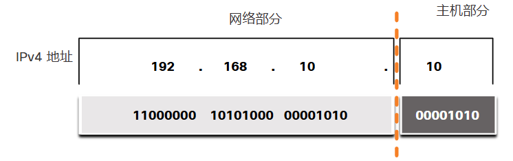{ width="600" }
</figure>

对于同一网络中的所有设备，地址的网络部分中的位必须完全相同。地址的主机部分中的位必须唯一，这方便识别网络中的特定主机。如果两台主机在 32 位数据流中的指定网络部分有相同的位模式，则这两台主机位于同一网络

### 11.1.2 子网掩码

为主机分配 IPv4 地址需要以下内容：

1. IPv4 地址：这是主机的唯一 IPv4 地址
2. 子网掩码：用于标识 IPv4 地址的网络部分/主机部分

<figure markdown="span">
  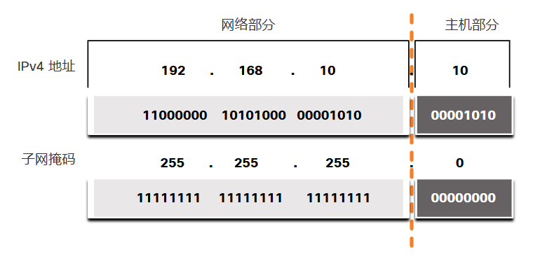{ width="600" }
</figure>

### 11.1.3 前缀长度

使用点分十进制子网掩码地址表示网络地址和主机地址会变得很麻烦。幸运的是，还有另一种识别子网掩码的方法，称为前缀长度

前缀长度是子网掩码中设置为 1 的位数。使用“斜线记法”写入，即“/”紧跟设置为 1 的位数。借此计算子网掩码中的位数，并在前面加斜线表示

<figure markdown="span">
  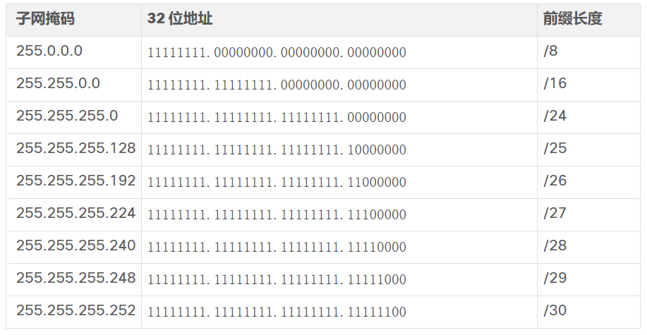{ width="600" }
</figure>

当使用前缀长度表示 IPv4 地址时，IPv4 地址后面写入不带空格的前缀长度。例如，192.168.10.10 255.255.255.0 可以写成192.168.10.10/24

### 11.1.6 网络地址、主机地址和广播地址

在每个网络中有三种类型的 IP 地址：

1. 网络地址
2. 主机地址
3. 广播地址

<figure markdown="span">
  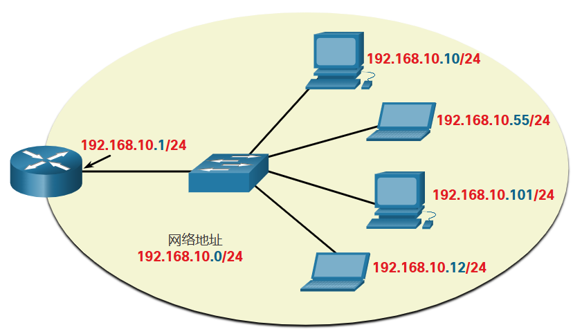{ width="600" }
</figure>

**网络地址**：表示特定网络的地址。如果设备满足以下三个条件，则属于此网络：

1. 它具有与网络地址相同的子网掩码
2. 它具有与网络地址相同的网络位，如子网掩码所示
3. 它与具有相同网络地址的其他主机位于同一广播域中

**主机地址**：可以分配给设备的地址，如主机，笔记本电脑，智能手机，网络摄像头，打印机，路由器等

地址的主机部分是由子网掩码中 0 位表示的位。除了全 0 位（这将是网络地址）或全 1 位（这将是广播地址）之外，主机地址在主机部分可以有任何位的组合

同一网络中的所有设备，必须具有相同的子网掩码和相同的网络位。只有主机位会有所不同，且必须是唯一的

**广播地址**：在需要访问 IPv4 网络上的所有设备时使用的地址。无法将广播地址分配给设备

## 11.2 IPv4 单播、广播和组播

### 11.2.1 单播

IPv4 单播主机地址的地址范围是 1.1.1.1 到 223.255.255.255。不过，此范围中的很多地址被留作特殊用途

### 11.2.2 广播

广播数据包以主机部分全部为 1 的地址或 32 个 1 位作为目的 IP 地址

除了 255.255.255.255 的广播地址外，每个网络还有一个广播 IPv4 地址。这个地址称为定向广播，它使用网络范围内的最大地址，即所有主机位全部为 1 的地址。例如，网络 192.168.1.0/24 的定向广播地址是 192.168.1.255。此地址允许与该网络中的所有主机进行通信。要向网络中的所有主机发送数据，主机只需以该网络广播地址为目标地址发送一个数据包即可

### 11.2.3 组播

组播数据包是一个目的 IP 地址为组播地址的数据包。IPv4 将 224.0.0.0 到 239.255.255.255 的地址保留为组播范围

路由协议（如 OSPF）使用组播传输。例如，启用 OSPF 的路由器使用保留的 OSPF 组播地址 224.0.0.5 相互通信。只有启用 OSPF 的设备才会以 224.0.0.5 作为目的 IPv4 地址处理这些数据包。所有其他设备将忽略这些数据包

## 11.3 IPv4 地址的分类

### 11.3.1 公有和私有 IPv4 地址

公有 IPv4 地址是能在 ISP（互联网运营商）路由器之间全局路由的地址。但是，并非所有可用的 IPv4 地址都可用于互联网。大多数组织使用称为私有地址的地址块向内部主机分配 IPv4 地址

<figure markdown="span">
  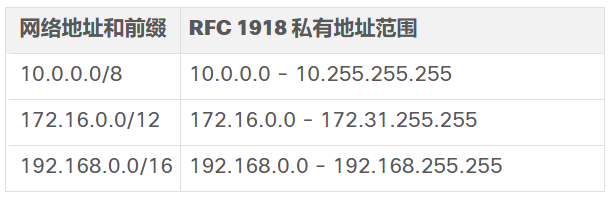{ width="600" }
</figure>

### 11.3.2 路由到互联网

大多数内部网络（从大型企业到家庭网络）都使用私有 IPv4 地址来编址所有内部设备（Intranet），包括主机和路由器。但是，私有地址不可全局路由

在 ISP 可以转发此数据包之前，它必须使用网络地址转换 (NAT) 将源 IPv4 地址（即私有地址）转换为公有 IPv4 地址。NAT 用于转换私有和公有 IPv4 地址。这通常是在将内部网络连接到 ISP 网络的路由器上完成。在路由到互联网之前，组织内部网中的私有 IPv4 地址将被转换为公有 IPv4 地址

拥有可用于互联网的资源的组织（如 Web 服务器）也将拥有具有公有 IPv4 地址的设备。如图所示，该网络的这一部分被称为 DMZ（非军事区）。图中的路由器不仅执行路由，还执行 NAT 并充当安全防火墙

<figure markdown="span">
  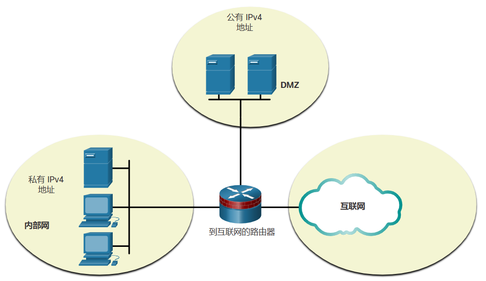{ width="600" }
</figure>

### 11.3.4 专用 IPv4 地址

一些地址，比如网络地址和广播地址不能分配给主机。还有些特殊地址可以分配给主机，但这些主机在网络内的交互方式却受到限制

**环回地址**：环回地址（127.0.0.0 /8 或 127.0.0.1 到 127.255.255.254）通常仅被标识为 127.0.0.1，主机使用这些特殊地址将流量指向其自身。主机可以使用这个特殊地址测试 TCP/IP 配置是否运行正常

> localhost: 127.0.0.1

**本地链路地址**：本地链路地址（169.254.0.0 /16 或 169.254.0.1 至 169.254.255.254）通常称为自动私有 IP 编址 (APIPA) 地址或自分配地址。当没有可用的 DHCP 服务器时，Windows DHCP 客户端使用它们进行自我配置。本地链路地址可以用于点对点连接，但通常不用于此目的

> 如果看到 169.254 开头的地址：地址异常，通信一般也异常

TEST-NET 地址：192.0.2.0/24 或 192.0.2.0 至 192.0.2.255 

### 11.3.5 传统有类编址

RFC 将单播范围分为具体的类别：

1. A 类 (0.0.0.0/8 - 127.0.0.0/8)：用于支持拥有 1600 万以上主机地址的规模非常大的网络。A 类的第一个八位组使用固定的 /8 前缀表示网络地址，其他的三个八位组表示主机地址
2. B 类 (128.0.0.0 /16 – 191.255.0.0 /16)：用于支持拥有大约 65,000 个主机地址的大中型网络。B类的两个高位八位组使用固定的 /16 前缀表示网络地址，其他的两个八位组表示主机地址
3. C 类 (192.0.0.0 /24 – 223.255.255.0 /24)：用于支持最多拥有 254 台主机的小型网络。C类的前三个八位组使用固定的 /24 前缀表示网络地址，其余的八位组表示主机地址

<figure markdown="span">
  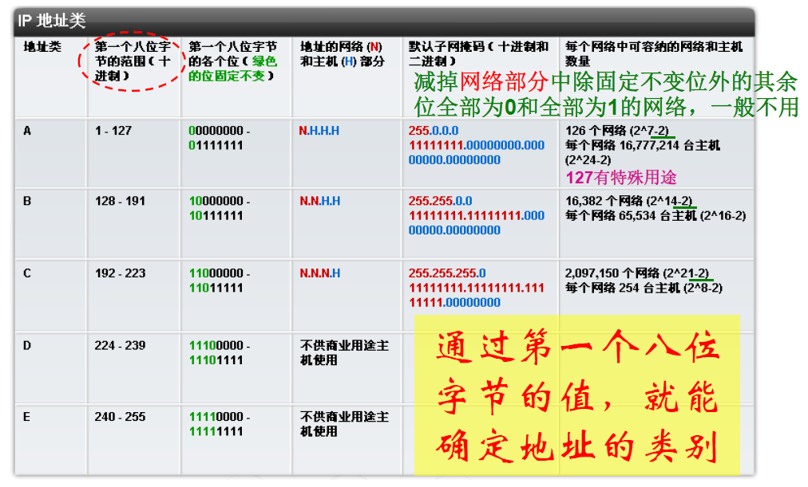{ width="600" }
</figure>

### 11.3.6 IP 地址的分配

公有 IPv4 地址是能通过互联网全局路由的地址。公有 IPv4 地址必须是唯一的

IPv4 和 IPv6 地址是通过互联网编号指派机构 (IANA) 管理的。IANA 管理并向地区性互联网注册机构 (RIR) 分配 IP 地址块

RIR 的职责是向 ISP 分配 IP 地址，而 ISP 将向组织和更小的 ISP 提供 IPv4 地址块。根据 RIR 的政策规定，组织也可直接从 RIR 获取地址

## 11.4 网络分段

### 11.4.1 广播域和分段

在以太网局域网中，设备使用广播和地址解析协议 (ARP) 来定位其他设备。地址解析协议 (ARP) 将第 2 层广播发送到本地网络上的已知 IPv4 地址，以发现相关 MAC 地址。以太网局域网上的设备还可以使用服务定位其他设备。主机通常需要使用动态主机配置协议 (DHCP) 来获取 IPv4 地址配置，这会发送本地网络上的广播来定位 DHCP 服务器

路由器不传播广播。路由器在收到广播时，它不会将其转发到其他接口。因此，每个路由器接口都连接了一个广播域，而广播只能在特定广播域内传播

### 11.4.2 大型广播域存在的问题

大型广播域是连接很多主机的网络。大型广播域的一个问题是这些主机会生成太多广播，这会对网络造成不良影响

解决方案是使用称为 **子网划分** 的过程缩减网络的规模以创建更小的广播域。这些较小的网络空间通常称为 **子网**

<figure markdown="span">
  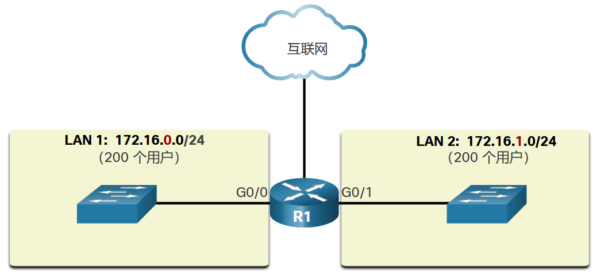{ width="600" }
</figure>

### 11.4.3 划分网络的原因

子网划分可以降低整体网络流量并改善网络性能。它也能让管理员实施安全策略，例如哪些子网允许或不允许进行通信。另一个原因是，它减少了由于错误配置、硬件/软件问题或恶意意图而受到异常广播流量影响的设备数量

网络管理员如何将设备和服务分组到子网中：

1. 位置
2. 组或功能
3. 设备类型

## 11.5 IPv4 网络的子网

### 11.5.1 在二进制八位组边界上划分子网

假设企业选择了私有地址 10.0.0.0/8 作为其内部网络地址。企业可以进一步在二进制八位组边界 /16 处对 10.0.0.0/8 地址进行子网划分，如表所示。这能让企业定义多达 256 个子网（例如，10.0.0.0/16 – 10.255.0.0/16），每个子网可以连接 65,534 个主机

<figure markdown="span">
  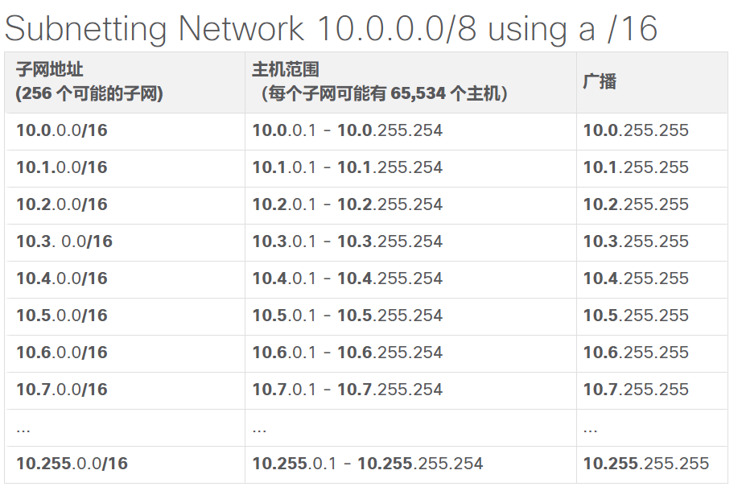{ width="600" }
</figure>

另外，企业也可以选择在 /24 二进制八位组边界处对 10.0.0.0/8 网络进行子网划分，如表所示。这将让企业能定义 65,536 个子网，每个子网能连接 254 个主机。/24 边界在子网划分中使用非常广泛，因为它在这个二进制八位数边界处可以容纳足够多的主机，并且子网划分也很方便

<figure markdown="span">
  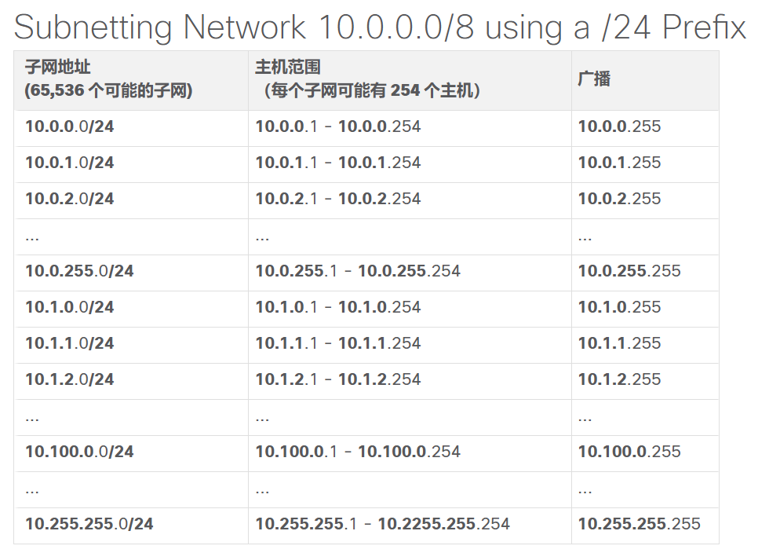{ width="600" }
</figure>

### 11.5.2 在二进制八位组边界内划分子网

<figure markdown="span">
  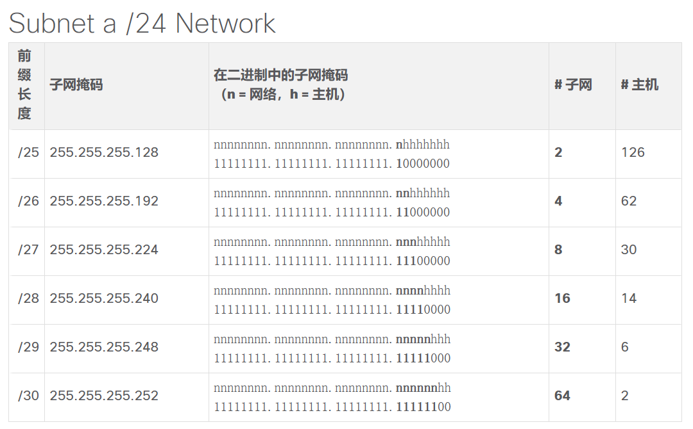{ width="600" }
</figure>

## 11.6 使用 /16和 /8 前缀划分子网

### 11.6.2 使用 /16 前缀创建 100 个子网

设一家大型企业需要至少 100 个子网，并且已选择私有地址 172.16.0.0/16 作为其内部网络地址

<figure markdown="span">
  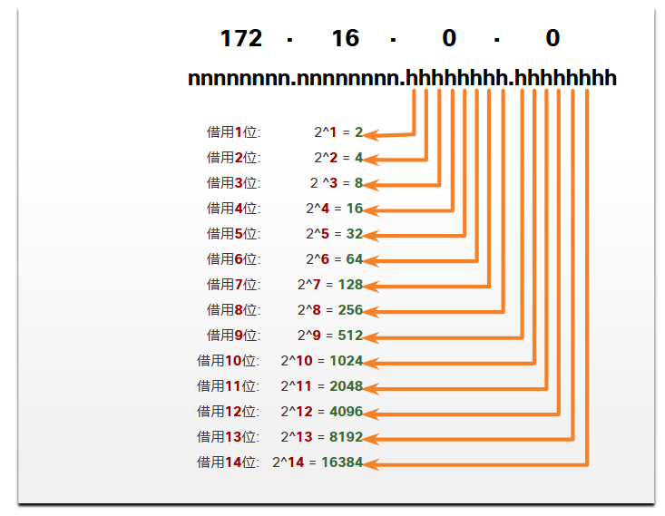{ width="600" }
</figure>

要满足企业 100 个子网的要求，需要借用 7 位（即 $2^7= 128$ 个子网）

### 11.6.3 使用 /8 前缀创建 1000 个子网

<figure markdown="span">
  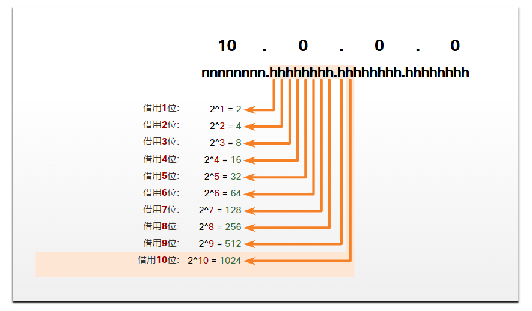{ width="600" }
</figure>

需要借用 10 位来创建 1024 个子网 ($2^{10} = 1024$)

## 11.7 按照要求划分子网

### 11.7.1 对私有和公有 IPv4 地址空间进行子网划分

1. 内部网：这是公司网络的内部部分，只能在组织内部访问。内部网中的设备使用私有 IPv4 地址
2. DMZ：这是公司网络的一部分，其中包含可供互联网使用的资源，如 Web 服务器。DMZ 中的设备使用公有 IPv4 地址

内部网使用私有 IPv4 编址空间。这允许组织使用任何私有 IPv4 网络地址

### 11.7.2 最小化未使用的主机 IPv4 地址并最大化子网

要尽量减少未使用的主机 IPv4 地址数量并最大化可用子网数量，在规划子网时需要考虑两个因素：每个网络所需的主机地址数量和所需的单个子网数量

## 11.8 VLSM

**可变长子网掩码**

### 11.8.4 VLSM

在前面主题的所有子网示例中，所有子网都使用相同的子网掩码。这意味着每个子网有相同数量的可用主机地址。VLSM 使网络空间能够分为大小不等的部分。使用 VLSM，子网掩码将根据特定子网所借用的位数而变化，从而成为 VLSM 的“变量”部分

VLSM 就是指对子网划分子网。图中显示了以前使用的相同拓扑

<figure markdown="span">
  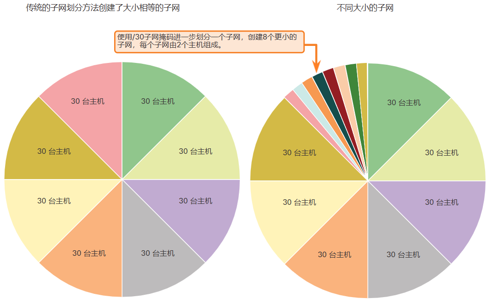{ width="600" }
</figure>

## 11.9 结构化设计

### 11.9.2 设备地址分配

在一个网络中，有不同类型的设备需要分配地址：

1. 终端用户客户端：大部分网络使用动态主机配置协议 (DHCP) 动态地将 IPv4 地址分配给客户端设备。这能减少网络支持人员的负担，并显著减少输入错误。使用 DHCP 时，地址仅租用一段时间，并且可以在租约到期时重新使用。这是支持临时用户和无线设备的网络的一个重要特性。更改子网划分方案意味着 DHCP 服务器需要进行重新配置，并且客户端必须续订其 IPv4 地址。IPv6 客户端可以使用 DHCPv6 或 SLAAC 获取地址信息
2. 服务器和外部设备：这些应具有可预测的静态 IP 地址。对这些设备使用统一的编号系统
3. 可从互联网访问的服务器：需要在互联网上公开可用的服务器必须具有公有 IPv4 地址，通常使用 NAT 访问。在一些组织中，必须使远程用户可以使用内部服务器 (不可公开使用)。在大多数情况下，这些服务器在内部分配了私有地址，用户需要创建一个虚拟专用网络 (VPN) 连接来访问服务器。这与用户从内部网中的主机访问服务器具有相同的效果
4. 中间设备：这些设备出于网络管理、监视和安全目的分配了地址。因为我们必须知道如何与中间设备通信，所以它们应当具有可以预测的静态地址
5. 网关：路由器和防火墙设备给每个接口分配一个 IP 地址，用作该网络中主机的网关。路由器接口一般使用网络中的最小地址或最大地址