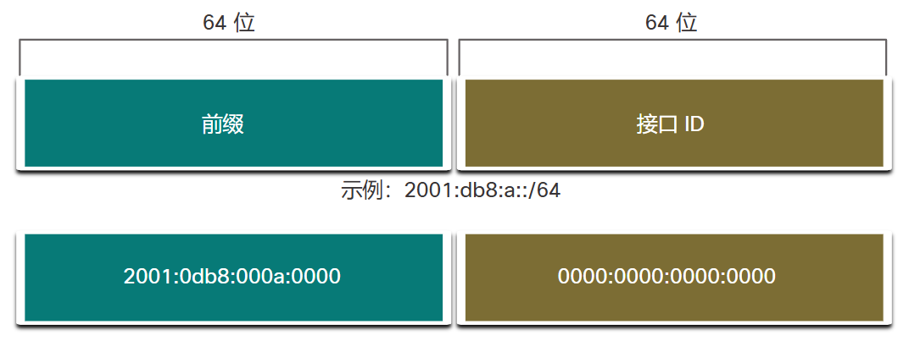
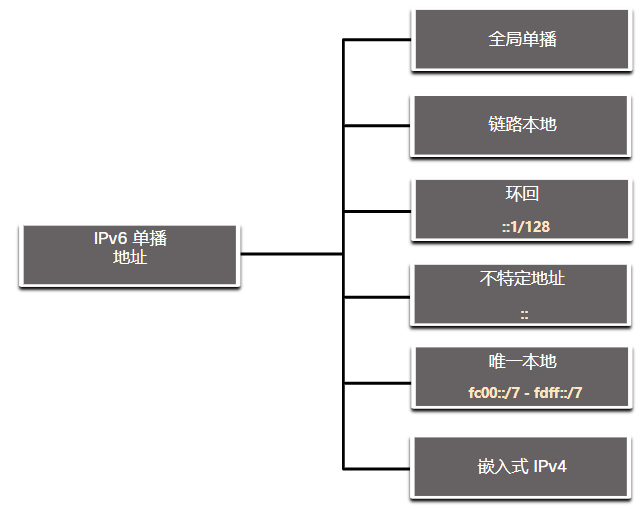
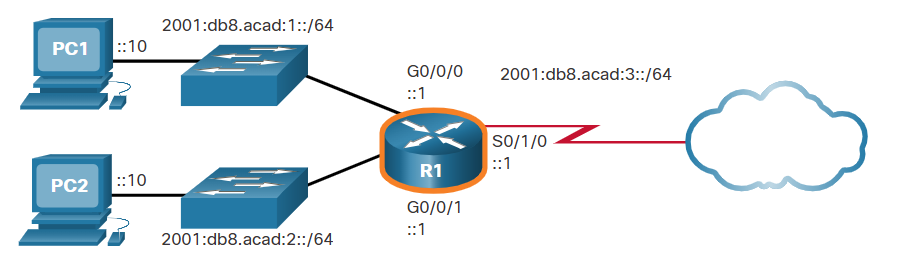
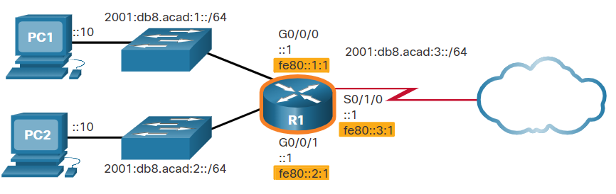
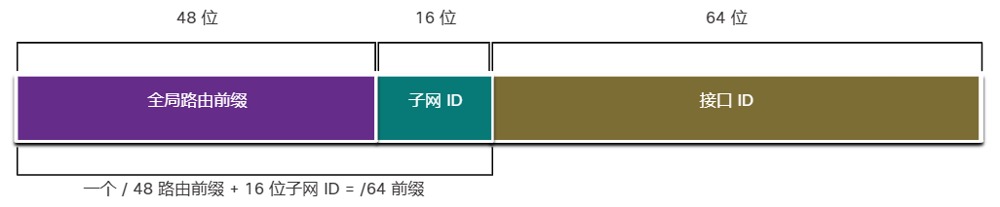
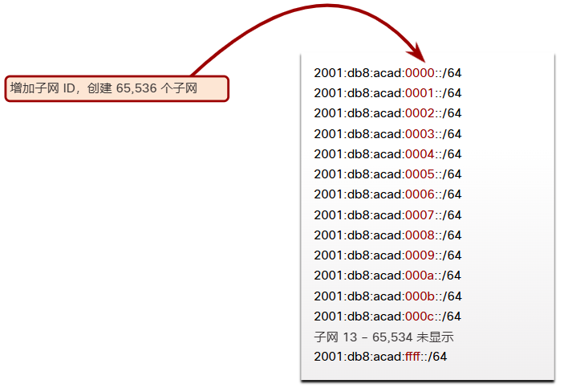

# 12 IPv6 编址

<!-- !!! tip "说明"

    本文档正在更新中…… -->

!!! info "说明"

    本文档仅涉及部分内容，仅可用于复习重点知识

## 12.1 IPv4 的问题

### 12.1.2 IPv4 和 IPv6 共存

迁移技术可分为三类：

1. 双堆栈
2. 隧道
3. 转换

## 12.2 IPv6 地址表示方法

### 12.2.1 IPv6 编址格式

书写 IPv6 地址的首选格式为 x\:x\:x\:x\:x\:x\:x\:x，每个“x”均包括四个十六进制值。术语“八位组”是指 IPv4 地址的八位。在 IPv6 中，十六位位组是指代 16 位二进制或四位十六进制数的非官方术语。每个“x”是一个 16 位二进制数或四位十六进制数字组成的十六进制数

### 12.2.2 规则 1 - 省略前导 0

第一条有助于缩短 IPv6 地址记法的规则是省略十六进制数中的所有前导 0（零）

### 12.2.3 规则 2 - 双冒号

第二条有助于缩短 IPv6 地址记法的规则是使用双冒号 (::) 替换任何由一个或多个全由 0 组成的 16 位十六进制数组成的连续字符串。例如，2001:db8:cafe:1:0:0:0:1（前导0省略）可以表示为 2001:db8:cafe:1::1

## 12.3 IPv6 地址类型

### 12.3.1 单播，组播，任播

IPv6 地址有三大类：

1. 单播
2. 组播
3. 任播

IPv4 不同，IPv6 没有广播地址。但是，IPv6 具有 IPv6 全节点组播地址，这在本质上与广播地址的效果相同

### 12.3.2 IPv6 前缀长度

在 IPv4 中，/24 称为前缀。在 IPv6 中，它被称为前缀长度。IPv6 不使用点分十进制子网掩码记法。与IPv4一样，前缀长度以斜线记法表示，用于表示 IPv6 地址的网络部分

前缀长度范围为 0 至 128。推荐的局域网和大多数其他网络类型 IPv6 前缀长度为 /64

<figure markdown="span">
  { width="600" }
</figure>

### 12.3.3 IPv6 单播地址的类型

IPv6 单播地址用于唯一标识支持 IPv6 的设备上的接口。发送到单播地址的数据包由分配有该地址的接口接收。与 IPv4 类似，源 IPv6 地址必须是单播地址。目的 IPv6 地址可以是单播地址也可以是组播地址

<figure markdown="span">
  { width="600" }
</figure>

与 IPv4 设备只有一个地址不同，IPv6 地址通常有两个单播地址：

1. 全局单播地址 (GUA)：这类似于公有 IPv4 地址。这些地址具有全局唯一性，是互联网可路由的地址。GUA 可静态配置或动态分配
2. 链路本地地址 (LLA)：这对于每个支持 IPv6 的设备都是必需的。LLA 用于与同一链路中的其他设备通信。在 IPv6 中，术语链路是指子网。LLA 仅限于单个链路。它们的唯一性仅在该链路上得到保证，因为它们在该链路之外不具有可路由性。换句话说，路由器不会转发具有本地链路源地址或目的地址的数据包

### 12.3.4 关于唯一本地地址的注意事项

唯一本地地址（范围 fc00:: /7 到 fdff:: /7）尚未普遍实现

IPv6 唯一本地地址与 IPv4 的 RFC 1918 私有地址具有相似之处，但是也有着重大差异

1. 唯一本地地址用于一个站点内或数量有限的站点之间的本地编址
2. 唯一本地地址可用于从来不需要访问其他网络的设备
3. 唯一本地地址不会全局路由或转换为全局 IPv6 地址

### 12.3.5 IPv6 GUA

IPv6 全局单播地址 (GUA) 具有全局唯一性，可在 IPv6 互联网上路由。这些地址相当于公有 IPv4 地址。互联网名称与数字地址分配机构 (ICANN)，即 IANA 的运营商，将 IPv6 地址块分配给五家 RIR。目前分配的仅是前三位为 001 或 2000::/3 的全局单播地址（GUA）

GUA 有三个部分：

1. 全局路由前缀
2. 子网 ID
3. 接口 ID

### 12.3.6 IPv6 GUA 结构

1. 全局路由前缀：全局路由前缀为提供商（如 ISP）分配给客户或站点的地址的前缀或网络部分。例如，ISP 通常会为其客户分配 /48 全局路由前缀。全局路由前缀通常会因 ISP 的策略而异
2. 子网 ID：子网 ID 字段是全局路由前缀和接口 ID 之间的区域。与 IPv4 不同，在 IPv4 中您必须从主机部分借用位来创建子网，IPv6 在设计时考虑到了子网。组织使用子网 ID 确定其站点的子网。子网 ID 越大，可用子网越多
3. 接口 ID：IPv6 接口 ID 相当于 IPv4 地址的主机部分。使用术语“接口 ID”是因为单个主机可能有多个接口，而每个接口又有一个或多个 IPv6 地址

### 12.3.7 IPv6 LLA

IPv6 链路本地地址 (LLA) 允许设备与同一链路上支持 IPv6 的其他设备通信，并且只能在该链路（子网）上通信。具有源或目的 LLA 的数据包不能在数据包的源链路之外进行路由

GUA 不是一项要求。但是，每个启用 IPv6 的网络接口都必须有 LLA

如果没有手动为接口配置 LLA，设备会在不与 DHCP 服务器通信的情况下自动创建自己的地址。支持 IPv6 的主机会创建 IPv6 LLA，即使没有为该设备分配 IPv6 全局单播地址。这允许支持 IPv6 的设备与同一子网中的其他支持 IPv6 的设备通信。这包括与默认网关（路由器）的通信

IPv6 LLAs 在 fe80::/10 范围内

设备可以通过两种方式获取 LLA：

1. 静态
2. 动态

## 12.4 GUA 和 LLA 静态配置

### 12.4.1 路由器上的静态 GUA 配置

<figure markdown="span">
  { width="600" }
</figure>

```txt linenums="1"
R1(config)# interface gigabitethernet 0/0/0
R1(config-if)# ipv6 address 2001:db8:acad:1::1/64
R1(config-if)# no shutdown
R1(config-if)# exit
R1(config)# interface gigabitethernet 0/0/1
R1(config-if)# ipv6 address 2001:db8:acad:2::1/64
R1(config-if)# no shutdown
R1(config-if)# exit
R1(config)# interface serial 0/1/0
R1(config-if)# ipv6 address 2001:db8:acad:3::1/64
R1(config-if)# no shutdown
```

### 12.4.3 链路本地单播地址的静态配置

<figure markdown="span">
  { width="600" }
</figure>

```txt linenums="1"
R1(config)# interface gigabitethernet 0/0/0
R1(config-if)# ipv6 address fe80::1:1 link-local
R1(config-if)# exit
R1(config)# interface gigabitethernet 0/0/1
R1(config-if)# ipv6 address fe80::2:1 link-local
R1(config-if)# exit
R1(config)# interface serial 0/1/0
R1(config-if)# ipv6 address fe80::3:1 link-local
R1(config-if)# exit
```

## 12.5 IPv6 GUA 的动态编址

### 12.5.1 RS and RA 消息

使用 **路由器通告**（RA）和 **路由器请求**（RS）消息来动态获取 IPv6 GUA

ICMPv6 RA 消息包括以下：

1. 网络前缀和前缀长度：这会告知设备其所属的网络
2. 默认网关：IPv6 LLA，RA 消息的源 IPv6 地址
3. DNS 地址和域名：这些是 DNS 服务器的地址和域名

RA 消息有三种方法：

1. SLAAC：“我拥有您需要的一切，包括前缀、前缀长度和默认网关地址”
2. SLAAC 和无状态 DHCPv6 服务器：“这是我的信息，但您需要从无状态 DHCPv6 服务器获得其他信息，例如 DNS 地址”
3. 有状态的 DHCPv6（无 SLAAC）：“我可以给您默认网关的地址。您需要向有状态的 DHCPv6 服务器询问您的所有其他信息”

## 12.6 IPv6 LLA的动态编址

### 12.6.1 动态 LLA

所有 IPv6 设备都必须有 IPv6 LLA。与 IPv6 GUA一样，您也可以动态创建 LLA。无论您如何创建 LLA (和 GUA)，重要的是要验证所有 IPv6 地址配置

## 12.7 IPv6 组播地址

### 12.7.1 分配的 IPv6 组播地址

IPv6 组播地址的前缀为 ff00::/8

IPv6 组播地址分为两种类型：

1. 知名组播地址
2. 请求节点组播地址

## 12.8 IPv6 网络的子网

### 12.8.1 使用子网 ID 划分子网

使用 IPv4 时，我们必须从主机部分借用位来创建子网。这是因为对 IPv4 来说，子网划分是事后才想到的。但是，IPv6 的设计考虑到了子网划分。IPv6 GUA 中的一个单独的子网 ID 字段用于创建子网。如图所示，子网 ID 字段是全局路由前缀和接口 ID 之间的区域

<figure markdown="span">
  { width="600" }
</figure>

### 12.8.2 IPv6 子网划分示例

例如，假设一个组织分配了 2001:db8:acad::/48 全局路由前缀，并采用 16 位子网 ID。这将允许组织创建 65,536个 /64 子网，如图所示。注意，所有子网的全局路由前缀是相同的。只为每个子网递增子网 ID 的十六位字节数（以十六进制形式）

<figure markdown="span">
  { width="600" }
</figure>