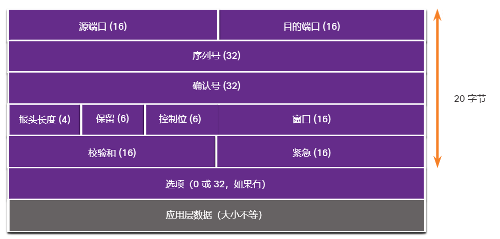
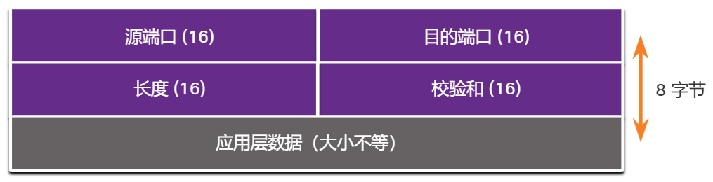
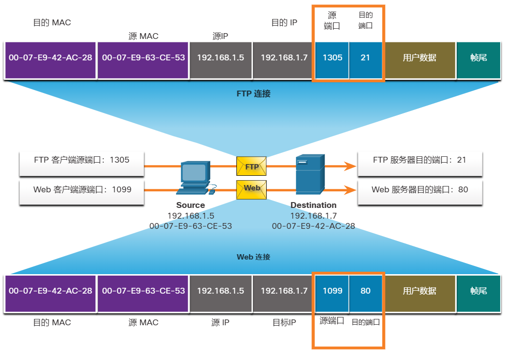
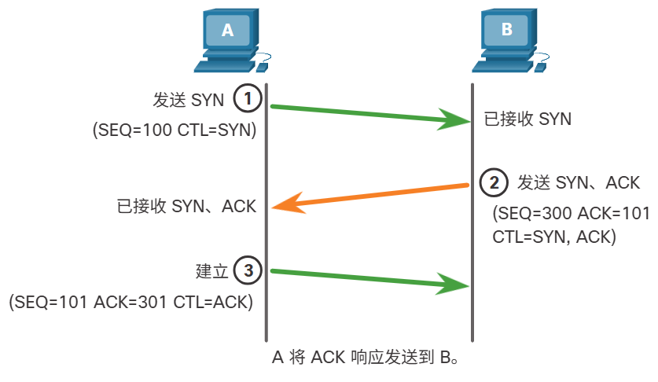
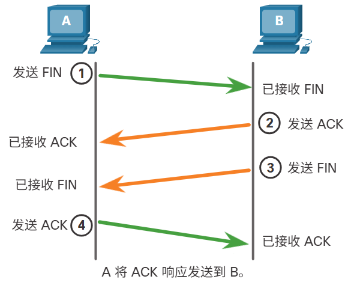

# 14 传输层

!!! tip "说明"

    本文档正在更新中……

!!! info "说明"

    本文档仅涉及部分内容，仅可用于复习重点知识

## 14.1 数据传输

### 14.1.1 传输层的作用

应用层程序生成必须在源主机和目的主机之间交换的数据。传输层负责在不同主机上运行的应用程序之间进行的逻辑通信。这可能包括在两个主机之间建立临时会话以及应用程序信息的可靠传输等服务

传输层包括两个协议：

1. 传输控制协议（TCP）
2. 用户数据报协议（UDP）

### 14.1.2 传输层的职责

1. 跟踪各个会话
2. 数据分段和数据段重组
3. 添加报头信息
4. 标识应用
5. 会话多路复用

### 14.1.4 传输控制协议 (TCP)

IP 只涉及从原始发送方到最终目的地的数据包的结构、编址和路由。IP不负责保证传递或确定发送方和接收方之间是否需要建立连接

TCP 被认为是可靠且功能齐全的传输层协议，用于确保所有数据到达目的设备。TCP 包含确保应用数据传递的字段。这些字段需要发送和接收的主机进行额外处理

TCP 传输类似于从源到目的地跟踪发送的数据包。如果快递订单分多个数据包，客户可以在线查看发货顺序

TCP 使用以下基本操作提供可靠性和流量控制：

1. 编号并跟踪从特定应用程序发送到特定主机的数据
2. 确认收到数据
3. 在一定时间段后重新传输未确认的数据
4. 有顺序的数据可能以错误的顺序到达以接收方可以接受的有效速率发送数据

### 14.1.5 用户数据报协议 (UDP)

UDP 是一种比 TCP 更简单的传输层协议。它不提供可靠性和流量控制，这意味着它需要更少的报头字段。由于发送方和接收方UDP进程不需要管理可靠性和流量控制，这意味着 UDP 数据报的处理速度比 TCP 数据段快。UDP 仅提供在相应应用之间传输数据报的基本功能，需要很少的开销和数据检查

UDP 是一种无连接协议。由于 UDP 不提供可靠性或流量控制，因此不需要建立连接。由于 UDP 不跟踪客户端和服务器之间发送或接收的信息，因此 UDP 也称为无状态协议

UDP 也称为最大努力交付协议，因为在目的地接收到数据后没有确认消息。UDP 中没有通知发送方是否成功传输的传输层流程

## 14.2 TCP 概述

### 14.2.1 TCP 功能

除了支持数据分段和重组的基本功能之外，TCP 还提供以下服务：

1. 建立会话
2. 确保可靠的传递
3. 提供相同顺序的传递
4. 支持流量控制

### 14.2.2 TCP 报头

在封装应用层数据时，TCP 数据段会增加 20 个字节（即 160 位）的开销。该图显示的是 TCP 报头中的字段

<figure markdown="span">
  { width="600" }
</figure>

### 14.2.4 使用 TCP 的应用程序

1. FTP
2. HTTP
3. SMTP
4. SSH

## 14.3 UDP 概述

### 14.3.1 UDP 功能

UDP 的特点包括以下几种：

1. 数据按照接收顺序重构
2. 丢失的任何数据段都不会重新发送
3. 不会建立会话
4. 不会告知发送者资源可用性

### 14.3.2 UDP 报头

UDP 报头比 TCP 报头简单得多，因为它只有四个字段，需要 8 个字节 (即 64 位)。该图显示的是 UDP 报头中的字段

<figure markdown="span">
  { width="600" }
</figure>

### 14.3.4 使用 UDP 的应用程序

最适合采用 UDP 协议的三种应用程序包括：

1. 实时视频和多媒体应用程序：VoIP 和实时流传输视频
2. 简单请求和应答应用程序：DNS 和 DHCP
3. 处理可靠性的应用程序：SNMP 和 TFTP

虽然 DNS 和 SNMP 默认使用 UDP，但它们都可以使用 TCP。如果 DNS 请求或 DNS 响应大于 512 字节，DNS 会使用 TCP，例如 DNS 响应包含许多域名解析时。同样，在某些情况下，网络管理员可以配置 SNMP 使用 TCP

## 14.4 端口号

### 14.4.1 多个单独的通信

TCP 和 UDP 报头字段标识源和目的应用程序端口号

目的端口号是标识目的 Web 服务器正在被请求的服务类型的端口号

### 14.4.2 套接字对

源端口和目的端口都被置入分段内，然后分段封装于 IP 数据包内。IP 数据包中含有源 IP 地址和目的 IP 地址。源 IP 地址和源端口号的组合或者目的 IP 地址和目的端口号的组合，称为 **套接字**

<figure markdown="span">
  { width="600" }
</figure>

套接字用于标识客户端所请求的服务器和服务。客户端套接字可能如下所示，其中 1099 代表源端口号：192.168.1.5:1099

Web 服务器上的套接字则可能是 192.168.1.7:80

### 14.4.3 端口号组

互联网编号指派机构 (IANA) 是负责分配各种编址标准（包括端口号）的标准组织。用于标识源端口号和目的端口号的 16 位二进制提供了从 0 到 65535 的端口范围

1. 公认端口：0 - 1023
2. 注册端口：1024 - 49151
3. 私有或动态端口：49152 - 65535

### 14.4.4 netstat 命令

输入命令 `netstat` 可列出正在使用的协议、本地地址和端口号、外部地址和端口号以及连接的状态

## 14.5 TCP 通信过程

### 14.5.1 TCP 服务器进程

在服务器上运行的每个应用程序进程都配置为使用一个端口号。端口号由系统管理员自动分配或手动配置

在同一传输层服务中，单个服务器上不能同时存在具有相同端口号的两个不同服务。例如，主机同时运行 Web 服务器应用程序和文件传输应用程序时，不能为两个应用程序配置相同的端口（如 TCP 端口 80）

### 14.5.2 TCP 连接的建立

在 TCP 连接中，主机客户端使用三次握手过程与服务器建立连接

1. SYN：源客户端请求与服务器进行客户端-服务器通信会话
2. ACK 和 SYN：服务器确认客户端-服务器通信会话，并请求服务器-客户端通信会话
3. ACK：源客户端确认服务器-客户端通信会话

<figure markdown="span">
  { width="600" }
</figure>

### 14.5.3 会话终止

若要关闭连接，分段报头必须设置完成 (FIN) 控制标志。为终止每个单向 TCP 会话，需采用包含 FIN 分段和确认 (ACK) 分段的二次握手。因此，若要终止 TCP 支持的整个会话过程，需要实施四次交换，以终止两个双向会话。客户端或服务器都可以发起终止

1. FIN：当客户端的数据流中没有其他要发送的数据时，它将发送带 FIN 标志设置的分段
2. ACK：服务器发送 ACK 信息，确认收到从客户端发出的请求终止会话的 FIN 信息
3. FIN：服务器向客户端发送 FIN 信息，终止从服务器到客户端的会话
4. ACK：客户端发送 ACK 响应信息，确认收到从服务器发出的 FIN 信息

<figure markdown="span">
  { width="600" }
</figure>

### 14.5.4 TCP 三次握手分析

三次握手的功能：

1. 确认目的设备存在于网络上
2. 确认目的设备有活动的服务，并且正在源客户端要使用的目的端口号上接受请求
3. 通知目的设备源客户端想要在该端口号上建立通信会话

## 14.6 可靠性和流控制

### 14.6.1 TCP 可靠性 - 保证及按序传递

