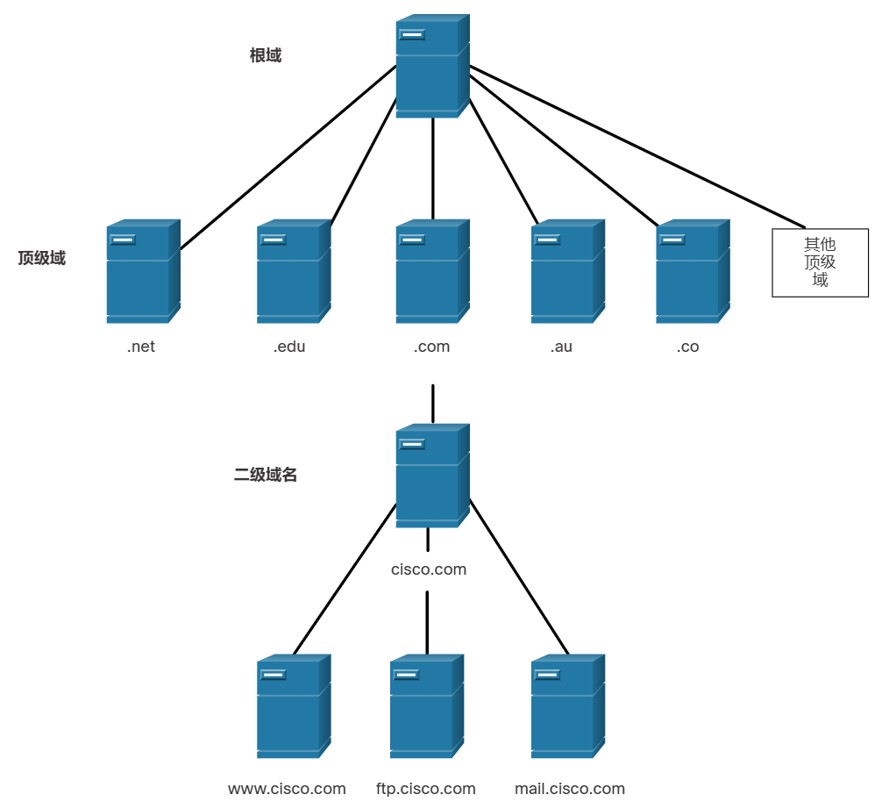

# 15 应用层

!!! tip "说明"

    本文档正在更新中……

!!! info "说明"

    本文档仅涉及部分内容，仅可用于复习重点知识

## 15.3 Web 和电子邮件协议

### 15.3.2 HTTP 和 HTTPS

HTTP 是一种请求/响应协议。当客户端，尤其是 Web 浏览器，发送请求到 Web 服务器时，HTTP 将指定用于该通信的消息类型。常用的三种消息类型包括 GET（见图）、POST 和 PUT

1. GET：客户端请求数据。客户端（Web 浏览器）向 Web 服务器发送 GET 消息以请求 HTML 页面
2. POST：上传数据文件到 Web 服务器，例如表单数据
3. PUT：用于向 Web 服务器上传资源或内容，例如图像

尽管 HTTP 灵活性相当高，但它不是一个安全协议。由于请求消息以明文形式向服务器发送信息，它非常容易被拦截和解读。服务器的响应（尤其是 HTML 页面）也不加密。

为了在互联网中进行安全通信，人们使用 HTTP 安全（HTTPS）协议。HTTPS 借助身份验证和加密来保护数据，使数据得以安全地在客户端与服务器之间传输。HTTPS 使用的客户端请求服务器响应过程与 HTTP 相同，但在数据流通过网络传输以前会使用安全套接字层 (SSL) 加密

### 15.3.3 电子邮件协议

电子邮件支持三种单独的协议以实现操作：简单邮件传输协议 (SMTP)、邮局协议 (POP) 和 Internet 邮件访问协议 (IMAP)。发送邮件的应用层进程会使用 SMTP。客户端会使用以下两种应用层协议之一来检索邮件：POP 或 IMAP

## 15.4 IP 编址服务

### 15.4.1 域名服务

还有其他应用层特定的协议，它们被设计可以更容易地获取网络设备的地址。这些服务是必不可少的，因为记住 IP 地址而不是 URL 或手动配置中大型网络中的所有设备将非常耗时

### 15.4.3 DNS 层级

DNS 使用域名来划分层次

域名结构被划分为多个更小的受管域。每台 DNS 服务器维护着特定的数据库文件，而且只负责管理 DNS 结构中那一小部分的“域名-IP”映射。当 DNS 服务器收到的域名转换请求不属于其所负责的 DNS 区域时，该 DNS 服务器可将请求转发到与该请求对应的区域中的 DNS 服务器进行转换。DNS 具有可扩展性，这是因为主机名解析分散于多台服务器上完成

不同的顶级域有不同的含义，分别代表着组织类型或起源国家/地区

1. .com：商业或行业
2. .org：非营利组织
3. .au：澳大利亚
4. .co：哥伦比亚

<figure markdown="span">
  { width="600" }
</figure>

### 15.4.4 nslookup 命令

使用操作系统中名为 Nslookup 的实用程序手动查询域名服务器，来解析给定的主机名。该实用程序也可以用于检修域名解析故障，以及验证域名服务器的当前状态

```powershell linenums="1"
C:\Users> nslookup
Default Server:  dns-sj.cisco.com
Address:  171.70.168.183
> www.cisco.com
Server:  dns-sj.cisco.com
Address:  171.70.168.183
Name:    origin-www.cisco.com
Addresses:  2001:420:1101:1::a
          173.37.145.84
Aliases:  www.cisco.com
> cisco.netacad.net
Server:  dns-sj.cisco.com
Address:  171.70.168.183
Name:    cisco.netacad.net
Address:  72.163.6.223
>
```

### 15.4.6 动态主机配置协议

IPv4 服务的动态主机配置协议 (DHCP) 会自动分配 IPv4 地址、子网掩码、网关以及其他 IPv4 网络参数。这称为动态编址。动态编址的替代选项是静态编址。在使用静态编址时，网络管理员在主机上手动输入 IP 地址信息

主机连入网络时，将联系 DHCP 服务器并请求地址。DHCP 服务器从已配置地址范围（也称为“地址池”）中选择一条地址，并将其分配（租赁）给主机

## 15.5 文件共享服务

### 15.5.1 文件传输协议

正如您在前面的主题中了解到的，在客户端/服务器模式中，如果两个设备都使用文件传输协议 (FTP)，客户端可以将数据上传到服务器，并从服务器下载数据。与 HTTP、电子邮件和编址协议一样，FTP 是常用的应用层协议

FTP 用于客户端和服务器之间的数据传输。FTP 客户端是一种在计算机上运行的应用，用于从 FTP 服务器中收发数据