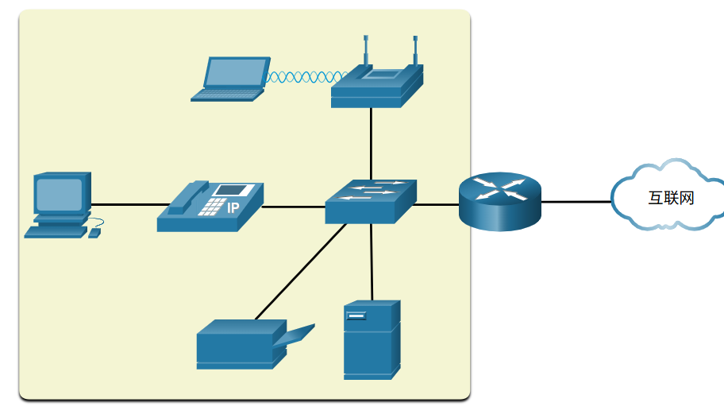
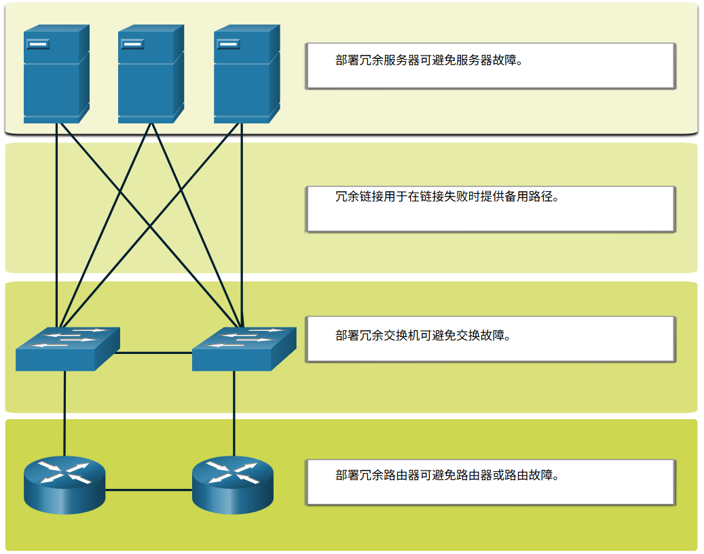
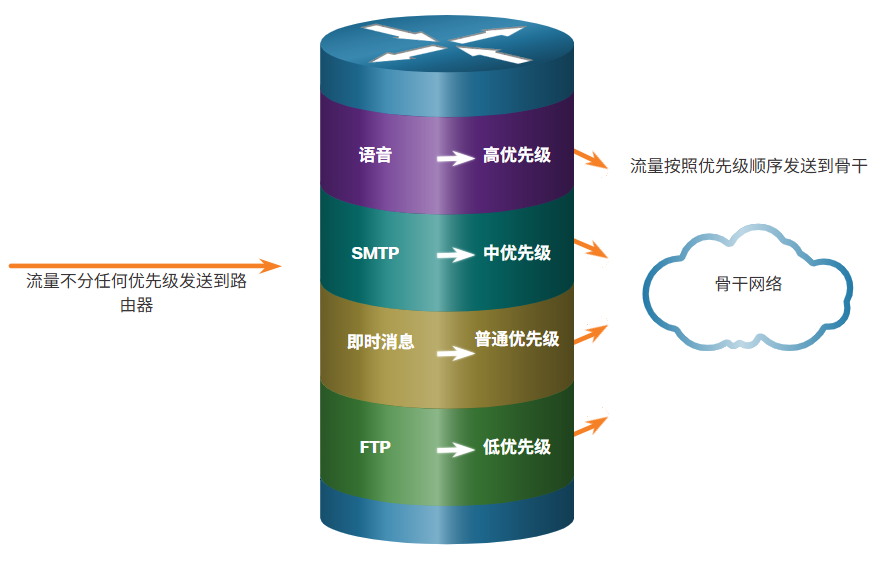

# 17 构建小型网络

<!-- !!! tip "说明"

    本文档正在更新中…… -->

!!! info "说明"

    本文档仅涉及部分内容，仅可用于复习重点知识

## 17.1 小型网络中的设备

### 17.1.1 小型网络拓扑

<figure markdown="span">
  { width="600" }
</figure>

这个小型网络需要一台路由器、一台交换机和一个无线接入点来连接有线和无线用户、IP 电话、打印机和服务器。通常小型网络有一个由 DSL、电缆或以太网连接提供的 WAN 连接

### 17.1.2 小型网络的设备选择

1. 成本
2. 端口/接口的速度和类型
3. 可扩展性
4. 操作系统的功能和服务

### 17.1.3 小型网络的 IP 编址

互联网络中的所有主机和设备都必须有一个唯一地址

### 17.1.4 小型网络中的冗余

为了保持高可靠度，网络设计中要求冗余。冗余有助于避免单点故障

在网络中实现冗余有许多方法。可以通过安装重复设备实现冗余，但也可以通过为关键区域提供重复的网络链路来实现

<figure markdown="span">
  { width="600" }
</figure>

### 17.1.5 流量管理

应当对小型网络中的路由器和交换机进行配置，以相对于其他数据流量的适当方式支持实时流量，如语音和视频。事实上，一个好的网络设计将实现服务质量（QoS），根据优先级对流量进行仔细分类

<figure markdown="span">
  { width="600" }
</figure>

## 17.2 小型网络应用程序和协议

### 17.2.1 常见应用程序

网络只有在网络上存在应用程序时才有用。有两种形式的软件程序或进程可以提供网络访问：网络应用程序和应用层服务

1. 网络应用程序：应用程序是指用于网络通信的软件程序。有些终端用户应用程序是网络感知程序，即这些程序实现应用层协议，并可直接与协议栈的较低层通信。电子邮件客户端和 Web 浏览器就属于这种类型的应用程序
2. 应用层服务：其他程序可能需要通过应用层服务使用网络资源，例如文件传输或网络假脱机打印。虽然这些服务对员工而言是透明的，但它们正是负责与网络交互和准备传输数据的程序。无论数据类型是文本、图形还是视频，只要类型不同，就需要与之对应的不同的网络服务，从而确保 OSI 模型的下层能够正确处理数据。每个应用程序或网络服务使用协议，定义要使用的标准和数据格式。如果没有协议，数据网络将不能使用通用的方式来格式化及引导数据

### 17.2.2 常见协议

网络管理员通常需要访问网络设备和服务器。两种最常见的远程访问解决方案是 Telnet 和安全外壳 (SSH)。SSH 服务是 Telnet 的安全替代方案。连接后，管理员可以像在本地登录一样访问 SSH 服务器设备

SSH 用于在 SSH 客户端和其他支持 SSH 的设备之间建立安全的远程访问连接：

1. 网络设备：网络设备（如路由器、交换机、接入点等）必须支持 SSH，才能为客户端提供远程访问 SSH 服务器的服务
2. 服务器：服务器（例如 Web 服务器、电子邮件服务器等）必须支持到客户端的远程访问 SSH 服务器的服务

    1. Web 设备安全
    2. 邮件服务器
    3. FTP 服务器
    4. DHCP 服务器
    5. DNS 服务器

### 17.2.3 语音和视频应用程序

1. 基础设施
2. VoIP
3. IP 电话
4. 实时应用

## 17.3 扩展为大型网络

### 17.3.1 小型网络的增长

要扩展网络，要求有以下几个要素：

1. 网络文档：物理和逻辑拓扑
2. 设备清单：使用或组成网络的设备列表
3. 预算：逐项列出 IT 预算，包括财年设备采购预算
4. 流量分析：应当记录协议、应用程序和服务以及它们各自的流量要求

## 17.6 故障排除方法

### 17.6.1 故障排除基本方法

网络问题可能非常简单，也可能很复杂，而且可能会因硬件、软件和连接问题综合导致。技术人员必须能够分析问题并确定错误的原因才能解决网络问题。此过程称为故障排除

1. 确定问题
2. 推测潜在原因
3. 验证推测以确定原因
4. 制定解决方案并实施方案
5. 检验解决方案并实施预防措施
6. 记录调查结果、采取措施和结果

### 17.6.2 解决还是上报？

在某些情况下，立即解决该问题是不可能的。如果问题需要经理决策，要求一些特定专业知识，或者实施故障排除的技术人员不具备所需网络访问级别，则应上报此问题

例如，在完成故障排查后，技术人员推断应该更换路由器模块。此问题应上报经理批准。经理可能需要再次上报此问题，因为需要财务部门批准后才能购买新的模块

## 17.7 故障排除场景

### 17.7.1 双工操作和不匹配问题

在数据通信中，双工是指两台设备之间数据传输的方向

1. 半双工：通信限制为每次在一个方向进行数据交换
2. 全双工：允许同时发送和接收通信

为了达到最佳通信性能，两个互相连接的以太网接口必须在同一双工模式下运行，以避免低效和链路延迟