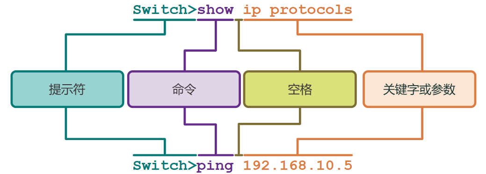

# 2 交换机和终端设备的基本配置

<!-- !!! tip "说明"

    本文档正在更新中…… -->

!!! info "说明"

    本文档仅涉及部分内容，仅可用于复习重点知识

## 2.1 思科 IOS 访问

### 2.1.1 操作系统

所有终端设备和网络设备都需要有操作系统 (OS)。如图所示，操作系统中直接与计算机硬件交互的部分称为内核。与应用程序和用户连接的部分则称为外壳。用户可以使用命令行界面 (CLI) 或图形用户界面 (GUI) 与外壳交互

## 2.2 IOS 导航

### 2.2.1 主要命令模式

作为一项安全功能，思科 IOS 软件将管理访问分为以下两种命令模式：

1. 用户 EXEC 模式：该模式功能有限，但可用于有效执行基本操作。它只允许有限数量的基本监控命令，不允许执行任何可能改变设备配置的命令。用户 EXEC 模式由采用 `>` 符号结尾的 CLI 提示符标识
2. 特权 EXEC 模式：要执行配置命令，网络管理员必须访问特权 EXEC 模式。较高级别的配置模式，比如全局配置模式，只能通过特权 EXEC 模式访问。特权 EXEC 模式由采用 `#` 符号结尾的提示符标识

### 2.2.2 配置模式和子配置模式

要配置设备，用户必须进入全局配置模式

在全局配置模式下， CLI 配置所做的更改将影响整个设备的运行。全局配置模式由在设备名称之后加 `(config)#` 结尾的提示符标识，比如 `Switch(config)#`

访问全局配置模式之后才能访问其他具体的配置模式。在全局配置模式下，用户可以进入不同的子配置模式。其中的每种模式可以用于配置 IOS 设备的特定部分或特定功能。两个常见的子配置模式包括：

1. 线路配置模式：用于配置控制台、SSH、Telnet 或 AUX 访问
2. 接口配置模式：用于配置交换机端口或路由器网络接口

当使用 CLI 时，每种模式由该模式独有的命令提示符来标识。默认情况下，每个提示符都以设备名称开头。命令提示符中设备名称后的部分用于表明模式。例如，线路配置模式的默认提示符是 `Switch(config-line)#`，默认的接口配置模式提示符是 `Switch(config-if)#`

### 2.2.4 在 IOS 模式之间导航

多种命令用于进出命令提示符。要从用户模式切换到特权模式，请使用 `enable` 命令。使用特权模式命令 `disable` 返回用户模式

要进出全局配置模式，请使用特权模式命令 `configure terminal`。要返回特权模式，请输入全局配置模式命令 `exit`

有许多不同的子配置模式。例如，要进入线路子配置模式，您可以使用 `line` 命令后跟您要访问的管理线路类型和编号来实现。使用 `exit` 命令来退出子配置模式并返回全局配置模式

```txt linenums="1"
Switch(config)# line console 0
Switch(config-line)# exit
Switch(config)#
```

要从任何子配置模式切换到特权模式，请输入 `end` 命令或输入组合键 ++ctrl+z++

```txt linenums="1"
Switch(config-line)# end
Switch#
```

您还可以直接从一个子配置模式切换到另一个子配置模式。注意在选择接口后，命令提示符如何从 `(config-line)#` 到 `(config-if)#`

```txt linenums="1"
Switch(config-line)# interface FastEthernet 0/1
Switch(config-if)#
```

## 2.3 命令结构

### 2.3.1 基本 IOS 命令结构

<figure markdown="span">
  { width="600" }
</figure>

## 2.4 基本设备配置

### 2.4.1 设备名称

在特权模式下，输入 `configure terminal` 命令访问全局配置模式。注意命令提示符的变化。从全局配置模式下，输入 `hostname` 命令后跟交换机的名称，然后按 ++enter++ 键。注意命令提示符的变化

```txt linenums="1"
Switch# configure terminal
Switch(config)# hostname Sw-Floor-1
Sw-Floor-1(config)#
```

### 2.4.3 配置密码

要保护特权 EXEC 访问，请使用 `enable secret {password}` 全局配置命令

```txt linenums="1"
Sw-Floor-1# configure terminal
Sw-Floor-1(config)# enable secret cisco
Sw-Floor-1(config)# exit
Sw-Floor-1#
```

```txt linenums="1"
Sw-Floor-1 # configure terminal
Sw-Floor-1(config)# line console 0
Sw-Floor-1(config-line)# password cisco
Sw-Floor-1(config-line)# login
Sw-Floor-1(config-line)# end
Sw-Floor-1#
```

```txt linenums="1"
Sw-Floor-1 # configure terminal
Sw-Floor-1(config)# line vty 0 15
Sw-Floor-1(config-line)# password cisco 
Sw-Floor-1(config-line)# login 
Sw-Floor-1(config-line)# end
Sw-Floor-1#
```

### 2.4.4 加密密码

要加密所有明文密码，请使用全局配置命令 `service password-encryption`

```txt linenums="1"
Sw-Floor-1 # configure terminal
Sw-Floor-1(config)# service password-encryption
Sw-Floor-1(config)#
```

### 2.4.5 横幅消息

尽管要求用户输入密码是防止未经授权的人员进入网络的有效方法，但同时必须向试图访问设备的人员声明仅授权人员才可访问设备。出于此目的，可向设备输出中加入一条标语。当控告某人侵入设备时，标语可在诉讼程序中起到重要作用。某些法律体系规定，若不事先通知用户，则既不允许起诉该用户，甚至连对该用户进行监控都不允许

要在网络设备上创建当日消息标语，请使用 `banner motd #当日消息#` 全局配置命令。命令语法中的“#”称为定界符。它会在消息前后输入。定界符可以是未出现在消息中的任意字符。因此，经常使用“#”之类的字符。命令执行完毕后，系统将向之后访问设备的所有用户显示该标语，直到该标语被删除为止

```txt linenums="1"
Sw-Floor-1 # configure terminal
Sw-Floor-1(config)# banner motd #Authorized Access Only#
```

## 2.5 保存配置

### 2.5.1 配置文件

有两种系统文件用于存储设备配置：

1. `startup-config` (启动配置文件)：存储在 NVRAM 中的配置文件。它包含在启动时或重启时用到的所有命令。当设备断电后，其中的内容不会消失
2. `running-config` (运行配置文件)：存储在随机存取存储器（RAM）中。它反映了当前的配置。修改运行配置会立即影响思科设备的运行。RAM 是易失性存储器。如果设备断电或重新启动，则它会丢失所有内容

如果设备断电或重新启动，所有未保存的配置更改都会丢失。要将对运行配置所作的更改保存到启动配置文件中，请使用特权 EXEC 模式命令 `copy running-config startup-config`

### 2.5.2 修改运行配置

如果对运行配置所作的更改未能实现预期的效果，而且运行配置文件尚未保存，您可以将设备恢复到以前的配置。单独删除更改的命令，或使用特权 EXEC 模式命令 `reload` 重新加载设备都能恢复启动配置

当开始重新加载时，IOS 会检测到发生更改的运行配置没有保存到启动配置中。因此，它将显示一则提示消息，询问是否保存更改。要放弃更改，请输入 `n` 或 `no`

## 2.7 配置 IP 地址

### 2.7.4 交换机虚拟接口配置

要远程访问交换机，SVI（交换机虚拟接口）上必须配置 IP 地址和子网掩码。要在交换机上配置 SVI，请使用全局配置命令 `interface vlan 1`。Vlan 1 并不是一个实际物理接口，而是一个虚拟接口。然后使用接口配置命令 `ip address {ip-address} {subnet-mask}` 配置 IPv4 地址。最后，使用接口配置命令 `no shutdown` 启用虚拟接口

```txt linenums="1"
Sw-Floor-1# configure terminal
Sw-Floor-1(config)# interface vlan 1
Sw-Floor-1(config-if)# ip address 192.168.1.20 255.255.255.0
Sw-Floor-1(config-if)# no shutdown
Sw-Floor-1(config-if)# exit
Sw-Floor-1(config)# ip default-gateway 192.168.1.1
```

## 2.8 验证连接

### 2.8.1 测试接口配置

使用命令和工具（比如 `ipconfig`）来检验 PC 主机的网络配置

使用命令 `show ip interface brief` 来检验交换机和路由器等中间设备的接口和地址设置

### 2.8.2 测试端到端连接

`ping` 命令可用于测试与网络上的另一设备或互联网上的一个网站的连接