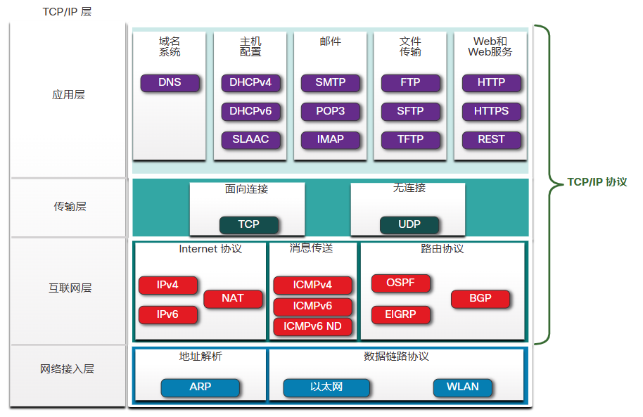
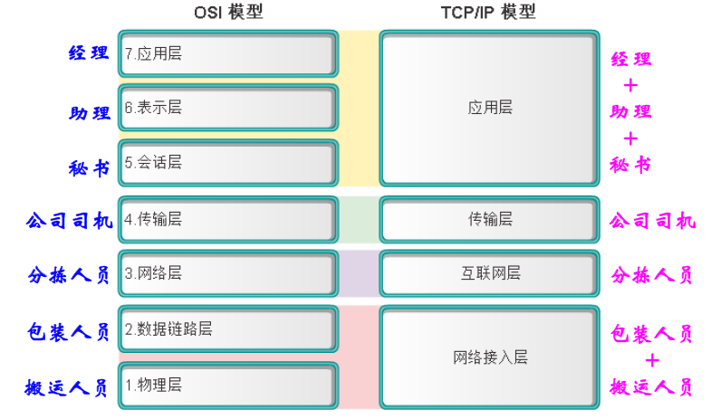
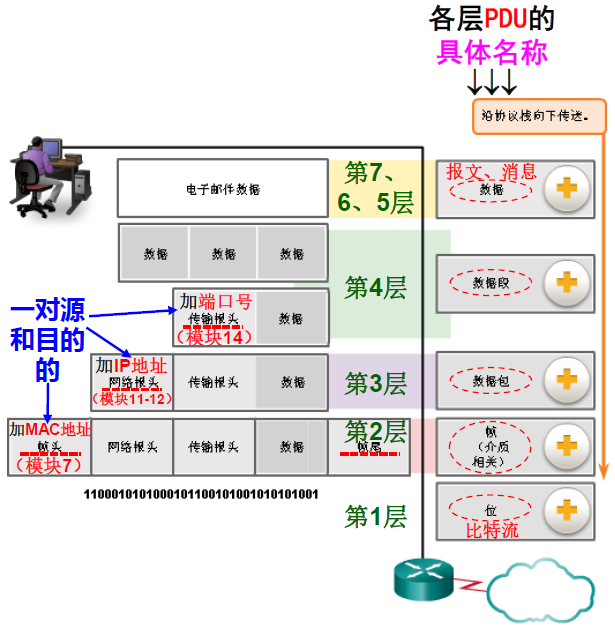
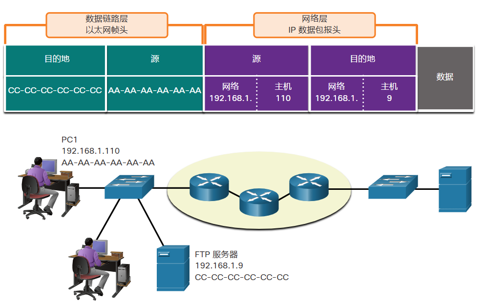
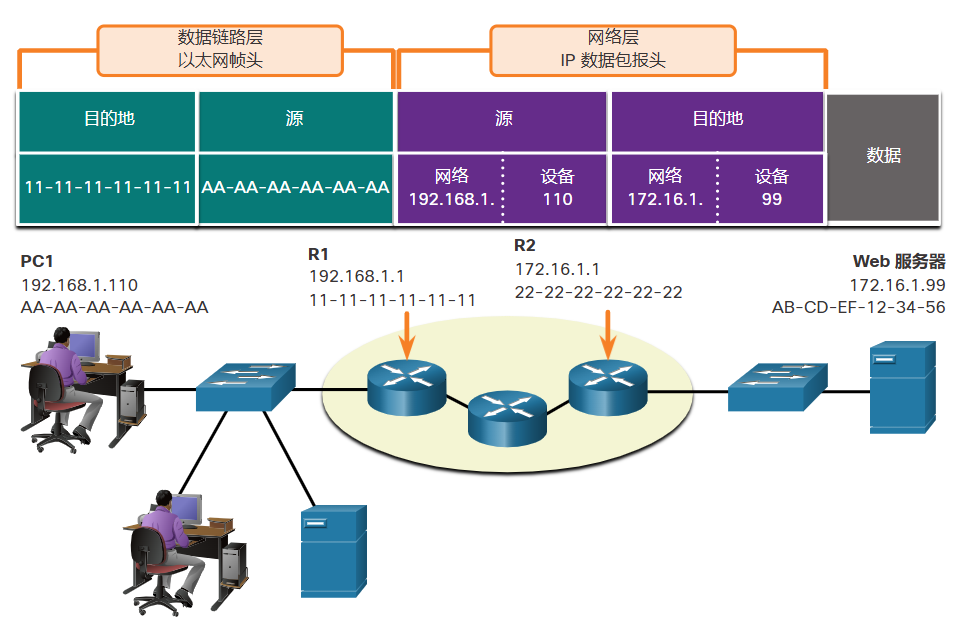

# 3 协议和模型

<!-- !!! tip "说明"

    本文档正在更新中…… -->

!!! info "说明"

    本文档仅涉及部分内容，仅可用于复习重点知识

## 3.1 规则

### 3.1.2 通信基础知识

所有通信方法都有以下三个共同要素

1. 消息源（发送方）：需要向其他人或设备发送消息的人或电子设备
2. 消息目的地（接收方）：接收并解释消息
3. 信道：由为消息从源传送到目的地提供路径的介质组成

### 3.1.3 通信协议

不同类型的通信方式，会有不同的特定协议

### 3.1.4 规则建立

协议必须考虑到以下要求，才能成功地传递被接收者理解的消息:

1. 标识出发送方和接收方
2. 通用语言和语法
3. 传递的速度和时间
4. 证实或确认要求

### 3.1.5 网络协议要求

常用的计算机协议包含以下要求：

1. 消息编码：编码是将信息转换为另一种广为接受的形式的过程，目的是为了便于传输信息。解码是编码的逆向过程，用来解释信息
2. 消息格式和封装：当消息从源发送到目的地时，必须使用特定的格式或结构。消息格式取决于消息的类型和传递信道
3. 消息大小
4. 消息时序

    1. 流量控制：这是管理数据传输速率的过程。流量控制定义了可以发送多少信息以及传递信息的速率
    2. 响应超时：网络上的主机会使用网络协议来指定等待响应的时长，以及在响应超时的情况下执行什么操作
    3. 访问方法：当设备想要在无线局域网上传输时，有必要使用 WLAN 网络接口卡 (NIC) 来确定无线介质是否可用

5. 消息传输选项

    1. 单播：信息传输到单个终端设备
    2. 组播：信息传输到一个或多个终端设备
    3. 广播：信息传输到所有终端设备

## 3.2 协议

### 3.2.1 网络协议概述

要使终端设备能够通过网络进行通信，每个设备都必须遵守相同的一套规则。这些规则被称为 **协议**

网络协议定义了用于设备之间交换消息的通用格式和规则集

1. 网络通信协议：使两个或多个设备能够在一个或多个网络上通信

    1. IP
    2. 传输控制协议（TCP）
    3. 超文本传输协议（HTTP）

2. 网络安全协议：保护数据以提供身份验证、数据完整性和数据加密

    1. 安全外壳协议 (SSH)
    2. 安全套接字层协议 (SSL)
    3. 传输层安全协议 (TLS)

3. 路由协议：使路由器能够交换路由信息，比较路径信息，然后选择到达目标网络的 最佳路径

    1. 开放最短路径优先协议 (OSPF)
    2. 边界网关协议 (BGP)

4. 服务发现协议：用于设备或服务的自动检测

    1. 动态主机配置协议（DHCP）：发现用于 IP 地址分配服务
    2. 域名系统（DNS）：用于执行域名到 IP 地址转换

### 3.2.2 网络协议的功能

1. 编址：使用已定义的编址方案来标识消息的发送者和预期的接收者

    1. 以太网
    2. IPv4
    3. IPv6

2. 可靠性：提供了有保证的传输机制，以防消息在传输过程中丢失或损坏

    - TCP 提供可靠的传输

3. 流量控制：确保数据在两个通信设备之间高效传输

    - TCP 提供流量控制服务

4. 排序：唯一地标记每个传输的数据段。接收设备使用排序信息正确地重组信息。如果数据段丢失，延迟或未按顺序接收，这将很有用

    - TCP 提供排序服务

5. 差错检测：用于确定传输过程中数据是否已损坏

    1. 以太网
    2. IPv4
    3. IPv6
    4. TCP

6. 应用接口：包含用于网络应用程序之间的进程间通信的信息

    - 访问网页时， 使用 HTTP 或 HTTPS 协议在客户端和服务器 Web 进程之间进行通信

### 3.2.3 协议交互

1. 超文本传输协议（HTTP）：控制 Web 服务器和 Web 客户端进行交互的方式。HTTP 定义了客户端和服务器之间交换的请求和相应的内容与格式。客户端软件和 Web 服务器软件都将 HTTP 作为应用程序的一部分来实现。HTTP 依靠其他协议来控制客户端和服务器之间传输消息的方式
2. 传输控制协议（TCP）：管理各个会话。TCP 负责保证信息的可靠传递和管理终端设备之间的流量控制
3. 互联网协议（IP）：将消息从发送方传输给接收方。路由器使用 IP 来跨多个网络转发消息
4. 以太网：将消息从一个 NIC 传输到同一个以太网局域网上的另一个 NIC

## 3.3 协议簇

### 3.3.1 网络协议簇

执行某种通信功能所需的一组内在相关协议称为 **协议簇**

协议显示为分层结构，每种上层服务都依赖于其余下层协议所定义的功能。协议栈的下层负责通过网络传输数据和向上层提供服务，而上层则负责处理发送的消息内容

### 3.3.2 协议簇的演变

1. 互联网协议簇或 TCP/IP
2. 开放系统互连（OSI）协议
3. Apple Talk
4. Novell NetWare

### 3.3.3 TCP/IP 协议示例

TCP/IP 协议可用于应用层、传输层和互联网层。网络接入层中没有 TCP/IP 协议。最常见的网络接入层 LAN 协议是以太网和 WLAN（无线 LAN）协议。网络接入层协议负责通过物理介质传输 IP 数据包

### 3.3.4 TCP/IP 协议簇

<figure markdown="span">
  { width="600" }
</figure>

1. 开放标准协议簇：对公众是免费的
2. 基于标准的协议簇：已经受到网络行业认可并已获得标准组织的批准

## 3.4 标准组织

### 3.4.1 开放标准

标准组织通常是中立于厂商的非营利性组织

### 3.4.2 互联网标准

1. 互联网工程任务组（IETF）：负责开发、更新和维护 Internet 和 TCP/IP 技术。包括用于开发新协议和更新现有协议的流程和文档，称为征求意见（RFC）文档
2. 互联网名称与数字地址分配机构（ICANN）：总部设在美国，负责全球 IP 地址分配、
全球域名管理、TCP/IP 协议中使用的其他信息如端口号的分配

### 3.4.3 电子和通信标准

1. 电气电子工程师协会 IEEE（读作“I-triple-E”）：是为致力于推动诸多行业领域的技术创新和标准创建的工程师设立的组织，涉及的领域包括电力与能源、医疗保健、电信和网络。（IEEE 802.3 以太网，IEEE 802.11 WLAN）
2. 美国电子工业协会（EIA）：因其在用于安装网络设备的电线、连接器和 19 英寸机架方面的标准而知名
3. 电信工业协会（TIA）：负责开发各种领域的通信标准，包括无线电设备、手机信号塔、IP 语音（VoIP） 设备和卫星通信等

## 3.5 参考模型

### 3.5.1 使用分层模型的优点

<figure markdown="span">
  { width="600" }
</figure>

### 3.5.2 OSI 参考模型

从下到上：

1. 物理层
2. 数据链路层
      - 物理 MAC 地址
3. 网络层
      - 逻辑 IP 地址及选择路由
4. 传输层
      - 发送方：消息分段。通过分段，可以在网络上交替发送许多不同的会话，称为多路复用
      - 接收方：消息重组
      - TCP、UDP
5. 会话层
6. 表示层
7. 应用层：定义应用软件与网络通信功能之间的接口并提供相关服务
      - HTTP、FTP

### 3.5.2 TCP/IP 协议模型

从下到上：

1. 网络接入层
      - 以太网、WiFi
2. 互联网层
      - IP
3. 传输层
      - TCP、UDP
4. 应用层
      - HTTP、FTP

> 在提及 TCP/IP 模型的各层时只使用其名称，而提及 OSI 模型的七层时则通常使用其编号

## 3.6 数据封装

### 3.6.1 对消息分段

将数据划分为更小、更易于管理的片段，然后再通过网络发送

**分段**：将数据流划分成更小的单元，以便在通过网络传输的过程

分段是必要的，因为数据网络使用 TCP/IP 协议簇以单独的 IP 数据包发送数据。每个数据包都是单独发出的，类似于把一封长信作为一系列独立的明信片寄出。包含同一目的地数据段的数据包可以通过不同的路径发送

好处：

1. 提高速度：由于将大数据流分段成为数据包，因此可以在不独占通信链路的情况下，通过网络发送大量数据。这允许许多不同的会话在称为 **多路复用** 的网络上交错
2. 提高效率：如果单个数据段由于网络故障或网络拥塞而无法到达其目的地，则只需要重新传输该段，而不需要重新发送整个数据流

### 3.6.2 排序

每一个片段都包含一个序列号，以确保接收者可以按适当的顺序重新组装页面

### 3.6.3 协议数据单元

**封装**：在通过网络介质传输应用程序数据的过程中，随着数据沿协议栈向下传递，每层都要添加各种协议信息。这个过程称为封装

**协议数据单元** (PDU)：一段数据在任意协议层的表示形式

<figure markdown="span">
  { width="600" }
</figure>

1. 数据：一般术语，泛指应用层使用的 PDU
2. 段：传输层 PDU
3. 数据包：网络层 PDU
4. 帧：数据链路层 PDU
5. 位：通过介质实际传输数据时使用的物理层 PDU

### 3.6.4 封装示例

封装过程自上而下工作。在各层，上层信息被视为封装协议内的数据。例如，TCP 分段被视为 IP 数据包内的数据

### 3.6.5 解封示例

**解封**：接收设备用来删除一个或多个协议报头的过程

解封过程自下而上工作

## 3.7 数据访问

### 3.7.1 地址

网络层和数据链路层负责将数据从源设备传输到目的设备

1. 网络层源地址和目的地址：负责将 IP 数据包从原始源设备传输到可能处于同一网络或远程网络中的最终目的设备
2. 数据链路层源地址和目的地址：负责将数据链路帧从一个网络接口卡 (NIC) 传输到同一网络上的另一个 NIC

### 3.7.2 第 3 层逻辑地址

**IP 地址**：网络层（或第 3 层）逻辑地址，用于将 IP 数据包从原始源设备传输到最终目的设备

IP 数据包包含两个 IP 地址：

1. 源 IP 地址：发送设备（数据包的始源设备）的 IP 地址
2. 目的 IP 地址：接收设备（数据包的最终目的设备）的 IP 地址

IP 地址包含两部分：

1. 网络部分（IPv4）或前缀（IPv6）：地址最左边的部分，表示 IP 地址是哪个网络的成员。同一网络中所有设备的地址都有相同的网络部分
2. 主机部分（IPv4）或接口 ID（IPv6）：地址的其余部分，用于识别网络上的特定设备。这部分对于网络中的每个设备或接口都是唯一的

> 子网掩码（IPv4）或前缀长度（IPv6）用于将 IP 地址的网络部分与主机部分区分开来

### 3.7.3 同一网络中的设备

客户端计算机 PC1 与同一 IP 网络中的 FTP 服务器进行通信

1. 源 IPv4 地址：发送设备的 IPv4 地址，即客户端计算机 PC1：192.168.1.110
2. 目的 IPv4 地址：接收设备的 IPv4 地址，即服务器，Web 服务器：172.16.1.99

下图中源 IPv4 地址的网络部分和目的 IPv4 地址的网络部分是相同的，因此，源和目的地在同一个网络上

<figure markdown="span">
  { width="600" }
</figure>

### 3.7.4 数据链路层地址的作用：相同的 IP 网络

当 IP 数据包的发送方和接收方处于同一网络中时，数据链路帧将直接发送到接收设备。在以太网中，数据链路地址称为以太网介质访问控制（MAC）地址

MAC 地址是以太网网卡的物理内嵌地址

1. 源 MAC 地址：这是发送封装有 IP 数据包的数据链路帧的设备的数据链路地址，或以太网 MAC 地址。PC1 以太网网卡的 MAC 地址为 AA-AA-AA-AA-AA-AA，以十六进制表示法表示
2. 目的 MAC 地址：当接收设备与发送设备在同一网络中时，这就是接收设备的数据链路层地址。在本例中，目的 MAC 地址就是 FTP 服务器的 MAC 地址：CC-CC-CC-CC-CC-CC-CC，用十六进制记法表示

### 3.7.6 网络层地址的作用

当数据包的发送方与接收方位于不同网络时，源 IP 地址和目的 IP 地址将代表位于不同网络的主机。这将由目的主机 IP 地址的网络部分来表明

<figure markdown="span">
  { width="600" }
</figure>

### 3.7.7 数据链路层地址的作用：不同的 IP 网络

当 IP 数据包的发送方和接收方位于不同网络时，以太网数据链路帧不能直接发送到目的主机，因为在发送方的网络中无法直接到达该主机。必须将以太网帧发送到称为路由器或默认网关的另一设备。在图中，默认网关是 R1。R1 有一个以太网数据链路地址与 PC1 位于同一网络中。这使 PC1 能够直接到达路由器

1. 源 MAC 地址：发送设备 PC1 的以太网 MAC 地址。PC1 以太网接口的 MAC 地址是 AA-AA-AA-AA-AA-AA
2. 目的 MAC 地址：当接收设备（目的 IP 地址）与发送设备位于不同网络时，发送设备使用默认网关或路由器的以太网 MAC 地址。在图中，目的 MAC 地址是 R1 的以太网接口的 MAC 地址：11-11-11-11-11-11。这是连接到与 PC1 相同的网络的接口

现在可以将封装有 IP 数据包的以太网帧传送到 R1。R1 将数据包转发到目的地（Web 服务器）。这可能意味着 R1 会将数据包转发到另一个路由器，或者如果目的地所在的网络与 R1 相连的话直接转发到 Web 服务器

必须在本地网络的每台主机上配置默认网关的 IP 地址。所有指向远程网络中目的地的数据包都会发送到默认网关

### 3.7.8 数据链路层地址

数据链路层（第 2 层）物理地址具有不同的作用。数据链路层地址的作用是将数据链路层帧从一个网络接口传输到同一网络中的另一个网络接口

在 IP 数据包可以通过有线或无线网络发送之前，必须将其封装成数据链路层帧，以便通过物理介质传输

**一跳**（Hop）：数据从一个网络节点传输到另一个直接相邻的节点的过程