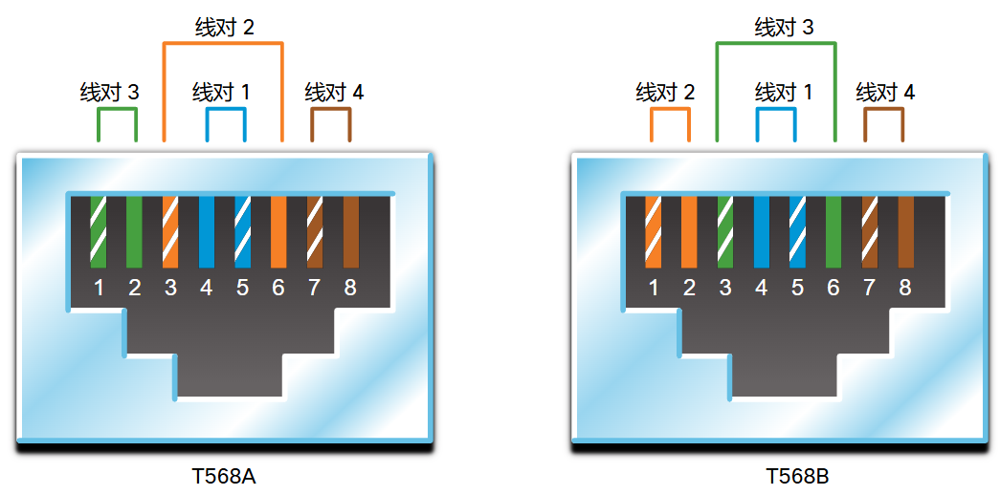

# 4 物理层

<!-- !!! tip "说明"

    本文档正在更新中…… -->

!!! info "说明"

    本文档仅涉及部分内容，仅可用于复习重点知识

## 4.1 物理层的用途

### 4.1.1 物理连接

网络接口卡 (NIC) 将设备连接到网络。以太网网卡用于有线连接，而无线局域网（WLAN）网卡用于无线连接

### 4.1.2 物理层

目的节点物理层从介质上检索每个信号，将其还原为位表示方式，然后将这些位作为一个完整的帧向上传递到数据链路层

## 4.2 物理层的特征

### 4.2.4 信令

物理层必须在介质上生成代表“1”和“0”的电信号、光信号或无线信号。表示位的方法称为信令方法。物理层标准必须定义哪种类型的信号代表“1”，而哪种类型的信号代表“0”。这可以简单到只是改变电信号或光脉冲的级别。例如，长脉冲可能代表 1，而短脉冲可能代表 0

### 4.2.5 带宽

**带宽** 是介质承载数据的能力

多种因素的结合，决定了网络的实际带宽：

- 物理介质的属性
- 信令和检测网络信号所选用的技术

### 4.2.6 带宽术语

用来衡量带宽质量的术语包括：

1. 延迟：数据从一个给定点传送到另一给定点所用的时间，包括时延
2. 吞吐量：给定时段内通过介质传输的位的量度。吞吐量通常低于带宽。影响吞吐量的因素有很多：

    1. 流量大小
    2. 流量类型
    3. 从源通往目的地的过程中遇到的网络设备数量所造成的延时

3. 实际吞吐量：在给定时间段内传输的有用数据的衡量标准。实际吞吐量就是吞吐量减去建立会话、确认、封装和重传所产生的流量开销

## 4.3 铜缆布线

### 4.3.1 铜缆布线的特征

网络使用铜介质是因为其价格低廉、易于安装、对电流的电阻低。但是，铜介质受到距离和信号干扰的限制

信号衰减：信号传输的距离越远，信号下降就越多。这称为信号衰减

电脉冲的时间和电压值易受两个干扰源的干扰：

1. 电磁干扰 (EMI) 或射频干扰 (RFI)：EMI 和 RFI 干扰信号会扭曲和损坏通过铜介质承载的数据信号。EMI 和 RFI 的潜在来源包括无线电波和电磁设备（如荧光灯或电动机）
2. 串扰：串扰是一根电线中信号的电场或磁场对邻近电线中的信号造成的干扰。在电话线上，串扰会由相邻电路中另一语音会话的接听部分引起。具体而言，当电流流经电线时，会在电线周围产生一个较小的环形磁场，而相邻电线可能接收到该磁场

为了应对 EMI 和 RFI 的负面影响，某些类型的铜缆会用金属屏蔽套包裹，并要求适当的接地连接

为了应对串扰的负面影响，某些类型的铜缆将相反电路线对绞合在一起以有效消除串扰

### 4.3.3 非屏蔽双绞线（UTP）

在 LAN 中，UTP 电缆由四对用颜色标记的电线组成。这些电线绞合在一起，并用软塑料套包裹，以避免较小的物理损坏。==电线的扭绞有助于防止电线之间的串扰==

1. 外层护套可防止通栏受到物理损坏
2. 线对扭绞可防止信号串扰
3. 颜色编码得塑料绝缘层使电线之间相互隔离并标识每个线对

### 4.3.4 屏蔽双绞线（STP）

屏蔽双绞线 (STP) 比 UTP 布线提供更好的噪声防护。但是，与 UTP 电缆相比，STP 电缆更加昂贵而且不易安装

STP 电缆结合屏蔽技术来应对 EMI 和 RFI，使用线缆扭绞技术来应对串扰。为了充分利用屏蔽的优势，STP 电缆使用特殊屏蔽 STP 数据连接器进行端接。如果电缆接地不正确，屏蔽就相当于一个天线，会接听多余信号

1. 外层护套
2. 金属编织或箔屏蔽
3. 金属箔屏蔽
4. 双绞线

### 4.3.5 同轴电缆

同轴电缆，或简称同轴，由于它的两根导线共享同一个中轴而得名。同轴电缆包括：

1. 一根用于传输电子信号的铜导线
2. 包裹着铜导线的柔软的塑料绝缘层
3. 绝缘材料的表皮是编织铜线或金属箔，作用相当于电路中的第二条电线，而且还可作为内部导体的屏蔽层。这个第二层，或称屏蔽层，还可减少许多外部电磁干扰
4. 整个电缆由一层电缆表皮覆盖，使其免于较小的物理损坏

虽然 UTP 电缆在现代以太网安装中最终取代了同轴电缆，但在以下情形中仍采用同轴电缆设计：

1. 无线安装：用同轴电缆将天线连接到无线设备。同轴电缆可传送天线和无线电设备之间的射频 (RF) 能量
2. 有线电视互联网安装：有线电视服务提供商为其客户提供互联网连接，他们会使用光缆替换同轴电缆和支撑放大元件部分。但是，客户所在地的布线仍采用同轴电缆

## 4.4 UTP 布线

### 4.4.1 UTP 布线的属性

在用作网络介质时，UTP 电缆由四对用颜色标记的铜线组成。这些铜线扭绞在一起，并用软塑料套包裹

UTP 电缆并不使用屏蔽层来对抗 EMI（电磁干扰）和 RFI 的影响。相反，电缆设计者发现他们可以通过以下方式来减少串扰的负面影响：

1. **抵消**：电缆设计者现在对电路中的电线进行配对。当电路中的两根电线紧密排列时，彼此的磁场正好相反。因此，这两个磁场相互抵消，也抵消了所有的外部 EMI 和 RFI 干扰信号
2. **变化每个线对中的扭绞次数**：为了进一步增强配对电线的抵消效果，设计者会变化电缆中每个线对的扭绞次数。UTP 电缆必须遵守精确的规定来管理每米（3.28 英尺）电缆所允许的扭绞次数或编织数。请注意，图中橙色/橙白色线对比蓝色/蓝白色线对的扭绞次数要少。每个彩色线对扭绞的次数不同

UTP 电缆仅通过线对扭绞的抵消效果来减小信号衰减，并为网络介质中的线对提供有效的自屏蔽

### 4.4.2 UTP 布线标准和连接器

UTP 布线遵循由 TIA/EIA 共同制定的标准。定义的一些要素如下：

1. 电缆类型
2. 电缆长度
3. 连接器
4. 电缆端接
5. 测试电缆的方法

不同类别的电缆：

1. 3 类电缆最初用于语音线路的语音通信，但后来用于数据传输
2. 5 类和 5e 类电缆用于数据传输。5 类电缆支持 100Mbps，5e 类电缆支持 1000 Mbps
3. 6 类电缆在每对线之间增加了一个分隔器以支持更高的速度。 6类电缆支持高达 10 Gbps
4. 7 类电缆也支持 10 Gbps
5. 8 类电缆支持 40 Gbps

### 4.4.3 直通和交叉 UTP 电缆

1. **以太网直通电缆**：最常见的网络电缆类型。它通常用于主机到交换机和交换机到路由器的互连
2. **以太网交叉电缆**：用于互连相似设备的电缆。例如，交换机到交换机、主机到主机或路由器到路由器的连接

> 但是，由于网卡使用介质相关接口交叉（auto-MDIX）来自动检测电缆类型并进行内部连接，因此现在已将交叉电缆视为传统电缆

<figure markdown="span">
  { width="600" }
</figure>

> PC 使用 1、2 发射，3、6 接收；交换机使用 1、2 接收，3、6 发射

| 电缆类型 | 标准 | 应用 |
|---------|---------|---------|
| 以太网直通线 | 两端均为 T568A 或两端均为 T568B | 将网络主机连接到交换机或集线器之类的网络设备 |
| 以太网交叉线 | 一端为 T568A，另一端为 T568B | 连接两个网络主机或连接两台网络中间设备（交换机到交换机或路由器到路由器）|
| 全反电缆 | 思科专有 | 使用适配器连接工作站串行端口与路由器控制台端口 |

## 4.5 光纤布线

### 4.5.1 光纤布线的属性

与其他网络介质相比，光缆能够以更远的距离和更高的带宽传输数据。不同于铜缆，光缆传输信号的衰减更少，并且完全不受 EMI 和 RFI 影响。光纤常用于互连网络设备

通过光缆传输时，位会被编码成光脉冲。光缆用作波导管或“光导管”，以最少的信号丢失来传输两端之间的光

### 4.5.2 光纤介质的类型

光缆通常分为两种类型：

1. 单模光纤 (SMF)：包含一个极小的芯，使用昂贵的激光技术来发送单束光。单模光纤在跨越数百公里的长距离传输情况下很受欢迎，例如应用于长途电话和有线电视中的光纤
2. 多模光纤 (MMF)：包含一个稍大的芯，使用 LED 发射器发送光脉冲。具体而言，LED 发出的光从不同角度进入多模光纤。普遍用于 LAN 中，因为它们可以由低成本的 LED 提供支持。它可以通过长达 550 米的链路提供高达 10 Gb/s 的带宽

多模和单模光纤之间的主要区别之一就是色散的数量。色散是指光脉冲在时间上的分布。色散增加意味着信号强度损失增加。多模光纤具有比单模光纤更大的色散。这就是为什么多模光纤在信号丢失之前只能传播 500 米

### 4.5.3 光纤布线的使用

目前光纤布线用于四类行业：

1. 企业网络：用于主干布线和基础设施设备互连
2. 光纤到户 (FTTH)：用于为家庭和小型企业提供不间断宽带服务
3. 长距离传输网络：由服务提供商用于连接国家/地区与城市
4. 水下有线网络：用于提供可靠高速、高容量的网络解决方案，使其在深度与横跨海洋的距离相当的严酷海下环境中仍能生存。在互联网上搜索“海底电缆电信地理地图”，以在线查看各种地图

### 4.5.4 光纤连接器

光纤连接器在光纤末端连接。有多种类型的光纤连接器。各种连接器类型的主要区别在于尺寸和耦合方式

### 4.5.5 光纤接插线

需要使用光纤接插线（即光纤跳线）互连基础设施设备。人们使用不同颜色来区分单模和多模接插线。黄色表皮的是单模光缆，橙色（或浅绿色）的是多模光缆

### 4.5.6 光纤与铜缆

目前，在大多数企业环境中，光纤主要用作数据分布层设备间的高流量点对点连接的主干布线。它也用于拥有多栋建筑物的校园建筑物互连。光缆不会导电且信号丢失率低，因此非常适合这些场合应用

## 4.6 无线介质

### 4.6.1 无线介质的属性

以下是无线网络的一些局限性:

1. 覆盖面积
2. 干扰
3. 安全性
4. 共享介质：WLAN 以半双工模式运行，意味着一台设备一次只能发送或接收。无线介质由所有无线用户共享。许多用户同时访问 WLAN 会导致每个用户的带宽减少

### 4.6.2 无线介质的类型

这些是无线标准：

1. Wi-Fi (IEEE 802.11) ：无线 LAN (WLAN) 技术
2. 蓝牙 (IEEE 802.15)：这是一个无线个人局域网 (WPAN) 标准
3. WiMAX (IEEE 802:16)：通常称为微波接入全球互通 (WiMAX)
4. Zigbee (IEEE 802.15.4)：Zigbee 是一种用于低数据速率、低功耗通信的规范。它适用于需要短距离、低数据速率和长电池寿命的应用。Zigbee 通常用于工业和物联网 (IoT) 环境，如无线照明开关和医疗设备数据采集

### 4.6.3 无线 LAN

通常，WLAN 要求具备下列网络设备：

1. 无线接入点 (AP)：集中用户的无线信号，并连接到现有基于铜介质的网络基础设施，如以太网
2. 无线网卡适配器：能够为每台网络主机提供无线通信

