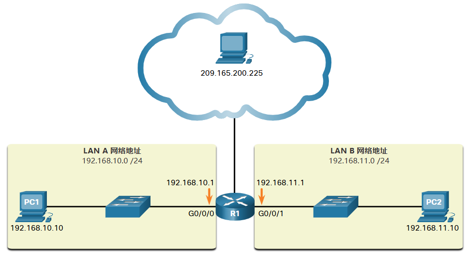

# 5 数制系统

!!! tip "说明"

    本文档正在更新中……

!!! info "说明"

    本文档仅涉及部分内容，仅可用于复习重点知识

## 5.1 二进制数制系统

### 5.1.1 二进制和 IPv4 地址

IPv4 地址以二进制开头，仅包含 1 和 0。这很难管理，因此网络管理员必须将它们转换为十进制

每一个地址包含一串 32 位字符串，并分为四个部分，称为二进制八位组。每一个二进制八位组包含 8 位（或 1 个字节），用句点分隔

> 在指 IPv4 地址的 8 位时，我们使用术语 **八位组**

为了方便人们使用，IPv4 地址通常表达为点分十进制记法。为 PC1 分配的 IPv4 地址为 192.168.10.10，其默认网关地址为 192.168.10.1

<figure markdown="span">
  { width="600" }
</figure>

## 5.2 十六进制数制系统

### 5.2.1 十六进制和 IPv6 地址

IPv6 地址长度为 128 位，每 4 位以一个十六进制数字表示，共 32 个十六进制值。IPv6 地址不区分大小写，可用大写或小写书写

书写 IPv6 地址的首选格式为 x:x:x:x:x:x:x:x，每个“x”均包括四个十六进制值

