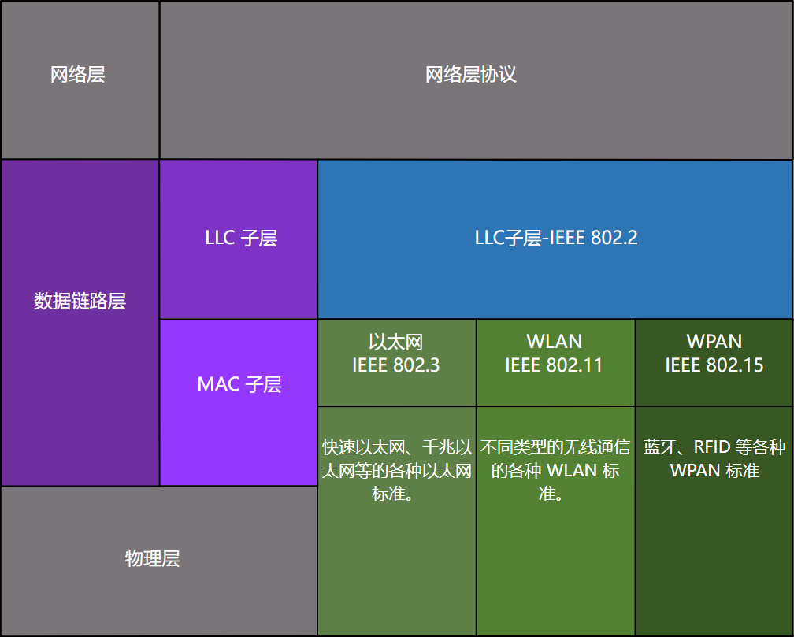
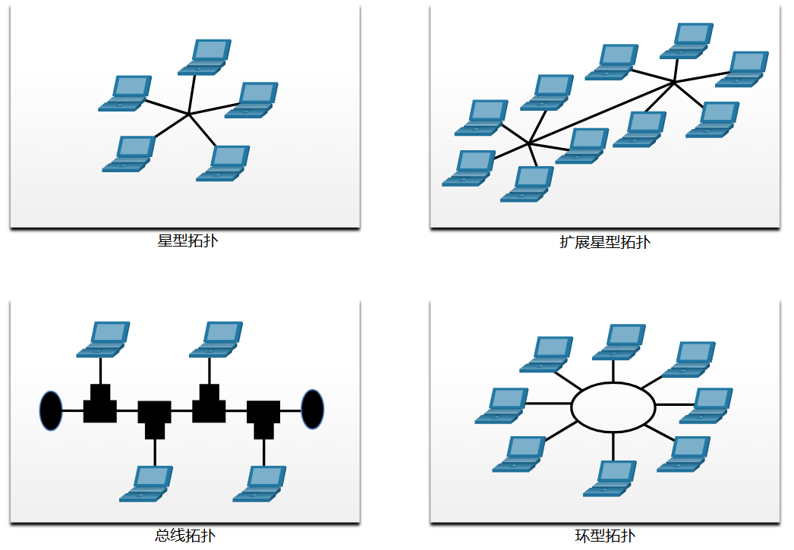
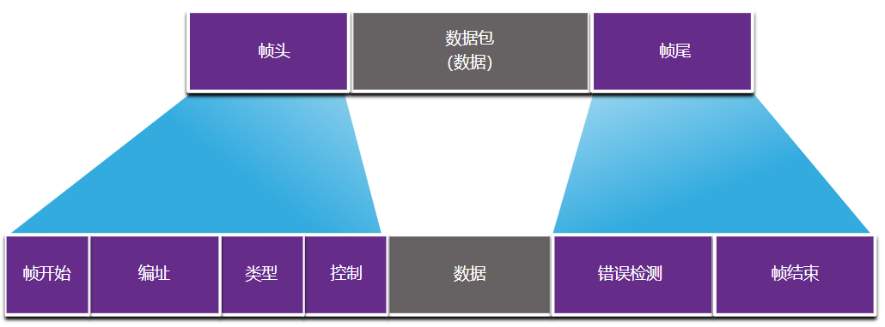

# 6 数据链路

!!! tip "说明"

    本文档正在更新中……

!!! info "说明"

    本文档仅涉及部分内容，仅可用于复习重点知识

## 6.1 数据链路层的用途

### 6.1.1 数据链路层

OSI 模型的数据链路层 (第 2 层) 为物理网络准备网络数据。数据链路层负责网络接口卡 (NIC) 到网络接口卡的通信。数据链路层执行以下操作：

1. 允许上层访问介质。上层协议完全不知道用于转发数据的介质类型
2. 接受数据，通常是第 3 层数据包（即 IPv4 或 IPv6），并将它们封装到第 2 层帧中
3. 控制数据在介质上的放置和接收方式
4. 通过网络介质在终端之间交换帧
5. 接收封装的数据，通常是第 3 层数据包，并将它们定向到适当的上层协议
6. 执行错误检测并拒绝任何损坏的帧

节点是可以沿通信路径接收、创建、存储或转发数据的设备。节点可以是笔记本电脑或移动电话等终端设备，也可以是中间设备如以太网交换机

### 6.1.2 IEEE 802LAN/MAN 数据链路子层

IEEE 802 LAN/MAN 标准专用于以太网局域网、无线局域网 (WLAN)、无线个人区域网 (WPAN) 和其他类型的局域网和城域网。IEEE 802 LAN/MAN 数据链路层由以下两个子层组成：

1. **逻辑链路控制** (LLC)：在上层的网络软件与下层的设备硬件之间进行通信。它放入帧中的信息用于确定帧所使用的网络层协议。此信息允许多个第 3 层协议使用相同的网络接口和介质
2. **介质访问控制** (MAC)：在硬件上实现这个子层。它负责数据封装和介质访问控制。它提供数据链路层寻址，并与各种物理层技术集成

<figure markdown="span">
  { width="600" }
</figure>

MAC 子层提供数据封装：

1. 帧定界：在成帧过程中提供重要的定界符，用来标识帧中的字段。这些定界符位可以在发送节点与接收节点之间提供同步
2. 编址：提供源和目的编址，用于在同一共享介质上的设备之间传输第 2 层帧
3. 错误检测：包含一个帧尾，用于检测传输错误

### 6.1.3 提供介质访问

路由器接口将数据包封装到适当的帧中。使用合适的介质访问控制方法来访问每个链路。在任意指定的网络层数据包交换过程中，可能存在多次数据链路层和介质的转换

在路径上的每一跳，路由器都执行以下第 2 层功能：

1. 从介质接受帧
2. 解封帧
3. 将数据包重新封装到新帧中
4. 从适合该物理网络网段的介质转发新帧

### 6.1.4 数据链路层标准

定义适用于网络接入层（即，OSI 的物理和数据链路层）的开放标准和协议的工程组织包括：

1. 电气电子工程师协会 (IEEE)
2. 国际电信联盟 (ITU)
3. 国际标准化组织 (ISO)
4. 美国国家标准学会 (ANSI)

## 6.2 拓扑

### 6.2.1 物理和逻辑拓扑

网络拓扑是指网络设备及它们之间的互连布局或关系

### 6.2.2 WAN 拓扑

1. 点对点
2. 中心辐射型
3. 网状

### 6.2.3 点对点 WAN 拓扑

物理点对点拓扑直接连接两个节点。在这种布局中，两个节点无需与其他主机共享介质。此外，当使用串行通信协议，如点对点协议 (PPP) 时，节点无需判定收到的帧是指向它还是指向另一节点。因此，逻辑数据链路协议将非常简单，因为介质中的所有帧都只去往或来自这两个节点。节点将帧放置到一端的介质上，然后点对点线路另一端的节点从介质取走帧

### 6.2.4 LAN 拓扑

在多路访问局域网中，终端设备（即节点）使用星型或扩展星型拓扑相互连接。在这种类型的拓扑中，终端设备连接到一个中央中间设备

早期的以太网和传统令牌环局域网技术包括另外两种拓扑结构：

1. 总线：所有终端系统都相互连接，并在两端以某种形式端接
2. 环：终端系统与其各自的邻居相连，形成一个环状

<figure markdown="span">
  { width="600" }
</figure>

### 6.2.5 半双工和全双工通信

**双工通信**：指的是两个设备之间的数据传输方向

1. **半双工通信**：两台设备都可以通过该介质发送和接收，但无法同时执行这两个操作。WLAN 和带有以太网集线器的传统总线拓扑使用半双工模式。半双工每次只允许一台设备通过共享介质发送或接收
2. **全双工通信**：两台设备都可以在共享介质上同时发送和接收。数据链路层假定介质随时可供两个节点实现传输。默认情况下，以太网交换机在全双工模式下运行，但是如果与以太网集线器等设备连接，它们则可以在半双工模式下运行

总之，半双工通信限制为每次在一个方向进行数据交换。全双工允许同时发送和接收数据

两个互连设备，比如一个主机网卡和以太网交换机上的一个接口，必须采用同一双工模式运行。否则，将会出现双工不匹配，导致链路效率低下和延时

### 6.2.6 访问控制方法

对于共享介质，有两种基本的访问控制方法：

1. 基于竞争的访问：在基于竞争的多路访问网络中，所有节点都工作在半双工方式，争夺介质的使用。然而，一次只有一台设备能够发送。因此，当多台设备同时传输时，会使用一个处理过程

    1. 在传统总线拓扑以太网局域网上使用载波侦听多路访问/冲突检测(CSMA/CD)
    2. 在无线局域网上使用载波侦听多路访问/冲突避免(CSMA/CA)

2. 受控访问：在基于控制的多路访问网络中，每个节点都有自己的时间来使用介质。这种确定性的传统网络类型效率很低，因为设备必须等到轮到自己才能访问介质

> 如今，以太网网络以全双工方式运行，不需要访问方法

### 6.2.7 基于竞争的访问 - CSMA/CD

基于竞争的访问网络示例如下：

1. 无线局域网（使用 CSMA/CA）
2. 传统总线拓扑以太网局域网（使用 CSMA/CD）
3. 使用集线器的传统以太网局域网（使用 CSMA/CD）

这些网络在半双工模式下运行，意味着一台设备一次只能发送或接收。这需要有一个进程来管理设备何时可以发送以及当多台设备同时发送时会发生什么情况

如果两台设备同时传输，则会发生冲突。对于传统以太网局域网，两台设备将会检测到网络上的冲突。这就是 CSMA/CD 的冲突检测 (CD) 部分。网卡通过比较传输的数据与接收的数据，或通过识别介质中的信号振幅是否高于正常状况来实现。两台设备发送的数据会损坏且需重新发送

### 6.2.8 基于竞争的访问 – CSMA/CA

在无线环境中，设备可能无法检测到冲突。CMSA/CA 不会检测冲突，但会通过在传输之前等待来尝试避免冲突。每台设备发送时都会包含传输所需的持续时间。所有其他无线设备都会收到此信息，知道介质将有多长时间不可用

## 6.3 数据链路帧

### 6.3.1 帧

数据链路层通过使用帧头和帧尾将其封装以创建帧，从而准备封装后的数据（通常是 IPv4 或 IPv6 数据包），以便在本地介质上进行传输

每种帧均有三个基本组成部分：

1. 帧头
2. 数据
3. 帧尾

数据链路层以帧尾的形式在帧的末尾附加信息

所有数据链路层协议均将数据封装于帧的数据字段内。但是，由于协议的不同，帧结构以及帧头和帧尾中包含的字段会存在差异

没有一种帧结构能满足通过所有类型介质的全部数据传输需求。根据环境的不同，帧中所需的控制信息量也相应变化，以匹配介质和逻辑拓扑的访问控制需求。例如，WLAN 帧必须包含避免冲突的过程，因此与以太网帧相比需要额外的控制信息

### 6.3.2 帧字段

<figure markdown="span">
  { width="600" }
</figure>

1. 帧开始和停止指示标志
2. 编址：表示介质上的源节点和目的节点
3. 类型
4. 控制
5. 数据
6. 错误检测

数据链路层协议将帧尾添加到各帧结尾处。在一个叫做错误检测的过程中，帧尾会判断帧是否到达时没有错误。它将组成帧的各个位的逻辑或数学摘要放入帧尾中。要将错误检测添加到数据链路层，因为介质中的信号可能遭受干扰、失真或丢失，从而大幅更改这些信号所代表的位值

### 6.3.3 第 2 层地址

数据链路层提供了通过共享本地介质传输帧时要用到的编址。此层中的设备地址称为物理地址。数据链路层地址包含在帧头中，它指定了帧在本地网络中的目的节点。它通常位于帧的开头，因此网卡可以在接受帧的其余部分之前快速确定它是否匹配自己的第 2 层地址。帧头还可能包含帧的源地址

与分层式第 3 层逻辑地址不同，物理地址不会表示设备位于哪个网络。相反，物理地址对于特定设备是唯一的。即使设备移至另一网络或子网，它将仍使用相同的第 2 层物理地址。因此，第 2 层地址仅用于在相同的共享介质中，在相同的 IP 网络上连接设备

数据链路层地址仅用于本地传送。该层地址在本地网络之外无任何意义。将它与第 3 层进行比较，我们发现在第 3 层中，无论途中有多少个网络跳点，数据包报头中的址址都会从源主机传送到目的主机

如果数据必须传递到另一网段上，则需要使用中间设备，比如路由器。路由器必须根据物理地址接受帧并解封帧，以便检查分层地址，即 IP 地址。路由器使用 IP 地址可以确定目的设备的网络地址以及到达该地址的最佳路径。当知道要将数据包转发到何处时，路由器会为数据包创建一个新帧，并将新帧发送到通往最终目的地的下一网段

### 6.3.4 LAN 和 WAN 上的帧

数据链路层协议包括：

1. 以太网
2. 802.11 无线
3. 点对点协议 (PPP)
4. 高级数据链路控制 (HDLC)
5. 帧中继
