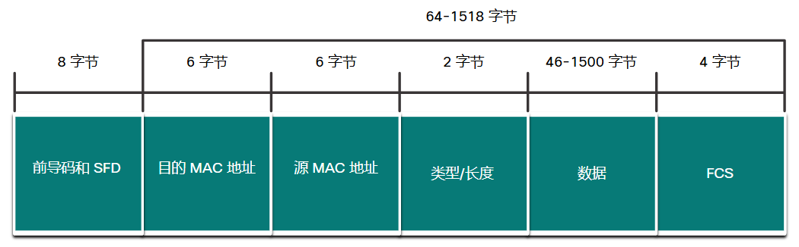

# 7 以太网交换

<!-- !!! tip "说明"

    本文档正在更新中…… -->

!!! info "说明"

    本文档仅涉及部分内容，仅可用于复习重点知识

## 7.1 以太网帧

### 7.1.1 以太网封装

以太网是如今广泛使用的两种局域网技术之一，另一种是无线局域网（WLAN）。它使用有线通信，包括双绞线、光纤链路和同轴电缆

以太网标准同时定义第 2 层协议和第 1 层技术

### 7.1.2 数据链路子层

IEEE 802 LAN/MAN 协议，包括以太网，使用以下两个单独的数据链路层子层进行操作。它们是逻辑链路控制 (LLC) 和介质访问控制 (MAC)

### 7.1.3 MAC 子层

MAC 子层负责数据封装和访问介质

IEEE 802.3 数据封装包括以下内容：

1. 以太网帧：这是以太网帧的内部结构
2. 以太网寻址：以太网帧中包含源和目的 MAC 地址，用于将该以太网帧从以太网网卡传送到同一 LAN 上的以太网网卡
3. 以太网错误检测：以太网帧中包含用于错误检测的帧校验序列 (FCS) 帧尾

访问介质：IEEE 802.3 MAC 子层包含了在各种介质（包括铜和光纤）上不同类型的以太网通信标准的规格

如今的以太网 LANs 使用的交换机是全双工的。在全双工模式下运行的以太网交换机不需要通过 CSMA/CD 进行访问控制

### 7.1.4 以太网帧字段

<figure markdown="span">
  { width="600" }
</figure>

1. 前导码和帧首定界符字段：前导码（7 字节）和帧首定界符（SFD），也称为帧首（1 字节），该字段用于发送设备与接收设备之间的同步。帧开头的八个字节用于引起接收节点的注意。基本上，前几个字节的作用是告诉接收方准备接收新帧
2. 目的 MAC 地址字段
3. 源 MAC 地址字段
4. 类型/长度：该字段包含两个字节，标识封装于以太网帧中的上层协议
5. 数据字段：该字段（46-1500 字节）包含来自较高层的封装数据，一般是第 3 层 PDU 或更常见的 IPv4 数据包。所有帧至少必须有 64 个字节。如果封装的是小数据包，则使用填充位将帧增大到最小值
6. 帧校验序列字段：用于检测帧中的错误

## 7.2 以太网 MAC 地址

### 7.2.2 以太网 MAC 地址

在以太网中，每台网络设备都连接到同一个共享介质。MAC 地址用于标识本地网段上的物理源和目的设备。MAC 编址为 OSI 模型的数据链路层提供了设备识别方法

以太网 MAC 地址是使用 12 个十六进制数字表示的 48 位地址，6 个字节

所有 MAC 地址对于以太网设备或以太网接口必须是唯一的。为了确保这一点，所有销售以太网设备的供应商必须向 IEEE 注册才能获得唯一的 6个十六进制（即 24 位或 3 字节）代码，称为组织唯一标识符 (OUI)

当供应商为设备或以太网接口分配 MAC 地址时，供应商必须执行以下操作：

1. 使用其分配的 OUI 作为前 6 个十六进制数字
2. 为后 6 个十六进制数字分配唯一值

因此，以太网 MAC 地址由 6 个十六进制供应商 OUI 代码和 6 个十六进制供应商分配的值组成

### 7.2.3 帧处理

MAC 地址通常称为烧录地址 (BIA)，因为传统上该地址被烧录到网卡的只读存储器（ROM）中。这意味着该地址会永久编码到 ROM 芯片中

注意: 在现代 PC 操作系统和网卡中，可以在软件中更改 MAC 地址。当试图访问基于 BIA 进行过滤的网络时，这一点非常有用。因此，根据 MAC 地址来过滤或控制流量就不再安全了

当计算机启动时，网卡将 MAC 地址从 ROM 复制到 RAM 中。设备在向以太网络转发消息时，以太网报头包含这些：

1. 源 MAC 地址
2. 目的 MAC 地址

注意: 如果目的 MAC 地址是主机为其成员的广播或组播组时，以太网网卡也会接收帧

### 7.2.5 广播 MAC 地址

以太网广播帧由以太网 LAN 上的每个设备接收和处理。以太网广播的功能如下：

1. 它有一个十六进制（在二进制中是 48 个 1）FF-FF-FF-FF-FF-FF 的目的 MAC 地址
2. 它向除输入端口以外的所有以太网交换机端口泛洪
3. 路由器不会转发该帧

如果封装的数据是 IPv4 广播包，这意味着该数据包包含一个目的 IPv4 地址，该地址的主机部分全部为 1。这种地址值表示本地网络（广播域）中的所有主机都将接收和处理该数据包

### 7.2.6 组播 MAC 地址

以太网组播帧由属于同一组多播组的以太网 LAN 上的一组设备接收和处理，以太网组播的功能如下：

1. 当封装数据为 IPv4 组播包时，目的 MAC 地址为 01-00-5E；当封装数据为 IPv6 组播包时，目的 MAC 地址为 33-33
2. 当封装的数据不是 IP 时，还有其他预留的组播目的 MAC 地址，如生成树协议 (STP) 和链路层发现协议 (LLDP)
3. 除非交换机被配置为用于组播窥探，否则它将向除传入端口之外的所有以太网交换机端口泛洪
4. 它不会由路由器转发，除非路由器配置为路由组播数据包

如果封装的数据是一个 IP 组播包，则属于组播组的设备都分配有该组播组 IP 地址。IPv4 组播地址的范围为 224.0.0.0 到 239.255.255.255。IPv6 组播地址的范围以 ff00::/8 开头。由于组播地址代表一组地址（有时称为主机组），因此只能用作数据包的目的地址。源地址始终应为单播地址

## 7.3 MAC 地址表

### 7.3.1 交换机基础知识

第 2 层以太网交换机使用 MAC 地址做出转发决策。它完全忽视帧的数据部分的协议，例如 IPv4 数据包，一个 ARP 消息或一个 IPv6 ND数据包。交换机仅根据第 2 层以太网 MAC 地址做出转发决策

### 7.3.2 交换机学习和转发

检查源 MAC 地址：进入交换机的每个帧被检查，以确定其中是否有可被学习的新信息。它是通过检查帧的源 MAC 地址和帧进入交换机的端口号来完成这一步的。如果源 MAC 地址不存在，会将其和传入端口号一并添加到表中。如果源 MAC 地址已存在于表中，则交换机会更新该条目的刷新计时器。默认情况下，大多数以太网交换机将条目在表中保留 5 分钟

查找目的 MAC 地址：如果目的 MAC 地址为单播地址，该交换机会看帧中的目的 MAC 地址与 MAC 地址表中的条目是否匹配。如果表中存在该目的 MAC 地址，交换机会从指定端口转发帧。如果表中不存在该目的 MAC 地址，交换机会从除传入端口外的所有端口转发帧。这称为未知单播

### 7.3.3 过滤帧

交换机是从不同的设备接收帧，因此它可以通过检查每个帧的源 MAC 地址来填充它的 MAC 地址表。如果 MAC 地址表包含目的 MAC 地址，则交换机将“滤过”该帧并将其从单个端口转发出去

## 7.4 交换机速率和转发方法

### 7.4.1 思科交换机上的帧转发方法

在过去，交换机使用下面的两种转发方法之一来进行网络端口间的数据交换：

1. 存储转发交换：这个帧转发的方法接收整个帧并计算 CRC。CRC 根据帧中的比特位为 1 的位数量，使用数学公式来确定收到的帧是否有错。如果 CRC 有效，则交换机查找目的地址，目的地址决定了转发接口。帧然后从正确的端口转发出去
2. 直通交换：这种帧转发的方法在收到整个帧之前即转发帧。在可以转发帧之前，至少必须读取帧的目的地址

### 7.4.2 直通交换

在直通交换中，交换机在收到数据时立即处理数据，即使传输尚未完成。交换机只缓冲帧的一部分，缓冲的量仅足以读取目的 MAC 地址，以便确定转发数据时应使用的端口。目的 MAC 地址位于帧中前导码后面的前 6 个字节。交换机在其交换表中查找目的 MAC 地址，确定转发端口，然后通过指定的交换机端口将帧转发到其目的地。交换机对该帧不执行任何错误检查

两种变体：

1. 快速转发交换
2. 免分片交换

### 7.4.3 交换机上的内存缓冲

以太网交换机在转发帧之前，可以使用缓冲技术存储帧。当目的端口由于拥塞而繁忙时，也可以使用缓冲。交换机将帧存储起来，直到可以传输

1. 基于端口的内存
2. 共享内存

### 7.4.4 双工和速率设置

用于以太网通信的双工设置有两种：

1. 全双工
2. 半双工

自动协商是大多数以太网交换机和网卡的一项可选功能。它使两个设备自动协商最佳速率和双工性能。如果两台设备具有最高常见带宽的功能，则会选择全双工

### 7.4.5 Auto-MDIX

设备之间的连接曾经要求使用交叉线或直通线。所需的线缆类型取决于互连设备的类型

<figure markdown="span">
  { width="600" }
</figure>
