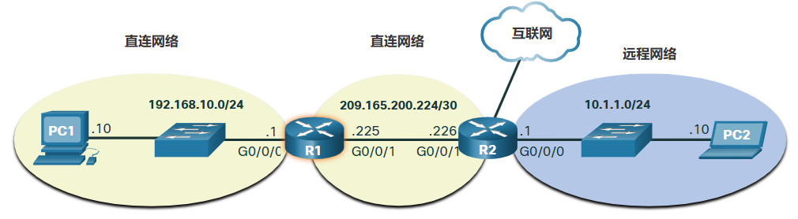
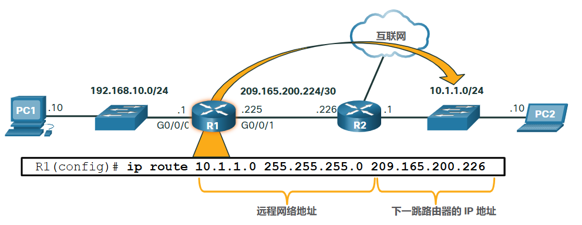

# 8 网络层

!!! tip "说明"

    本文档正在更新中……

!!! info "说明"

    本文档仅涉及部分内容，仅可用于复习重点知识

## 8.4 主机路由方式

### 8.4.1 主机转发决策

网络层的另一个作用是在主机之间转发数据包。主机可以将数据包发送至如下：

1. 主机自己：主机可以通过向特定的地址发送数据包来向自己发起 ping 测试，这个特定的地址是：IPv4 地址 127.0.0.1，或者IPv6地址 ::1，它被称为环回接口。对环回接口执行 ping 操作可以测试主机上的 TCP/IP 协议堆栈
2. 本地主机：目的主机与发送主机位于同一本地网络。源和目的主机共享同一个网络地址
3. 远程主机：这是位于远程网络上的目的主机。源和目的主机不共享同一个网络地址

### 8.4.2 默认网关

默认网关是可以将流量路由到其他网络的网络设备（即，路由器或第 3 层交换机）。如果把一个网络比作一个房间，那么默认网关就好比是门口。如果要去另一个房间或网络，您就需要找到门口

在网络上，默认网关通常是具有以下功能的路由器：

1. 它拥有与本地网络其他主机位于相同地址范围的本地 IP 地址
2. 它可以接受数据到本地网络，并将数据转发出本地网络
3. 它向其他网络路由流量

需要使用默认网关来发送本地网络之外的流量。如果没有默认网关、未配置默认网关地址或默认网关关闭，则无法将流量转发到本地网络之外

### 8.4.3 主机路由到默认网关

主机的路由表通常包括默认网关。在IPv4中，主机通过动态主机配置协议 (DHCP) 动态接收默认网关 IPv4 地址，或者通过手动配置。在 IPv6 中，路由器通告默认网关地址，或者可以在主机上手动配置

配置默认网关会在 PC 的路由表中创建一个默认路由。**默认路由** 是计算机尝试联系远程网络时所用的路由或路径

### 8.4.4 主机路由表

在 Windows 主机上，使用 `route print` 或 `netstat -r` 命令可以显示主机路由表

显示有关当前 TCP/IP 网络连接的三个部分：

1. 接口列表：列出主机上的介质访问控制 (MAC) 地址和每个网络接口的已分配接口编号，包括以太网、Wi-Fi 和蓝牙适配器
2. IPv4 路由表：列出所有已知的 IPv4 路由，包括直接连接、本地网络和本地默认路由
3. IPv6 路由表：列出所有已知的 IPv6 路由，包括直接连接、本地网络和本地默认路由

## 8.5 路由简介

### 8.5.1 路由器数据包转发决策

当一台主机发送数据包到另一台主机时，它将查询路由表来确定将数据包发送到哪里。如果目的主机位于远程网络，则数据包会被转发到默认网关，通常是本地路由器

路由器会检查数据包的目的 IP 地址并搜索其路由表以确定将数据包转发到何处。路由表包含所有已知网络地址（前缀）以及数据包转发位置的列表。这些条目称为 **路由条目** 或 **路由**

路由器将使用最佳（最长）匹配的路由条目转发数据包

### 8.5.2 IP 路由器路由表

路由器的路由表包含所有可能的已知目的地网络的路由条目列表

路由表存储三种类型的路由条目：

1. 直连网络：这些网络路由条目是活动的路由器接口。当接口配置了 IP 地址并激活时，路由器会添加直连路由。每个路由器接口均连接到一个不同的网段
2. 远程网络：这些网络路由条目连接到其他路由器。路由器通过由管理员明确配置或使用动态路由协议交换路由信息来学习远程网络
3. 默认路由：像主机一样，大多数路由器还包含默认路由条目，即默认网关。当 IP 路由表中没有更好（更长）的匹配时，将使用默认路由

<figure markdown="span">
  { width="600" }
</figure>

路由器可通过两种方式获知远程网络：

1. 手动：使用静态路由将远程网络手动输入到路由表中
2. 动态：使用动态路由协议自动学习远程路由

### 8.5.3 静态路由

静态路由是手动配置的路由条目。静态路由包括远程网络地址和下一跳路由器的 IP 地址

如果网络拓扑改变，静态路由不会自动更新，必须手动重新配置静态路由

<figure markdown="span">
  { width="600" }
</figure>

特征：

1. 必须手动配置静态路由
2. 如果拓扑发生变化，且静态路由不再可用，则管理员需要重新配置静态路由
3. 静态路由适用于小型网络且当冗余链路很少或没有冗余链路的情况
4. 静态路由通常与动态路由协议一起用于配置默认路由

### 8.5.4 动态路由

动态路由协议可让路由器从其他路由器那里自动学习远程网络，包括默认路由。如果使用动态路由协议，则路由器无需网络管理员的参与，即可自动与其它路由器共享路由信息并对拓扑结构的变化作出反应。如果网络拓扑发生变化，路由器将使用动态路由协议共享此信息，并自动更新路由表

动态路由协议包括 OSPF 和增强型内部网关路由协议 (EIGRP)

当使用静态路由手动配置路由器或使用动态路由协议动态学习远程网络时，远程网络地址和下一跳地址将被输入到 IP 路由表中

### 8.5.6 IPv4 路由表简介

每个路由表条目的开头都有一个代码，用于标识路由的类型或路由的学习方式。常见路由源（代码）包括以下内容：

1. L：直连的本地接口 IP 地址
2. C：直连网络
3. S：静态路由由管理员手动配置
4. O：OSPF
5. D：EIGRP
