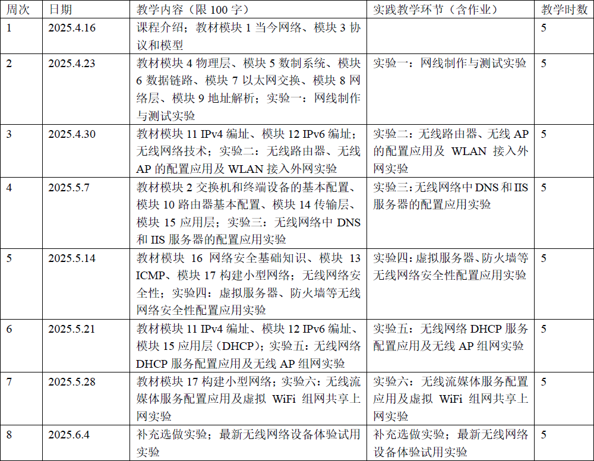

# 无线网络应用

!!! tip "说明"

    本文档正在更新中……

## 课程介绍

!!! info "注意"

    此为 2024-2025 夏学期课程安排，仅供参考

zy老师、sxx老师

### 课程类型

博雅技艺

### 课程内容

<figure markdown="span">
  { width="600" }
</figure>

### 考核方式

#### 平时（30 分）

1. 线下课堂实验：20 分
      1. 基本必做实验完成分：15 分
      2. 补充选做实验完成分：5 分
2. 线上学习活动：10 分

#### 实验总结（30 分）

实验四和实验五中的 2 个指定小实验各写一份实验总结

#### 考试（40 分）

- 线上考试
- 开卷考试

1. 取平时模块组考试最高分：20 分
      - 一共有 6 个，至少参加 1 个
2. 期末考试：20 分
