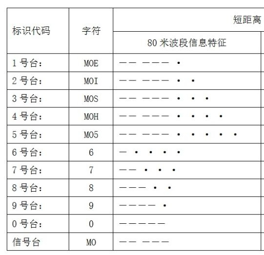

# 无线电测向（初级）

<!-- !!! tip "说明"

    本文档正在更新中…… -->

## 课程介绍

!!! info "注意"

    此为 2023-2024 秋冬 和 2024-2025 秋冬学期课程安排，仅供参考

dyp老师 / zl老师 (1)
{ .annotate }

1. 我报了两次这个课，两次课的老师报的不一样

无线电台散落在各个地方，需要使用无线电测向机找到这些电台，操作起来非常的简单，但是找起来可能有些难度

如果你上过这门课，老师可能会安排你为放电台的人，任务就是在指定区域放置电台，下课前收回来

### 考核方式

!!! info "说明"

    体测、理论考试等其它内容省略

#### 听台考试

<figure markdown="span">
    { width="400" }
</figure>

一共有 11 个台，每个台对应一种电码 (1) ，一段时间内随机切换台号，需要使用无线电测向机听出是哪一个台号
{ .annotate }

1. 类似于摩斯电码

??? quote "碎碎念"

    听台考试很简单的，不要紧张就行

#### 实践找台

4 次实践找台考试，2 次在紫金港校区，另外 2 次在其它校区。取 2 次最好的成绩

开始时给你一个卡片，上面是你需要找的台号，一共 10 个台 (1) ，你需要找 5 个。找到后，电台那里有给卡片相应位置做标记 (3) 的工具。全部找完再返回起点（终点）即可，根据你所用的时间和找到台的数量 (2) 进行排名
{ .annotate }

1. MO 台不需要找，MO 台的作用是告诉你起点和终点在哪里，我们这门课起点和终点在同一个位置
2. 因为你可能找错台了
3. 每个台的标记不一样，用于检查你的台有没有找对

??? quote "碎碎念"

    可以相互帮助哦（小声）

## 理论考试资料

[体育通用资料](./index.md#体育理论考试通用资料){:target="_blank"}

[无线电测向题库](../../file/PE/radio_doc1.pdf){:target="_blank"} 
[无线电测向介绍](../../file/PE/radio_doc2.pdf){:target="_blank"}

> 无线电测向题库中 ^^答案^^ 那一列是正确答案

## 个人感受

很有意思的一门课呀