# 2 知识表达与推理

<!-- !!! tip "说明"

    本文档正在更新中…… -->

!!! info "说明"

    本文档仅涉及部分内容，仅可用于复习重点知识

## 1 命题逻辑

<figure markdown="span">
  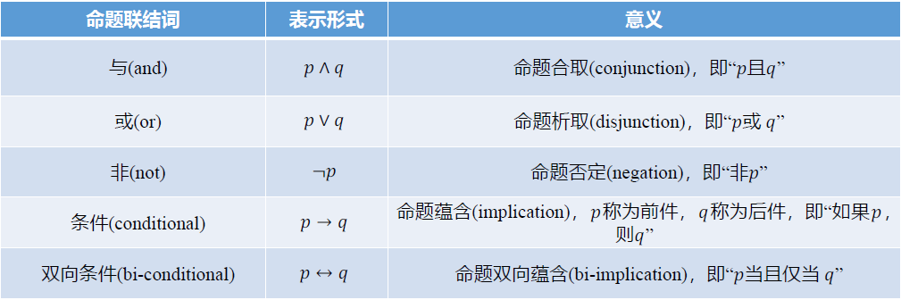{ width="600" }
</figure>

<figure markdown="span">
  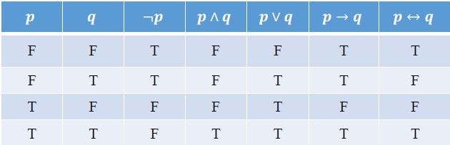{ width="600" }
</figure>

$𝑝 → 𝑞$：定义的是一种蕴含关系，也就是命题 𝑞 包含命题 𝑝（𝑝 是 𝑞 的子集）。𝑝 不成立相当于 𝑝 是一个空集，而空集是任何集合的子集。因此，当 𝑝 不成立时，$𝑝 → 𝑞$ 恒为真。

<figure markdown="span">
  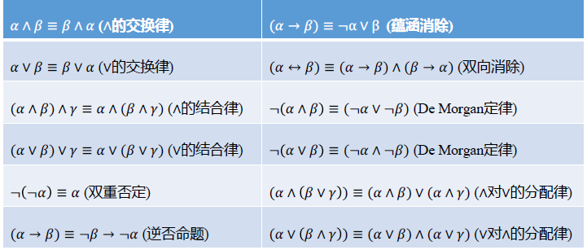{ width="600" }
</figure>

<figure markdown="span">
  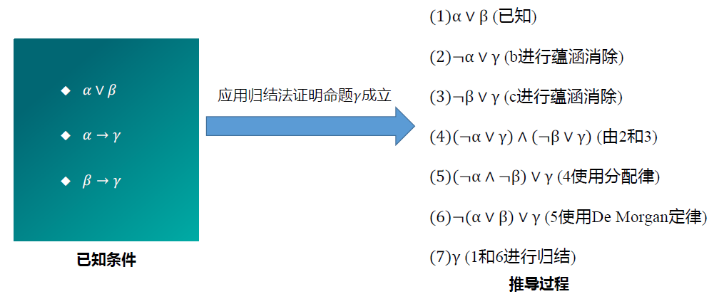{ width="600" }
</figure>

## 2 谓词逻辑

1. $(∀𝑥)(𝐴(x)∧ 𝐵(𝑥)) ≡ (∀𝑥)𝐴(x)∧ (∀𝑥)𝐵(𝑥)$
2. $(∃𝑥)(𝐴(x)∨ 𝐵(𝑥)) ≡ (∃𝑥)𝐴(x)∨ (∃𝑥)𝐵(𝑥)$

<figure markdown="span">
  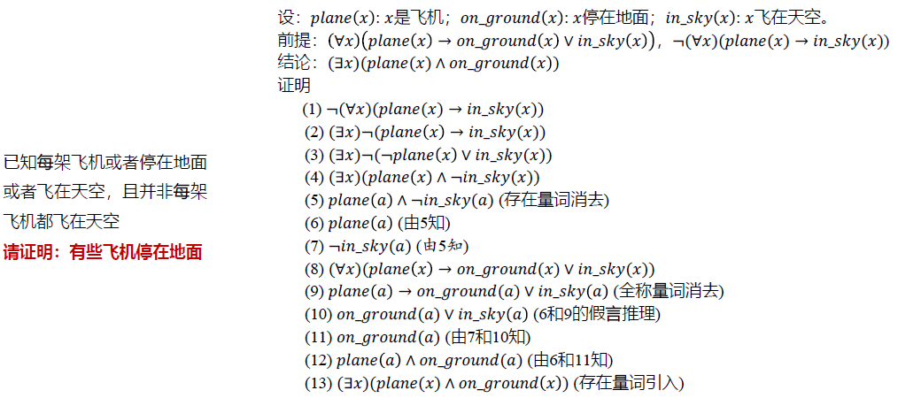{ width="600" }
</figure>

## 3 知识图谱推理

知识图谱 (knowledge graph) 由有向图 (directed graph) 构成，被用来描述现实世界中实体及实体之间的关系，是人工智能中进行知识表达的重要方式。在知识图谱中，每个节点表示客观世界中的一个实体，两个节点之间的连线表示节点具有某一关系

关系推理是统计关系学习研究的基本问题，也是当前知识图谱领域研究的热点问题。对实体之间存在的关系进行推理，能够从现有知识中发现新的知识，在实体间建立新关联，从而扩充和丰富现有知识库。例如从 `<奥巴马，出生地，夏威夷>` 和 `<夏威夷，属于，美国>` 两个三元组，可推理得到 `<奥巴马，国籍，美国>`

<figure markdown="span">
  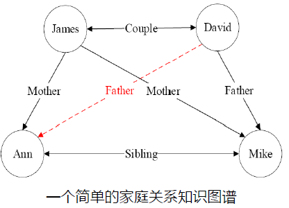{ width="600" }
</figure>

形如 `<James, Couple, David>` 的关系可用一阶逻辑的形式来描述，即 Couple(James, David)。其中，Couple(x, y) 是一阶谓词，Couple 是图中实体之间具有的关系，𝑥 和 𝑦 是谓词变量，可由知识图谱中的实体将其实例化

<figure markdown="span">
  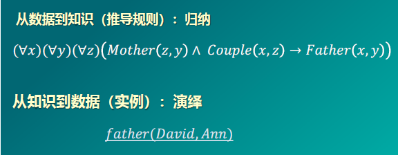{ width="600" }
</figure>

归纳逻辑程序设计 (inductive logic programming，ILP) 是机器学习和逻辑程序设计交叉领域的研究内容。ILP 使用一阶谓词逻辑进行知识表示，通过修改和扩充逻辑表达式对现有知识归纳，完成推理任务

作为 ILP 的代表性方法，FOIL（First Order Inductive Learner）通过序贯覆盖学习推理

### 3.1 FOIL 算法

FOIL 算法解决的问题是：在已知一些事实（背景知识）的情况下，如何通过机器学习，自动总结出一条逻辑规则（推理规则），来解释这些事实

<figure markdown="span">
  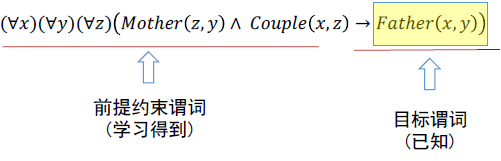{ width="600" }
</figure>

输入：

1. 目标谓词（Target Predicate）：这是我们要学习的规则结论。例如，`Father(x, y)`
2. 正例（Positive Examples）：满足目标谓词的事实。例如 `Father(David, Mike)`
3. 反例（Negative Examples）：不满足目标谓词的事实。例如 `¬Father(David, James)`
4. 背景知识（Background Knowledge）：已知的其他相关事实（谓词）。例如 `Couple(x, z)` 和 `Mother(z, y)`

FOIL 算法采用序贯覆盖（Sequential Covering）策略，其核心逻辑是：

1. 初始化：从最一般的规则开始（即规则体为空，只有结论 `Target`）
2. 迭代添加：在每一步中，尝试将背景知识中的谓词添加到规则的前提（规则体）中
3. 终止条件：当这条规则只覆盖正例，且不覆盖任何反例时停止

在每一步迭代中，系统会尝试将所有可能的背景谓词及其所有可能的变量组合加入到规则中，并计算一个评分指标 —— FOIL 信息增益（FOIL Gain）。对于每一个候选谓词，算法会计算加入该谓词后，新规则覆盖的正例数 $\hat{m}_+$ 和反例数 $\hat{m}_-$。通过比较加入谓词前后的信息量变化，来决定哪个谓词能带来最大的纯度提升（即覆盖更多正例，排除更多反例）

$\text{FOIL Gain} = \hat{m}_+ \times (\log_2 \dfrac{\hat{m}_+}{\hat{m}_+ + \hat{m}_-} - \log_2 \dfrac{m_+}{m_+ + m_-})$

> 1. $m_+, m_-$ ：加入谓词前，当前规则覆盖的正例和反例数量
> 2. $\hat{m_+}, \hat{m_-}$ ：尝试加入新谓词后，新规则覆盖的正例和反例数量

<figure markdown="span">
  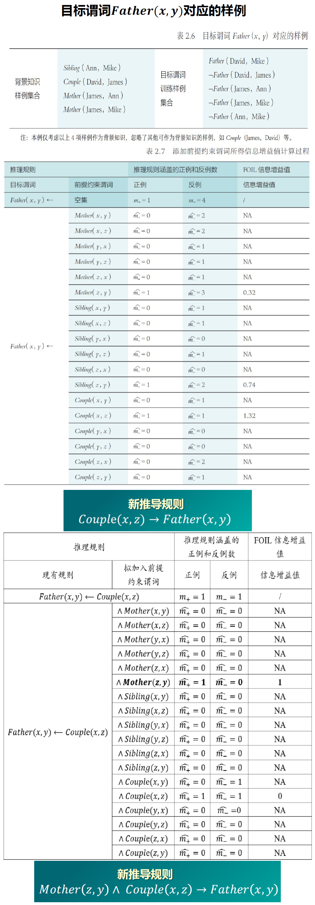{ width="600" }
</figure>

### 3.2 路径排序推理算法

PRA：将实体之间的关联路径作为特征，来学习目标关系的分类器

1. 特征抽取：生成并选择路径特征集合。生成路径的方式有随机游走（random walk）、广度优先搜索、深度优先搜索等
2. 特征计算：计算每个训练样例的特征值 $𝑃(𝑠 → 𝑡; 𝜋_j)$ 。该特征值可以表示从实体节点 𝑠 出发，通过关系路径 $𝜋_j$ 到达实体节点 𝑡 的概率；也可以表示为布尔值，表示实体 𝑠 到实体 𝑡 之间是否存在路径 $𝜋_j$；还可以是实体 𝑠 和实体 𝑡 之间路径出现频次、频率等
3. 分类器训练：根据训练样例的特征值，为目标关系训练分类器。当训练好分类器后，即可将该分类器用于推理两个实体之间是否存在目标关系

<figure markdown="span">
  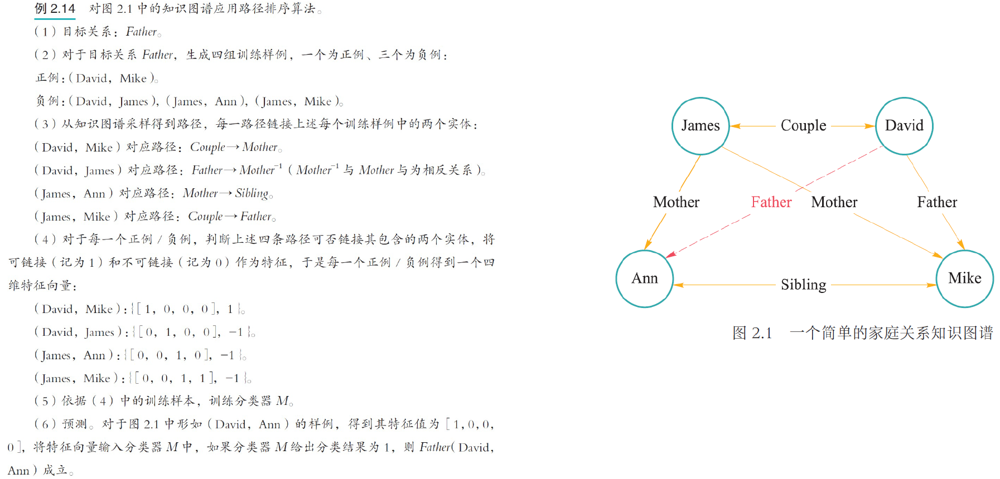{ width="600" }
</figure>

## 4 概率图推理

在图数据中，如果两个节点之间存在连边，则可视为这两个节点之间具有概率依赖关系而相互影响。在这类图中，可用概率描述两个相连节点之间的关联，而不是假设节点之间的影响一定会百分之百发生。这种图被称为概率图（probabilistic graph），而基于概率图进行的推理被称为概率推理。很明显，概率推理反映了推理过程中存在的不确定性特点

概率图模型一般分为:

1. 贝叶斯网络（Bayesian Network）：用一个有向无环图（directed acyclic graph）来表示，其用有向边来表示节点和节点之间的单向概率依赖
2. 马尔可夫网络（Markov Network）：表示成一个无向图的网络结构，其用无向边来表示节点和节点之间的相互概率依赖

### 4.1 贝叶斯网络

贝叶斯网络满足局部马尔可夫性（local Markov property），即在给定一个节点的父节点的情况下，该父亲节点有条件地独立于它的非后代节点

<figure markdown="span">
  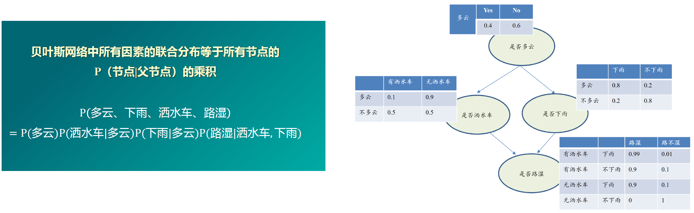{ width="600" }
</figure>

### 4.2 马尔可夫逻辑网络

将一阶谓词逻辑引入概率图，通过权重表示规则的不确定性

给定一个由若干规则构成的集合，集合中每条推理规则赋予一定权重，则可如下计算某个断言 𝑥 成立的概率：$P(X=x)=\dfrac{1}{Z}\exp(\sum\limits_iw_in_i(x))$，其中 $n_i(x)$ 是在推导 𝑥 中所涉及第 𝑖 条规则的逻辑取值（为 1 或 0），$w_i$ 是该规则对应的权重，𝑍 是一个固定的常量，可由下式计算：$Z = \sum\limits_{x\in X}\exp(\sum\limits_i w_in_i(x))$

<figure markdown="span">
  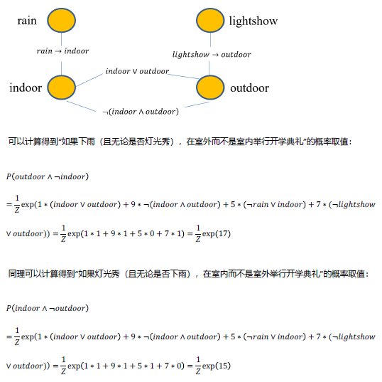{ width="600" }
</figure>

## 5 因果推理

辛普森悖论：忽略第三变量（混杂因子）会导致统计结论完全相反

<figure markdown="span">
  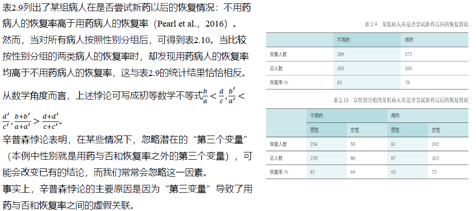{ width="600" }
</figure>

<figure markdown="span">
  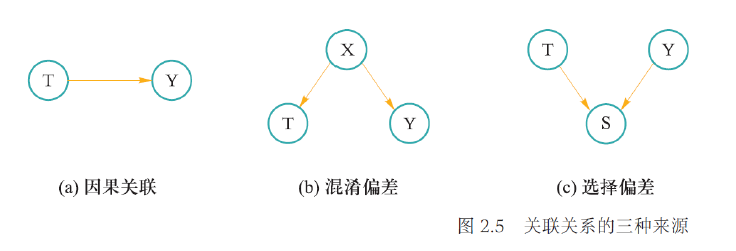{ width="600" }
</figure>

1. 因果关联：数据中两个变量，如一个变量是另一个变量的原因，则该两变量之间存在因果关联
2. 混淆关联：数据中待研究的两个变量之间存在共同的原因变量
3. 选择关联：数据中待研究的两个变量之间存在共同的结果变量

因果分析的理论框架：

1. 结构因果模型：使用因果图（DAG）描述数据生成机制
2. 潜在结果框架：关注干预后的潜在结果

因果图的优势：易于计算变量的联合概率

<figure markdown="span">
  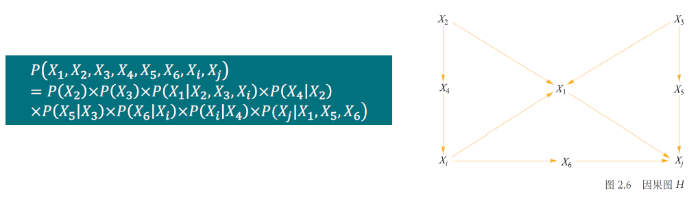{ width="600" }
</figure>

因果推理中的干预（intervention）：改变明确存在关联关系的某变量取值，研究变量取值改变对结果变量的影响，就是因果推理中常用的干预手段。比如：在已知商品价格和销售量存在关联关系的情况下，将商品价格提高一倍后，研究销售量会发生怎样的变化？在已知吸烟频率和患癌症概率存在关联关系的情况下，研究人们放弃吸烟后，患癌症概率会发生怎样的变化？

“do”算子：为了从因果分析角度实现这一任务，提出了“do”算子，计算当系统中一个变量取值发生变化、其他变量保持不变时，系统输出结果是否变化，这样可判断改变取值的变量是否是系统中起决定作用的原因要素

干预过程中固定系统中其他变量，然后改变某一变量取值，观察其他变量的变化。为了与 𝑋 的自然取值 𝑥 进行区分，在对 𝑋 进行干预时，引入 𝑑𝑜 算子，记作 𝑑𝑜(𝑋 = 𝑥)。因此，𝑃(𝑌 = 𝑦|𝑋 = 𝑥) 表示的是当发现 𝑋 = 𝑥 时，𝑌 = 𝑦 的概率；而 𝑃(𝑌 = 𝑦|𝑑𝑜(𝑋 = 𝑥)) 表示的是对 𝑋 进行干预，固定其值为 𝑥 时，𝑌 = 𝑦 的概率。用统计学的术语来说，𝑃(𝑌 = 𝑦|𝑋 = 𝑥) 反映的是在取值为 𝑥 的个体 𝑋 上，𝑌 的总体分布；而 𝑃(𝑌 = 𝑦|𝑑𝑜(𝑋 = 𝑥)) 反映的是如果将每一个 𝑋 取值都固定为 𝑥 时，𝑌 的总体分布

因果效应：$P(Y=y|do(X=x))$

因果效应差（ACE）：$P(Y=1|do(X=1)) - P(Y=1|do(X=0))$

<figure markdown="span">
  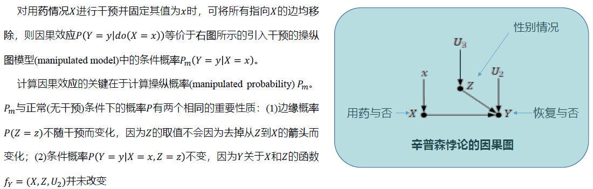{ width="600" }
</figure>

调整公式：$P(Y=y|do(X=x)) = \sum\limits_xP(Y=y|X=x,Z=z)P(Z=z)$

<figure markdown="span">
  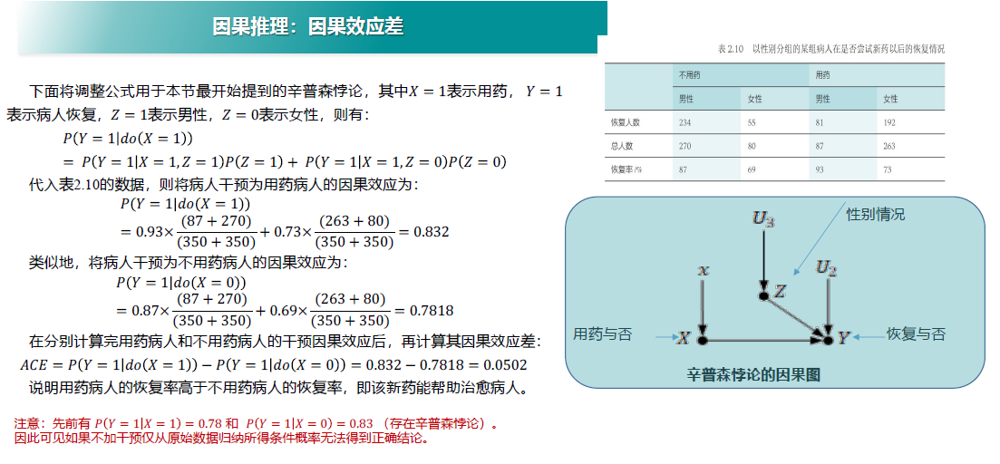{ width="600" }
</figure>

给定因果图 𝑮，𝑷𝑨 表示 𝑿 的父节点集合，则 𝑿 对 𝒀 的因果效应为：$P(Y=y|do(X=x)) = \sum\limits_xP(Y=y|X=x,PA=z)P(PA=z)$，在上一个例子中，Z 就是 PA 的具体取值

反事实推理：某个事情已经发生了，则在相同环境中，这个事情不发生会带来怎样的新结果