# 3 搜索探寻与问题求解

<!-- !!! tip "说明"

    本文档正在更新中…… -->

!!! info "说明"

    本文档仅涉及部分内容，仅可用于复习重点知识

## 1 搜索基本概念

搜索过程可视为搜索树的构建

<figure markdown="span">
  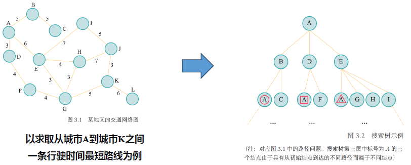{ width="600" }
</figure>

## 2 贪婪最佳优先搜索与 A* 搜索

### 2.1 贪婪最佳优先搜索

1. 评价函数 f(n)：从当前结点 𝒏 出发，根据评价函数来选择后续结点
2. 启发函数 h(n)：计算从结点 𝒏 到目标结点之间所形成路径的最小代价值

在贪婪最佳优先搜索中，将启发函数作为评价函数

<figure markdown="span">
  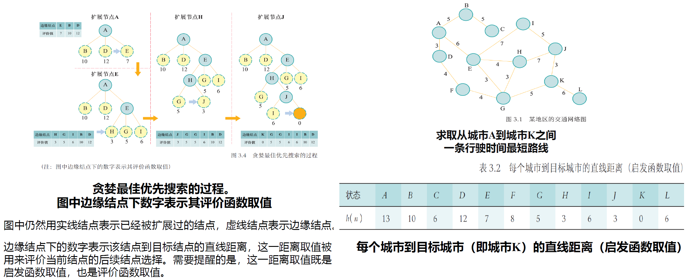{ width="600" }
</figure>

贪婪最佳优先搜索得到的解可能不是最优的

### 2.2 A* 搜索

评价函数 = 起始结点到结点 n 代价 + 结点 n 到目标结点代价

<figure markdown="span">
  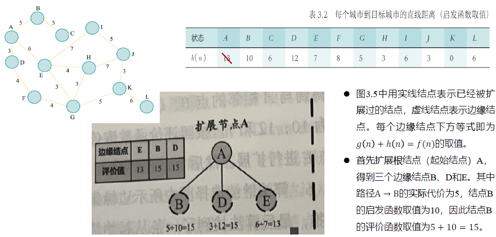{ width="600" }
</figure>

<figure markdown="span">
  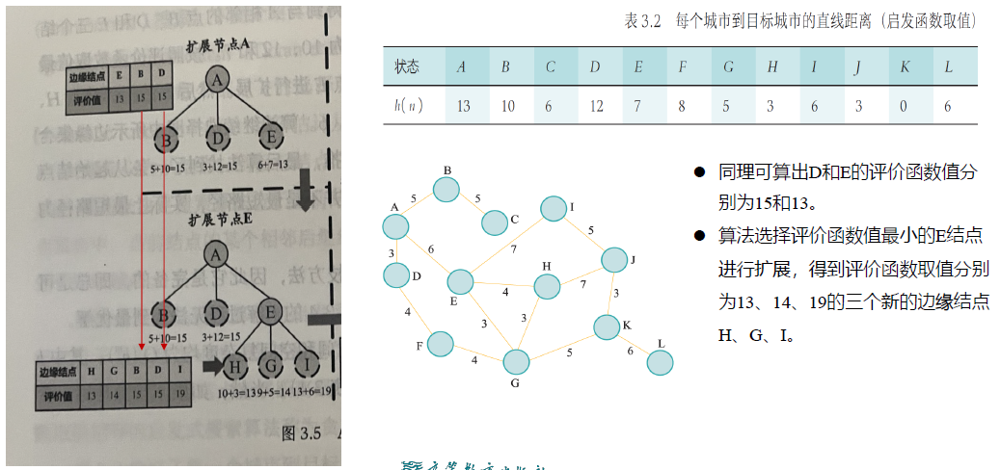{ width="600" }
</figure>

<figure markdown="span">
  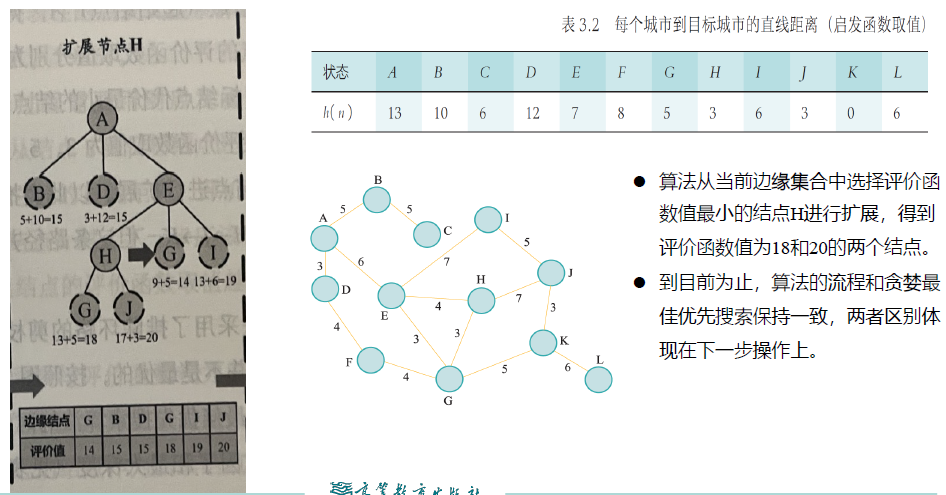{ width="600" }
</figure>

<figure markdown="span">
  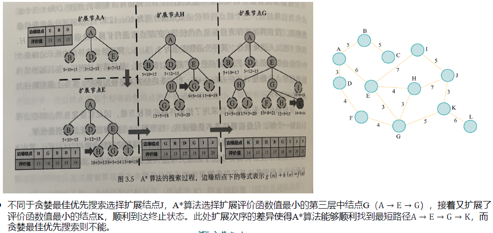{ width="600" }
</figure>

A* 搜索能够得到最优解

## 3 minimax 搜索与 alpha-beta 剪枝算法

### 3.1 minimax 搜索

1. 最大化玩家（max）：被视为我们，目标是最大化评分
2. 最小化玩家（min）：被视为对手，目标是最小化我们的评分，相当于最大化他们自己的评分

### 3.2 alpha-beta 剪枝算法

<figure markdown="span">
  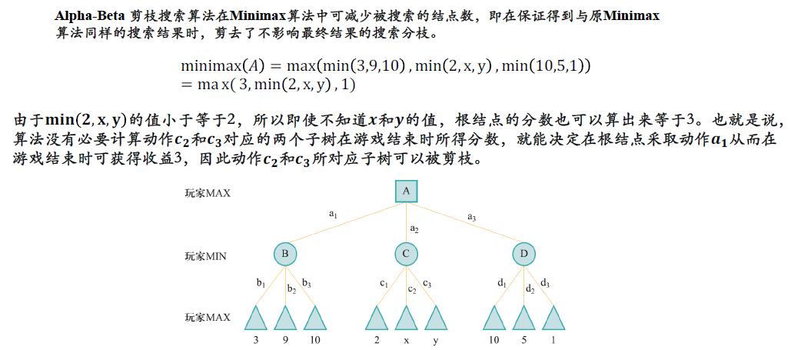{ width="600" }
</figure>

<figure markdown="span">
  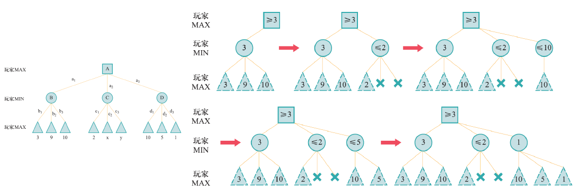{ width="600" }
</figure>

## 4 蒙特卡洛树搜索

蒙特卡洛树搜索（MCTS）的理论基础来源于多臂赌博机问题：智能体面前有 K 个赌博机，每次摇动一个臂膀会获得随机的收益。目标是在有限的 τ 次机会内，通过选择摇动哪个臂膀来获得最大总收益

- 利用（Exploitation）：选择目前看来收益最高的赌博机（基于历史数据）
- 探索（Exploration）：尝试那些被摇动次数少的赌博机，以确认它们是否可能有更高的潜在收益

如果只利用，可能会错过真正的最优解；如果只探索，会浪费大量资源

### 4.1 $\epsilon$-贪心算法

以 $1 - \epsilon$ 的概率利用（选最优），以 $\epsilon$ 的概率随机探索

缺点：探索是盲目的随机，没有优先考虑不确定性高的动作

### 4.2 上限置信区间算法

上限置信区间（UCB1）算法优先选择估计收益均值 + 不确定性惩罚项最高的动作

<figure markdown="span">
  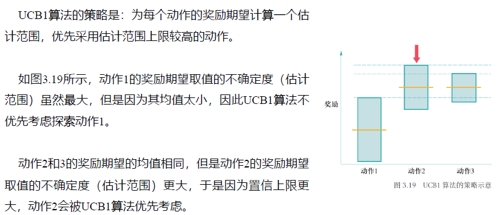{ width="600" }
</figure>

$UCB1 = \bar{x}_i + C\sqrt{\dfrac{2\ln t}{n_i}}$

1. $\bar{x}_i$：该节点目前的平均奖励（利用）
2. $C$：探索参数（控制探索欲望的超参数）
3. $\sqrt{\dfrac{2\ln t}{n_i}}$：不确定性项（探索）。$t$ 是父节点访问次数，$n_i$ 是该节点访问次数。访问越少，该项越大

### 4.3 蒙特卡洛树搜索算法

MCTS 并不是一次性的决策，而是一个迭代过程。算法通过反复执行以下四个步骤来构建和优化搜索树：

1. 选择：从根节点开始，递归地选择一个子节点，直到到达一个叶子节点（尚未完全扩展的节点）。使用 UCB1 公式来决定走哪条路，从而在利用已知好路和探索未走路之间做权衡
2. 扩展：当到达一个叶子节点 L 且 L 不是终止状态时，算法会随机创建一个或多个新的子节点 M。这代表了在当前局面下尝试了一个新的、之前未深入研究的走法
3. 模拟：从新扩展的节点 M 开始，使用默认策略（通常是快速随机策略，而非最优策略）进行游戏，直到分出胜负（到达终止节点）。不需要进行深度计算，只需通过随机对局快速得到一个结果（胜/负/平）
4. 反向传播：将模拟得到的结果（奖励分数）沿着刚才选择的路径，从叶子节点反向更新回根节点。路径上所有节点的访问次数 N 加 1。路径上所有节点的总收益 Q 更新为 Q + 结果

<figure markdown="span">
  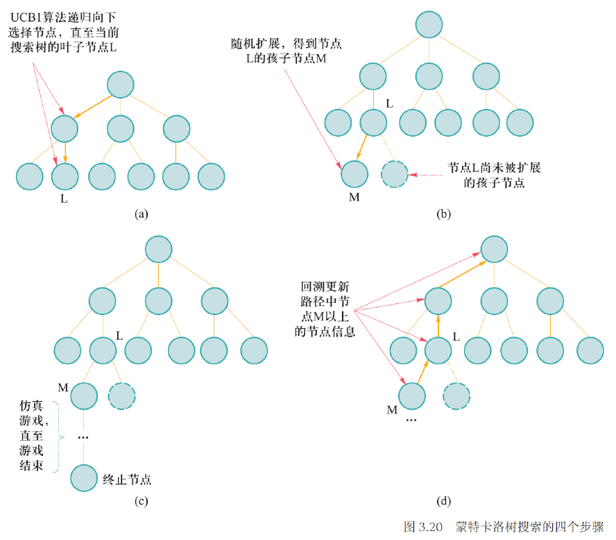{ width="600" }
</figure>

<figure markdown="span">
  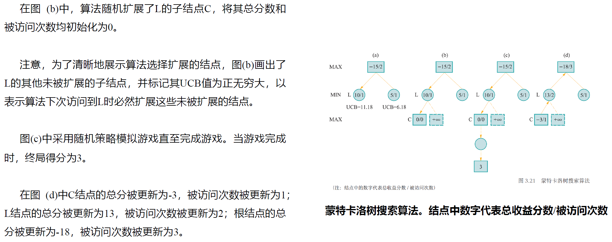{ width="600" }
</figure>

<figure markdown="span">
  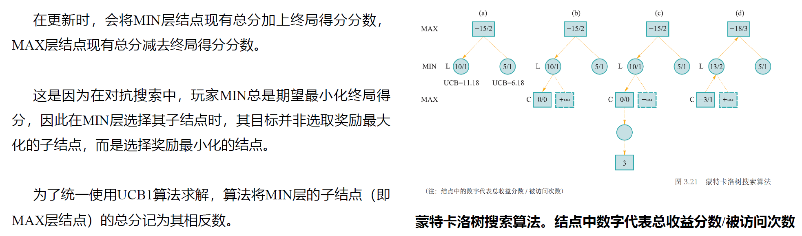{ width="600" }
</figure>