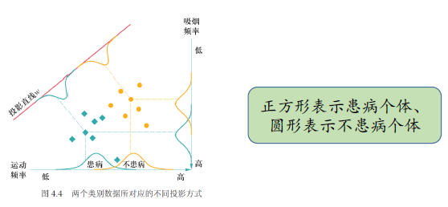

# 4 机器学习

!!! tip "说明"

    本文档正在更新中……

!!! info "说明"

    本文档仅涉及部分内容，仅可用于复习重点知识

## 1 机器学习基本概念

## 2 监督学习：回归分析与决策树

## 3 无监督学习：K 均值聚类

k-means 算法的目标是将 𝑛 个 𝑑 维数据划分为 𝐾 个聚簇，使得簇内方差最小化

## 4 监督学习与非监督学习下特征降维

### 4.1 线性判别分析

LDA 是一种监督学习的降维方法，也叫 Fisher 线性判别分析（FDA）。它的目标是将高维数据投影到低维空间，使得同一类样本尽可能聚集，不同类样本尽可能分开

<figure markdown="span">
  { width="600" }
</figure>

定义：

1. 样本集：$D = \lbrace (x_i,y_i)\rbrace_{i=1}^n, x_i \in R^d, y_i \in \lbrace C_1,C_2 \rbrace$
2. 第 $i$ 类样本集合：$X_i$
3. 第 $i$ 类样本均值：$m_i$
4. 第 $i$ 类样本协方差矩阵：$\Sigma_i = \sum_{x\in X_i}(x-m_i)(x-m_i)^T$

我们寻找一个投影向量 $w$，将样本投影到一维空间：$y=w^Tx$，投影后：

1. 类 $C_1$ 的均值为 $w^Tm_1$
2. 类 $C_2$ 的均值为 $w^Tm_2$
3. 类 $C_1$ 的协方差为 $w^T\Sigma_1w$
4. 类 $C_2$ 的协方差为 $w^T\Sigma_2w$

我们希望：

1. 类间距离尽量大：$(w^Tm_2 - w^Tm_1)^2$
2. 类内方差尽量小：$w^T\Sigma_1w + w^T\Sigma_2w$

因此定义目标函数：$J(w) = \dfrac{(w^Tm_2 - w^Tm_1)^2}{w^T\Sigma_1w + w^T\Sigma_2w}$

1. 类间散度矩阵：$S_b = (m_2-m_1)(m_2-m_1)^T$
2. 类内散度矩阵：$S_w = \Sigma_1 + \Sigma_2$

那么目标函数可转换为 $J(w) = \dfrac{w^TS_bw}{w^TS_ww}$

这是一个广义瑞利商，其最大值对应的 $w$ 是 $S_w^{-1}S_b$ 的最大特征值对应的特征向量

求解最优投影方向的方法是拉格朗日乘子法。我们最大化 $w^TS_bw$，约束 $w^TS_ww = 1$

拉格朗日函数：$L(w) = w^TS_bw - \lambda(w^TS_ww - 1)$

对 $w$ 求导并令为零可得：$S_w^{-1}S_b w = \lambda w$

由于 $S_b w = (m_2-m_1)(m_2-m_1)^T w = (m_2-m_1)\lambda_w$，代入得 $S_w^{-1}(m_2-m_1)\lambda_w = \lambda w$

去掉常数因子 $\lambda_w$，得到：$w = S_w^{-1}(m_2-m_1)$，这就是最优投影方向

### 4.2 主成分分析

## 5 演化学习