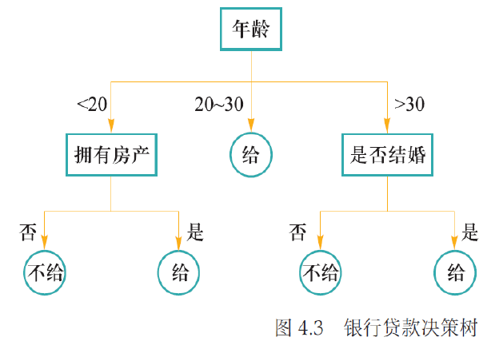

# 4 机器学习

<!-- !!! tip "说明"

    本文档正在更新中…… -->

!!! info "说明"

    本文档仅涉及部分内容，仅可用于复习重点知识

## 1 机器学习基本概念

机器学习就是从数据中自动学习规律，并用学到的规律对新数据进行预测或决策

| 类型 | 数据特点 | 典型任务 |
| -- | -- | -- |
| 监督学习 | 数据有标签 | 分类、回归 |
| 无监督学习 | 数据无标签 | 聚类、降维 |
| 半监督学习 | 部分有标签、部分无标签 | 利用少量标签提升效果 |

数据集划分：

| 数据集 | 作用 |
| -- | -- |
| 训练集 | 用于训练模型参数 |
| 验证集 | 用于调整超参数、选择最佳模型 |
| 测试集 | 用于最终评估模型性能 |

三个数据集之间没有任何交叉

损失函数用来衡量预测值 $f(x_i)$ 与真实值 $y_i$ 之间的差异。训练目标就是最小化所有样本损失之和

- 经验风险 $R_{emp}$：模型在训练集上的平均损失
- 期望风险 $R$：模型在所有数据（含未知数据）上的平均损失

存在关系：$R \leqslant R_{emp} + err$。其中 err 与模型复杂度和训练样本数有关

| 情况 | 经验风险 | 期望风险 | 结论 |
| -- | -- | -- | -- |
| 泛化能力强 | 小 | 小 | 理想状态 |
| 过拟合 | 小 | 大 | 模型过于复杂，记住了噪声 |
| 欠拟合 | 大 | 大 | 模型太简单，没学到规律 |

## 2 监督学习：回归分析与决策树

### 2.1 回归分析

回归分析是分析不同变量之间存在关系的研究方法，刻画变量之间关系的模型称为回归模型

线性回归只能处理线性关系，对于分类问题不适用

logistic regression 是在线性回归的基础上引入 sigmoid 函数，用于解决二分类问题

对于多分类问题，使用 softmax 函数将输出转换为各个类别的概率分布

### 2.2 决策树

决策树将分类问题分解为若干基于单个信息的推理任务，采用树状结构来逐步完成决策判断

<figure markdown="span">
  { width="600" }
</figure>

构建决策树的关键是选择哪个属性先进行划分。好的划分应该让子节点的纯度越来越高。熵值越小，纯度越高

信息增益划分前后信息熵的减少量，选择信息增益最大的属性作为当前节点的划分属性

## 3 无监督学习：K 均值聚类

k-means 算法的目标是将 𝑛 个 𝑑 维数据划分为 𝐾 个聚簇，使得簇内方差最小化

## 4 监督学习与非监督学习下特征降维

### 4.1 线性判别分析

LDA 是一种监督学习的降维方法，也叫 Fisher 线性判别分析（FDA）。它的目标是将高维数据投影到低维空间，使得同一类样本尽可能聚集，不同类样本尽可能分开

<figure markdown="span">
  { width="600" }
</figure>

定义：

1. 样本集：$D = \lbrace (x_i,y_i)\rbrace_{i=1}^n, x_i \in R^d, y_i \in \lbrace C_1,C_2 \rbrace$
2. 第 $i$ 类样本集合：$X_i$
3. 第 $i$ 类样本均值：$m_i$
4. 第 $i$ 类样本协方差矩阵：$\Sigma_i = \sum_{x\in X_i}(x-m_i)(x-m_i)^T$

我们寻找一个投影向量 $w$，将样本投影到一维空间：$y=w^Tx$，投影后：

1. 类 $C_1$ 的均值为 $w^Tm_1$
2. 类 $C_2$ 的均值为 $w^Tm_2$
3. 类 $C_1$ 的协方差为 $w^T\Sigma_1w$
4. 类 $C_2$ 的协方差为 $w^T\Sigma_2w$

我们希望：

1. 类间距离尽量大：$(w^Tm_2 - w^Tm_1)^2$
2. 类内方差尽量小：$w^T\Sigma_1w + w^T\Sigma_2w$

因此定义目标函数：$J(w) = \dfrac{(w^Tm_2 - w^Tm_1)^2}{w^T\Sigma_1w + w^T\Sigma_2w}$

1. 类间散度矩阵：$S_b = (m_2-m_1)(m_2-m_1)^T$
2. 类内散度矩阵：$S_w = \Sigma_1 + \Sigma_2$

那么目标函数可转换为 $J(w) = \dfrac{w^TS_bw}{w^TS_ww}$

这是一个广义瑞利商，其最大值对应的 $w$ 是 $S_w^{-1}S_b$ 的最大特征值对应的特征向量

求解最优投影方向的方法是拉格朗日乘子法。我们最大化 $w^TS_bw$，约束 $w^TS_ww = 1$

拉格朗日函数：$L(w) = w^TS_bw - \lambda(w^TS_ww - 1)$

对 $w$ 求导并令为零可得：$S_w^{-1}S_b w = \lambda w$

由于 $S_b w = (m_2-m_1)(m_2-m_1)^T w = (m_2-m_1)\lambda_w$，代入得 $S_w^{-1}(m_2-m_1)\lambda_w = \lambda w$

去掉常数因子 $\lambda_w$，得到：$w = S_w^{-1}(m_2-m_1)$，这就是最优投影方向

### 4.2 主成分分析

PCA 是一种无监督的特征降维方法。其目标是，在尽可能保留原始数据总体方差结构的前提下，将高维数据映射到低维空间。通俗地说，就是找到数据中方差最大的方向（主成分），将数据投影到这些方向上，从而用更少的维度表达数据的主要信息

原始数据往往存在冗余（如相邻像素之间高度相关）。高维数据会带来维度灾难，增加计算与存储成本。而 PCA 可以：去噪、减少冗余、提高后续任务（如分类、聚类）的效率

对每个样本 $x_i$ 进行中心化处理：$x_i = x_i - \mu,\ \mu = \dfrac{1}{n}\sum\limits_{i=1}^n x_i$，目的是使数据的均值为0，便于计算协方差矩阵

$X$ 是中心化后的数据矩阵，计算协方差矩阵 $\Sigma = \dfrac{1}{n-1}X^TX$

对协方差矩阵进行特征值分解：$\Sigma v= \lambda v$，特征值 $\lambda$ 表示该主成分方向上的方差大小。特征向量 $v$ 表示主成分的方向

将特征值从大到小排序：$\lambda_1 \geqslant \lambda_2 \geqslant \cdots \geqslant \lambda_d$，选择前 $l$ 个最大特征值对应的特征向量 $w_1, w_2, \cdots, w_l$，这些特征向量构成投影矩阵 $W$

将原始 $d$ 维样本 $x$ 映射到 $l$ 维空间 $z$，$z = W^Tx$

## 5 演化学习

演化学习是指一类受自然演化启发的启发式随机优化算法，通过突变重组和自然选择两种机制来模拟生物演化过程

常见的演化算法：

1. 遗传算法：最经典，使用选择、交叉、变异操作
2. 遗传规划：对计算机程序进行演化
3. 演化策略：强调自适应变异步长

遗传算法步骤：

1. 初始化种群：随机生成一定数量的染色体（候选解），每个染色体代表问题的一个潜在解
2. 计算适应度：适应度函数就是我们的目标函数（越大越好）
3. 选择（轮盘赌算法）：适应度越高的个体，被选中的概率越大
4. 交叉：随机选择一对染色体，随机选择一个位置，该位置之后的基因进行交换，产生新后代
5. 变异：以很小的概率随机改变染色体中的某个基因
6. 重新评价适应度，更新最优解
7. 判断终止条件