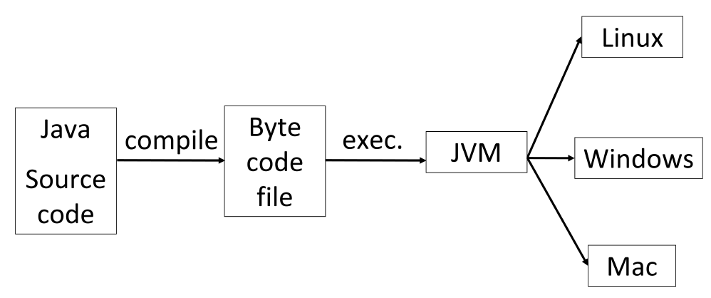

# 1 Introduction

<!-- !!! tip "说明"

    本文档正在更新中…… -->

!!! info "说明"

    本文档仅涉及部分内容，仅可用于复习重点知识

## 1 Java

Java 语言规范明确规定了每种基本数据类型所占用的字节数，并且要求在所有实现 Java 虚拟机（JVM）的平台上都必须严格遵守。这意味着，无论你的程序运行在 Windows、Linux、macOS 系统上，也无论底层是 x86、ARM 还是其他硬件架构，这些数据类型的长度都是固定不变的

### 1.1 How Java Runs

1. 编译期：`.java` 源文件通过 `javac` 编译器编译成 `.class` 字节码（一种介于高级语言和机器码之间的中间代码。它不是针对任何一种特定的硬件和操作系统，而是专门为 JVM 设计的指令集。这正是跨平台的基础）文件
2. 运行期：将 `.class` 字节码文件交给目标平台上的 JVM 来加载、解释或编译并执行

<figure markdown="span">
  { width="600" }
</figure>

### 1.2 Stable and KISS

1. Stable：指 Java 语言和平台非常稳定，向后兼容性做得很好。一个多年前编写的 Java 程序，在今天的新版本 JVM 上通常依然可以运行
2. KISS（Keep It Simple, Stupid）：一条著名的设计原则，意为“保持简单和直接”。Java 的设计哲学就是去除 C++ 中复杂、容易出错的特性，让语言更简单、更易于学习和使用

体现：

1. No point： Java 没有 C++ 中那样可以直接操作内存地址的指针。它使用更安全的“引用”来操作对象。这消除了因指针使用不当（如野指针、空指针解引用、内存越界）而导致的程序崩溃和安全漏洞，极大地增强了语言的稳定性和安全性
2. Index check：在 Java 中，每次访问数组元素时，JVM 都会自动检查下标是否越界。如果越界，会抛出 `ArrayIndexOutOfBoundsException` 异常，防止程序访问到非法的内存区域。而在 C++ 中，数组越界会导致未定义行为，是常见且危险的错误来源
3. Auto memory management：这就是我们常说的 **垃圾回收机制**。Java 开发者通常不需要像 C++ 那样手动 `new` 和 `delete`。JVM 中的垃圾回收器会自动追踪不再使用的对象并释放其内存，从根本上避免了内存泄漏和悬空指针等问题，使程序更稳定
4. C++ like：基本语法和面向对象思想与 C++ 非常相似。这使得有 C++ 背景的程序员可以相对轻松地过渡到 Java，降低了学习成本，符合 KISS 原则

### 1.3 Purer OOP

Java 相对于 C++ 减去的特性：

1. Multi-inheritance：避免“菱形继承”问题。Java 改用 **接口** 来实现多重继承的功能，接口只定义方法规范而不包含具体实现，从而避免了歧义
2. Virtual inheritance：这是 C++ 中用于解决菱形继承问题的一种复杂机制。因为 Java 从一开始就不允许多重继承，所以完全不需要这个复杂的概念
3. Template：Java 引入了 **泛型**。模板和泛型都是为了解决同一个问题（编译时处理的多态技术），但两个是不同的概念
4. Operator overloading：Java 不允许开发者自定义运算符的重载（除了字符串连接 `+`）。这个设计是为了保持代码的清晰和可读性，避免出现令人困惑的运算符行为，让代码行为更 predictable

### 1.4 Dynamic

1. Java has no such idea of a concrete program

    - 在 C/C++ 等传统语言中，最后所有代码会编译链接得到一个 `exe` 文件。这个文件就是一个具体的程序
    - Java 的看法完全不同。它认为世界是由类和对象构成的广阔空间（可以想象成一个巨大的、动态的零件库）

2. Java believes all classes and objects in the world are in one space：这个“空间”就是 Java 运行时环境。它包含了 JVM 自带的核心类库，你项目编译出的所有类，以及第三方 JAR 包引入的所有类。所有这些共同构成了一个统一的、活生生的生态系统
3. The compilation result of your program is one part of the space：编译生成的 `.class` 文件并不是一个独立的程序，而只是向这个巨大的“类空间”中添加了一些新的零件
4. To "run a program" is to start a thread from one method of one class in the space：所谓的“运行Java程序”，其实就是告诉 JVM：“请进入这个已经准备好的庞大空间，找到那个叫 `Main` 的类，执行它的 `public static void main(String[] args)` 方法，并以此作为起点开始运行”。这个起点（`main` 方法）就像一个触发开关，一旦启动，就会在这个动态的空间里创建对象、调用方法，各个“零件”开始协同工作

!!! tip "多个 main 函数"

    Java 的 `main` 函数是写在类里的。一个项目可以有多个 `.java` 文件，而这些 `.java` 文件可以有自己的 `main` 函数
    
    > C/C++ 整个项目有且仅有 1 个 `main` 函数
    
    运行 Java 程序时，你可以选择进入这些 `main` 函数中的一个，然后 JVM 再根据函数中的代码，寻找对应的零件，执行程序

### 1.5 Storage of Objects

1. For C, efficiency is the most important, so programmers can make decision by their own
2. For Java, all objects should be constructed in runtime and be stored in heap

Java 为了实现自动内存管理（垃圾回收）和语言的简单性，制定了一条明确的规则：**几乎所有对象实例** 都必须通过 `new` 关键字在运行时动态创建。这些动态创建的对象统一存储在 Heap 内存中

!!! tip "stack 里存什么"

    栈里只存储基本数据类型的局部变量和对象引用（可以理解为指向堆中对象地址的指针）

### 1.6 Create and Destroy Objects

1. You must create your objects：在 Java 中，几乎所有对象都必须通过 `new` 关键字显式地创建。这与基本类型（如 `int`, `char`）不同，基本类型的变量在声明时就会直接分配空间和值
2. But can not destroy them by yourself：这是 Java 与 C++ 等语言的一个关键区别。在 C++ 中，程序员需要用 `delete` 来手动释放对象内存。在 Java 中，没有提供任何像 `delete` 这样的操作符或方法来让程序员直接销毁一个对象。你无法强制 JVM 立即释放某个特定对象的内存
3. There is a recycle mechanism to help clean up objects that will never be used again

### 1.7 Root

1. Every class in Java is a descendant of one class: `Object`：在 Java 中，`Object` 类位于类继承树的最顶端。如果你定义一个类时没有用 `extends` 关键字明确指定父类，编译器会自动让它继承自 `Object` 类
2. So all objects in Java is objects of the class object
3. In this way, container is an object that can hold objects：这是单根继承带来的巨大优势。因为所有对象都是 `Object`，所以可以设计一个非常通用的容器（或称集合）

> 例如，`ArrayList` 类的内部可以简单地使用一个 `Object[]` 数组来存储元素。它可以存放任何类型的对象，因为任何对象向上转型为 `Object` 引用都是安全的

## 2 First Java Program

1. 一个 `.java` 源文件中最多只能有一个 `public class`
2. `.java` 源文件的文件名必须与其中的 `public class` 类名 **完全一致**

```java linenums="1" title="Helloworld.java"
public class Helloworld {
    // main 函数必须这样写
    public static void main(String[] args) {
        // System 是 Java 提供的核心类，代表系统本身
        // out 是 System 类的一个静态成员变量，类型为 PrintStream，代表标准输出流
        // println() 是 PrintStream 类的方法，用于输出内容并换行
        System.out.println("Hello, World!");
    }
}
```

```bash linenums="1"
# 编译 java 文件
$ javac Helloworld.java
# 执行程序，java 后跟类名
$ java Helloworld
Hello, World!
```

```java linenums="1" title="Helloworld.java"
public class Helloworld {
    public static void main(String[] args) {
        // 输出多个内容（字符串拼接）
        int age = 20;
        System.out.println("年龄：" + age);
    }
}
```

```java title="输出" linenums="1"
年龄：20
```

!!! tip "其他输出函数"

    1. `print()`：输出内容后不会换行
    2. `printf()`：格式化输出。和 C 语言类似

## 3 Scanner

```java linenums="1"
import java.util.Scanner;
```

`Scanner` 的构造函数可以接收多种类型的输入源

| 输入源 | 构造函数示例 | 说明 |
| -- | -- | -- |
| 标准输入（键盘） | `Scanner sc = new Scanner(System.in);` | 最常用，从控制台读取用户输入 |
| 字符串 | `Scanner sc = new Scanner("Hello World");` | 用于解析给定的字符串 |
| 文件 | `Scanner sc = new Scanner(new File("myFile.txt"));` | 读取文件内容，需要处理 `FileNotFoundException` |

使用 `close()` 方法关闭 Scanner 对象是一个好习惯，尤其是在读取文件时，可以释放相关的 I/O 资源。关闭后，与之关联的底层流（如 `System.in`）也会被关闭。如果之后还需要使用 `System.in`，关闭 Scanner 会导致无法再从控制台读取输入

### 3.1 Scanner 方法

| 方法 | 功能 |
| -- | -- |
| `next()` | 查找并返回下一个完整的令牌（token）（默认以空格/换行符分隔） |
| `nextLine()` | 读取下一行输入（包括空格，以换行符 `\n` 结束） |
| `nextInt()` | 将下一个令牌扫描为 `int` 类型 |
| `nextDouble()` | 将下一个令牌扫描为 `double` 类型 |
| `nextBoolean()` | 将下一个令牌扫描为 `boolean` 类型 |
| `...` | 其他基本类型如 `nextByte()`, `nextShort()`, `nextLong()`, `nextFloat()` |
| `hasNext()` | 判断是否还有下一个令牌（非空） |
| `hasNextInt()` | 判断下一个令牌是否可解释为 `int` 类型 |
| `hasNextDouble()` | 判断下一个令牌是否可解释为 `double` 类型 |
| `...` | 其他类型对应的方法，如 `hasNextBoolean()` 等 |

### 3.2 分隔符

默认情况下，Scanner 使用空白字符（空格、制表符、换行符等）作为分隔符来分割令牌。
可以使用 `useDelimiter()` 方法来指定自己的分隔符模式（支持正则表达式）

```java linenums="1" title="创建字符串"
String input = "Apple, Banana, Cherry\nOrange";
Scanner sc = new Scanner(input);
sc.useDelimiter(",|\\n"); // 分隔符是“逗号”或“换行符”

while (sc.hasNext()) {
    System.out.println(sc.next().trim()); // trim()去除首尾空格
}

sc.close();

// 输出:
// Apple
// Banana
// Cherry
// Orange
```

### 3.3 `nextLine()` 与 `next()` 的陷阱

`nextInt()`, `nextDouble()`, `next()` 等这些方法在读取后，不会消耗输入行末尾的换行符 `\n`。紧接着调用 `nextLine()` 时，它会读取到之前留下的那个换行符，并立即返回一个空字符串

解决方案：在调用 `nextLine()` 之前，先额外调用一次 `nextLine()` 来“消耗”掉残留的换行符

```java linenums="1" title="创建字符串"
Scanner sc = new Scanner(System.in);
System.out.print("请输入数字: ");
int num = sc.nextInt();
sc.nextLine();  // 消耗掉残留的换行符

System.out.print("请输入字符串: ");
String str = sc.nextLine();

System.out.println("数字: " + num);
System.out.println("字符串: '" + str + "'");
```

## 4 格式化输出

使用 `System.out.printf()` 或 `String.format()` 进行格式化输出，语法与 C 语言类似

| 格式符 | 含义 |
| -- | -- |
| `%d` | 整数 |
| `%f` | 浮点数（默认保留 6 位小数）|
| `%.2f` | 浮点数（保留 2 位小数）|
| `%s` | 字符串 |
| `%c` | 字符 |
| `%ms` | 宽度为 m，右对齐，左侧补空格（字符串）|
| `%md` | 宽度为 m，右对齐，左侧补空格（整数）|
| `%-ms` | 宽度为 m，左对齐，右侧补空格|
| `%0md` | 宽度为 m，左侧补 0（整数）|

> `%` 后加宽度、`-`（左对齐）、`0`（补零）

```java linenums="1"
int a = 10;
double b = 3.14159;
String s = "Java";
System.out.printf("a=%d, b=%.2f, s=%s%n", a, b, s);
// 输出：a=10, b=3.14, s=Java
```

`String.format()` 用于生成格式化字符串，不直接输出：

```java linenums="1"
String str = String.format("姓名：%s，分数：%.1f", "张三", 95.5);
System.out.println(str);
```

## 5 Java 标识符

Java 标识符规则：

1. 必须以字母、`_`、`$` 开头（在较新版本中，Unicode 字符如中文也可以开头）
2. 后续字符可以是字母、数字、下划线、`$` 以及某些 Unicode 字符
3. 不能是 Java 关键字或保留字

```java linenums="1"
// 是可以编译运行的
public class Test {
    public static void main(String[] args) {
        int 名字 = 10;
        int $1a = 20;
        System.out.println(名字);
        System.out.println($1a);
    }
}
```