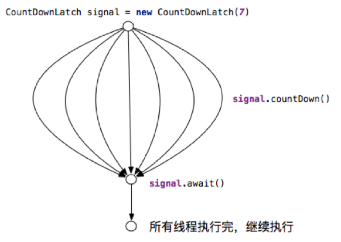
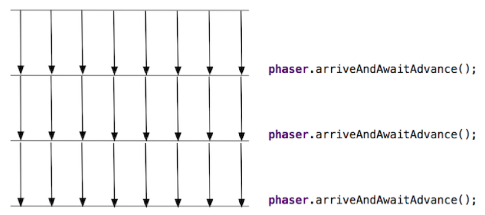

# 10 Thread Coordination and Parallel Streams

<!-- !!! tip "说明"

    本文档正在更新中…… -->

!!! info "说明"

    本文档仅涉及部分内容，仅可用于复习重点知识

## 1 同步辅助器

Java 并发包 `java.util.concurrent` 提供了一系列同步辅助器，用于协调多线程之间的执行顺序和时序关系，相比基本的 `synchronized` 和 `wait()` / `notify() `机制更加灵活和强大

### 1.1 CountDownLatch

`CountDownLatch`：允许一个或多个线程等待，直到在其他线程中执行的一组操作完成

1. 初始化：在创建 `CountDownLatch` 时，需要指定一个初始计数值。这个计数值代表需要完成的事件或任务的数量
2. 等待（await）：一个或多个线程可以调用 `latch.await()` 方法。调用后，这些线程会立即被阻塞，进入等待状态，就像被一个关闭的门闩拦住一样
3. 倒数 (countDown)：其他线程在每完成一个事件或任务后，就调用 `latch.countDown()` 方法。这个方法会将内部的计数值减一
4. 开门：当计数值被减到零时，门闩就会打开。所有之前因调用 `await()` 而被阻塞的线程都会被立即唤醒，可以继续执行它们后续的逻辑

==`CountDownLatch` 是一次性的==，计数值减到零后，它就失去了作用，不能被重置

<figure markdown="span">
  { width="600" }
</figure>

```java linenums="1"
public class CountDownLatchDemo {
    public static void main(String[] args) throws InterruptedException {
        int workerCount = 3;
        CountDownLatch startSignal = new CountDownLatch(1);
        CountDownLatch doneSignal = new CountDownLatch(workerCount);
        
        for (int i = 0; i < workerCount; i++) {
            new Thread(() -> {
                try {
                    startSignal.await(); // 等待开始信号
                    System.out.println(Thread.currentThread().getName() + " 开始工作");
                    Thread.sleep((long) (Math.random() * 1000));
                    System.out.println(Thread.currentThread().getName() + " 工作完成");
                    doneSignal.countDown(); // 完成计数减 1
                } catch (InterruptedException e) {
                    e.printStackTrace();
                }
            }).start();
        }
        
        Thread.sleep(1000);
        System.out.println("主线程：发出开始信号");
        startSignal.countDown(); // 开始所有工作线程
        
        doneSignal.await(); // 等待所有工作线程完成
        System.out.println("主线程：所有工作完成");
    }
}
```

### 1.2 CyclicBarrier

`CyclicBarrier`：允许一组线程互相等待，直到所有线程都到达一个共同的屏障点，然后这些线程再一起继续执行

1. 初始化：创建一个 `CyclicBarrier` 时，需要指定一个参与方的数量（parties），也就是需要等待的线程数量
2. 等待 (await)：每个线程在到达屏障点时，调用 `barrier.await()` 方法。调用后，该线程会被阻塞，并等待其他线程
3. 打破屏障：当最后一个线程（第 N 个线程）调用 `await()` 方法时，屏障就会被打破。此时，所有之前因调用 `await()` 而被阻塞的线程都会被立即唤醒，并一起继续执行
4. 循环使用 (Cyclic)：一旦屏障被打破，它会自动重置（reset）。下一次这些线程再调用 `await()` 时，它们会为下一轮的集合而等待。==这是它与 `CountDownLatch` 最核心的区别==

<figure markdown="span">
  { width="600" }
</figure>

`public CyclicBarrier(int parties, Runnable barrierAction)`：构造函数之一。`barrierAction` 是一个 `Runnable` 任务。当屏障被打破时，在唤醒所有等待线程之前，会由最后一个到达屏障的线程来执行这个 `barrierAction` 任务

```java linenums="1"
public class CyclicBarrierDemo {
    public static void main(String[] args) {
        int threadCount = 3;
        CyclicBarrier barrier = new CyclicBarrier(threadCount, () -> {
            System.out.println("所有线程已到达屏障，执行屏障操作");
        });
        
        for (int i = 0; i < threadCount; i++) {
            final int threadId = i;
            new Thread(() -> {
                try {
                    System.out.println("线程" + threadId + " 第一阶段工作");
                    Thread.sleep((long) (Math.random() * 1000));
                    System.out.println("线程" + threadId + " 到达屏障");
                    barrier.await(); // 等待其他线程
                    
                    System.out.println("线程" + threadId + " 第二阶段工作");
                    Thread.sleep((long) (Math.random() * 1000));
                    System.out.println("线程" + threadId + " 再次到达屏障");
                    barrier.await(); // CyclicBarrier 可以重复使用
                    
                    System.out.println("线程" + threadId + " 完成所有工作");
                } catch (InterruptedException | BrokenBarrierException e) {
                    e.printStackTrace();
                }
            }).start();
        }
    }
}
```

### 1.3 Phaser

`Phaser`：可以被看作是 `CyclicBarrier` 和 `CountDownLatch` 的一个更强大、更灵活的合体。它同样用于多线程分阶段的同步，但提供了更动态的功能

1. 动态调整参与方数量 (Dynamic Parties)：这是 `Phaser` 最核心、最强大的特性。与 `CyclicBarrier` 在创建时就固定参与方数量不同，`Phaser` 允许在任何时候动态地增加或减少需要同步的线程数量

    1. 一个线程可以通过 `register()` 方法加入 `Phaser`
    2. 一个线程可以通过 `arriveAndDeregister()` 方法在完成自己的任务后离团

2. 阶段 (Phases)：`Phaser` 内部维护一个阶段编号（phase number），从 0 开始。当所有已注册的参与方都到达屏障后，阶段编号会加一，然后进入下一个阶段。这使得跟踪多阶段任务的进展变得容易
3. 分层结构 (Tiering)：`Phaser` 可以组织成树状结构。一个 `Phaser` 可以有一个父 `Phaser`。当一个子 `Phaser` 的屏障被打破时，它会作为一个参与方去通知其父 `Phaser`。这种分层结构可以减少大规模线程同步时的竞争，提高可伸缩性

<figure markdown="span">
  { width="600" }
</figure>

| 方法 | 作用 |
| -- | -- |
| `register()` | 注册一个新的参与方，使得屏障需要多等待一个线程 |
| `arrive()` | 一个参与方到达屏障。它不会阻塞，并立即返回到达时所处的阶段编号。该线程可以继续做其他事 |
| `awaitAdvance(int phase)` | 阻塞等待，直到 `Phaser` 的阶段编号超过了给定的 `phase` 值 |
| `arriveAndAwaitAdvance()` | 相当于 `arrive()` + `awaitAdvance()`。参与方到达屏障并阻塞等待，直到所有其他参与方都到达 |
| `arriveAndDeregister()` | 参与方到达屏障，并从 `Phaser` 中注销自己。此后，屏障将不再等待该线程。返回到达时的阶段编号 |
| `onAdvance(int phase, int registeredParties)` | 可被子类覆写，类似于 `CyclicBarrier` 的 `barrierAction`。当一个阶段结束时，该方法会被调用。如果它返回 `true`，则表示 `Phaser` 应该终止 |

```java linenums="1"
public class PhaserDemo {
    public static void main(String[] args) {
        // 初始参与方为 1 (主线程)
        Phaser phaser = new Phaser(1);
        
        // 创建 3 个工作线程
        for (int i = 0; i < 3; i++) {
            final int workerId = i + 1;
            phaser.register(); // 注册一个新参与方
            new Thread(() -> {
                // 阶段 0
                System.out.println("线程 " + workerId + " 完成阶段 0");
                phaser.arriveAndAwaitAdvance(); // 到达并等待

                // 线程 3 在阶段 0 后退出
                if (workerId == 3) {
                    System.out.println("线程 " + workerId + " 退出。");
                    phaser.arriveAndDeregister(); // 到达并注销
                    return;
                }

                // 阶段 1
                System.out.println("线程 " + workerId + " 完成阶段 1");
                phaser.arriveAndAwaitAdvance(); // 到达并等待

                // 阶段 2
                System.out.println("线程 " + workerId + " 完成阶段 2");
                phaser.arriveAndDeregister(); // 完成所有工作，注销
            }).start();
        }

        // 主线程控制阶段的开始
        // 阶段 0 -> 1
        System.out.println("--- 主线程：准备开始阶段 1 ---");
        phaser.arriveAndAwaitAdvance();

        // 阶段 1 -> 2
        System.out.println("--- 主线程：准备开始阶段 2 ---");
        // 模拟一个新任务加入
        phaser.register();
        new Thread(() -> {
            System.out.println("新线程 4 完成阶段 2");
            phaser.arriveAndDeregister();
        }).start();
        phaser.arriveAndAwaitAdvance();

        // 阶段 2 -> 结束
        System.out.println("--- 主线程：准备结束 ---");
        phaser.arriveAndAwaitAdvance();

        System.out.println("所有阶段完成，Phaser 已终止: " + phaser.isTerminated());
    }
}
```

## 2 ForkJoinPool

`ForkJoinPool` 是 Java 7 中引入的一个特殊的线程池，它是 Fork/Join 并行计算框架的核心。这个框架专门用于处理那些可以被递归地分解成更小独立子任务的计算密集型任务

`ForkJoinPool` 的设计完全基于分而治之的算法思想

!!! tip "Work Stealing"

    工作窃取。这是 `ForkJoinPool` 与普通线程池最核心的区别，也是其高性能的关键
    
    普通线程池：通常使用一个共享的任务队列。所有线程都从这个队列中获取任务。当任务多、线程多时，对这个共享队列的访问会成为性能瓶颈
    
    `ForkJoinPool`：
    
    1. 双端队列 (Deque)：池中的每个工作线程都有自己独立的双端队列（Deque）来存放任务
    2. LIFO (后进先出)：工作线程优先处理自己队列头部的任务。这通常是最新分解出的子任务，利用了 CPU 缓存的局部性原理，效率更高
    3. 工作窃取 (Work-Stealing)：当一个线程完成了自己队列中的所有任务后，它不会闲置等待。相反，它会变成一个小偷，去查看其他线程的队列，并从队列的尾部窃取一个任务来执行
    4. FIFO (先进先出)：窃取任务时从尾部拿，这通常是较早创建的、粒度更大的任务。窃取一个大任务可以保证小偷线程在接下来的一段时间内有活干，从而减少了窃取的频率和线程间的竞争

`ForkJoinTask<V>`: 在 `ForkJoinPool` 中运行的任务的抽象基类。它有两个关键的子类：

1. `RecursiveTask<V>`: 一个会返回结果的递归任务
2. `RecursiveAction`: 一个不返回结果的递归任务，仅执行某些操作

`ForkJoinPool` 的使用方法：

1. 创建任务类：编写一个类，继承 `RecursiveTask` 或 `RecursiveAction`
2. 实现 `compute()` 方法：这是任务的核心逻辑

    1. 设置阈值：在 `compute()` 方法中，首先判断当前任务是否足够小（低于预设的阈值）
    2. 直接计算：如果任务足够小，就直接执行计算
    3. 分解任务：如果任务太大，就将其分解成两个或多个子任务
    4. 调用 `fork()` 和 `join()`：对子任务调用 `fork()`，将其放入工作队列等待异步执行；对子任务调用 `join()`，阻塞当前线程，直到该子任务执行完毕并返回结果

3. 启动任务：创建一个 `ForkJoinPool` 实例，创建一个顶层任务的实例，通过 `pool.invoke(task)` 或 `pool.submit(task)` 来启动执行

```java linenums="1"
// 1. 创建一个继承自 RecursiveTask 的任务类
class SumTask extends RecursiveTask<Long> {
    private static final int THRESHOLD = 1000; // 阈值
    private final long[] array;
    private final int start;
    private final int end;

    public SumTask(long[] array, int start, int end) {
        this.array = array;
        this.start = start;
        this.end = end;
    }

    @Override
    protected Long compute() {
        // 2. 如果任务足够小，直接计算
        if (end - start <= THRESHOLD) {
            long sum = 0;
            for (int i = start; i < end; i++) {
                sum += array[i];
            }
            return sum;
        }

        // 3. 如果任务太大，一分为二
        int middle = (start + end) / 2;
        SumTask leftTask = new SumTask(array, start, middle);
        SumTask rightTask = new SumTask(array, middle, end);

        // 4. 异步执行子任务
        leftTask.fork(); // 安排左边的任务去执行
        rightTask.fork(); // 安排右边的任务去执行

        // 5. 等待子任务完成并合并结果
        return leftTask.join() + rightTask.join();
    }
}

public class ForkJoinDemo {
    public static void main(String[] args) {
        long[] array = new long[10000];
        for (int i = 0; i < array.length; i++) {
            array[i] = i + 1;
        }

        // 6. 创建 ForkJoinPool 和顶层任务
        ForkJoinPool pool = new ForkJoinPool();
        SumTask task = new SumTask(array, 0, array.length);

        // 7. 启动任务并获取结果
        long result = pool.invoke(task);
        System.out.println("计算结果: " + result);
        pool.shutdown();
    }
}
```

## 3 parallelStream

`parallelStream`：是 Java Stream API 的一部分，它提供了一种非常简单的方式来对集合中的元素进行并行处理，从而在多核处理器上显著提升性能

`parallelStream` 的核心思想是数据并行。它会自动将一个大的数据集（例如一个 `List`）分割成多个小块，然后将这些小块分配给多个线程同时处理。处理完成后，再将各个线程的结果合并起来

1. 分割 (Splitting)：流的源数据通过一个名为 `Spliterator` 的工具被递归地分割成多个部分
2. 处理 (Processing)：Java 会使用一个公共的 `ForkJoinPool`（`ForkJoinPool.commonPool()`），将这些数据块分配给池中的工作线程去并行执行流中间操作
3. 合并 (Combining)：最后，将每个线程处理得到的结果按照流操作的定义合并起来，得到最终结果

将顺序流转换为并行流：

```java linenums="1"
// 从集合创建
List<Integer> numbers = new ArrayList<>();
Stream<Integer> parallelStream = numbers.parallelStream();

// 从现有流转换
Stream<Integer> sequentialStream = numbers.stream();
Stream<Integer> parallelStream = sequentialStream.parallel();
```

错误地使用 `parallelStream` 可能会导致性能下降甚至程序错误：

1. I/O 密集型任务：==绝对不要在并行流中执行阻塞的 I/O 操作==（如读写文件、网络请求、数据库查询）。`parallelStream` 默认使用公共的 `ForkJoinPool`，其线程数通常等于 CPU 核心数。如果这些宝贵的线程因为等待 I/O 而被阻塞，整个应用中所有依赖公共池的任务（包括其他并行流、`CompletableFuture` 等）都会被饿死，导致严重的性能问题
2. 线程安全问题：并行流会在多个线程中同时执行 Lambda 表达式。如果在其中修改了共享的可变变量（例如一个普通的 `ArrayList` 或一个成员变量），就会产生线程安全问题（竞态条件），导致结果不可预测

可以创建一个自定义的 `ForkJoinPool`，将并行流封装成一个任务并在自定义池中提交