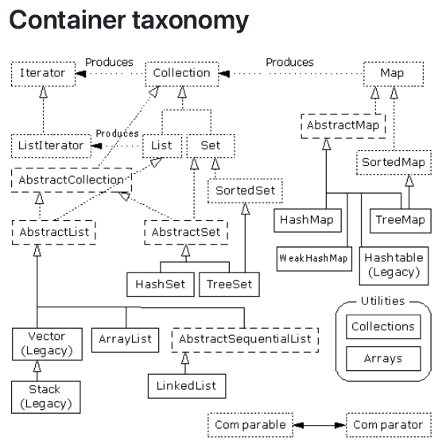

# 5 Container and Generics

!!! tip "说明"

    本文档正在更新中……

!!! info "说明"

    本文档仅涉及部分内容，仅可用于复习重点知识

## 1 Array

在 Java 中，数组是一种用于存储固定大小的同类型元素的线性数据结构

```java linenums="1" title="声明"
int[] numbers;
String[] names;
double[] scores;
```

初始化：

```java linenums="1" title="静态初始化"
// 完整格式
int[] arr1 = new int[]{1, 2, 3, 4, 5};

// 简化格式（最常用）
int[] arr2 = {1, 2, 3, 4, 5};
String[] strArr = {"Hello", "World"};
```

```java linenums="1" title="动态初始化"
int[] arr = new int[5];  // 创建一个长度为5的int数组，默认值全是0
```

```java linenums="1" title="声明后再初始化"
int[] arr;
// arr = {1, 2, 3}; // 错误！不能这样写
arr = new int[]{1, 2, 3}; // 正确
```

Array 在 Java 中被视为对象，它继承自 `java.lang.Object`，因此两个 Array 变量可以相互赋值

```java linenums="1"
int[] a = new int[10];
a[0] = 5;
int[] b = a;
b[0] = 16;
System.out.println(a[0]);  // 输出：16
```

### 1.1 访问 Array

使用 `{arrayName.length}` 属性获取长度，注意这不是方法

```java linenums="1" title="声明后再初始化"
int[] arr = {1, 2, 3};
System.out.println(arr.length); // 输出：3
```

遍历数组可以使用 `foreach` 或者普通的 `for` 循环

```java linenums="1" title="声明后再初始化"
int[] arr = {1, 2, 3, 4, 5};
for (int num : arr) {
    System.out.println(num);
}
// var：编译器自动推断类型
for (var num : arr) {
    System.out.println(num);
}
```

!!! tip "bounds checking"

    编译器本身不会验证你使用的数组下标是否在数组的有效范围内，为了避免程序运行时导致问题，Java 语言在运行时负责进行边界检查。这意味着当程序执行到访问数组元素的代码时，JVM 会自动检查你提供的下标是否在合法的范围内。如果检查发现下标越界，Java 会抛出一个 `ArrayIndexOutOfBoundsException` 运行时异常
    
    ```java linenums="1"
    public class Test {
        public static void main(String[] args) {
            int[] nums = {1, 2, 3, 4, 5};
            System.out.println(nums[5]);
        }
    }
    ```
    
    ```bash linenums="1"
    $ javac Test.java  # 不会报错
    $ java Test  # 运行时检查
    Exception in thread "main" java.lang.ArrayIndexOutOfBoundsException: Index 5 out of bounds for length 5
        at Test.main(Test.java:4)
    ```

### 1.2 Array 方法

| 方法 | 说明 | 返回值 |
| :--: | :--: | :--: |
| `String Arrays.toString(array)` | 将数组转换为字符串表示形式 | |
| `String Arrays.deepToString(array)` | 将多维数组转换为字符串表示形式  | |
| `void Arrays.sort(array)`| 对数组进行升序排序 | |
| `void Arrays.sort(array, fromIndex, toIndex)` | 对数组指定范围进行排序| |
| `int Arrays.binarySearch(array, key)` | 在已排序数组中二分查找元素 | 找到则返回索引，否则返回负值 |
| `T[] Arrays.copyOf(original, newLength)` | 复制数组，可指定新长度 | |
| `T[] Arrays.copyOfRange(original, from, to)` | 复制数组的指定范围 | |
| `boolean Arrays.equals(array1, array2)`| 比较两个数组是否相等 | |
| `boolean Arrays.deepEquals(array1, array2)`| 比较两个多维数组是否相等 | |
| `void Arrays.fill(array, value)`| 用指定值填充整个数组 | |
| `void Arrays.fill(array, fromIndex, toIndex, value)` | 用指定值填充数组的指定范围 | |
| `List<T> Arrays.asList(elements...)` | 将元素列表转换为固定大小的 `List` | |
| `Stream<T> Arrays.stream(array)`| 将数组转换为 `Stream` 流 | |
| `void Arrays.parallelSort(array)`| 并行排序数组 | 大数据量时更高效 |
| `void Arrays.setAll(array, generator)`| 使用生成函数设置所有元素的值 | |
| `void Arrays.parallelSetAll(array, generator)`| 并行使用生成函数设置所有元素的值 | |
| `void Arrays.parallelPrefix(array, op)`| 并行计算数组的前缀 | |
| `int Arrays.mismatch(array1, array2)` | 查找两个数组第一个不匹配的索引 | |
| `int Arrays.compare(array1, array2)` | 按字典顺序比较两个数组 | |
| `void System.arraycopy(...)` | 高效复制数组 | 系统级底层方法 |
| `Object array.clone()` | 克隆数组 | 浅拷贝 |

### 1.3 多维数组

Java 中的多维数组本质上就是数组的数组。这意味着数组中的每个元素本身也是一个数组

```java linenums="1"
// 声明一个 2 行 3 列的整数数组
int[][] matrix = new int[2][3];

// 声明并初始化一个 2 行 3 列的数组
int[][] matrix = {
    {1, 2, 3},   // 第 0 行
    {4, 5, 6}    // 第 1 行
};
```

还可以定义不规则数组，多维数组的每一行可以有不同的长度

```java linenums="1"
// 声明一个二维数组，但只指定第一维（行数）
int[][] jaggedArray = new int[3][];

// 然后为每一行分别分配不同长度的数组
jaggedArray[0] = new int[1]; // 第0行有1列
jaggedArray[1] = new int[2]; // 第1行有2列
jaggedArray[2] = new int[3]; // 第2行有3列

// 也可以用字面量初始化不规则数组
int[][] jaggedArray2 = {
    {1},        // 第0行，长度1
    {2, 3},     // 第1行，长度2
    {4, 5, 6}   // 第2行，长度3
};
```

## 2 Collection

Collection 是 Java 集合框架的根接口，它代表了一组对象的容器，定义了集合类的基本操作

```text linenums="1"
集合框架根接口
├── Collection (接口)
│   ├── List (接口 - 有序、可重复)
│   │   ├── ArrayList (类)
│   │   ├── LinkedList (类)
│   │   └── Vector (类)
│   │       └── Stack (类)
│   ├── Set (接口 - 无序、不可重复)
│   │   ├── HashSet (类)
│   │   ├── LinkedHashSet (类)
│   │   └── TreeSet (类)
│   └── Queue (接口 - 队列)
│       ├── LinkedList (类)
│       ├── PriorityQueue (类)
│       └── Deque (接口)
│           └── ArrayDeque (类)
│
└── Map (接口)
    ├── HashMap
    ├── TreeMap
    ├── LinkedHashMap
    └── Hashtable
```

<figure markdown="span">
  { width="600" }
</figure>

collection 类是 generic 类，在定义变量时，要指定两种类型：集合本身的类型和存储在集合中的元素的类型

```java linenums="1"
ArrayList<String> stringList = new ArrayList<String>();
// 简化写法 - 编译器自动推断类型
ArrayList<String> list1 = new ArrayList<>();  // 推断为 String
```

### 2.1 Iterate

迭代（遍历）Collection 是指按顺序访问集合中的每一个元素的过程

1.简单的 `for` 循环（仅 `List` 可用）

```java linenums="1"
List<String> list = Arrays.asList("Apple", "Banana", "Orange");

for (int i = 0; i < list.size(); i++) {
    String fruit = list.get(i);
    System.out.println("索引 " + i + ": " + fruit);
}
```

2.for-each 循环（最常用）

```java linenums="1"
List<String> list = Arrays.asList("Apple", "Banana", "Orange");

for (String fruit : list) {
    System.out.println(fruit);
}
```

3.使用 `Iterator` 迭代器

```java linenums="1"
List<String> list = Arrays.asList("Apple", "Banana", "Orange");
Iterator<String> iterator = list.iterator();

while (iterator.hasNext()) {
    String fruit = iterator.next();
    System.out.println(fruit);
    
    // 可以在迭代时安全删除元素
    if ("Banana".equals(fruit)) {
        iterator.remove(); // 安全删除当前元素
    }
}
```

## 3 List

`List` 代表一个有序的、可重复的元素序列

1. `ArrayList` 是基于动态数组的 `List` 接口实现
2. `LinkedList` 是基于双向链表的 `List` 接口实现

!!! tip "`ArrayList` 对比 `LinkedList`"

    | 特性 | `ArrayList` | `LinkedList` |
    | :--: | :--: | :--: |
    | 底层结构 | 动态数组 | 双向链表 |
    | 内存占用 | 较小（仅数组） | 较大（每个元素包含前后指针）|
    | 随机访问 | **O(1)** - 极快 | O(n) - 慢 |
    | 头部插入 | O(n) - 慢 | **O(1)** - 极快 |
    | 尾部插入 | 平均 O(1) - 快 | **O(1)** - 极快 |
    | 中间插入 | O(n) - 慢 | O(n) - 慢（需要遍历）|
    | 内存局部性 | 好（连续内存）| 差（分散内存）|
    | 实现接口 | `List`, `RandomAccess` | `List`, `Deque`, `Queue` |

!!! tip "`ArrayList` 对比 `Vector`"

    | 特性 | `ArrayList` | `Vector` |
    | :--: | :--: | :--: |
    | 同步性 | 非线程安全 | 线程安全（所有方法同步） |
    | 性能 | 较快 | 较慢（同步开销） |
    | 使用推荐 | 推荐使用 | 不推荐在新代码中使用 |

### 3.1 ArrayList 方法

| 方法 | 说明 | 返回值 |
| :--: | :--: | :--: |
| **Add** | | |
| `boolean add(E e)` | 将指定元素追加到此列表的末尾 | 总是返回 `true` |
| `void add(int index, E element)` | 将指定元素插入此列表中的指定位置 |  |
| `boolean addAll(Collection<? extends E> c)` | 将指定集合中的所有元素按顺序追加到此列表的末尾 | 如果列表更改则返回 `true` |
| `boolean addAll(int index, Collection<? extends E> c)` | 从指定位置开始，将指定集合中的所有元素插入此列表 | 如果列表更改则返回 `true` |
| **Remove** | | |
| `E remove(int index)` | 移除此列表中指定位置的元素 | 被移除的元素 `E` |
| `boolean remove(Object o)` | 从此列表中移除第一次出现的指定元素（如果存在） | 如果列表包含元素则返回 `true` |
| `boolean removeAll(Collection<?> c)` | 移除此列表中所有也包含在指定集合中的元素 | 如果列表更改则返回 `true` |
| `boolean removeIf(Predicate<? super E> filter)` | 移除此列表中满足给定谓词的所有元素 | 如果任何元素被移除则返回 `true` |
| `protected void removeRange(int fromIndex, int toIndex)` | 移除列表中索引在 `fromIndex`（含）和 `toIndex`（不含）之间的所有元素 |  |
| `void clear()` | 移除此列表中的所有元素 |                                 |
| `boolean retainAll(Collection<?> c)` | 仅保留此列表中包含在指定集合中的元素 | 如果列表更改则返回 `true` |
| **Modify** | | |
| `E set(int index, E element)` | 将此列表中指定位置的元素替换为指定元素 | 被替换的旧元素 `E` |
| `void replaceAll(UnaryOperator<E> operator)` | 将该列表的每个元素替换为将该运算符应用于该元素的结果 |  |
| **Search** | | |
| `E get(int index)` | 返回此列表中指定位置的元素 | 元素 `E` |
| `int indexOf(Object o)` | 返回此列表中第一次出现的指定元素的索引；如果列表不包含该元素，则返回 -1 |  |
| `int lastIndexOf(Object o)` | 返回此列表中最后一次出现的指定元素的索引；如果列表不包含该元素，则返回 -1 |  |
| `boolean contains(Object o)` | 如果此列表包含指定的元素，则返回 `true` |  |
| `boolean containsAll(Collection<?> c)` | 如果此列表包含指定集合中的所有元素，则返回 `true` |  |
| **Info** | | |
| `boolean isEmpty()` | 如果此列表不包含任何元素，则返回 true |  |
| `int size()` | 返回此列表中的元素数 |  |
| **Capacity** | | |
| `void ensureCapacity(int minCapacity)` | 如有必要，增加此 ArrayList 实例的容量，以确保它至少能够容纳最小容量参数指定的元素数 |  |
| `void trimToSize()` | 将此 ArrayList 实例的容量修剪为列表的当前大小 |  |
| **Generate** | | |
| `Object[] toArray()` | 返回一个包含此列表中所有元素的数组 |  |
| `<T> T[] toArray(T[] a)` | 返回一个包含此列表中所有元素的数组；返回数组的运行时类型是指定数组的类型 |  |
| `Object clone()` | 返回此 `ArrayList` 实例的浅表副本 |  |
| `void sort(Comparator<? super E> c)` | 根据指定比较器产生的顺序对此列表进行排序 |  |
| `List<E> subList(int fromIndex, int toIndex)` | 返回此列表中在 `fromIndex`（含）和 `toIndex`（不含）之间的部分的视图 | |
| **Iterator** |  |  |
| `Iterator<E> iterator()` | 以正确的顺序返回此列表中元素的迭代器 | |
| `ListIterator<E> listIterator()` | 返回此列表中元素的列表迭代器（按正确顺序） | |
| `ListIterator<E> listIterator(int index)`| 从列表中的指定位置开始，返回列表中元素的列表迭代器（按正确顺序） | |
| **Stream** | | |
| `Stream<E> stream()` | 以此列表作为源返回一个顺序 `Stream` | |
| `Stream<E> parallelStream()` | 以此列表作为源返回一个可能并行的 `Stream`  | |
| `void forEach(Consumer<? super E> action)` | 对 `Iterable` 的每个元素执行给定的操作，直到所有元素都被处理或操作引发异常 | |

## 4 Set

Set 代表一个不包含重复元素的集合

1. `HashSet` 是基于哈希表（`HashMap`）的 `Set` 接口实现
2. `TreeSet` 是基于红黑树（`TreeMap`）的 `Set` 接口实现，元素按顺序存储
3. `LinkedHashSet` 维护一个贯穿所有条目的双向链表，从而保持了元素的插入顺序

| 需求 | 推荐实现 | 理由 |
| :--: | :--: | :--: |
| 一般去重需求 | HashSet | 性能最好 |
| 需要有序集合 | TreeSet | 自动排序 |
| 保持插入顺序 | LinkedHashSet | 插入顺序 + 去重 |
| 范围查询 | TreeSet | 高效的导航方法 |
| 大量数据快速查找 | HashSet | O(1) 查找性能 |
| 需要 `null` 元素 | HashSet | 允许 `null` 元素 |

当自定义一个类实现 `Set` 接口时，必须正确实现 `equals` 和 `hashCode`

!!! tip "`equals` 规则"

    1. 自反性：`x.equals(x) == true`
    2. 对称性：`x.equals(y) == y.equals(x)`
    3. 传递性：`x.equals(y) && y.equals(z) == x.equals(z)`
    4. 一致性：多次调用结果不变
    5. 与 `null` 比较必须返回 `false`

!!! tip "`hashCode` 规则"

    相等对象必须返回相同哈希值

```java linenums="1"
public class CustomSet<E> implements Set<E> {
    @Override
    public boolean equals(Object obj) {
        if (this == obj) return true;
        if (!(obj instanceof Set)) return false;
        
        Set<?> other = (Set<?>) obj;
        return this.size() == other.size() && 
               this.containsAll(other);
    }
    
    @Override
    public int hashCode() {
        int hashCode = 0;
        for (E element : this) {
            if (element != null) {
                hashCode += element.hashCode();
            }
        }
        return hashCode;
    }
}
```

使用 `TreeSet` 时需要实现 `Comparable<T>`，或者提供外部 `Comparator`

```java linenums="1"
// 实现 `Comparable<T>`
class Person implements Comparable<Person> {
    String name;
    int age;
    
    @Override
    public int compareTo(Person other) {
        return Integer.compare(this.age, other.age);
    }
}

// 提供外部 `Comparator`
Set<Person> treeSet = new TreeSet<>(Comparator.comparing(p -> p.name));
```

### 4.1 Set 方法

| 方法 | 说明 |
| :--: | :--: |
| `boolean add(E e)` | 向集合添加元素，如果元素已存在则返回 `false` |
| `boolean remove(Object o)` | 从集合中移除指定元素 |
| `boolean contains(Object o)` | 判断集合是否包含指定元素 |
| `int size()` | 返回集合中的元素个数 |
| `boolean isEmpty()` | 判断集合是否为空 |
| `void clear()` | 清空集合中的所有元素 |
| `Iterator<E> iterator()` | 返回集合的迭代器 |
| `Object[] toArray()` | 将集合转换为数组 |
| `<T> T[] toArray(T[] a)` | 将集合转换为指定类型的数组 |
| `boolean containsAll(Collection<?> c)` | 判断集合是否包含指定集合的所有元素 |
| `boolean addAll(Collection<? extends E> c)` | 添加指定集合中的所有元素 |
| `boolean retainAll(Collection<?> c)` | 仅保留集合中包含在指定集合中的元素 |
| `boolean removeAll(Collection<?> c)` | 移除集合中所有包含在指定集合中的元素 |
| `boolean equals(Object o)` | 比较集合与指定对象是否相等 |
| `int hashCode()` | 返回集合的哈希码值 |
| `default boolean removeIf(Predicate<? super E> filter)` | 移除满足条件的元素 |
| `default Spliterator<E> spliterator()` | 返回集合的可分割迭代器 |
| `default Stream<E> stream()` | 返回集合的顺序流 |
| `default Stream<E> parallelStream()` | 返回集合的并行流 |

## 5 Map

Map 代表一个键值对（Key-Value） 的映射集合

1. `HashMap`：最常用，无序
2. `LinkedHashMap`：保持插入顺序
3. `TreeMap`：按键的自然顺序或自定义比较器排序
4. `Hashtable`：线程安全但较老，不推荐使用

使用 `HashMap` 时，作为键的对象必须必须同时重写 `hashCode` 和 `equals` 方法

```java linenums="1"
class ProperKey {
    private String id;
    private String name;
    
    public ProperKey(String id, String name) {
        this.id = id;
        this.name = name;
    }
    
    // 必须重写 equals()
    @Override
    public boolean equals(Object o) {
        if (this == o) return true;
        if (o == null || getClass() != o.getClass()) return false;
        ProperKey properKey = (ProperKey) o;
        return Objects.equals(id, properKey.id) && 
               Objects.equals(name, properKey.name);
    }
    
    // 必须重写 hashCode()
    @Override
    public int hashCode() {
        return Objects.hash(id, name);
    }
}
```

| 使用场景 | 推荐实现 | 关键特性 | 性能特点 |
| :--: | :--: | :--: | :--: |
| 通用键值存储 | `HashMap` | 快速查找，无序 | O(1) 操作 |
| 保持插入顺序 | `LinkedHashMap` | 插入顺序迭代 | 接近 HashMap |
| 需要键排序 | `TreeMap` | 键的自然顺序或定制顺序 | O(log n) 操作 |
| 高并发环境 | `ConcurrentHashMap` | 线程安全，分段锁 | 高并发性能 |
| 遗留系统/同步 | `Hashtable` | 线程安全（全表锁） | 性能较差 |
| 配置文件 | `Properties` | 字符串键值对，IO 支持 | 专用场景 |

### 5.1 遍历 Map

遍历所有键值对：

```java linenums="1"
// 方法 1：使用 entrySet()
for (Map.Entry<String, Integer> entry : map.entrySet()) {
    String key = entry.getKey();
    Integer value = entry.getValue();
    System.out.println(key + ": " + value);
}

// 方法 2：使用 forEach (Java 8+)
map.forEach((key, value) -> {
    System.out.println(key + ": " + value);
});
```

遍历所有键：

```java linenums="1"
for (String key : map.keySet()) {
    System.out.println("Key: " + key);
}
```

遍历所有值：

```java linenums="1"
for (Integer value : map.values()) {
    System.out.println("Value: " + value);
}
```

### 5.2 Map 方法

| 方法 | 说明 | 返回值 |
| :--: | :--: | :--: |
| `V put(K key, V value)` | 添加键值对，如果键已存在则替换旧值 | 旧值或 `null` |
| `V get(Object key)` | 根据键获取对应的值 |  |
| `V remove(Object key)` | 根据键移除键值对 | 被移除的值 |
| `boolean containsKey(Object key)` | 判断是否包含指定键 |  |
| `boolean containsValue(Object value)` | 判断是否包含指定值 |  |
| `int size()` | 返回键值对的数量 |  |
| `boolean isEmpty()` | 判断 Map 是否为空 |  |
| `void clear()` | 清空所有键值对 |  |
| `void putAll(Map<? extends K,? extends V> m)` | 添加另一个 Map 的所有键值对 |  |
| `Set<K> keySet()` | 返回所有键的 Set 视图 |  |
| `Collection<V> values()` | 返回所有值的 Collection 视图 |  |
| `Set<Map.Entry<K,V>> entrySet()` | 返回所有键值对的 Set 视图 |  |
| `boolean equals(Object o)` | 比较 Map 与指定对象是否相等 |  |
| `int hashCode()` | 返回 Map 的哈希码值 |  |
| `default V getOrDefault(Object key, V defaultValue)` | 获取值，如果键不存在返回默认值 |  |
| `default void forEach(BiConsumer<? super K,? super V> action)` | 对每个键值对执行操作 |  |
| `default void replaceAll(BiFunction<? super K,? super V,? extends V> function)` | 替换所有值 |  |
| `default V putIfAbsent(K key, V value)` | 键不存在时才放入值 |  |
| `default boolean remove(Object key, Object value)` | 键值都匹配时才删除 |  |
| `default boolean replace(K key, V oldValue, V newValue)` | 键值都匹配时才替换 |  |
| `default V replace(K key, V value)` | 键存在时替换值 |  |
| `default V computeIfAbsent(K key, Function<? super K,? extends V> mappingFunction)` | 键不存在时计算新值 |  |
| `default V computeIfPresent(K key, BiFunction<? super K,? super V,? extends V> remappingFunction)` | 键存在时重新计算值 |  |
| `default V compute(K key, BiFunction<? super K,? super V,? extends V> remappingFunction)` | 计算指定键的新值 |  |
| `default V merge(K key, V value, BiFunction<? super V,? super V,? extends V> remappingFunction)` | 合并指定键的值 |  |

### 5.3 Map.Entry 方法

| 方法 | 说明 | 返回值 |
| :--: | :--: | :--: |
| `K getKey()` | 返回条目的键 | |
| `V getValue()` | 返回条目的值 | |
| `V setValue(V value)` | 设置条目的值 | 旧值 |
| `boolean equals(Object o)` | 比较条目与指定对象是否相等 |  |
| `int hashCode()` | 返回条目的哈希码值 | |
| `static <K,V> Map.Entry<K,V> copyOf(Map.Entry<? extends K,? extends V> e)` | 创建条目的不可变副本 |  |
| `static <K,V> Comparator<Map.Entry<K,V>> comparingByKey()` | 返回按键比较的比较器 |  |
| `static <K,V> Comparator<Map.Entry<K,V>> comparingByValue()` | 返回按值比较的比较器 |  |
| `static <K,V> Comparator<Map.Entry<K,V>> comparingByKey(Comparator<? super K> cmp)` | 返回使用指定比较器按键比较的比较器 |  |
| `static <K,V> Comparator<Map.Entry<K,V>> comparingByValue(Comparator<? super V> cmp)` | 返回使用指定比较器按值比较的比较器 |  |

## 6 Generic

Java 泛型在底层的实现机制：

1. 代码复用，无多份副本：与 C++ 模板不同，Java 泛型不会为每种具体类型生成多份代码副本
2. 一次性编译：泛型类只被编译一次，生成单个类文件。这是通过类型擦除实现的，在编译后，泛型类型信息被擦除，替换为它们的边界或 `Object` 类型

### 6.1 Generic Classes

泛型类是在类定义时使用类型参数的类，允许在创建对象时指定具体的类型

| 类型参数 | 通常含义 | 示例 |
| :--: | :--: | :--: |
| `T` | Type（类型） | `Box<T>` |
| `E` | Element（元素） | `List<E>` |
| `K` | Key（键） | `Map<K, V>` |
| `V` | Value（值） | `Map<K, V>` |
| `N` | Number（数字） | `Calculator<N>` |
| `R` | Return type（返回类型） | `Function<T, R>` |

!!! tip "不能有类型参数的类"

    1. 枚举类
    2. 匿名类
    3. 异常类

```java linenums="1"
public class Box<T> {
    private T content;
    
    public Box(T content) {
        this.content = content;
    }
    
    public T getContent() {
        return content;
    }
    
    public void setContent(T content) {
        this.content = content;
    }
    
    public String getContentType() {
        return content.getClass().getSimpleName();
    }
}
```

### 6.2 Generic Methods

泛型函数是在方法级别使用类型参数的函数，允许在调用方法时推断或指定具体的类型

```java linenums="1"
public class GenericMethodExamples {
    // 简单的泛型函数
    public static <T> void printArray(T[] array) {
        for (T element : array) {
            System.out.print(element + " ");
        }
        System.out.println();
    }
    
    // 返回泛型类型的函数
    public static <T> T getFirstElement(T[] array) {
        if (array == null || array.length == 0) {
            return null;
        }
        return array[0];
    }
    
    // 多个类型参数的泛型函数
    public static <T, U> void printPair(T first, U second) {
        System.out.println("First: " + first + " (" + first.getClass().getSimpleName() + ")");
        System.out.println("Second: " + second + " (" + second.getClass().getSimpleName() + ")");
    }
}
```

### 6.3 Generic and Subtyping

泛型类型本身没有继承关系

```java linenums="1"
class Animal {}
class Dog extends Animal {}
class Cat extends Animal {}

List<Dog> dogs = new ArrayList<>();
// List<Animal> animals = dogs; // 编译错误！
// List<Object> objects = dogs; // 编译错误！
```

可以使用 wildcard（通配符）

1. 无界通配符 `<?>`：未知类型（图片中展示的）
2. 上界通配符 `<? extends T>`：`T` 或 `T` 的子类型
3. 下界通配符 `<? super T>`：`T` 或 `T` 的父类型

```java linenums="1" title="无界通配符"
void printCollection(Collection<?> c) {
    for (Object e : c) {
        System.out.println(e);
    }
}
```

```java linenums="1" title="上界通配符"
public class UpperBoundedWildcard {
    // 接受 Animal 及其任何子类的 List
    public static void processAnimals(List<? extends Animal> animals) {
        for (Animal animal : animals) {
            System.out.println("Animal: " + animal.getClass().getSimpleName());
        }
        
        // 不能添加元素（除了 null）
        // animals.add(new Dog()); // 编译错误！
        // animals.add(new Animal()); // 编译错误！
    }
    
    // 可以读取元素为 Animal 类型
    public static Animal getFirstAnimal(List<? extends Animal> animals) {
        return animals.get(0); // 安全 - 总是Animal
    }
    
    public static void main(String[] args) {
        List<Dog> dogs = Arrays.asList(new Dog(), new Dog());
        List<Cat> cats = Arrays.asList(new Cat(), new Cat());
        List<Animal> animals = Arrays.asList(new Dog(), new Cat());
        
        processAnimals(dogs);    // List<Dog> 是 List<? extends Animal>
        processAnimals(cats);    // List<Cat> 是 List<? extends Animal>
        processAnimals(animals); // List<Animal> 是 List<? extends Animal>
        
        Animal firstDog = getFirstAnimal(dogs);
        Animal firstCat = getFirstAnimal(cats);
    }
}
```

```java linenums="1" title="下界通配符"
public class LowerBoundedWildcard {
    // 接受 Dog 及其任何父类的 List
    public static void addDogs(List<? super Dog> list) {
        list.add(new Dog());           // 可以添加 Dog
        // list.add(new Animal());     // 不能添加 Animal（如果 list 是 List<Dog>）
        
        // 读取时只能得到 Object
        Object obj = list.get(0);
        // Dog dog = list.get(0);      // 编译错误！
    }
    
    public static void main(String[] args) {
        List<Dog> dogs = new ArrayList<>();
        List<Animal> animals = new ArrayList<>();
        List<Object> objects = new ArrayList<>();
        
        addDogs(dogs);      // List<Dog> 是 List<? super Dog>
        addDogs(animals);   // List<Animal> 是 List<? super Dog>  
        addDogs(objects);   // List<Object> 是 List<? super Dog>
        
        // 不允许
        List<Cat> cats = new ArrayList<>();
        // addDogs(cats);   // List<Cat> 不是 List<? super Dog>
    }
}
```

### 6.4 类型擦除

```java linenums="1"
// 源代码（编译时）
public class Pair<T> {
    private T first;
    private T second;
    
    public Pair(T first, T second) {
        this.first = first;
        this.second = second;
    }
    
    public T getFirst() {
        return first;
    }
    
    public void setFirst(T first) {
        this.first = first;
    }
}

// 编译后（运行时） - 概念上的等价代码
public class Pair {
    private Object first;    // T 被擦除为 Object
    private Object second;   // T 被擦除为 Object
    
    public Pair(Object first, Object second) {
        this.first = first;
        this.second = second;
    }
    
    public Object getFirst() {
        return first;
    }
    
    public void setFirst(Object first) {
        this.first = first;
    }
}
```

编译时的类型检查：

```java linenums="1"
Pair<String> stringPair = new Pair<>("Hello", "World");
String first = stringPair.getFirst();
// Integer num = stringPair.getFirst(); // 编译错误
```

运行时的类型擦除：

```java linenums="1"
// 运行时：所有类型信息都被擦除
Pair stringPair = new Pair("Hello", "World");
String first = (String) stringPair.getFirst();  // 编译器插入的强制转换

// 相当于以下代码：
Object rawFirst = stringPair.getFirst();        // 实际返回 Object
String first = (String) rawFirst;               // 编译器生成的转换
```

这就导致无法在运行时检查泛型类型

```java linenums="1"
public class RuntimeTypeCheck {
    public static void main(String[] args) {
        List<String> stringList = new ArrayList<>();
        List<Integer> intList = new ArrayList<>();
        
        // 编译错误
        // if (stringList instanceof List<String>) {}
        
        // 只能检查原始类型
        if (stringList instanceof List) {
            System.out.println("It's a List");
        }
        
        // 两个列表的运行时类型相同
        System.out.println(stringList.getClass() == intList.getClass()); // true
    }
}
```

## 7 Reflection

反射是 Java 语言的一种特性，允许程序在运行时检查、访问和修改类、接口、字段、方法等程序结构的能力

获取 `Class` 对象：

```java linenums="1"
public class ReflectionBasics {
    public static void main(String[] args) throws Exception {
        // 方式 1: 类名.class (最常用)
        Class<String> stringClass = String.class;
        
        // 方式 2: 对象.getClass()
        String str = "Hello";
        Class<?> strClass = str.getClass();
        
        // 方式 3: Class.forName() (动态加载)
        Class<?> arrayListClass = Class.forName("java.util.ArrayList");
        
        System.out.println("String class: " + stringClass);
        System.out.println("Object class: " + strClass);
        System.out.println("ArrayList class: " + arrayListClass);
        
        System.out.println("Same class: " + (stringClass == strClass)); // true
    }
}
```

获取类的基本信息:

```java linenums="1"
public class ClassInfoInspection {
    public static void main(String[] args) throws Exception {
        Class<ArrayList> arrayListClass = ArrayList.class;
        
        // 类基本信息
        System.out.println("类名: " + arrayListClass.getName());
        System.out.println("简单类名: " + arrayListClass.getSimpleName());
        System.out.println("包名: " + arrayListClass.getPackage().getName());
        System.out.println("修饰符: " + Modifier.toString(arrayListClass.getModifiers()));
        System.out.println("父类: " + arrayListClass.getSuperclass().getName());
        
        // 实现的接口
        Class<?>[] interfaces = arrayListClass.getInterfaces();
        System.out.println("实现的接口: " + Arrays.toString(interfaces));
        
        // 类注解
        Annotation[] annotations = arrayListClass.getAnnotations();
        System.out.println("类注解: " + Arrays.toString(annotations));
    }
}
```