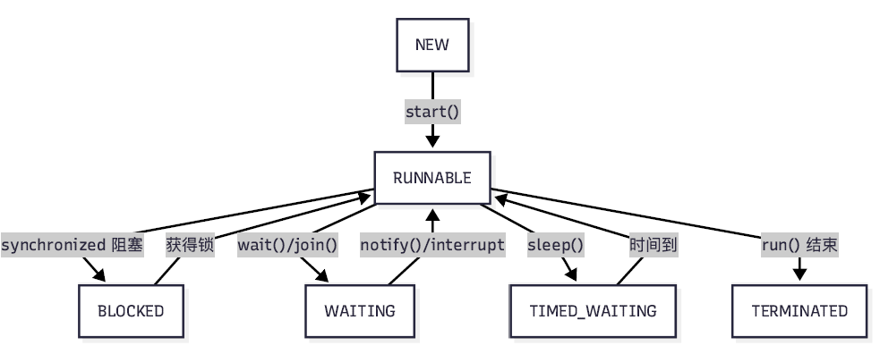

# 8 Thread and Thread Pool

<!-- !!! tip "说明"

    本文档正在更新中…… -->

!!! info "说明"

    本文档仅涉及部分内容，仅可用于复习重点知识

## 1 Thread

Java 线程不是 JVM 自己实现的，而是映射到操作系统的原生线程。在 Windows 上是 Windows 线程，在 Linux 上是 pthread 等

线程调度由操作系统负责，不是 JVM，OS 的调度器决定哪个线程在哪个 CPU 核心上运行，调度基于线程优先级、CPU 负载均衡等因素

Java 线程可能在不同核上同时执行。如果有多个 CPU 核心，不同的 Java 线程可能真正并行执行

Java 开发者不能控制线程在哪个具体的 CPU 核心上运行，线程调度完全由操作系统管理，Java 只能设置线程优先级（但这也是建议性的，OS 可能忽略）

### 1.1 创建线程

创建线程的 4 种方式：

**1.继承 `Thread` 类**：简单，但不利于扩展（Java 单继承限制）

```java linenums="1"
public class MyThread extends Thread {
    @Override
    public void run() {
        // 线程要执行的任务
        System.out.println("线程运行: " + Thread.currentThread().getName());
    }

    public static void main(String[] args) {
        MyThread t1 = new MyThread();
        MyThread t2 = new MyThread();
        t1.start(); // 启动线程，会异步执行 run 方法
        t2.start(); // 不要直接调用 run()，那样会变成普通方法调用，仍在主线程执行
    }
}

// output:
// 线程运行: Thread-1
// 线程运行: Thread-0
```

**2.实现 `Runnable` 接口**（推荐）：更灵活，可以再继承其他类。适合多个线程共享同一个任务对象的场景（例如，共享资源）

```java linenums="1"
public class MyRunnable implements Runnable {
    @Override
    public void run() {
        System.out.println("线程运行: " + Thread.currentThread().getName());
    }

    public static void main(String[] args) {
        Thread t1 = new Thread(new MyRunnable());
        Thread t2 = new Thread(new MyRunnable());
        t1.start();
        t2.start();
    }
}

// output:
// 线程运行: Thread-0
// 线程运行: Thread-1
```

!!! tip "Lambda 简化"

    ```java linenums="1"
    Thread t = new Thread(() -> {
        System.out.println("Lambda线程: " + Thread.currentThread().getName());
    });
    t.start();
    ```

**3.实现 `Callable` 接口**：与 `Runnable` 不同，`Callable` 的 `call()` 方法可以返回结果和抛出异常

```java linenums="1"
public class MyCallable implements Callable<String> {
    @Override
    public String call() throws Exception {
        // 执行任务，并返回结果
        Thread.sleep(1000);
        return "任务执行完毕，来自: " + Thread.currentThread().getName();
    }

    public static void main(String[] args) throws Exception {
        FutureTask<String> futureTask = new FutureTask<>(new MyCallable());
        Thread t = new Thread(futureTask);
        t.start();

        // get() 方法会阻塞，直到线程执行完毕并返回结果
        String result = futureTask.get();
        System.out.println(result);
    }
}

// output:
// 任务执行完毕，来自: Thread-0
```

**4.虚拟线程**：轻量级（由 JVM 管理），内存占用小，高性能

```java linenums="1"
// 直接创建并启动
Thread.startVirtualThread(() -> {
    System.out.println("快速启动！");
});

// 创建但不启动
Thread vt = Thread.ofVirtual().unstarted(() -> {
    System.out.println("稍后启动");
});
vt.start();

// 使用构建器
Thread vt2 = Thread.ofVirtual()
    .name("my-virtual-thread")  // 设置线程名称
    .start(() -> {
        System.out.println("有名字的虚拟线程");
    });
```

!!! tip "虚拟线程适用场景"

    1. IO 密集任务
    2. 网络请求处理
    3. 数据库请求
    4. 文件读写

    不适合：

    1. 计算密集任务
    2. 需要精确控制的场合
    3. 使用 `ThreadLocal` 的场合

### 1.2 生命周期

Java 线程在其生命周期中处于以下 6 种状态之一（`Thread.State` 枚举）：

1. NEW（新建）：线程被创建，但尚未调用 `start()` 方法
2. RUNNABLE（可运行）：调用 `start()` 后，线程在 JVM 中执行，但可能在等待操作系统资源（如 CPU）
3. BLOCKED（阻塞）：线程等待获取一个监视器锁（synchronized）以进入同步块/方法
4. WAITING（等待）：线程无限期等待另一个线程执行特定操作。例如：`object.wait()`, `thread.join()`
5. TIMED_WAITING（超时等待）：在指定时间内等待。例如：`Thread.sleep(millis)`, `object.wait(timeout)`, `thread.join(millis)`
6. TERMINATED（终止）：线程执行完毕（`run` 方法正常退出或因异常终止）

<figure markdown="span">
  { width="600" }
</figure>

!!! tip "`wait()` and `notify()`"

    `wait()` 和 `notify()` 是 Java 中用于线程间通信的重要方法，它们定义在 `Object` 类中，所有 Java 对象都拥有这些方法

    1. `wait()`：使当前线程进入等待状态，直到其他线程调用该对象的 `notify()` 或 `notifyAll()` 方法。调用 `wait()` 方法会释放对象的锁。必须在同步代码块或同步方法中调用
    2. `notify()`：唤醒在此对象监视器上等待的单个线程，如果有多个线程在等待，选择哪个线程被唤醒是不确定的，被唤醒的线程需要重新获取对象锁才能继续执行
    3. `notifyAll()`：唤醒在此对象监视器上等待的所有线程，所有被唤醒的线程会竞争对象锁

### 1.3 核心方法

| 方法 | 说明 |
| -- | -- |
| `start()` | 启动新线程，使其进入 RUNNABLE 状态。一个线程只能 start 一次 | 
| `run()` | 线程的入口点，定义了线程要执行的任务。直接调用 `run()` 不会启动新线程 | 
| `static sleep(long millis)` | 让当前正在执行的线程休眠指定毫秒数，不释放锁，进入 TIMED_WAITING 状态 | 
| `static yield()` | 提示调度器当前线程愿意让出 CPU，但调度器可以忽略这个提示 | 
| `join()` / `join(long millis)` | 等待该线程终止。例如，在主线程中调用 `t.join()`，主线程会阻塞，直到线程 t 执行完毕 | 
| `interrupt()` | 中断线程。它不会强制停止线程，而是设置一个中断标志。如果线程在 `wait`, `join`, `sleep` 时被中断，会抛出 `InterruptedException`，并清除中断状态 | 
| `static currentThread()` | 返回对当前正在执行的线程对象的引用 | 
| `setDaemon(boolean on)` | 设置为守护线程（后台线程）。当 JVM 中只剩下守护线程时，JVM 会退出。必须在 `start()` 前设置 | 

获取线程运行时信息：

```java linenums="1"
// 获取线程名称
String threadName = Thread.currentThread().getName();
// 获取线程组
ThreadGroup group = Thread.currentThread().getThreadGroup();
String groupName = group.getName();
// 获取线程优先级
int priority = Thread.currentThread().getPriority();
// 检查线程是否存活
boolean isAlive = thread.isAlive();
// 检查是否为守护线程
boolean isDaemon = thread.isDaemon();
```

## 2 Thread Pool

在并发编程中，频繁地创建和销毁线程会带来显著的性能开销。线程池通过复用已创建的线程来解决这个问题，其核心优势在于：

1. 降低资源消耗：复用已存在的线程，避免频繁创建和销毁
2. 提高响应速度：任务到达时，无需等待线程创建即可立即执行
3. 提高线程的可管理性：线程是稀缺资源，线程池可以统一进行分配、调优和监控
4. 提供更强大的功能：线程池具备可扩展性，允许定时、延迟执行等高级功能

Java 的线程池框架主要在 `java.util.concurrent` 包中

1. `Executor`：最顶层的接口，只有一个 `execute(Runnable command)` 方法，用于执行任务
2. `ExecutorService`：继承了 `Executor`，是真正的“线程池”接口。提供了更丰富的方法，如 `submit()`（可返回 `Future`）、`shutdown()`、`invokeAll()` 等
3. `ThreadPoolExecutor`：是 `ExecutorService` 最核心、最灵活的实现类。我们通常通过 `Executors` 工厂方法创建的线程池，本质上都是 `ThreadPoolExecutor` 的不同参数配置
4. `ScheduledThreadPoolExecutor`：继承了 `ThreadPoolExecutor`，实现了 `ScheduledExecutorService` 接口，用于支持定时及周期性任务
5. `Executors`：线程池的工厂类，提供了一系列静态工厂方法用于创建不同类型的常用线程池

### 2.1 ThreadPoolExecutor

`ThreadPoolExecutor` 核心构造参数：

```java linenums="1"
public ThreadPoolExecutor(
    int corePoolSize,
    int maximumPoolSize,
    long keepAliveTime,
    TimeUnit unit,
    BlockingQueue<Runnable> workQueue,
    ThreadFactory threadFactory,
    RejectedExecutionHandler handler
)
```

1. `corePoolSize`：核心线程数。线程池中长期维持的线程数量，即使这些线程处于空闲状态，也不会被回收（除非设置了 `allowCoreThreadTimeOut`）
2. `maximumPoolSize`：最大线程数。线程池允许创建的最大线程数量
3. `keepAliveTime`：线程空闲时间。当线程数超过 `corePoolSize` 时，多余的空闲线程在终止前等待新任务的最长时间
4. `unit`：时间单位。`keepAliveTime` 参数的时间单位（如 `TimeUnit.SECONDS`）
5. `workQueue`：工作序列。用于保存等待执行的任务的阻塞队列。提交的任务会被放入这个队列

    1. `LinkedBlockingQueue`：无界队列（如果未指定容量），可能导致 OOM
    2. `ArrayBlockingQueue`：有界队列
    3. `SynchronousQueue`：不存储元素的队列，每个插入操作必须等待另一个线程的移除操作
    4. `PriorityBlockingQueue`：无界队列，线程按照优先级顺序出队

6. `threadFactory`：线程工厂。用于创建新线程的工厂。可以用于设置线程名、优先级、守护状态等，便于监控和调试
7. `handler`：拒绝策略。当线程池和工作队列都已满时，用于处理新提交任务的策略

    1. `ThreadPoolExecutor.AbortPolicy`（默认）： 抛出 `RejectedExecutionException` 异常
    2. `ThreadPoolExecutor.CallerRunsPolicy`： 由调用者所在线程来执行该任务
    3. `ThreadPoolExecutor.DiscardPolicy`： 直接丢弃新任务，不抛异常
    4. `ThreadPoolExecutor.DiscardOldestPolicy`： 丢弃队列中最旧的任务，然后尝试重新提交当前任务

!!! tip "自定义 `ThreadFactory`"

    推荐使用自定义的 `ThreadFactory`，方便在出现问题时进行监控和排查

    ```java linenums="1"
    ThreadFactory namedThreadFactory = new ThreadFactoryBuilder()
        .setNameFormat("my-pool-%d") // 使用 Guava 的 ThreadFactoryBuilder
        .build();
    
    // 或者自己实现 ThreadFactory
    ThreadFactory customFactory = r -> {
        Thread t = new Thread(r, "MyAppThread-" + COUNTER.getAndIncrement());
        t.setDaemon(false); // 通常设置为非守护线程
        return t;
    };
    ```

当向 `ThreadPoolExecutor` 提交一个新任务时，其工作流程：

1. 如果当前运行的线程数小于 `corePoolSize`，则创建新线程来执行任务（即使其他核心线程空闲）
2. 如果当前运行的线程数大于或等于 `corePoolSize`，则将该任务放入 `workQueue` 等待
3. 如果队列已满，且当前线程数小于 `maximumPoolSize`，则创建新的非核心线程来执行任务
4. 如果队列已满，且当前线程数等于 `maximumPoolSize`，则触发拒绝策略 `handler`

> 先核心 -> 再队列 -> 后最大 -> 最后拒绝

!!! tip "通过 `Executors` 创建常见线程池"

    1.`newFixedThreadPool`：固定大小线程池

    - 特点：核心线程数 = 最大线程数。使用无界的 `LinkedBlockingQueue`
    - 风险：如果任务处理速度跟不上提交速度，队列会无限膨胀，可能导致 OOM

    ```java linenums="1"
    ExecutorService executor = Executors.newFixedThreadPool(5);
    ```

    2.`newCachedThreadPool`：可缓存线程池

    - 特点：核心线程数为 0，最大线程数为 `Integer.MAX_VALUE`。使用 `SynchronousQueue`。空闲线程存活 60 秒
    - 风险：理论上可以无限创建线程，容易耗尽系统资源，导致 OOM

    ```java linenums="1"
    ExecutorService executor = Executors.newCachedThreadPool();
    ```

    3.`newSingleThreadExecutor`：单线程线程池

    - 特点：只有一个线程。使用无界的 `LinkedBlockingQueue`
    - 风险：同 `FixedThreadPool`，队列无界，可能导致 OOM

    ```java linenums="1"
    ExecutorService executor = Executors.newSingleThreadExecutor();
    ```

    4.`newScheduledThreadPool`：定时 / 周期线程池

    ```java linenums="1"
    ScheduledExecutorService executor = Executors.newScheduledThreadPool(3);
    // 延迟执行
    executor.schedule(task, 10, TimeUnit.SECONDS);
    // 固定速率执行
    executor.scheduleAtFixedRate(task, 5, 1, TimeUnit.SECONDS);
    // 固定延迟执行
    executor.scheduleWithFixedDelay(task, 0, 2, TimeUnit.SECONDS);
    ```

??? example "示例"

    ```java linenums="1"
    import java.util.concurrent.ExecutorService;
    import java.util.concurrent.Executors;
    import java.util.concurrent.TimeUnit;

    public class ThreadPoolExample {
        public static void main(String[] args) {
            // 1. 使用 Executors 工厂类创建一个固定大小的线程池
            // 这个线程池里有 3 个工作线程
            ExecutorService executor = Executors.newFixedThreadPool(3);

            System.out.println("向线程池提交 5 个任务...");

            // 2. 循环提交 5 个任务到线程池
            for (int i = 1; i <= 5; i++) {
                final int taskId = i;
                // 使用 submit 或 execute 方法提交一个 Runnable 任务
                executor.submit(() -> {
                    System.out.println("任务 " + taskId + " 开始执行, 由线程: " + Thread.currentThread().getName() + " 处理");
                    try {
                        // 模拟任务执行耗时
                        Thread.sleep(2000);
                    } catch (InterruptedException e) {
                        Thread.currentThread().interrupt();
                    }
                    System.out.println("任务 " + taskId + " 执行完毕。");
                });
            }

            // 3. 关闭线程池
            // shutdown() 方法会平滑地关闭线程池。
            // 它会等待所有已提交的任务执行完毕，但不再接受新的任务。
            System.out.println("调用 shutdown()，准备关闭线程池...");
            executor.shutdown();

            try {
                // 可选：等待所有任务完成，可以设置一个超时时间
                // 如果在 1 分钟内所有任务都执行完毕，则返回 true
                if (!executor.awaitTermination(1, TimeUnit.MINUTES)) {
                    System.err.println("线程池任务未在规定时间内完成，强制关闭。");
                    executor.shutdownNow(); // 尝试立即停止所有正在执行的任务
                }
            } catch (InterruptedException e) {
                // 如果当前线程在等待时被中断，也强制关闭
                executor.shutdownNow();
            }

            System.out.println("所有任务执行完毕，线程池已关闭。");
        }
    }
    ```

## 3 工具

### 3.1 jconsole

jconsole 是 JDK 自带的一个图形化的监控和管理工具。它基于 JMX 技术，允许你连接到一个正在运行的 Java 进程，并实时地查看其内部的各种性能指标和资源消耗情况

启动 jconsole：在命令行或终端中直接输入 `jconsole` 并回车，即可启动 jconsole 的图形化界面

连接 Java 进程：

1. 本地进程：jconsole 会自动发现本机上正在运行的、可供连接的 Java 进程。只需在列表中选择要监控的进程，然后点击连接
2. 远程进程：也可以连接到运行在另一台服务器上的 Java 进程。这需要在远程 Java 应用启动时，添加特定的 JMX 参数来开放远程连接端口（例如 `-Dcom.sun.management.jmxremote.port=9999`）

jconsole 的主要功能面板：

1. 概述：以图表的形式汇总了四个最重要的指标

    1. 堆内存使用情况 (Heap Memory Usage)：显示了堆内存已使用大小随时间的变化
    2. 线程 (Threads)：显示了活动线程数量的变化
    3. 类 (Classes)：显示了已加载类的数量
    4. CPU 使用率 (CPU Usage)：显示了 JVM 进程的 CPU 占用率

2. 内存：详细展示了 JVM 内存的各个区域。可以选择查看不同内存池（如 Eden 区、Survivor 区、老年代 Tenured Gen、元空间 Metaspace）的使用情况
3. 线程：列出了当前所有的线程。点击任意一个线程，会显示该线程的当前状态（如 `RUNNABLE`, `BLOCKED`）和完整的堆栈轨迹（Stack Trace），能够知道它正在执行什么代码
4. 类：显示当前 JVM 加载和卸载的类的总数
5. VM 摘要：提供了关于 JVM 和运行环境的静态信息
6. MBeans：允许直接与 JVM 内部的 JMX MBean 进行交互

### 3.2 jstack

jstack 是 JDK (Java Development Kit) 自带的一个命令行工具，它的核心功能是生成指定 Java 进程的线程快照（Thread Dump）。这个快照包含了该进程中所有线程在某一时刻的运行状态和执行堆栈

jstack 主要用于解决以下问题：

1. 死锁 (Deadlock)：当多个线程互相等待对方持有的锁时，就会发生死锁。jstack 不仅能捕获到这种情况，还能直接明确地指出哪些线程参与了死锁，以及它们各自等待的锁和持有的锁
2. 无限循环 / CPU 占用率过高：当某个线程执行了无限循环或进行大量计算时，会导致 CPU 占用率飙升。通过结合 top (Linux) 或 taskmgr (Windows) 等系统命令，可以定位到具体是哪个 Java 线程在消耗 CPU，然后用 jstack 查看该线程的堆栈，从而快速定位到问题代码
3. 线程阻塞 / 程序无响应：当应用程序看起来卡住或响应缓慢时，通常是因为大量线程被阻塞了。jstack 可以显示出每个线程的当前状态（如 BLOCKED, WAITING），以及它们正在等待什么资源（锁、网络 I/O 等），帮助我们理解程序为什么会停滞不前

**1.获取 Java 进程的 PID**

使用 `jps` 命令（JDK 自带）来列出当前系统上所有的 Java 进程及其 PID

```bash linenums="1"
$ jps -l
12345 com.example.MyApplication
67890 org.apache.catalina.startup.Bootstrap
```

**2.执行 jstack 命令**

- `jstack <pid>`
- `jstack -l <pid>`：`-l` 参数会打印出关于锁的附加信息

例如：`jstack -l 12345 > threaddump.txt`

jstack 的输出：

```java linenums="1"
"pool-1-thread-2" #12 prio=5 os_prio=0 tid=0x00007f8c9c8b8800 nid=0x1a0b waiting on condition [0x00007f8c8a9a9000]
   java.lang.Thread.State: WAITING (parking)
    at sun.misc.Unsafe.park(Native Method)
    - parking to wait for  <0x000000076ab4f8f8> (a java.util.concurrent.locks.AbstractQueuedSynchronizer$ConditionObject)
    at java.util.concurrent.locks.LockSupport.park(LockSupport.java:175)
    at java.util.concurrent.locks.AbstractQueuedSynchronizer$ConditionObject.await(AbstractQueuedSynchronizer.java:2039)
    at java.util.concurrent.LinkedBlockingQueue.take(LinkedBlockingQueue.java:442)
    at java.util.concurrent.ThreadPoolExecutor.getTask(ThreadPoolExecutor.java:1074)
    at java.util.concurrent.ThreadPoolExecutor.runWorker(ThreadPoolExecutor.java:1134)
    at java.util.concurrent.ThreadPoolExecutor$Worker.run(ThreadPoolExecutor.java:624)
    at java.lang.Thread.run(Thread.java:748)

   Locked ownable synchronizers:
    - None
```

1. `"pool-1-thread-2" #12 prio=5 os_prio=0 tid=0x00007f8c9c8b8800 nid=0x1a0b`：线程头信息:

    1. `"pool-1-thread-2"`：线程名称
    2. `#12`：线程的内部 ID
    3. `prio=5`：线程的 Java 优先级
    4. `tid`：线程在 JVM 内的唯一 ID
    5. `nid`：线程对应的操作系统本地线程 ID，通常是十六进制。可以用它来关联 top 等系统命令的输出

2. `java.lang.Thread.State: WAITING (parking)`：线程状态

    1. `RUNNABLE`: 正在运行或在就绪队列中等待 CPU。CPU 占用率高的问题通常发生在这里
    2. `BLOCKED`: 正在等待一个监视器锁（`synchronized` 块）
    3. `WAITING`: 无限期等待另一个线程执行特定操作（如调用 `Object.wait()` 或 `LockSupport.park()`）
    4. `TIMED_WAITING`: 在指定的时间内等待

3. Stack Trace：从上到下显示了方法的调用链。最上面的是当前正在执行的方法。通过堆栈轨迹，我们可以精确地知道线程卡在了哪一行代码
4. 锁信息：

    1. `waiting on condition [0x00007f8c8a9a9000]`：表示线程正在等待获取哪个对象的锁
    2. `locked ...`：表示线程当前持有哪些对象的锁
    3. `Locked ownable synchronizers`：显示了线程持有的 `java.util.concurrent` 包下的锁

如果存在死锁，jstack 会非常智能地直接打印出 `Found 1 deadlock.` 并详细列出参与死锁的线程、它们正在等待的锁和已经持有的锁