# 1 Graphics and Image Data Representation

<!-- !!! tip "说明"

    本文档正在更新中…… -->

## 1 Basic Graphics / Image Types

### 1.1 1-Bit Image

也叫 binary image 或 monochrome image（黑白照）

<figure markdown="span">
  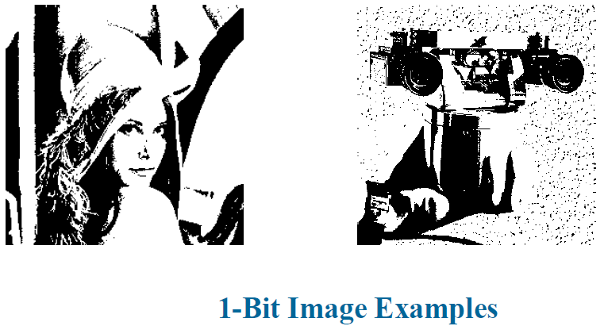{ width="600" }
</figure>

每个像素点由 1 bit 表示，0 表示黑色，1 表示白色

### 1.2 8-Bit Gray-Level Image

<figure markdown="span">
  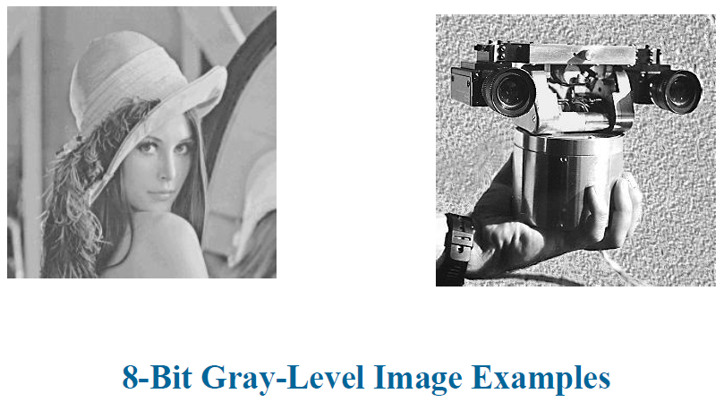{ width="600" }
</figure>

每个像素点由 8 bit 也就是 1 byte 表示，从 0 到 255

<figure markdown="span">
  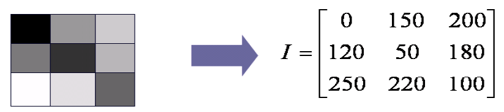{ width="600" }
</figure>

#### 1.2.1 Print

如何在只能打印黑白两色的打印机上，输出一张包含 256 级灰度（8 位）的照片

DPI：每英寸点数。这是打印机的物理分辨率，指打印机在一英寸的长度内可以打印多少个墨点。高 DPI 意味着更精细的打印能力

解决方案：Dithering（抖动）。既然无法直接改变墨水的深浅（强度），那么就用墨点的疏密（空间）来模拟灰度。利用人眼视觉的低通特性，在一定距离外看图片时，眼睛会自动将密集的黑点和白点混合，从而"欺骗"大脑，感受到连续的灰度

使用一个 $N \times N$ 的矩阵来表示一个像素点，一个 $N \times N$ 的矩阵能够表示 $N^2 + 1$ 个灰度

<figure markdown="span">
  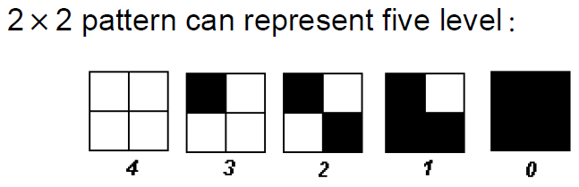{ width="600" }
</figure>

但这种方式会使得输出图像尺寸变大，我们可以使用阈值抖动的方法：预先定义一个固定的、重复铺满整个图像的矩阵（dither matrix，抖动矩阵）。这个矩阵里的每个单元格都存储了一个阈值。对于原始灰度图像中的每一个像素，将其灰度值与对应位置的阈值矩阵中的值进行比较，当矩阵值大于灰度值时打印

<figure markdown="span">
  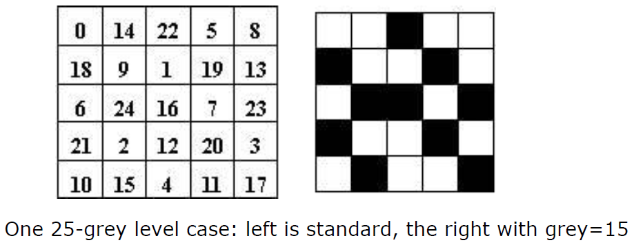{ width="600" }
</figure>

!!! question "example"

    Print an image (240 * 180 * 8 bit) on a paper (12.8 * 9.6 inch) by a printer with 300 * 300 DPI, what’s the size of each pixel (dots)?

    ??? success "answer"

        一共有 12.8 * 300 * 9.6 * 300 = 3480 * 2880 个 dot。那么每个像素的大小就是 3480 / 240 * 2880 / 180 = 16 * 16 dot

<figure markdown="span">
  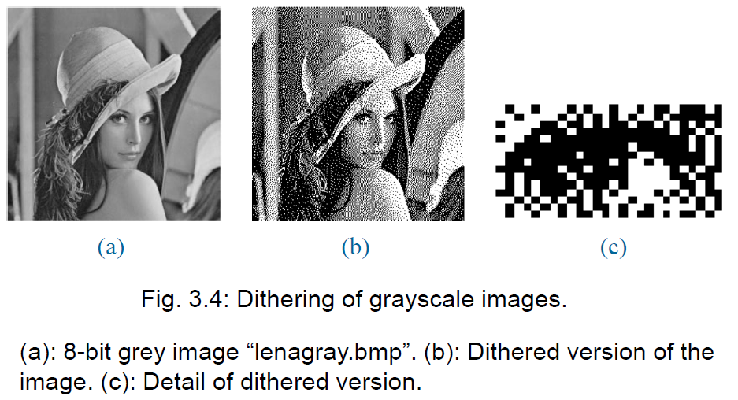{ width="600" }
</figure>

### 1.3 24-Bit Color Image

每个像素点由 24 bit 也就是 3 byte 表示，3 个 byte 分别表示 RGB 三个通道

<figure markdown="span">
  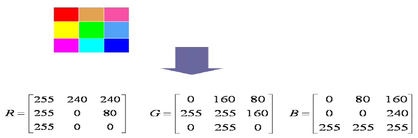{ width="600" }
</figure>

### 1.4 8-Bit Color Image

也叫 256-colors image

<figure markdown="span">
  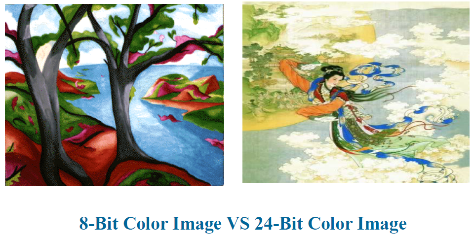{ width="600" }
</figure>

24-bit color image 的每个像素占用 3 byte，一个完整的图片就需要比较大的存储空间。256-colors image 图像文件不再为每个像素存储完整的 3 字节 RGB 信息，而是只存储一个字节。这个字节实际上是一个索引。图像文件附带一个 lookup table（颜色查找表），这个表里有 256 行，每行存储一个真正的 3 字节 RGB 颜色值

当显示器要显示像素时，它先读取像素的索引值，然后去查表，最后把查到的 RGB 颜色显示在屏幕上

<figure markdown="span">
  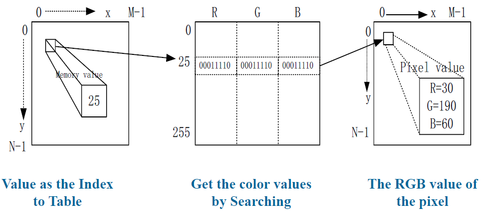{ width="600" }
</figure>

<figure markdown="span">
  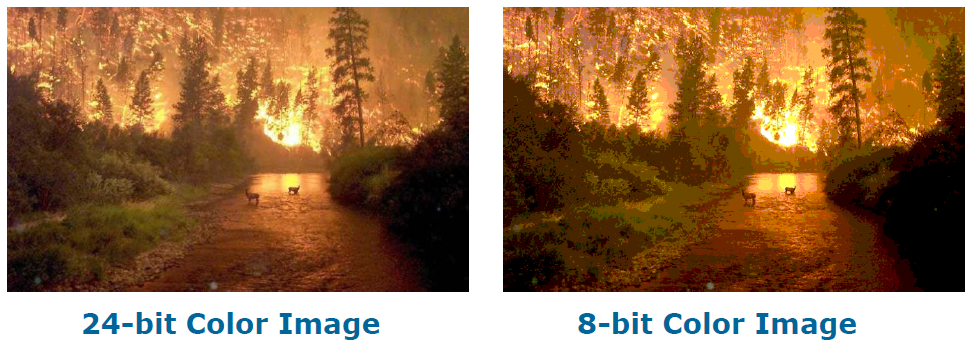{ width="600" }
</figure>

因此我们需要根据每个具体的图片，从 256 * 256 * 256 种颜色中选择最重要的 256 种颜色。这个过程称为 color quantization（颜色量化），颜色量化是一种图像处理技术，用于减少图像中使用的颜色数量，同时尽可能保持其视觉外观

由于人对 RGB 的敏感程度：R > G > B。我们可以让 RGB 三通道分别可以取 8，8，4 种不同的值，这样刚好能够组成 8 * 8 * 4 = 256 种颜色。根据这些值将原图的每一个像素颜色，转换为调色板中最近似的颜色

<figure markdown="span">
  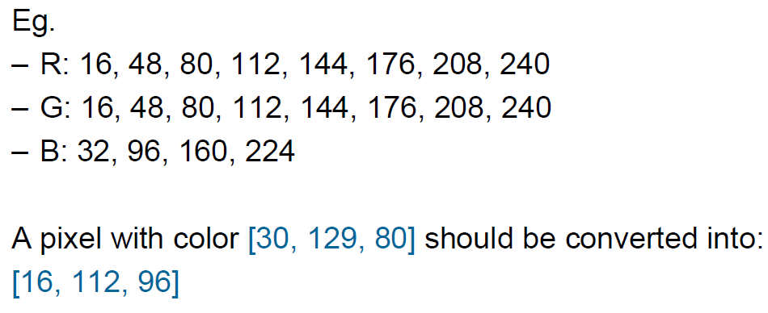{ width="600" }
</figure>

#### 1.4.1 Median-Cut Algorithm

中位切分算法是一种经典的颜色量化算法，它根据图像中颜色分布的密集程度进行自适应切割

先从 R 通道直方图中找到中间位置切开，得到 2 个像素区域，再从 G 通道直方图中找到中间位置切开，得到 4 个像素区域，再从 B 通道直方图中找……直到得到 256 个像素区域。其中通道顺序就是 RGBRGBRG

<figure markdown="span">
  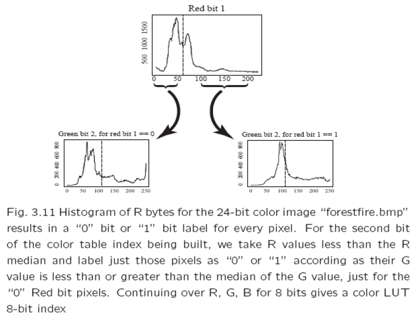{ width="600" }
</figure>

<figure markdown="span">
  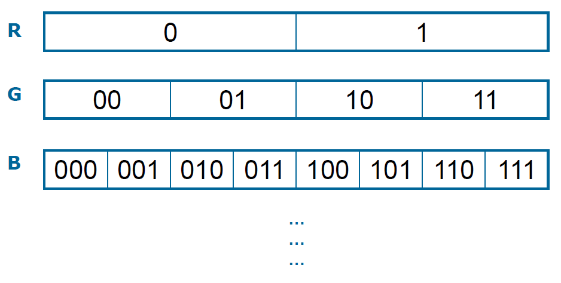{ width="600" }
</figure>

??? success "python 实现"

    ```python linenums="1"
    from PIL import Image
    import numpy as np
    
    def median_cut_256(image_path):
        try:
            img = Image.open(image_path)
        except FileNotFoundError:
            print(f"Error: The file '{image_path}' was not found.")
            return None
        
        original_shape = img.size
    
        # 数组形状为 (height, width, 3)，每个像素包含 RGB 值
        pixels = np.array(img).reshape(-1, 3)
        # 像素索引，用于跟踪每个像素在原图中的位置
        indices = np.arange(len(pixels))
    
        buckets = [indices]
    
        # RGBRGBRG 循环 8 次，分成 256 个桶
        for i in range(8):
            print(f"Iteration {i + 1}")
    
            channel_index = i % 3
            new_buckets = []
    
            for bucket_index in buckets:
                if bucket_index.size == 0:
                    continue
    
                bucket_pixels = pixels[bucket_index]
                median = np.median(bucket_pixels[:, channel_index])
                # 对像素索引进行切分
                mask = bucket_pixels[:, channel_index] <= median
                left_bucket = bucket_index[mask]
                right_bucket = bucket_index[~mask]
    
                if left_bucket.size > 0:
                    new_buckets.append(left_bucket)
                if right_bucket.size > 0:
                    new_buckets.append(right_bucket)
    
            buckets = new_buckets
    
        print(f"Number of buckets: {len(buckets)}")
    
        # 生成新图像
        new_pixels = np.zeros_like(pixels)
    
        for bucket_index in buckets:
            if bucket_index.size == 0:
                continue
    
            bucket_pixels = pixels[bucket_index]
            # 计算平均颜色
            mean_color = np.mean(bucket_pixels, axis=0).astype(np.uint8)
            new_pixels[bucket_index] = mean_color
    
        new_pixels = new_pixels.reshape(original_shape[1], original_shape[0], 3)
        new_img = Image.fromarray(new_pixels, 'RGB')
    
        output_path = image_path.replace('.png', '_median_cut_256.png')
        new_img.save(output_path)
    
    if __name__ == '__main__':
        image_path = './example/median_cut_example.png'
        median_cut_256(image_path)
    ```

## Exercise

Suppose we decide to quantize an 8 bit grayscale image down to just 2 bits of accuracy. What is the simplest way to do so? What ranges of byte values in the original image are mapped to what quantized values?

只使用 8 bit 中的前两位

---

Suppose we have a 5 bit grayscale image. What size of ordered dither matrix do we need to display the image on a 1 bit printer?

5 bit 灰度值，说明有 32 级灰度值，那么抖动矩阵至少是 6 x 6 大小

---

Suppose we have available 24 bits per pixel for a color image. However, we notice that humans are more sensitive to R and G than to B in fact, 1.5 times more sensitive to R than to G, and 2 times more sensitive to G than to B. How could we best make use of the bits available?

敏感程度的比例 R : G : B = 3 : 2 : 1 = 12 : 8 : 4。因此 RGB 分别用 12、8、4 bit 来表示