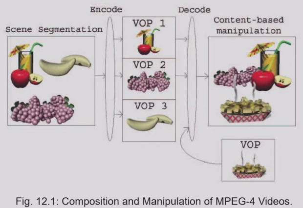

# 10 MPEG Video Coding 2

!!! warning "说明"

    本文档已停止更新

!!! info "说明"

    本文档仅涉及部分内容，仅可用于复习重点知识

## 1 MPEG-4

### 1.1 Overview

MPEG-4 不同于传统的 MPEG-1/2，它最大的特点是基于对象的编码（Object-Based Coding）。传统的 MPEG-1/2 是基于帧或块的，而 MPEG-4 处理的是视频对象（Video Object, VO），可以是任意形状（非矩形）

<figure markdown="span">
  { width="600" }
</figure>

MPEG-4 视频码流的层级：

1. 视频对象序列 (VS)：完整的场景
2. 视频对象 (VO)：场景中的特定对象（如人、背景）
3. 视频对象层 (VOL)：支持可分级编码（Scalable Coding）
4. 视频对象平面 (VOP)：VO 在某一时刻的快照（相当于传统的一帧）

### 1.2 Object-Based Visual Coding

MPEG-4 同样采用 motion compensation，同样有 I-VOP、P-VOP 和 B-VOP。由于 VOP 是任意形状的，在进行运动补偿时会遇到边界问题

MPEG-4 中基于运动补偿的 VOP 编码的三个步骤：

1. 运动估计：在当前帧中寻找与参考帧中某个块最相似的块，计算运动向量
2. 基于运动补偿的预测：根据运动向量，从参考帧中生成当前帧的预测图像
3. 预测误差编码：将真实图像与预测图像之间的差异（残差）进行变换、量化和熵编码，进一步压缩

VOP 可能是不规则形状，不是整个矩形帧。在运动估计与匹配时，只使用属于当前 VOP 内部的像素，忽略背景或其它 VOP 的像素，这有助于提高编码效率并避免跨对象干扰

为了便于块匹配运动估计，将 VOP 划分为固定大小的宏块。16x16 的亮度分量和 8x8 的色度分量

## 2 MPEG-7

## 3 MPEG-21

## Exercise

MPEG-2 和 MPEG-4 的区别（4 ~ 5 点）