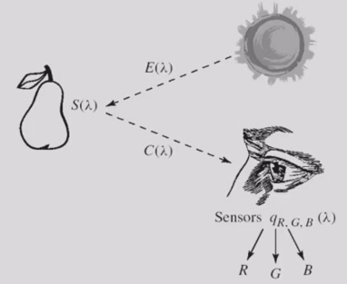
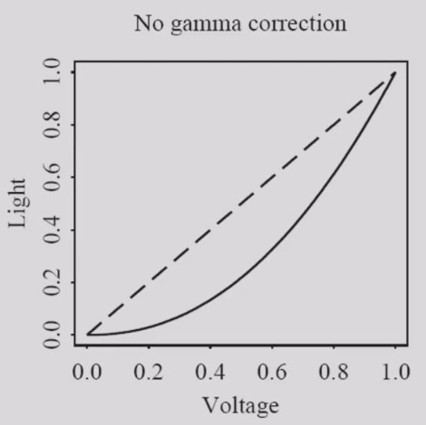
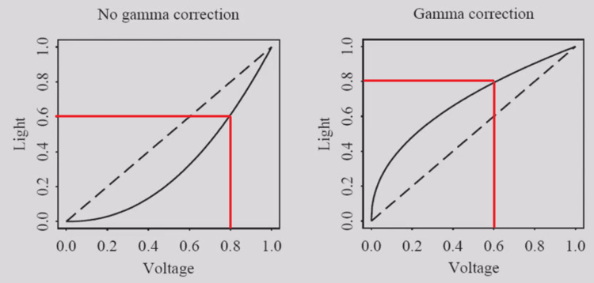
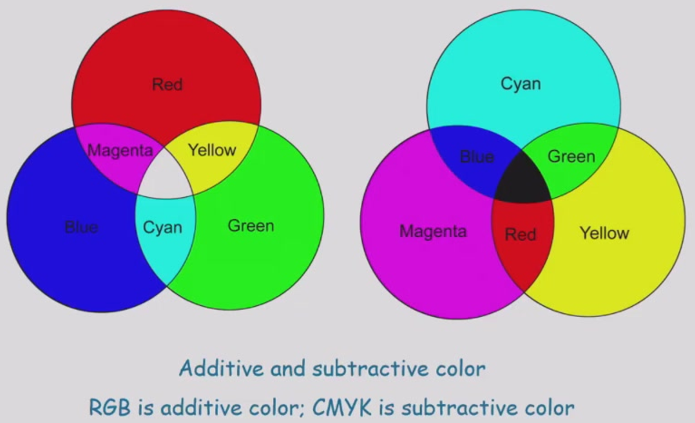

# 2 Color in Image and Video

<!-- !!! tip "说明"

    本文档正在更新中…… -->

## 1 Color Science

### 1.1 Light and Spectra

spectral power distribution（SPD）：光谱功率分布。描述了在不同波长上的光强度分布。这种分布关系用函数 $E(\lambda)$ 来表示

spectral sensitivity functions：光谱灵敏度函数。人眼中有三种不同类型的感光细胞，它们分别对红光、绿光、蓝光最为敏感。用 $q(\lambda)$ 来表示，$q(\lambda) = (q_R(\lambda), q_G(\lambda), q_B(\lambda))^T$

$\begin{cases}
    R = \int E(\lambda)q_R(\lambda) d\lambda \\
    G = \int E(\lambda)q_G(\lambda) d\lambda \\
    B = \int E(\lambda)q_B(\lambda) d\lambda
\end{cases}$

spectral reflectance function：光谱反射函数。物体本身吸收多少光、反射多少光。用 $S(\lambda)$ 来表示

color signal：颜色信号。用 $C(\lambda)$ 来表示，$C(\lambda) = E(\lambda)S(\lambda)$

<figure markdown="span">
  { width="600" }
</figure>

$\begin{cases}
    R = \int E(\lambda)S(\lambda)q_R(\lambda) d\lambda \\
    G = \int E(\lambda)S(\lambda)q_G(\lambda) d\lambda \\
    B = \int E(\lambda)S(\lambda)q_B(\lambda) d\lambda
\end{cases}$

### 1.2 Gamma Correction

CRT 显示器的亮度与输入电压之间不是简单的正比关系，$亮度 \propto 电压^\gamma$，指数就是伽马值，对于 CRT 显示器，这个值大约在 2.2 左右

<figure markdown="span">
  { width="600" }
</figure>

因此需要伽马修正

<figure markdown="span">
  { width="600" }
</figure>

## 2 Color Models in Images

<figure markdown="span">
  { width="600" }
</figure>

$\begin{cases}
    (C,M,Y) = (1,1,1)-(R,G,B) \\
    (R,G,B) = (1,1,1)-(C,M,Y)
\end{cases}$

## 3 Color Models in Video

YUV、YIQ、YCbCr 颜色模型都有一个共同点，它们都将图像信息分为一路亮度（Luma，用 Y 表示）和两路色度（Chrominance，用 I/Q, U/V, Cb/Cr 表示）。人眼对亮度细节敏感，但对颜色细节不那么敏感。因此可以对色度信息进行下采样（减少分辨率），从而节省传输带宽和存储空间

## Exercise

We wish to produce a graphic that is pleasing and easily readable. Suppose we make the background color pink. What color text font should we use to make the text most readable? Justify your answer. Pink = (Red + White) / 2

找到粉色的互补色，pink = ((1, 0, 0) + (1, 1, 1)) / 2 = (1, 0.5, 0.5)，互补色为 (1, 1, 1) - (1, 0.5, 0.5) = (0, 0.5, 0.5)，是浅青色

---

Color inkjet printers use the CMY model. When the cyan ink color is sprayed onto a sheet of white paper

- Why does it look cyan under daylight?
- What color would it appear under a blue light? Why?

青色墨水完全吸收红色光，反射绿色光和蓝色光。在日光下看起来就是青色的。在蓝光下看起来就是蓝色的