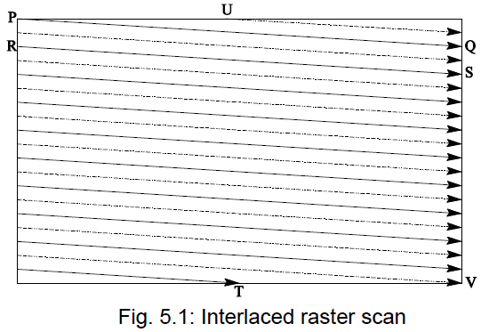
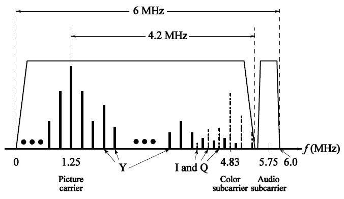
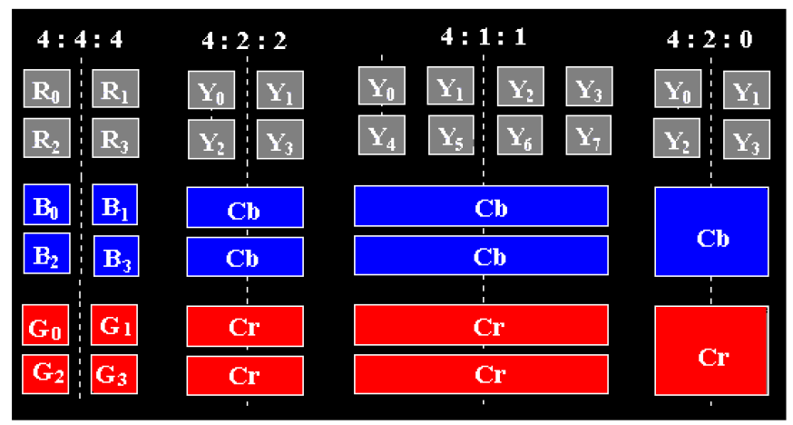

# 3 Fundamental Concepts in Video

<!-- !!! tip "说明"

    本文档正在更新中…… -->

!!! info "说明"

    本文档仅涉及部分内容，仅可用于复习重点知识

## 1 Types of Video Signals

### 1.1 Component Video

在专业视频设备中，图像被分为红、绿、蓝三个独立的信号传输，这样可以避免信号之间的干扰，保证色彩还原的准确性。这种方式需要三根独立的线缆来传输，因此对硬件要求较高

- YIQ：NTSC 电视标准使用的色彩空间，Y 表示亮度，I 和 Q 表示色度
- YUV：PAL 电视标准使用的色彩空间，Y 表示亮度，U 和 V 表示色度

这些模型通过对 RGB 信号进行数学变换得到，目的是在不显著增加带宽的情况下，兼容黑白电视并优化色彩传输

### 1.2 Composite Video

在广播电视中，为了节省带宽和简化传输，将亮度信号（Y）和色度信号（C）混合到一个载波中传输。这种混合信号只需要一根线缆（或一个无线电信道）传输，大大简化了传输系统。黑白电视只接收亮度信号（Y），忽略色度信号，因此仍然可以显示正常的黑白图像。彩色电视则可以同时接收亮度和色度信号，还原彩色画面

### 1.3 S-Video

S-Video 是介于复合视频和分量视频之间的一种折中方案：

1. 复合视频：1 根线，亮度和色度完全混合 → 串扰严重
2. S-Video：2 根线，亮度和色度分开传输 → 串扰减少
3. 分量视频：3 根线，亮度 + 两个色差分量完全分离 → 无串扰

人眼对亮度和色彩的分辨能力是不同的，对亮度分辨能力高，对色彩分辨能力低。因此在传输时，亮度信号细节需要全部保留，而色彩信号可以压缩一些细节

## 2 Analog Video

### 2.1 Related Concepts

<figure markdown="span">
  { width="600" }
</figure>

从图中 Q 点到 R 点，叫做 horizontal retrace。从 T 点到 U 点或从 V 点到 P 点，叫做 vertical retrace

### 2.2 NTSC Video

NTSC 基本规格：

1. 画面比例：4:3
2. 每帧扫描行：525
3. 帧率：30 fps（实际为 29.97 fps）
4. 色彩模型：YIQ

NTSC 采用隔行扫描，每帧分为两场：

1. 第一场：扫描奇数行
2. 第二场：扫描偶数行

$C = I \cos(F_{sc}t) + Q \sin(F_{sc}t)$

NTSC 系统分配给 Y（亮度）信号的带宽为 4.2 MHz，而分配给 I 和 Q（色度）信号的带宽分别只有 1.6 MHz 和 0.6 MHz。I 信号更宽是因为人眼对橙-青色调的变化（对应 I 分量）比紫-黄绿色调的变化（对应 Q 分量）更敏感

<figure markdown="span">
  { width="600" }
</figure>

$composite = Y + C = Y + I \cos(F_{sc}t) + Q \sin(F_{sc}t)$

1. 提取 $Y$ 分量：使用低通滤波器分离 $Y$ 与 $C$
2. 提取 $I$ 分量：$C$ 与 $2 \cos(F_{sc}t)$ 相乘，得到 $I + I \cos(2F_{sc}t) + Q\cdot 2\sin(2F_{sc}t)$，再使用低通滤波器
3. 提取 $Q$ 分量：$C$ 与 $2 \sin(F_{sc}t)$ 相乘，得到 $Q + I\sin(2F_{sc}t) - Q\cos(2F_{sc}t)$

## 3 Digital Video

### 3.1 Chroma Subsampling

人眼对亮度（黑白细节）非常敏感，但对颜色细节不太敏感。所以我们可以减少颜色信息的数据量，而不明显影响画质。这样可以大大压缩图像或视频文件大小

以 4 个像素为一组，有 4 种抽样方式：

1. 4:4:4：表示不进行子抽样（完整保留所有颜色信息）
2. 4:2:2：表示对 Cb 和 Cr（色度通道）在水平方向进行 2 倍子抽样
3. 4:1:1：表示对 Cb 和 Cr 在水平方向进行 4 倍子抽样
4. 4:2:0：表示对 Cb 和 Cr 分别在水平和垂直方向进行 2 倍子抽样

<figure markdown="span">
  { width="600" }
</figure>

其中 4:2:0 方案通常用于 JPEG 和 MPEG

### 3.2 Digital Video CCIR Standard

这是数字视频的奠基性标准，定义了如何将模拟视频信号。转换为数字信号。它统一了数字视频的格式，使得不同设备之间可以交换视频数据

对于 NTSC 制式：

1. 525 行：NTSC 模拟电视的一帧图像由 525 条扫描线组成
2. 858 像素/行：每条扫描线被采样为 858 个像素。但并不是所有像素都在屏幕上显示，只有中间的 720 个像素是有效的可视区域（左右两侧的像素用于同步和消隐）
3. 4:2:2 方案
4. 每个像素 2 字节：每个像素用 16 位表示，其中亮度（Y）和色度（Cb/Cr）各占一定比特数

行数 × 每行像素数 × 帧率 × 每像素字节数 × 8 = 比特率。计算出比特率为 216 Mbps

### 3.3 CIF Standard

CIF 是一种视频分辨率标准，专门为视频会议和低带宽传输设计。它的目标是用较低的比特率传输视频，并保持与 VHS（家用录像系统）相当的画质

QCIF 是四分之一的 CIF，比特率更低

## Exercise

NTSC video has 525 lines per frame and 63.6 sec per line, with 20 lines per field of vertical retrace and 10.9 sec horizontal retrace.

(a) Where does the 63.6 sec come from?
(b) Which takes more time, horizontal retrace or vertical retrace?

$1 / (525 行/帧 × 29.97 帧/秒) = 63.6 × 10^{-6} 秒/行$

水平回扫时间 = $10.9 × 10^{-6}$ 秒

垂直回扫时间 = 20 行 × 63.6 微秒/行 = 1272 微秒

因此垂直回扫时间是水平回扫时间的 1272 / 10.9 = 117 倍

---

Show how the Q signal can be extracted from the NTSC chroma signal C (Eq. 5.1) during the demodulation process.

将信号 $C$ 乘以 $2\sin(F_{sc}t)$，再应用低通滤波器

> 上文有提到过