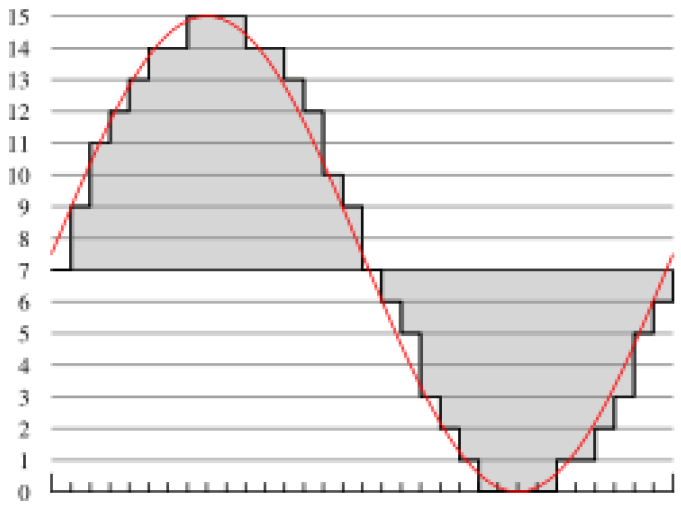

# 4 Basics of Digital Audio

<!-- !!! tip "说明"

    本文档正在更新中…… -->

## 1 Digitization of Sound

### 1.1 Digitization

数字化意味着转换为数字流，并且为了效率起见，这些数字最好是整数

<figure markdown="span">
  { width="600" }
</figure>

### 1.2 Nyquist Theorem

Nyquist rate：指为了能够无失真地从采样信号中恢复原始信号，所需的最低采样频率。它等于信号最高频率的两倍

Nyquist theorem：这是对带限信号（即频率范围在 f1 到 f2 之间的信号）的采样要求。对于这类信号，所需的采样率至少是信号带宽的两倍，即 2(f2 - f1)

Nyquist frequency：定义为奈奎斯特率的一半，即采样频率的一半。它是采样系统能够无混叠地表示的最高频率。如果信号中含有高于奈奎斯特频率的成分，这些成分会在采样后混叠到低频区域，无法恢复

### 1.3 Signal-to-Noise Ratio

信噪比 SNR 表示有用信号的功率与噪声功率的比值，通常使用 dB 为单位来表示：$SNR = 10 \cdot \log_{10}\dfrac{P_{signal}}{P_{noise}} = 20 \cdot \log_{10}\dfrac{V_{signal}}{V_{noise}}$

### 1.4 SQNR

在将模拟信号（如连续的电压）转换为数字信号的过程中，需要经过两个主要步骤：采样（时间上的离散化）和量化（幅值上的离散化）。量化误差是指由于将连续的精确值强制转换为离散的近似值而产生的误差，也被称为量化噪声

如果信号覆盖了全部量化范围，其最大幅度可以近似用总层级数来表示。如果有 $N$ 位，总共有 $2^N$ 个层级，最大量化值对应 $2^N - 1$

假设两个相邻量化层级之间的间隔（即量化步长）为 $\Delta$。只要信号值落在某个量化间隔内，它都会被量化到该间隔的中心值或边界值。那么，任何一个原始信号值与它最接近的量化层级之间的最大距离，不会超过半个间隔，即 $\Delta / 2$

SQNR 是信号功率与量化噪声功率的比值

$SQNR = 20\cdot \log_{10}\dfrac{V_{signal}}{V_{quan_noise}} = 20 \cdot \log_{10}\dfrac{2^{N-1}}{\frac{1}{2}}$

## 2 Music Instrument Digital Interface

MIDI 是一种通信协议，而不是音频格式。MIDI 记录的是指令序列，就像一份乐谱或一个演奏脚本。例如，它记录的是“在时间点 X，用乐器 Y，以力度 Z，弹奏音符 C”这样的信息。它不包含实际的声音。这就是为什么 MIDI 文件通常非常小

MP3 是一种音频压缩格式，它存储的是经过压缩编码的、实际的声音波形数据（即数字化的声音）。即使经过压缩，它仍然需要记录声音本身的细节，所以文件体积比 MIDI 大得多

MP3 音质接近 CD。由于 MP3 存储的是实际录音的波形，它可以记录复杂的声音，包括人声歌唱、各种乐器的复杂音色以及环境混响等，因此能够达到很高的保真度

MIDI 无法重现人声。MIDI 文件本身不包含人声样本。它通过发送指令让合成器发声。普通的 MIDI 合成器主要用于模拟乐器音色，很难合成出真实、自然的人声歌唱。因此，MIDI 音乐听起来通常是电子化的器乐旋律

## 3 Quantization and Transmission of Audio

### 3.1 Coding of Audio

对于音频信号，相邻的采样点之间通常变化不大，存在很强的相关性。这种重复或缓慢变化的信息就是时间冗余。与其存储每个时刻的绝对值，不如存储差值。这些差值通常比原始值小得多，因此可以用更少的比特数来表示，有利于压缩

无损压缩：通过这种差值表示法，再配合熵编码等方法，可以在不丢失任何信息的前提下，减少存储所需的比特数

### 3.2 Pulse Code Modulation

decision boundaries（决策边界）：想象一个数轴，上面划分了许多区间。这些区间的端点（分界点）就是决策边界

reconstruction levels（重建电平）：每个区间对应一个输出值。例如，所有落在 `[0, 0.1)` 区间的值，都输出为 0.05 V。这个 0.05 V 就是该区间的重建电平

coder mapping（编码器映射）：这个过程发生在发送端。它的任务是接收输入的模拟值，根据决策边界，决定它属于哪个区间，并为这个区间分配一个唯一的符号，通常是一个整数索引

decoder mapping（解码器映射）：这个过程发生在接收端。它收到代表区间的整数索引后，需要将这个索引转换回一个具体的幅度值，用于重建信号。它使用的就是预先约定好的重建电平

编码器映射产生了一系列的整数索引。如果某些索引值出现的频率特别高，我们就可以用一种更聪明的方式（如霍夫曼编码）来给它们分配比特流，这就可以进一步压缩总数据量，而不会丢失任何信息

### 3.3 Lossless Predictive Coding

预测编码：它不直接传输当前的采样值 $f_n$，而是先根据前面的值 $f_{n-1}$ 做一个预测，然后只传输预测的误差 $e_n$。由于信号变化平缓，误差 $e_n$ 通常远小于信号本身 $f_n$，因此可以用更少的比特来表示，从而实现数据压缩。这正是 DPCM 的基础

### 3.4 DPCM

DPCM 编码器的工作原理：

1. 预测：$\hat{f}_n = function(\tilde{f}_{n-1}, \tilde{f}_{n-2}, \cdots)$。根据之前已编码并解码的信号值，预测当前值
2. 计算误差：$e_n = f_n - \hat{f}_n$
3. 量化误差：$\hat{e}_n = Q[e_n]$。将预测误差送入一个量化器 $Q$，将其映射到有限的几个离散电平上，得到量化后的误差值 $\hat{e}_n$。这一步会引入量化误差
4. 传输：$transmit_codeword(\hat{e}_n)$。将量化后的误差值转换成码字进行传输或存储
5. 熵编码：最后，还可以对代表量化误差的码字进一步进行无损压缩，例如使用霍夫曼编码，为出现概率高的误差值分配更短的码字，从而进一步压缩数据量

解码器重建：$\tilde{f}_n = \hat{f}_n + \tilde{e}_n$