# 5 Lossless Compression Algorithms

<!-- !!! tip "说明"

    本文档正在更新中…… -->

!!! info "说明"

    本文档仅涉及部分内容，仅可用于复习重点知识

## 1 Introduction and Basics of Information Theory

### 1.1 Basics of Information Theory

entry of an information source（一个信息源的熵）：$H(S) = -\sum\limits_{i=1}^n p_i\log_2p_i = \sum\limits_{i=1}^n p_i\log_2\frac{1}{p_i}$。其中 $p_i$ 是符号 $s_i$ 在 $S$ 中出现的概率

自信息量：$\log_2\frac{1}{p_i}$ 表示某个特定符号出现时所携带的信息量。概率越小的符号，出现时带来的信息量越大；概率为 1 的符号，信息量为 0

<figure markdown="span">
  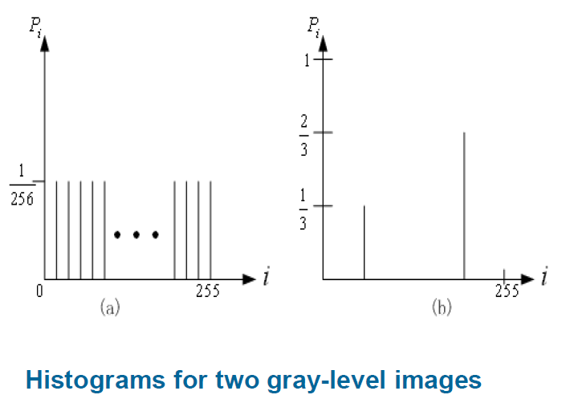{ width="600" }
</figure>

如果频率分布图越平坦，信息熵越大；越陡峭，信息熵越小

## 2 Lossless Coding Algorithms

### 2.1 Run-Length Coding

<figure markdown="span">
  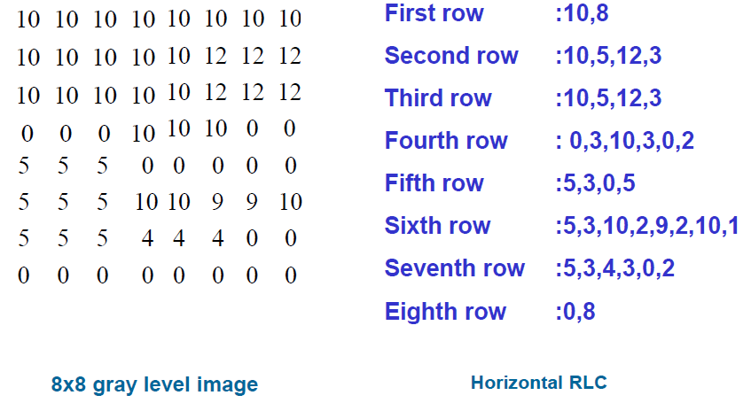{ width="600" }
</figure>

使用二元对来编码，第一个元素表示 0 的个数，第二个元素表示原数字

<figure markdown="span">
  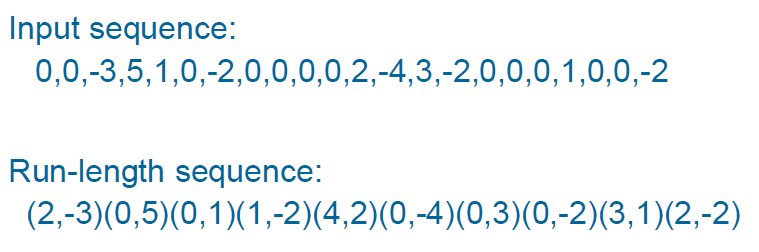{ width="600" }
</figure>

### 2.2 Variable-Length Coding

#### 2.2.1 Shannon-Fano Algorithm

根据符号出现的频率，为每个符号分配一个编码，使得频率高的符号用较短的编码，频率低的符号用较长的编码，从而减少平均编码长度

首先统计每个符号在信息中出现的次数（或概率），然后按频数从大到小排序。将排序后的符号列表分成两个子组，使得两个组的总频数之和尽可能接近。对每个子组重复同样的划分过程，直到每个组中只剩下一个符号

是一个自顶向下的二叉树

<figure markdown="span">
  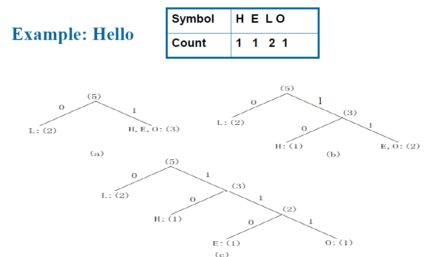{ width="600" }
</figure>

香农-范诺编码不一定是最优的

#### 2.2.2 Huffman Coding

使用一个自底向上的二叉树

<figure markdown="span">
  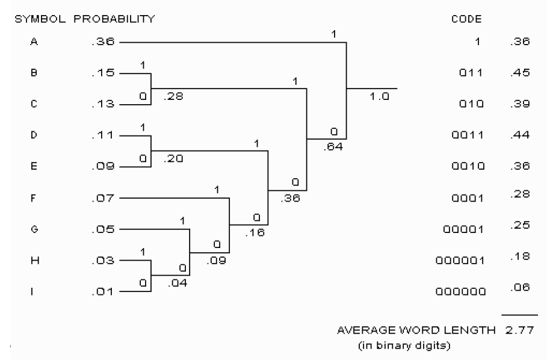{ width="600" }
</figure>

霍夫曼能保证生成最优前缀码

#### 2.2.3 Adaptive Huffman Coding

经典霍夫曼编码要求事先知道所有符号的概率分布，才能构建编码树。但在许多实际场景中（如实时传输、未知文件格式），这些统计信息是无法预先获取的。即使已知概率分布，也需要将符号表（即编码映射关系）随压缩数据一起传输给解码端，这本身会占用额外的带宽或存储空间，对于小文件而言开销尤其明显

自适应算法从空的统计信息开始，或者假设所有符号初始概率相等。随着数据逐个符号地到来，编码器实时更新每个符号的出现次数和概率，并动态调整霍夫曼树的结构。只需要一次遍历数据即可完成编码，无需预先读取全部数据来统计频率。解码端采用相同的自适应规则，从相同的初始状态开始，随着接收数据同步更新统计信息和树结构，因此无需额外传输符号表

### 2.3 Dictionary-Based Coding

Lempel-Ziv-Welch algorithm（LZW compression）：字典预先包含所有可能的单个字符

1. 从当前扫描位置开始，在字典中查找最长的匹配字符串
2. 输出该字符串对应的定长码字
3. 将该字符串加上下一个字符形成的新字符串加入字典，为后续更长的匹配做准备
4. 移动扫描指针，继续重复上述过程

解码过程：解码器从接收到的码字序列中，以相同的规则同步重建字典，恢复原始数据

该算法无需传输字典。字典由编码器和解码器动态同步构建，消除了存储或传输概率表/字典的开销

```c linenums="1" title="compression"
s = next input character;
while (not EOF) {
    c = next input character;
    if (s + c exists in the dictionary) {
        s = s + c;
    } else {
        output the code of s;
        add string s + c to the dictionary with a new code;
        s = c;
    }
}
output the code of s;
```

```c linenums="1" title="decompression"
s = NIL;
while (not EOF) {
    k = next input code;
    entry = dictionary entry for k;
    if (entry == NULL) {
        entry = s + s[0];
    }
    output entry;
    if (s != NIL) {
        add string s + entry[0] to dictionary with a new code;
    }
    s = entry;
}
```

<figure markdown="span">
  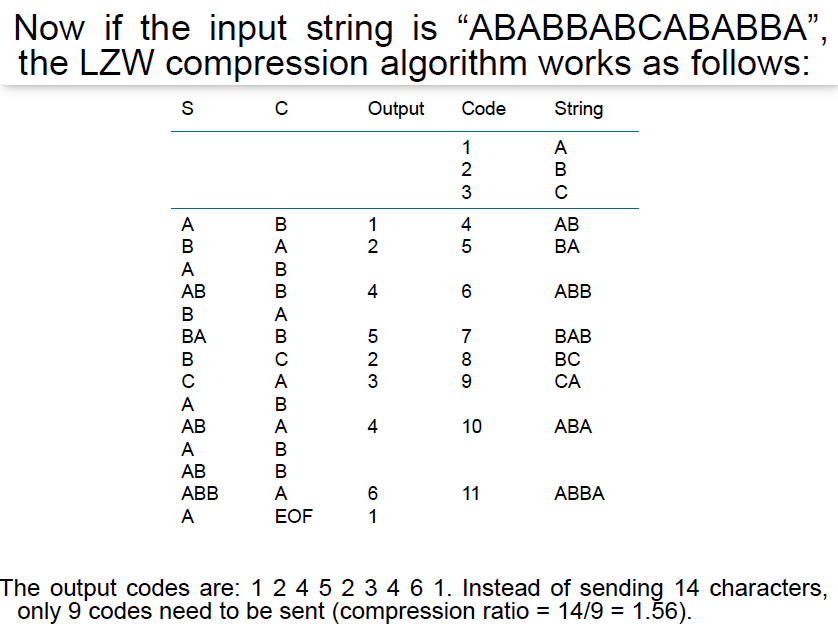{ width="600" }
</figure>

<figure markdown="span">
  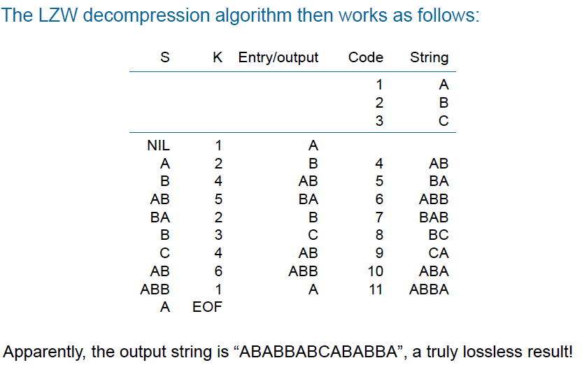{ width="600" }
</figure>

### 2.4 Arithmetic Coding

算术编码是一种熵编码技术，它将整个消息（一串符号）编码为一个位于 `[0, 1)` 区间内的实数，而不是为每个符号分配独立的码字。这种方法能够达到接近香农熵极限的压缩率，尤其在符号概率分布不均匀或消息较短时，往往优于霍夫曼编码

<figure markdown="span">
  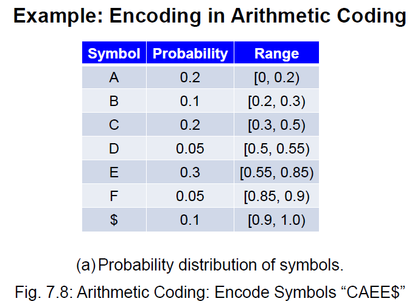{ width="600" }
</figure>

<figure markdown="span">
  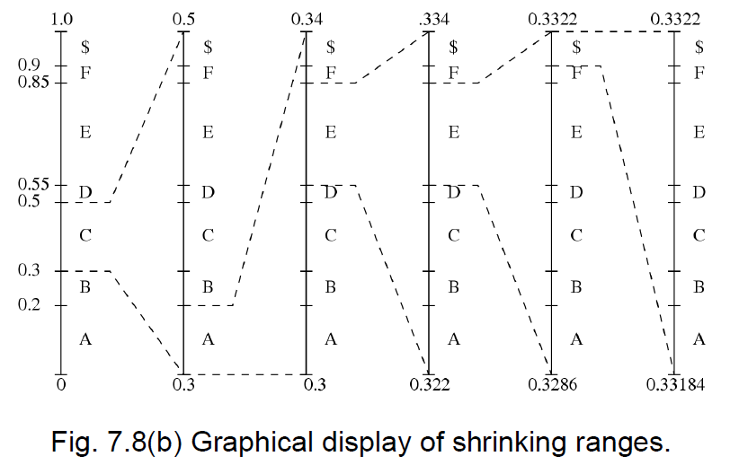{ width="600" }
</figure>

<figure markdown="span">
  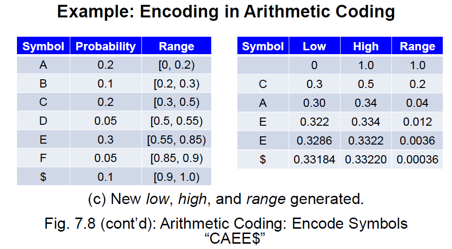{ width="600" }
</figure>

接下来从区间生成码字：

```c linenums="1"
code = 0;
k = 1;
while (value(code) < low) {
    assign 1 to the k th binary function bit;
    if (value(code) > high) {
        replace the k th bit by 0;
    }
    k = k + 1;
}
```

```c linenums="1" title="decoder"
get binary code and convert to decimal value = value(code);
do {
    find a symbol s so that range_low(s) <= value < range_high(s);
    output s;
    low = range_low(s);
    high = range_high(s);
    range = high - low;
    value = (value - low) / range;
} until symbol s is a terminator
```

<figure markdown="span">
  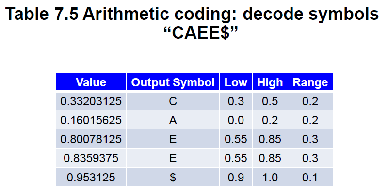{ width="600" }
</figure>

## 3 Lossless Image Compression

### 3.1 Differential Coding of Images

差分编码是一种利用数据之间相关性进行压缩的技术，其核心思想是：相邻数据之间的差异通常远小于数据本身，因此对差异值进行编码比直接对原始数据编码效率更高

在多媒体数据（如图像、音频、视频）中，连续的数据样本之间往往存在高度相关性。因此，直接存储或编码差值而不是原始值，可以显著降低数据的动态范围和熵

1. 简单差分算子（水平方向）：$d(x,y)=I(x,y)-I(x-1,y)$
2. 离散二维拉普拉斯算子：$d(x,y) = 4I(x,y)-I(x,y-1)-I(x,y+1)-I(x+1,y)-I(x-1,y)$

## Exercise

Suppose eight characters have a distribution A:(1), B:(1), C:(1), D:(2), E:(3), F:(5), G:(5), H:(10). Give the Huffman Code for this signal.

---

What is the entropy （） of the image below, where numbers (0, 20, 50, 99) denote the gray-level intensities?

```text linenums="1"
99 99 99 99 99 99 99 99
20 20 20 20 20 20 20 20
0  0  0  0  0  0  0  0
0  0  50 50 50 50 0  0
0  0  50 50 50 50 0  0
0  0  50 50 50 50 0  0
0  0  50 50 50 50 0  0
0  0  0  0  0  0  0  0
```

99 有 8 次。20 有 8 次。50 有 16 次。0 有 32 次

$\dfrac{1}{8}\log_28 + \dfrac{1}{8}\log_28 + \dfrac{1}{4}\log_216 + \dfrac{1}{32}\log_232$