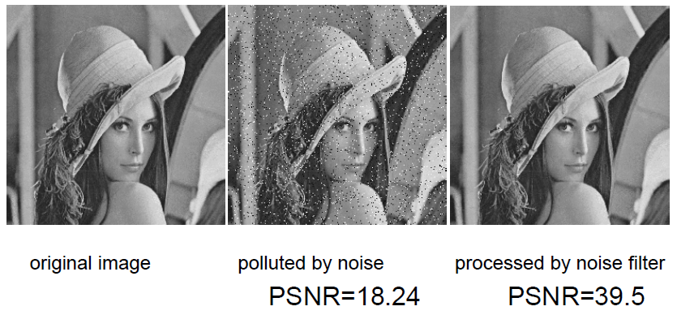
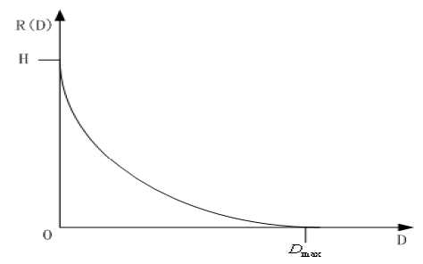
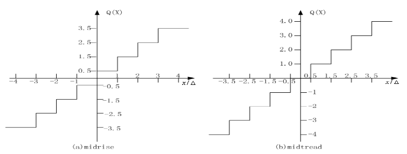
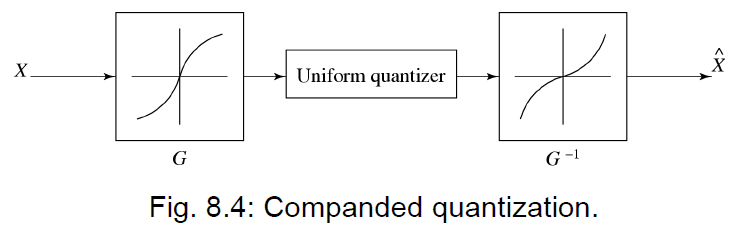
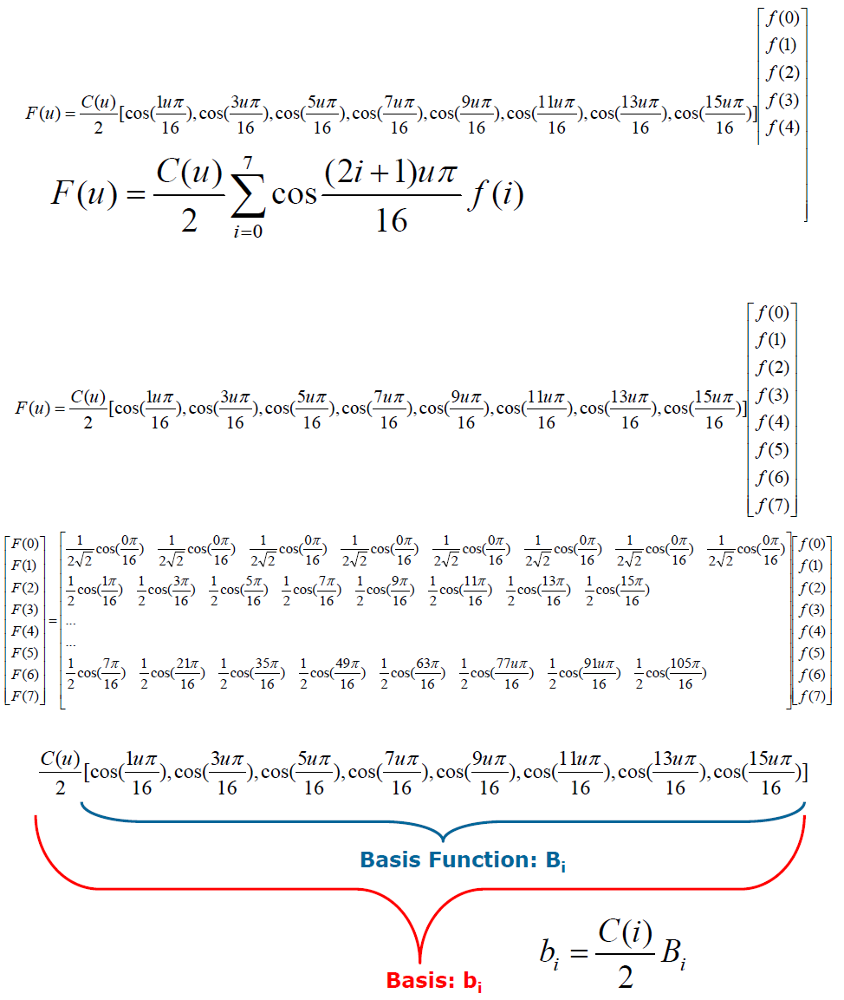
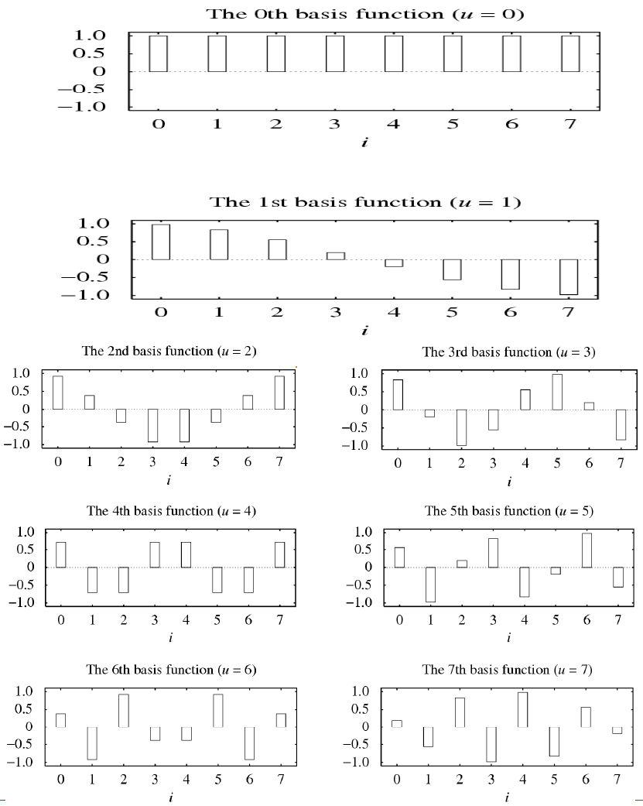
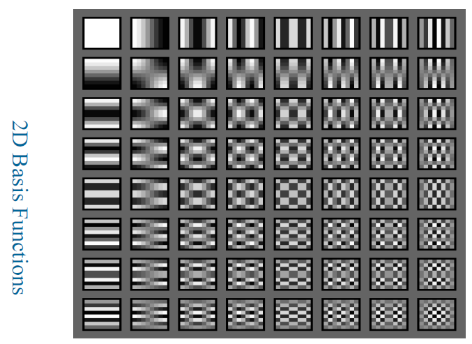
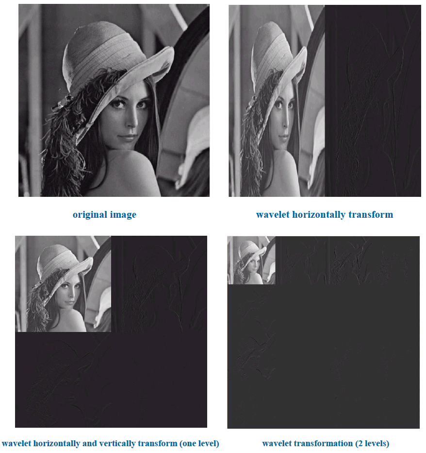

# 6 Lossy Compression Algorithms

!!! tip "说明"

    本文档正在更新中……

!!! info "说明"

    本文档仅涉及部分内容，仅可用于复习重点知识

## 1 Distortion Measures

衡量近似值与原始值之间差异的数学量

1. 均方误差 $MSE = \dfrac{1}{N}\sum\limits_{n=1}^N(x_n-y_n)^2$
2. 信噪比 $SNR = 10\log_{10}\dfrac{\sigma_x^2}{\sigma_d^2}$。信号大小相对于误差的大小。值越大越好
3. 峰值信噪比 $PSNR = 10\log_{10}\dfrac{\text{PeakValue}^2}{\sigma_d^2}$。信号峰值相对于误差的大小

<figure markdown="span">
  { width="600" }
</figure>

## 2 The Rate-Distortion Theory

有损压缩总是在码率与失真之间进行权衡

1. 码率 (Rate)：压缩后每个数据单元（如图像中每个像素）平均占用的比特数。码率越高，文件越大
2. 失真 (Distortion, D)：压缩后数据与原始数据的差异程度，通常用 MSE 或 PSNR 来衡量。失真越大，质量损失越多

率失真函数 R(D)：在保证失真不超过 D 的前提下，数据能够被编码的最低码率 R

- 当 D = 0 时，R(D) 于信源的熵 H
- 当 R(D) = 0 时，意味着没有信息被编码，失真达到最大值

它定义了编码算法性能的极限，用于评估不同算法的好坏

<figure markdown="span">
  { width="600" }
</figure>

## 3 Quantization

量化是绝大多数有损压缩算法中产生损失的步骤。但是量化能够减少数据中不同数值的数量

每个量化器都有其独特的输入范围划分和输出值集合

### 3.1 Uniform Scalar Quantization

均匀标量量化：将输入域划分为等间距的区间

1. 决策边界 (Decision Boundaries)：区间的端点
2. 再生/输出值 (Reconstruction Values)：区间的中点
3. 步长 (Step size, Δ)：区间的长度

有两种类型：

1. Midrise (中升型)：输出偶数个电平。有一个区间包围着零点
2. Midtread (中平型)：输出奇数个电平。零点本身是一个输出值

量化公式（给定步长 $Δ=1$ ）：

1. Midrise: $Q(x)=⌊x⌋+0.5$
2. Midtread: $Q(x)=⌊x+0.5⌋$

<figure markdown="span">
  { width="600" }
</figure>

性能分析：

1. 码率 $R = \log_2 M$（M 为量化级数）
2. 步长：$\Delta = 2X_{max}/M$

两种失真：

1. 颗粒失真 (Granular Distortion)：输入有界时，量化器产生的误差（主要关注对象）
2. 过载失真 (Overload Distortion)：输入超出量化范围（大于 $X_{max}$ 或小于 $X_{max}$）时产生的误差

对于 Midrise 量化器，如果输入是均匀分布的，可以推导出：SQNR 约等于 6.02n dB。因此，每增加 1 bit 的编码位数，SQNR 提高约 6dB

### 3.2 Nonuniform Scalar Quantization

如果输入信号不是均匀分布的（例如语音或图像信号通常集中在某些值附近），均匀量化效率很低

策略：

1. 在信号密集的区域增加决策级数（减小步长）
2. 在信号稀疏的区域减少决策级数（增大步长）

常见方法：

1. Lloyd-Max 量化器：基于最小均方误差准则设计的最佳量化器
2. 压扩器 (Companded Quantizer)：压缩函数 (Compressor $G$) → 均匀量化器 → 扩展函数 (Expander $G^{-1}$)。常用的压扩函数有 μ-law 和 A-law（常用于语音编码）

<figure markdown="span">
  { width="600" }
</figure>

## 4 Transform Coding

信息论指出，对向量进行编码比对单个标量编码更高效

去相关 (De-correlation)：输入向量 X 中的相邻样本通常具有很强的相关性（冗余）。通过线性变换 T 得到 Y。如果 Y 的分量相关性很低（甚至不相关），那么 Y 就可以被更高效地编码

DCT（离散余弦变换）是一种广泛使用的去相关变换

考虑一个由 8 个像素点组成的序列

一维 DCT 正变换：

$F(u) = \dfrac{C(u)}{2}\sum\limits_{i=0}^7\cos\dfrac{(2i+1)u\pi}{16}f(i)$

$C(u) = \begin{cases}
    \dfrac{\sqrt{2}}{2} & u = 0\\
    1 & u ≠ 0
\end{cases}$

$i$：空间域/时域样本索引。表示输入信号的位置；$u$：频率索引。表示余弦波的频率

- 当 $u=0$ 时，$F(u)$ 是 DC 系数，代表信号的平均值
- 当 $u ≠ 0$ 时，$F(u)$ 是 AC 系数，代表信号变化的分量（频率从低到高）

一维 DCT 逆变换：

$\tilde{f}_i = \sum\limits_{i=0}^7\dfrac{C(u)}{2}\cos\dfrac{(2i+1)u\pi}{16}F(u)$

<figure markdown="span">
  { width="600" }
</figure>

<figure markdown="span">
  { width="600" }
</figure>

考虑 8x8 大小的像素块：

二维 DCT：$F(u,v)=\dfrac{1}{4}C(u)C(v)\sum\limits_{i=0}^7\sum\limits_{j=0}^7f(i,j)\cos(\dfrac{\pi}{16}(2i+1)u)\cos(\dfrac{\pi}{16}(2j+1)v)$

2D DCT 可以分解为两次 1D DCT（先对行，再对列），大大减少了计算量

<figure markdown="span">
  { width="600" }
</figure>

- DCT：只涉及实数运算
- DFT：涉及复数运算（实部 + 虚部）

DCT 相当于对一个对称扩展后的输入信号进行 DFT。DCT 避免了 DFT 在块边界处的不连续性，更适合图像压缩

## 5 Wavelet-Based Coding

DFT/DCT 的局限：在频域有很好的分辨率，但在时间（空间）域没有分辨率（即无法同时精确定位时间和频率）

小波的目标便是在时间和频率上都具有良好的分辨率

最简单的小波变换是 Haar 变换

输入序列：{10, 13, 25, 26, 29, 21, 7, 15}

变换操作：

1. 计算平均值：$x_{n-1,i}=\dfrac{x_{n,2i} + x_{n,2i+1}}{2}$。得到序列 {11.5, 25.5, 25, 11}
2. 计算差值：$d_{n-1,i} = \dfrac{x_{n,2i} - x_{n,2i+1}}{2}$。得到序列 {−1.5, −0.5, 4, −4}

将平均值序列和差值序列拼接得到结果序列：{11.5, 25.5, 25, 11, −1.5, −0.5, 4, −4}

原始数据可以通过以下公式完美重构：

1. $x_{n,2i} = x_{n-1,i} + d_{n-1,i}$
2. $x_{n,2i+1} = x_{n-1,i} - d_{n-1,i}$

二维 Haar 变换：

1. 水平变换：对每一行进行 Haar 变换（得到水平近似和水平细节）
2. 垂直变换：对变换后的矩阵的每一列进行 Haar 变换

输出结构：

1. LL (低频)：图像的粗略近似（主要能量）
2. LH (水平细节)：水平方向的边缘/变化
3. HL (垂直细节)：垂直方向的边缘/变化
4. HH (高频)：对角线方向的细节

<figure markdown="span">
  { width="600" }
</figure>