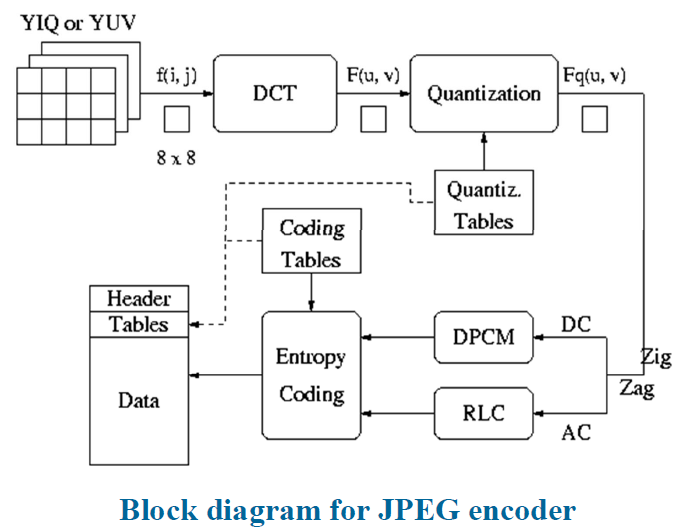
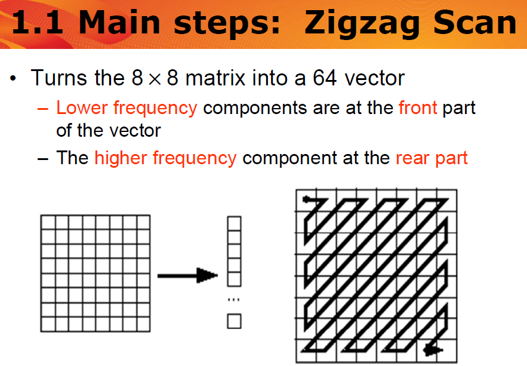
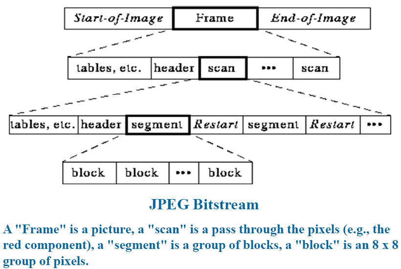

# 7 Image Compression Standards

<!-- !!! tip "说明"

    本文档正在更新中…… -->

!!! info "说明"

    本文档仅涉及部分内容，仅可用于复习重点知识

## 1 The JPEG Standard

JPEG 是 ISO 制定的第一个静态图像压缩国际标准。它是一种有损压缩方法，核心是使用 DCT 进行变换编码

JPEG 的有效性基于三个关键观察：

1. 空间冗余：图像内容通常变化缓慢，相邻像素值差异不大（平滑区域多）
2. 频率敏感度：人眼对高频分量（细节/边缘）的丢失不敏感，但对低频分量（整体轮廓）丢失非常敏感
3. 色度敏感度：人眼对黑白（亮度）的分辨力远高于对颜色（色度）的分辨力

### 1.1 Main Steps

JPEG 编码器主要包含以下 7 个步骤：

1. 颜色空间转换与下采样：将 RGB 转换为 YIQ 或 YUV。利用人眼对色度不敏感的特点，对色度分量（I/Q 或 U/V）进行下采样（如 4:2:0），大幅减少数据量
2. 分块 (Block Division)：将每个颜色分量的图像划分为 8×8 的像素块。这是为了平衡计算精度和运算量，但也是导致块效应（Blocky Artifacts）的根源
3. DCT 变换：对每个 8×8 块进行 2D-DCT 变换。将图像从空间域转换为频率域。左上角是低频（DC 系数，代表平均亮度），右下角是高频（AC 系数，代表细节）
4. 量化 (Quantization)：使用量化表对 DCT 系数进行除法并取整。量化表中的数值右下角（高频）较大，左上角（低频）较小。除以大数后取整，高频分量往往变为 0，从而实现压缩
5. Zigzag 扫描：将 8×8 的矩阵按之字形转换为 1×64 的向量。目的是将非零系数集中在向量前部，长串的 0（高频丢失后）集中在后部，便于后续编码
6. DC 系数编码 (DPCM)：DC 系数（每个块的第一个数）代表直流分量。相邻块的 DC 值通常接近，因此使用差分脉冲编码调制 (DPCM)，即存储当前 DC 与前一个块 DC 的差值
7. AC 系数编码 (RLE + Entropy)：针对 AC 系数中大量的 0，使用 (跳过 0 的个数, 下一个非零值) 的形式编码。最后使用霍夫曼编码进行无损压缩

<figure markdown="span">
  { width="600" }
</figure>

<figure markdown="span">
  { width="600" }
</figure>

DC 系数编码步骤中，假设原始数据为 (150, 155, 149, 152, 144)，经过 DPCM 变为 (150, 5, -6, 3, -8)，最后会使用一对符号 (size, amplitude) 来表示这个差值。size 表示该数值需要多少个二进制位，amplitude 是该数值具体的二进制表示。所以最后是 (8, 10010110), (3, 101), (3, 001), (2, 11), (4, 0111)。其中 size 进行霍夫曼编码，而 amplitude 是原始的二进制位流，直接附加在后面即可

> JPEG 对负数使用反码表示

AC 系数编码步骤也是同理的，由两个符号来表示，第一个符号是 (runLength, size)，runLength 表示当前非零系数之前有多少个连续的 0，size 指当前这个非零 AC 系数需要多少位来表示，这两个值组合成一个字节（高 4 位存 runLength，低 4 位存 size），然后对这个组合值进行霍夫曼编码。第二个符号是 (amplitude)，这是当前非零 AC 系数的具体数值位，与 DC 系数一样，这个部分不进行霍夫曼编码，直接存储二进制位

### 1.2 JPEG Modes

JPEG 的四种工作模式：

1. 顺序模式 (Sequential)：默认模式，从左到右、从上到下扫描一次完成编码
2. 渐进模式 (Progressive)：适合网络传输，先传低质量预览，再逐步清晰

    1. 频谱选择：先传低频（DC + 少量 AC），再传高频（细节）
    2. 连续逼近：先传所有系数的高位比特，再传低位比特

3. 分层模式 (Hierarchical)：以不同分辨率编码。先编码低分辨率图像，再编码高分辨率与低分辨率的差值。支持多级解码
4. 无损模式 (Lossless)：不使用 DCT，而是使用预测编码（差分编码）。压缩率很低，很少使用

### 1.3 The JPEG Bit Stream

<figure markdown="span">
  { width="600" }
</figure>

JPEG 文件由多个段（Segment）组成：

1. Frame Header：包含图像宽高、采样因子、量化表信息
2. Scan Header：包含扫描组件、霍夫曼表信息

## 2 The JPEG 2000 Standard

JPEG 2000 是新一代标准，旨在解决传统 JPEG 的痛点：

1. 统一架构：同时支持无损和有损压缩
2. 高压缩比：在低比特率下有更好的率失真（Rate-Distortion）性能
3. ROI (感兴趣区域) 编码：可以指定图像中的特定区域（如人脸、肿瘤）以无损或高质量压缩，背景用高压缩比
4. 抗误码：适合在噪声环境（如无线传输）中使用
5. 无块效应：因为不使用 8×8 分块处理

| 对比维度 | 传统 JPEG | JPEG 2000 |
| -- | -- | -- |
| 压缩率 vs 质量 | 在高压缩比（>80:1）时，PSNR 性能急剧下降 | 在高压缩比下依然保持较高的 PSNR 值，曲线更平滑 |
| 视觉效果 | 块效应 (Blocking Artifacts)：高压缩下出现明显的马赛克方块 | 模糊 (Blurring)：图像变模糊，但没有生硬的方块边界，视觉效果更自然 |
| 图像类型适应性 | 对自然图像尚可，对计算机生成图像（如线条图、文本）效果较差 | 对自然图像、计算机生成图像、医疗影像均表现优异 |
| 比特率性能 | 在低比特率（<1 bpp）时，失真严重 | 在低比特率（0.25bpp - 0.75bpp）下，图像依然可辨识，细节保留更好 |

## Exercise

JPEG uses the Discrete Cosine Transform (DCT) for image compression.

i. What is the value of F(o, O) if the image f(i, j) is as below?

ii. Which AC coefficient |F(u, v)| is the largest for this f(i, j)? Why? Is this F(u, v) positive or negative? Why?

```text linenums="1"
20 20 20 20 20 20 20 20
20 20 20 20 20 20 20 20
80 80 80 80 80 80 80 80
80 80 80 80 80 80 80 80
140 140 140 140 140 140 140 140
140 140 140 140 140 140 140 140
200 200 200 200 200 200 200 200
200 200 200 200 200 200 200 200
```

i. $F(0,0) = \dfrac{1}{8} \times (20 \times 16 + 80 \times 16 + 140 \times 16 + 200 \times 16) = 880$

ii. |F(1, 0)| 是最大的，因为强度值的变化类似于在 8x8 块内垂直方向上的半个余弦周期。F(1,0) 是负数，因为变化的相位相差 180 度
