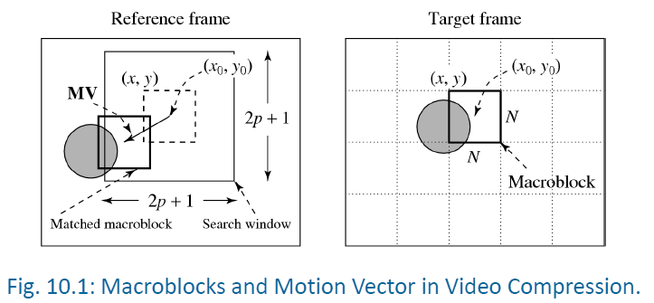
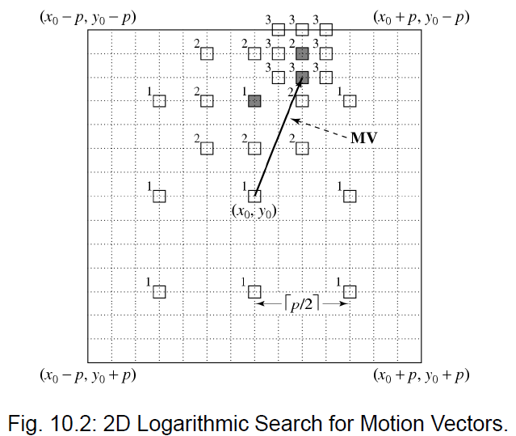
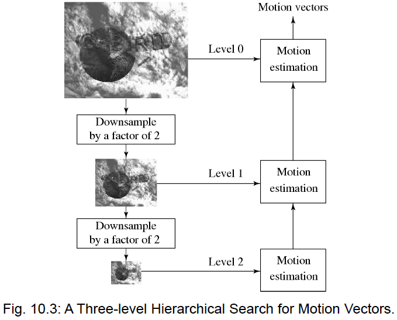
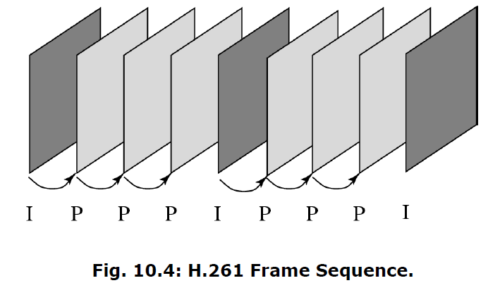
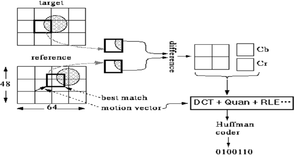

# 8 Basic Video Compression Techniques

<!-- !!! tip "说明"

    本文档正在更新中…… -->

!!! info "说明"

    本文档仅涉及部分内容，仅可用于复习重点知识

## 1 Introduction to Video Compression

未压缩的高清视频数据量是巨大的，网络无法承受。为了减少数据量，我们可以扔掉一些信息，因为人眼并不敏感：

1. 分辨率降低：从广播标准（如 625 线）降低到 SIF (Source Input Format)，即 352 x 288 像素
2. 色彩信息（YUV）：人眼对亮度（Y）敏感，对色度（U/V）不敏感。进行 4:2:0 采样

JPEG 标准用于压缩单帧图像，利用 DCT 去除空间冗余，但单纯使用 JPEG 无法满足视频通信的极高压缩比需求，因为视频还存在时间冗余

视频是时间维度上的图像序列。连续帧之间通常非常相似，主要差异来自于摄像机或物体的运动。predictive coding（预测编码）则是不直接编码每一帧，而是编码相邻帧的差值（残差）

## 2 Video Compression Based on Motion Compensation

### 2.1 Motion Compensation

运动补偿是去除时间冗余的主要手段：将图像分为背景（静止）和前景（运动）

1. 宏块 (Macroblock)：图像被划分为 16x16 像素的块（亮度分量）
2. 参考帧 (Reference Frame)：以前的帧作为基准
3. 运动矢量 (Motion Vector, MV)：描述当前宏块在参考帧中的位置偏移量 (u,v)

过程：

1. 运动估计：在参考帧中寻找与当前宏块最匹配的块
2. 预测：计算预测块与当前块的差值
3. 编码：只传输运动矢量和预测误差（残差）

<figure markdown="span">
  { width="600" }
</figure>

## 3 Search For Motion Vectors

匹配准则：MAD (Mean Absolute Difference) 平均绝对误差。寻找使 $\sum|C(x+i,y+j) - R(x+i,y+j)|$ 最小的 $(i,j)$

搜索算法：

1. 全搜索 (Sequential Search)：遍历搜索窗口内的每一个位置
2. 2D 对数搜索 (2D-Logarithmic Search)：类似二分法。从大步长开始，在 9 个方向搜索，找到最小 MAD 后缩小步长，直到步长为 1
3. 分层搜索 (Hierarchical Search)：多分辨率搜索。先将图像下采样（如降为 1/4 大小），在低分辨率下进行粗估，得到粗略 MV，然后在原图分辨率下进行微调

<figure markdown="span">
  { width="600" }
</figure>

<figure markdown="span">
  { width="600" }
</figure>

## 4 H.261

H.261 是第一个广泛使用的视频压缩标准（1990 年），奠定了现代视频编码的基础

1. 应用场景：视频会议、ISDN 网络
2. 码率：p x 64 kbps（p = 1 到 30）
3. 帧格式：

    1. CIF (Common Intermediate Format): 352 x 288
    2. QCIF: 176 x 144

4. 帧类型：

    1. I 帧 (Intra): 帧内编码，类似 JPEG，独立解码，用于随机访问和防止误差累积
    2. P 帧 (Predictive): 帧间编码，基于前一帧（I 帧或 P 帧）进行运动补偿预测

<figure markdown="span">
  { width="600" }
</figure>

I 帧编码：DCT → 量化 → 熵编码

P 帧编码：

1. 运动矢量精度：全像素（整数像素）
2. 搜索范围：限制在 ±15 像素内
3. 预测误差编码：传输的是差值宏块
4. MV 差分编码：传输的是当前 MV 与前一个 MV 的差值 (MVD)，以提高熵编码效率

<figure markdown="span">
  { width="600" }
</figure>

量化步长 (step_size) 为 2-62 的偶数。DC 系数固定用步长 8

码流语法 (4 层结构)：

1. 图像层 (Picture): 包含起始码和时间戳
2. GOB 层 (Group of Blocks): 将图像分为 11 x 3 宏块的组（CIF 有 12 个 GOB），用于同步和错误恢复
3. 宏块层 (Macroblock): 包含位置信息、量化参数、运动矢量等
4. 块层 (Block): 8 x 8 的 DCT 系数，采用 Z 字形扫描，行程编码 (Run, Level)

## 5 H.263

H.263 是 H.261 的改进版，针对低码率（< 64 kbps）进行了优化

1. 更低的码率：适用于 PSTN（公共交换电话网）
2. 图像格式：支持 Sub-QCIF 到 16 CIF
3. GOB 结构变化：GOB 不再有固定大小，且总是从行首开始到行尾结束，增加了灵活性

运动补偿增强：

1. 半像素精度 (Half-pixel precision)：H.261 只有全像素，H.263 支持半像素（通过双线性插值计算），大大提高了预测精度
2. 运动矢量预测：当前宏块的 MV 是由左侧、上方、右上方 MV 的中值预测出来的，传输的是误差值
3. 无限制运动矢量：允许参考块超出图像边界（通过边缘扩展实现）

可选编码模式：

1. 算术编码：替代变长编码，效率更高
2. 高级预测模式：每个宏块可以使用 4 个运动矢量（针对每个 8 x 8 块分别计算），适合复杂运动
3. PB 帧模式：将 P 帧和 B 帧（双向预测）组合在一起编码，进一步提高压缩率（虽然 H.263 核心不支持 B 帧，但通过此模式模拟）

## Exercise

In block-based video coding, what takes more effort: compression or decompression? Briefly explain why.

压缩通常需要更多的精力（计算资源）。编码器（压缩端）需要执行复杂的操作来寻找最佳的压缩方案，例如在帧内编码时进行变换和量化，在帧间编码时进行运动估计（Motion Estimation）以寻找最佳的运动矢量。这通常涉及大量的搜索和计算。解码器（解压缩端）的主要任务是解析压缩数据并进行逆变换，其计算复杂度通常远低于编码器，因为它不需要进行耗时的搜索过程

---

An H.261 video has the three color channels Y, Cr, Cb. Should MVs be computed for each channel and then transmitted? Justify your answer. If not, which channel should be used for motion compensation?

不应该为每个通道（Y, Cr, Cb）都计算并传输运动矢量。运动矢量代表了图像块在时间上的位移。对于同一位置的像素，无论是在亮度通道还是色度通道，其运动位移在物理上是相同的。如果为每个通道单独计算，会导致大量的冗余计算和传输开销，且不会显著提高补偿精度。通常只在 Y（亮度）通道上计算运动矢量。因为人眼对亮度的变化最敏感，且亮度通道包含了主要的图像细节信息，基于 Y 通道的运动估计最能反映物体的真实运动