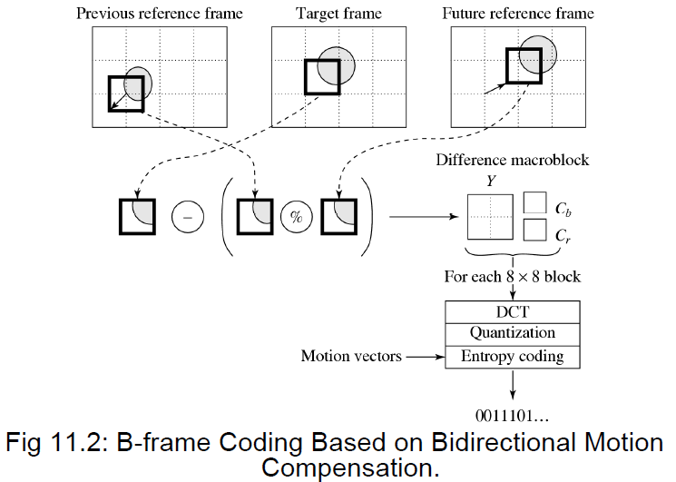
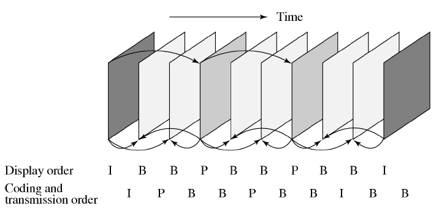
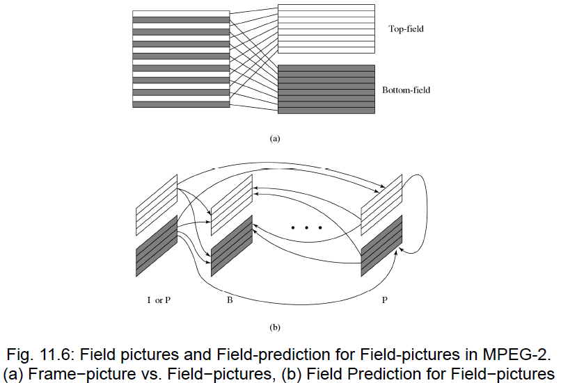
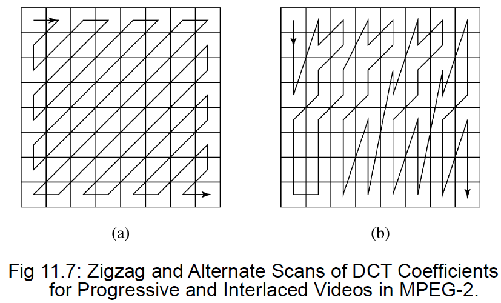

# 9 MPEG Video Coding

!!! tip "说明"

    本文档正在更新中……

!!! info "说明"

    本文档仅涉及部分内容，仅可用于复习重点知识

MPEG 的定义：Moving Pictures Experts Group（动态图像专家组），旨在制定数字音视频压缩标准

## 1 MPEG-1

H.261 的局限：仅支持前向预测（Forward Prediction），即 P 帧参考前面的 I/P 帧

MPEG-1 引入双向预测（Bidirectional Search）：在某些场景下（如遮挡），当前帧的物体在前一帧被挡住，找不到匹配块，但在后一帧可见。解决方案是引入 B 帧 (Bidirectional Frame)。B 帧可以参考前向（Previous）和后向（Future）两个参考帧，每个宏块（Macroblock）最多有两个运动矢量（MV），如果双向匹配都成功，取两个匹配宏块的平均值作为预测值，计算预测误差（DCT 输入）

<figure markdown="span">
  { width="600" }
</figure>

由于 B 帧依赖未来的帧，所以编码/传输顺序必须调整

<figure markdown="span">
  { width="600" }
</figure>

MPEG-1 与 H.261 的主要差异：

1. 分辨率支持：

    1. H.261：仅支持 CIF (352×288) 和 QCIF
    2. MPEG-1：支持 SIF（Source Input Format），NTSC 制式为 352×240 @30fps，PAL 制式为 352×288 @25fps。且支持最大 768×576 的分辨率

2. Slice（片）结构：MPEG-1 的 slice 取代了 H.261 的 GOB（宏块组），Slice 可以包含任意数量的宏块，只要填满整幅图像。Slice 独立编码，用于比特率控制和错误恢复
3. 量化（Quantization）的改进：MPEG-1 为帧内编码（Intra）和帧间编码（Inter）使用了不同的量化表

    1. Intra 量化表：对低频分量（左上角）使用较小的量化步长，对高频分量使用较大的步长，保留更多细节
    2. Inter 量化表：通常比 Intra 更粗糙，因为帧间残差本身能量就较低

4. 运动矢量精度：MPEG-1 支持 1/2 像素（半像素）精度。通过双线性插值（Bilinear Interpolation）生成半像素值，比 H.261 的整像素精度能更精确地描述运动，减少残差。支持更大的搜索范围

MPEG-1 的数据是按层级组织的，这种结构允许随机访问和灵活解码：

1. Sequence (序列层)：包含序列头和一个或多个 GOP
2. GOP (图像组层)：Group of Pictures。以 I 帧开始，包含 B/P 帧
3. Picture (图像层)：单帧图像，包含图像头
4. Slice (片层)：垂直方向上的一组宏块（通常是一行或几行），用于错误恢复
5. Macroblock (宏块层)：16x16 像素。对于 4:2:0 采样，包含 4 个 Y 块，1 个 Cb 块，1 个 Cr 块
6. Block (块层)：8x8 像素，DCT 变换的基本单位

## 2 MPEG-2

MPEG-2 是 MPEG-1 的升级版，主要为数字电视和高清电视（HDTV）设计

MPEG-2 的目标是支持更高码率（>4 Mbps）、更高分辨率（HDTV）和隔行扫描（Interlaced）

隔行扫描是 MPEG-2 区别于 MPEG-1 的最大特征：一帧（Frame）由顶场（Top-field）和底场（Bottom-field）组成

编码模式：

1. Frame-picture (帧模式)：将两场交织在一起作为一个 16x16 的宏块处理
2. Field-picture (场模式)：将每场视为独立的图像进行编码

<figure markdown="span">
  { width="600" }
</figure>

5 种预测模式：

1. 帧预测：同 MPEG-1，适合慢速运动
2. 场预测：适合快速不规则运动
3. 场预测用于帧图像：混合模式
4. 16x8 MC：将宏块垂直分为两半进行运动补偿
5. Dual-prime：特殊的 P 帧预测模式

DCT 扫描优化：

1. Zigzag Scan：标准扫描
2. Alternate Scan：针对隔行扫描，由于场之间相关性弱，采用交替扫描以更好地处理垂直高频分量

<figure markdown="span">
  { width="600" }
</figure>

MPEG-2 支持分层编码，允许在带宽不足时丢弃部分数据仍能观看

基本原理：Base Layer（基本层）+ Enhancement Layer（增强层）

1. 基本层独立解码，提供基础质量
2. 增强层依赖基本层，提供更高质量

5 种可分级类型：

1. SNR 可分级：增强层提供更高的信噪比（更少的块效应）
2. 空间可分级：基本层是低分辨率，增强层提供高分辨率细节
3. 时间可分级：基本层帧率低（如 15 fps），增强层补充帧以达到高帧率（如 30 fps）
4. 混合可分级：上述两两的组合
5. 数据分割（Data Partitioning）：将重要数据（头信息、低频 DCT 系数）和非重要数据（高频 DCT 系数）分开传输。在噪声信道中，即使丢失高频部分，图像轮廓依然清晰

MPEG-2 和 MPEG-1 的其他差异：

1. 抗误码能力：MPEG-2 增加了 Transport Stream (传输流)，比 Program Stream 更适合易出错的传输环境（如无线广播）
2. 色度抽样：MPEG-2 支持 4:2:2 和 4:4:4，而不仅仅是 4:2:0
3. 量化方式：MPEG-2 支持非线性量化表（Look-up Table），提供了比 MPEG-1 更灵活的量化步长控制